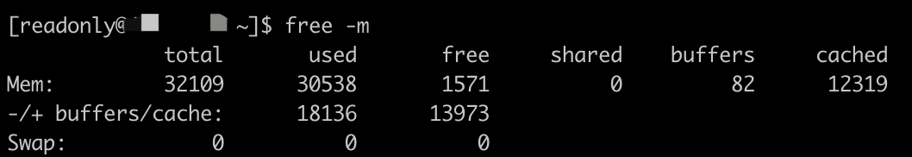
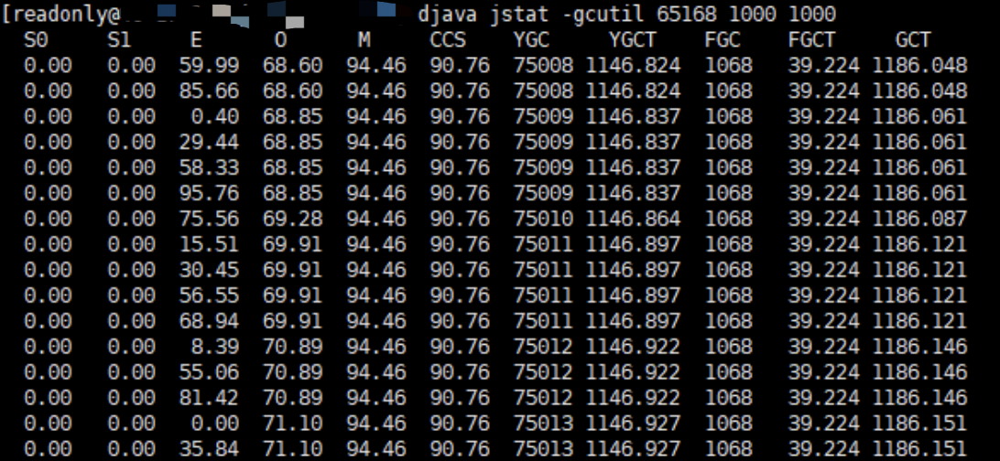
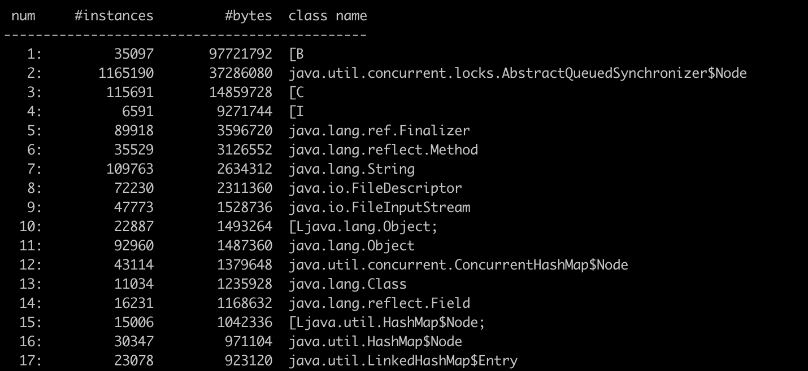
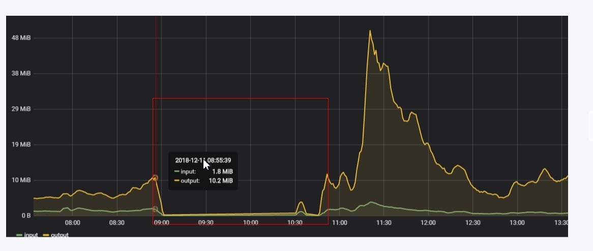

# 一、问题发现：
上午9点开始CS系统出现登录异常和菜单和权限服务异常。 

事故时间: 9:00到11:20

影响范围：接入CS平台所有系统

<!--more-->    

# 二、排查过程
服务出现登录异常，大范围不可使用，知道服务一定出问题了。
    
1、 排查服务最近是否有上线
* ps -ef | grep uum，查看进程启动时间，近期没有上线，排除。

2、 排查内存资源
* free -m，如下图所示，系统内存资源不是很紧张，排除。


3、排查服务器情况
* top，查看是否项目线程占用CPU过高，发现正常，排除。

4、排查服务运行情况
* 服务大范围不可用，怀疑是出现频繁的FGC，从而导致系统响应慢.
* 排查GC情况：jstat命令查看GC情况
    * jstat -gcutil 65168，查看GC情况。
    
    （具体排查时，没有保留图片，用上图表示）
    * 结果：FGC频率实际没有很频繁，几分钟一次，实际不影响（还是查看FGC稍微频繁原因）

* 排查大对象：jmap命令
    * 实际在开发维护工程中，已经知道统一登录系统内部存在非常多的大对象（老系统，设计不合理）
    * 查看堆对象：jmap -histo 65168 > /opt/backup/recycle/65168_jmap_histo.txt，重定向至文件内。
    
    * 查看堆内存：jmap -heap
    
    查看堆及堆对象没有太大问题。
    
5、排查JVM参数
* -Xms512m -Xmx512m -Xmn256m -Xss1024K -XX:PermSize=256m -XX:MaxPermSize=512m -XX:ParallelGCThreads=8 -XX:+UseConcMarkSweepGC -XX:+UseParNewGC -XX:+UseConcMarkSweepGC -XX:+UseCMSCompactAtFullCollection -XX:SurvivorRatio=4 -XX:MaxTenuringThreshold=8 -XX:CMSInitiatingOccupancyFraction=80    
    * 调整垃圾最大年龄：-XX:MaxTenuringThreshold=15（即对象最多经过几轮复制之后进入老年代），防止对象过快进入老年代
    * 调整Eden比例：-XX:SurvivorRatio=8（伊甸区与存活区的From区或To区的比值，默认比值设置为8，即伊甸区占整个新生代的8/10，From和To各占1/10）
    * 调整堆空间：-Xms512g -Xmx1g -Xmn256m，调大堆最大空间。

6、以上步骤，实际并未解决问题，调整参数后重启，依旧无法登陆。  
7、然后追踪数据库，发现数据库的磁盘IO及CPU都不是很高，并且没有宕机。   
8、然后追踪Redis，发现出现问题
* Redis连接情况 

异常时间内redis夯住，导致监控检查连接不能获取到运行信息
* Redis的IO情况


9、找到了问题所在，Redis异常，导致服务不可用。

10、总结
* 查看线程情况，回过头来看，是否可以查看出毛病呢？
* ps p 65168 -L -o pcpu,pid,tid,time，打印进程线程的耗时情况
* 打印线程栈信息：jstack pid 

```
1、ps Hh -eo pid,tid,pcpu |sort -nk3|tail //直接定位到占用CPU最大的进程pid-线程id
2、printf "0x%x\n" 线程pid  // 将线程PID转换为 16进制 0x1a2f ，为后面查找 jstack 日志做准备
3、jstack pid | grep -A 20 'nid=0x1a2f' //查看对应线程堆栈，分析问题
```


# 三、问题原因：
    1、mybatis二级缓存组件使用不当：在高并发情况下，mybatis二级缓存组件实现方式会在数据更新，修改和删除时，频繁调用redis中的keysByScan去获取当前库中全局匹配到的key，当key数量足够多时，执行时间会十分漫长，导致整个redis服务并夯住，出于不可用状态
    2、redis超时时间设置过长，redis超时后，不能将请求漏给mysql数据库做兜底支撑
    3、csrecruit线索系统，每5分钟，全量刷新一次所有用户权限数据，一天调用量达到2000w以上，占整个djuum的调用量的75%以上 


# 四、问题解决
做限流降级处理。对刷新用户权限数据接口，做限流降级处理。


