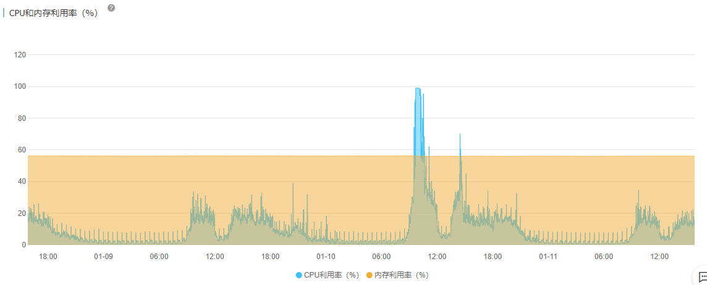
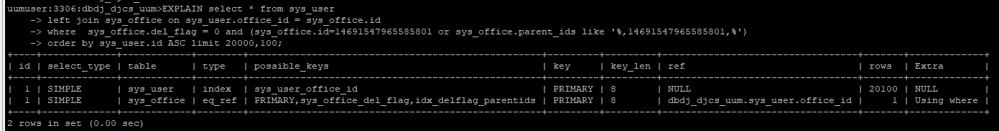
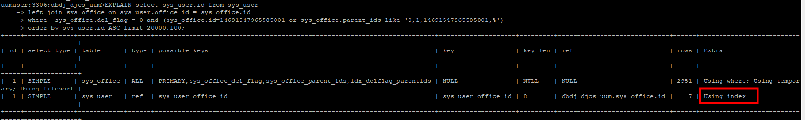
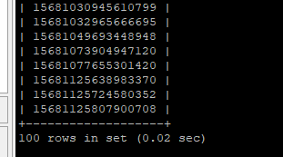

# 一、背景
数据库CPU爆满，负载高。


<!--more-->    

# 二、查看具体问题SQL


# 三、使用EXPLAIN解析SQL
```
EXPLAIN select * from sys_user
left join sys_office on sys_user.office_id = sys_office.id
where  sys_office.del_flag = 0 and (sys_office.id=14691547965585801 or sys_office.parent_ids like '%,14691547965585801,%')
order by sys_user.id ASC limit 20000,100;
```


# 四、优化方案
```
EXPLAIN select sys_user.id from sys_user
left join sys_office on sys_user.office_id = sys_office.id
where  sys_office.del_flag = 0 and (sys_office.id=14691547965585801 or sys_office.parent_ids like '0,1,14691547965585801,%')
order by sys_user.id ASC limit 20000,100;
```

注意上图红框所示，用户表直接通过索引获取用户主键：解读MySQL执行计划的type列和extra列

新SQL耗时
