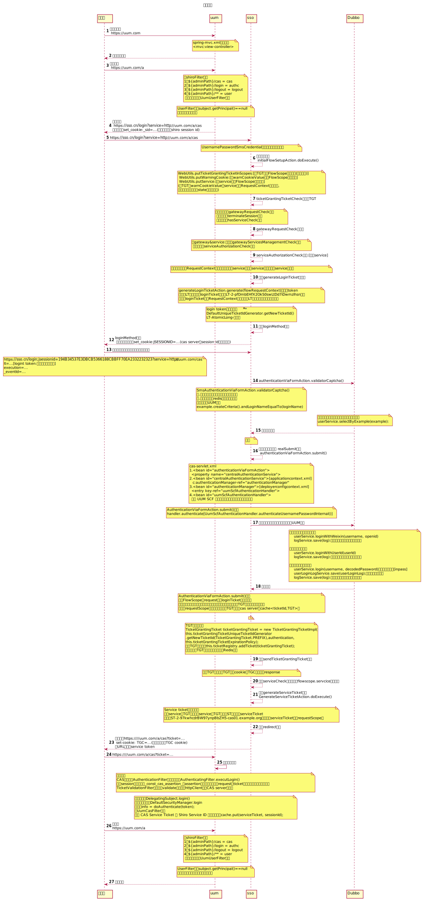
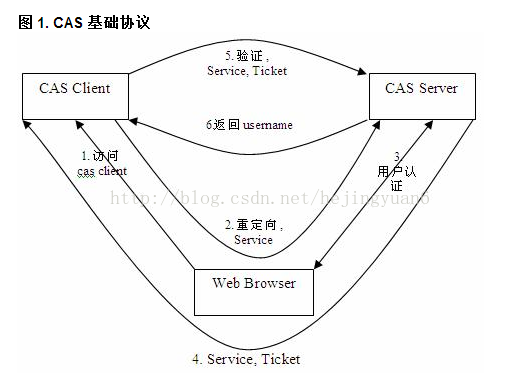
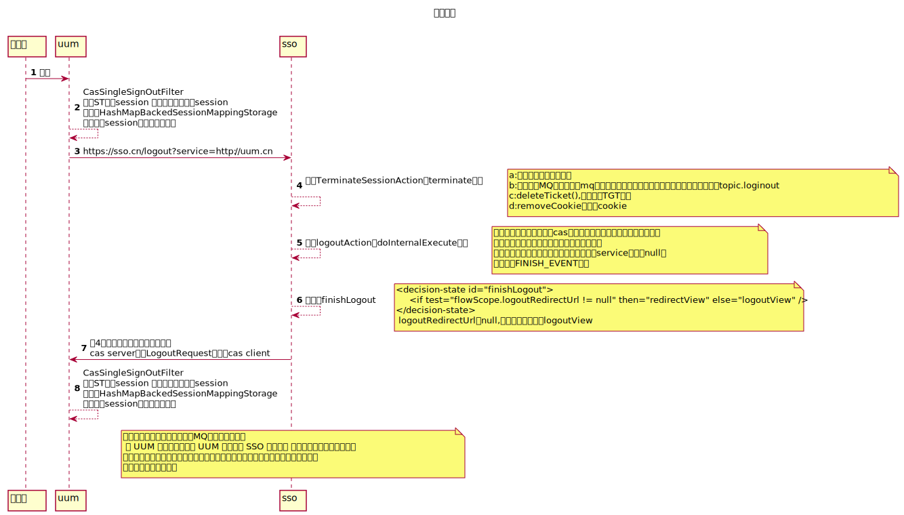

这篇文章，将从登陆、登出流程，详细讲解CAS+Shiro的执行过程。
## 一、开始
uum：一个基于RBAC（Role-Based Access Control ）的权限系统（CAS client + shiro）
sso：CAS server，负责认证授权

> ### 1、登陆流程:

这里将以时序图的方式展现。

<!--more-->

总结：
* 访问CAS client，再访问CAS server获得login token，作为登录的票据
* 用户输入用户名密码，CAS server进行验证
* 验证通过，CAS server返回Service token和TGT
* CAS client拿service token 去CAS server进行验证。

> ### 2、登出流程:

这里将以时序图的方式展现。

## 二、使用现状及局限性

##### 2.1、部署方式：cas server主备方式部署，采用nginx配置负载均衡，当主节点挂掉后，启动备用节点。
    
    问题一：单节点方式，服务压力大，响应慢，若主节点挂掉，此时所有登录的用户session将丢失，用户需重新登录，并且在备用节点启动完成之前造成服务不可用，造成的影响范围大。
    问题二：cas server中获取用户的个人信息太多，如角色、菜单、归属城市、机构等数据都获取出来，多次DB查询耗时（6次），大数据传输耗带宽（多达1M），导致登录时间长，用户体验差。
    
##### 2.2、权限控制采用shiro，各业务系统都缓存了权限及登陆信息，若退出登陆，通过发送MQ通知其他系统进行登录信息清除。
    
    问题一：为客户端提供了三种缓存策略（redis、memcache、local cache），各业务系统保存了用户信息，无统一保存用户信息容器，当用户改变，无法立即全局生效。
    问题二：采用MQ通知其他业务系统退出清理登录信息，达到了一定的解耦，但是clientId多达65个，增大MQ压力并且亦产生死信消息。
    问题三：接入方式繁杂，未做到服务的简易性、高内聚、低耦合。

##### 2.3、底层RPC服务臃肿，模块职责不清晰，查询基本信息时查询的其他信息过多，未做到接口的单一职责、高性能。

## 三、个人感悟
针对上面现阶段系统的局限性，以下是个人优化想法：

    1、认证过程，要做到耗时少，只验证用户的登录名密码，也只传输登录状态信息。
    2、CAS client根据需要，再调用服务去获取用户授权信息，并将信息统一存放至Redis。
    3、用户退出，清空Redis中的用户信息，不再依赖MQ逐一通知各业务系统。
    4、RPC接口设计，要做到单一职责、高性能，让调用方接入方便快捷，做到高内聚、低耦合。

参考博客：
[shiro 登录授权过程详细解析](https://my.oschina.net/u/2415799/blog/865526)
[CAS 4.1.10 版本服務端原始碼解讀](https://www.codetw.com/lyxepf.html)
[从http验证流程解析CAS单点登录](https://www.jianshu.com/p/5ef9407c71af)
[CAS的详细登录流程](https://blog.csdn.net/qq_34246546/article/details/79493208)
[前端关于单点登录SSO的知识](https://juejin.im/post/5b8116afe51d4538d23db11e)