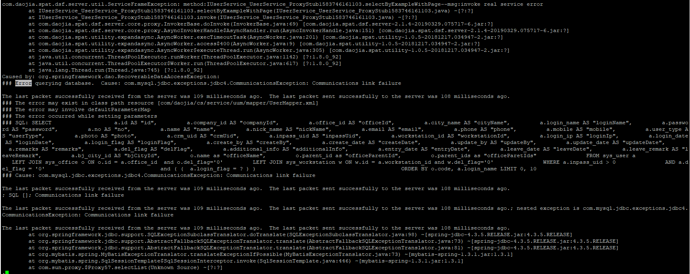

# 一、问题场景
mybatis报异常


<!--more-->

# 二、排查过程
如日志所述，无法和MySQL服务端建立通讯。那为什么会断开连接呢？

排查步骤如下：
* a、上次该连接与mysql的交互是108ms以前，但是现在却出问题了，说明是mysql server主动关闭了连接。（ps：只有服务器主动断开连接时才会出现这种问题）
* b、检查MySQL参数
```
dataSource.url=jdbc:mysql://mysql:3306/uum?useUnicode=true&characterEncoding=utf8&rewriteBatchedStatements=true&zeroDateTimeBehavior=convertToNull
dataSource.username=aaa
dataSource.password=111
dataSource.initialSize=10
dataSource.maxActive=20
dataSource.minIdle=10
dataSource.maxWait=5000
dataSource.testOnBorrow=false
dataSource.testOnReturn=false
dataSource.testWhileIdle=true
dataSource.timeBetweenEvictionRunsMillis=60000
dataSource.minEvictableIdleTimeMillis=25200000
dataSource.removeAbandoned=true
dataSource.removeAbandonedTimeout=1800
dataSource.logAbandoned=true
dataSource.slowSqlMillis=100
```
排查是否由wait_timeout设置太小，导致服务器断开了连接，发现并没有设置，默认是8小时，排除wait_timeout参数问题。
* c、排查是否是连接池连接数过小
```
dataSource.maxActive=20，最大活跃数20个，对当前系统访问量，也不少了，排除。
dataSource.maxWait=5000，是否是最大等待毫秒数, 超过时间，5s，排除。
```
* c、查看数据库连接池情况。（连接池数据图标，出现空白问题，跟DBA沟通，认为是mysql server连接池的淘汰策略问题：实际上是正确的）
* d、DBA排查，和前几天的job有关。（相同SQL CPU飙升，会激活job，进行连接kill；验证了是mysql server主动关闭连接）


# 三、总结
影响MySQL连接的问题原因有很多种。   
1、和连接mysql时间有关的系统变量
* wait_timeout：服务器关闭非交互连接之前等待活动的秒数。（即一个连接多久没交互后会被关闭）
* interactive_timeout：服务器关闭交互式连接前等待活动的秒数。（即一个连接多久没交互后会被关闭）

以上两个参数，会影响MySQL服务端对连接进行关闭，保持默认即可。  
2、连接非正常关闭，可以查看MySQL服务端是否出现问题，都是服务端关闭连接后，
而客户端连接池还持有这个连接，用关闭的连接去请求服务器，当然不能响应。


