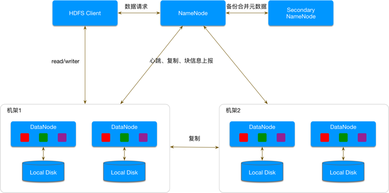

# hadoop
分布式文件存储系统

## 1、hadoop架构图

* MapReduce：分布式计算模型
* YARN：任务管理与资源管理调度
* HDFS：Hadoop Distributed File system，分布式文件存储系统

<!--more-->    

## 2、HDFS
Hadoop Distributed File System
### 2.1、HDFS架构图

* NameNode（NN）是主节点，存储文件的元数据如文件名，文件目录结构，文件属性（生成时间,副本数,文件权限），以及每个文件的块列表和块所在DataNode等。 响应Hadoop客户端请求
* DataNode（DN）在本地文件系统存储文件块数据，以及块数据的校验和。 
* Secondary NameNode（SNN） 用来监控HDFS状态的辅助后台程序，每隔一段时间获 取HDFS元数据的快照。

#### 1、NameNode
namespace：维护整个文件系统的目录树结构及目录树上的状态变化。  
blockmanager：维护数据块相关信息及数据块的状态变化，

##### A、namespace [命名空间]
  
1、目录树常驻内存，会定期生成fsImage文件（快照），方便当NameNode重启后数据恢复。  
2、目录树文件节点由NodeFile定义，每个NodeFile分割成多个block（BlockInfo的数组），BlockInfo维护的是block的元数据，例如在哪个DataNode等等。  

##### B、BlockManager 【块管理器】
    
1、为了根据blockId快速定位block，使用了BlocksMap来保存。   
2、blockInfo指向NodeFile中的BlockInfo。   
3、根据blockId进行hash计算，获取blockInfo在blocksMap中的位置，获取位置后再进行block的获取。  

#### 2、DataNode
1、存储block信息。  
2、周期性（1小时）向NN上传所有block信息。   
3、DN与NN之间有3s每次的心跳信息，若超过10分钟未收到心跳，NN认为该DN无效。   

#### 3、Secondary NameNode
1、通知NN，checkpoint。   
2、读取NN的fsimage和editlog。  
3、将两个合并。  
4、然后将合并结果回传给NN。   

### 2.2、数据写过程
    

1、client请求NN获取文件的存储位置。   
2、client根据client的位置直接与DN连接进行数据传输，数据备份由DN之间通过pipeline进行。   

### 2.3、数据读过程
    

## 3、MapReduce

## 4、YARN

## 5、NameNode单点故障问题
采用HA方案，Namenode可以部署两个：Active NN和Standly NN。在同一时间永远都是只有一个NN对外提供服务的，即Active NN。Active NN并不永远都是一个固定的状态，当Active NN出现故障后，Standly NN就会切换成Active NN提供服务，而之前的Active NN就会变成Standly NN停止位集群服务。

其实就是NameNode和Secondary NameNode
### 5.1、脑裂问题
两个NameNode为了数据同步，会通过一组称作JournalNodes的独立进程进行相互通信。当active状态的NameNode的命名空间有任何修改时，会告知大部分的JournalNodes进程。

只有standby状态的NameNode才可以对JNS的日志进行操作

参考
[HDFS NameNode内存全景](https://tech.meituan.com/2016/08/26/namenode.html)  
[原理漫画](https://chu888chu888.gitbooks.io/hadoopstudy/content/Content/3/chapter0302.html)        