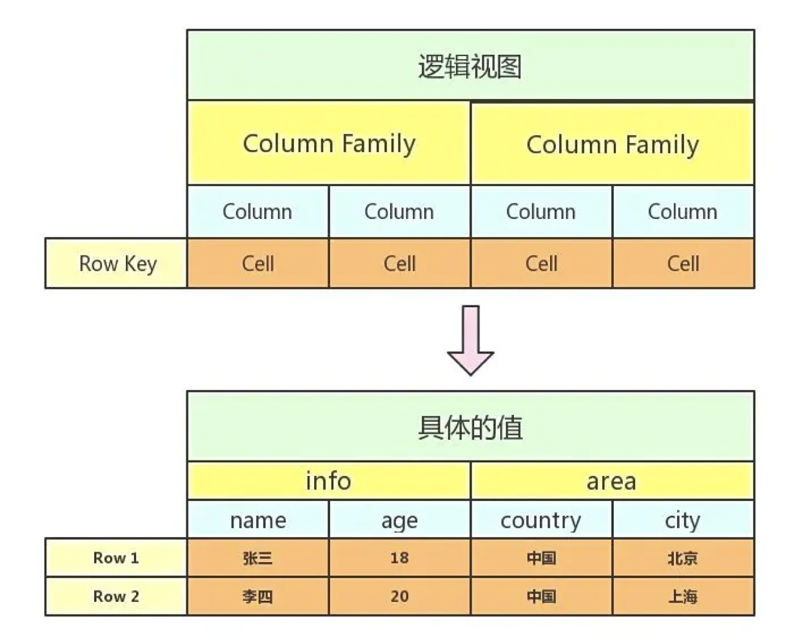
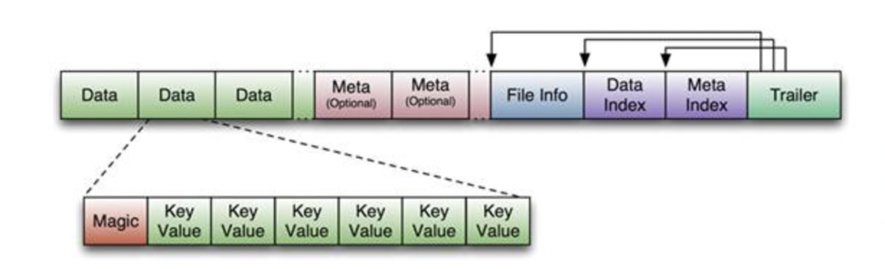

# 一、什么是HBASE
1、面向列存储的分布式存储系统。   
2、概念有row key和cloumn family。   
3、仅能通过行键(row key)和行键序列来检索数据，仅支持单行事务。  

<!--more-->  

> 下图为hbase的整体架构图：

  

Zookeepr负责维护集群的memberlist, 哪台服务器在线,哪台服务器宕机都由zookeeper探测和管理. Region server, 主备Master节点主动连接Zookeeper, 维护一个Session连接,

从图可以看出，HBase中的存储包括HMaster、HRegionServer、HRegion、Store、MemStore、StoreFile、HFile、HLog等
1. HMaster：协调HRegionServer的负载均衡，
2. HRegionServer：管理region，处理对region的IO请求。
3. HRegion：存储数据，按行进行分割，每个region最大256M，超过将分割成两个region。
4. Store：为每一个columnFamily创建一个store
5. MEMStore
6. StoreFile：HFile的轻量封装。
7. HFile：KeyValue的存储格式，是Hadoop的二进制存储文件。
8. Hlog：一旦HRegionServer意外退出，MemStore中的内存数据就会丢失，引入HLog就是防止这种情况

# 二、基本类型
HBASE中每一个表叫做BigTable，bigtable会存储一系列的行数据，行的三个基本类型的定义：
1.逻辑存储：



2.三个类型定义：
1.RowKey
是行在BigTable中的唯一标识。
2.TimeStamp：
是每一次数据操作对应关联的时间戳，可以看作SVN的版本。
3.Column：
定义为:，通过这两部分可以指定唯一的数据的存储列，family的定义和修改需要对HBase进行类似于DB的DDL操作，
而label，不需要定义直接可以使用，这也为动态定制列提供了一种手段。family另一个作用体现在物理存储优化读写操作上，同family
的数据物理上保存的会比较接近，因此在业务设计的过程中可以利用这个特性。

```
示例：
Row row =new Row();
List<Column> columns = new ArrayList<>();
columns.add(new Column("id",dto.getId().toString()));
columns.add(new Column("operation",dto.getOperation()));
columns.add(new Column("operationId",String.valueOf(dto.getOperationId())));
columns.add(new Column("recordId",dto.getRecordId().toString()));
columns.add(new Column("beforeData",dto.getBeforeData()));
columns.add(new Column("afterData",dto.getAfterData()));
row.setColumnList(columns);
```

将这些字段都放入到一个column family内。


# 三、各个模块的结构
1、HMaster
> 1、协调各个regsion server的负载均衡。   
> 2、负责给region分配region server。   
> 3、通过zk可以实现master的集群部署，但是同时只有一个master提供服务。

```
**************************
**** HBase Meta Table ****
**************************
Meta table存储所有region的列表
Meta table的结构如下:
- Key: region的开始row key, region id
- Values: Region server

```

2、Region Server
结构及流程图：


2.1、Region
1、根据Row Key的区域分成多个Region（按照rowkey分成region，若一个region存储不下则开辟新的region）
2、每个HRegion对应Table中一个Region，HRegion由多个HStore组成；
3、每个HStore对应Table中一个Column Family的存储；
4、flush的最小单位是region。
5、每个region最大1GB(默认)。


案例：
假设一个region只能存储一条数据，那么现在两条数据，则会生成两个region。

一条数据怎么存储呢？通过store存储。
现在一行数据有两个column family：info和area。
每个column family都使用store存储，那么现在会有两个store。
那一个store怎么存储呢？
通过keyvalue的方式存储，key=name,value=age
那怎么对应到物理文件中呢？
使用HFile进行存储，将keyvalue封装成Data block。Data block是HBASE IO的最基本单元。


2.2、MemStore
1、每一个cloumn family对应一个memstore，
2、采用LSM数据结构存储，并在内存中排序，提高写入速度。
3、若rowkey的cf过多，则会导致memstore过多，导致region的flush。


2.3、Store File
HFile的轻量封装。

2.4、HFile
1、HFile中存储有序的Key-Value对. 当Memstore满了之后, Memstore中的所有数据写入HDFS中,形成一个新的HFile
2、HFile文件主要分为4个部分：Scanned block部分、Non-scanned block部分、Load-on-open部分和Trailer。

> HFile结构：



首先HFile文件是不定长的，长度固定的只有其中的两块：Trailer和FileInfo。Trailer中又指针指向其他数据块的起始点，FileInfo记录了文件的一些meta信息。
HFile由一个一个Data block组成，Data block中存储一个一个的key value。

> keyvalue结构：


2.5、HLog
一旦HRegionServer意外退出，MemStore中的内存数据就会丢失，引入HLog就是防止这种情况。
每个region server都有一个HLog。


# 四、数据读取过程
Client 请求读取数据时，先转发到 ZK 集群，在 ZK 集群中寻找到相对应的 Region Server，再找到对应的 Region，先是查 MemStore，如果在 MemStore 中获取到数据，那么就会直接返回，否则就是再由 Region 找到对应的 Store File，从而查到具体的数据。
在整个架构中，HMaster 和 HRegion Server 可以是同一个节点上，可以有多个 HMaster 存在，但是只有一个 HMaster 在活跃。
在 Client 端会进行 rowkey-> HRegion 映射关系的缓存，降低下次寻址的压力。

client -> zk -> hmaster -> hregionServer -> hRegion -> MemStore -> HFile -> HDFS -> NameNode -> DataNode

Zookeepr负责维护集群的memberlist, 哪台服务器在线,哪台服务器宕机都由zookeeper探测和管理. Region server, 主备Master节点主动连接Zookeeper, 维护一个Session连接,
HBase的第一次读写流程

HBase把各个region的位置信息存储在一个特殊的表中, 这个表叫做Meta table.
Zookeeper里面存储了这个Meta table的位置信息.

HBase的访问流程:
1. 客户端访问Zookeep, 得到了具体Meta table的位置
2. 客户端再访问真正的Meta table, 从Meta table里面得到row key所在的region server
3. 访问rowkey所在的region server, 得到需要的真正数据.

# 五、数据写入过程

先是 Client 进行发起数据的插入请求，如果 Client 本身存储了关于 Rowkey 和 Region 的映射关系的话，那么就会先查找到具体的对应关系，如果没有的话，就会在ZK中进行查找到对应 Region server，然后再转发到具体的 Region 上。所有的数据在写入的时候先是记录在 WAL 中，同时检查关于 MemStore 是否满了，如果是满了，那么就会进行刷盘，输出到一个 Hfile 中，如果没有满的话，那么就是先写进 Memstore 中，然后再刷到 WAL 中。

https://www.infoq.cn/article/iehfj_irzkiuepm6udza


HBase Meta Table
Meta table存储所有region的列表
Meta table用类似于Btree的方式存储
Meta table的结构如下:
- Key: region的开始row key, region id
- Values: Region server

# 六、region分区及定位?
每张表一开始只有一个 Region，但是随着数据的插入，HBase 会根据一定的规则将表进行水平拆分，形成两个 Region。当表中的行越来越多时，就会产生越来越多的 Region，而这些 Region 无法存储到一台机器上时，则可将其分布存储到多台机器上。
表的所有行都是按照 RowKey 的字典序排列的，表在行的方向上分割为多个分区（Region），如下图所示。

6.1、region分区
region两个重要属性：startKey与endKey，代表该region维护的rowkey范围。
如果一开始，一张表只有一个region，当数据put超过region的存储容量，则会发生分区，找到一个midkey，将region一分为二。
问题：
* 如果rowkey是递增的，那么数据会一直往大的分区写，则分割的另外一半没有满。
散列+预分区，二者结合是比较好的方式。预分区一开始就预建好了一部分region,这些region都维护着自已的start-end keys，再配合上随机散列，写数据能均等地命中这些预建的region，就能解决上面的那些缺点，大大地提高了性能

6.2、理解rowkey的字典序：
HBase是三维有序存储的，是指rowkey（行键），column key（column family和qualifier）和TimeStamp（时间戳）这个三个维度是依照ASCII码表排序的。（比如A排在a前面）
* 先rowkey升序排序，
* rowkey相同则column key升序排序
* rowkey、column key相同则timestamp降序排序
如下： 假设存在table：test，family：info
scan表得到结果如下：
```
//列族默认VERSIONS值为1，可以通过命令：alter 'tableName','familyName',VERSINOS =>5来设置
//不同version保存不同时间戳的数据，默认是只显示最新version数据。要想显示所有，scan时应该加上{VERSIONS =>5}
hbase(main):009:0> scan 'test', {VERSIONS =>5}
ROW                                                    COLUMN+CELL                                                                                                                                                   
 12Aabb                                                column=info:name,timestamp=1519957330893,value=123                                                                                                      
 3aabb                                                 column=info:name,timestamp=1519963129863,value=3234                                                                                                         
 3aabb                                                 column=info:name,timestamp=1519962895984,value=234                                                                                                          
 3aabb                                                 column=info:name,timestamp=1519962889791,value=234                                                                                                          
 3aabb                                                 column=info:name,timestamp=1519960252203,value=999                                                                                                          
 Aabb                                                  column=info:address,timestamp=1519969857611,value=cccc                                                                                                      
 Aabb                                                  column=info:friend,timestamp=1519969916299,value=jack                                                                                                       
 Aabb                                                  column=info:name,timestamp=1519957330890,value=123                                                                                                         
 aabb                                                  column=info:name,timestamp=1519957330859,value=123                                                                                                          
4 row(s) in 0.0530 seconds
```


# 七、Rowkey的设计原则
## 1、rowkey长度原则
rowkey是一个二进制码流，可以是任意字符串，最大长度64kb，实际应用中一般为10-100bytes，以byte[]形式保存，一般设计成定长。
建议越短越好，不要超过16个字节，原因如下：

数据的持久化文件HFile中是按照KeyValue存储的，如果rowkey过长，比如超过100字节，1000w行数据，光rowkey就要占用100*1000w=10亿个字节，将近1G数据，这样会极大影响HFile的存储效率；
MemStore将缓存部分数据到内存，如果rowkey字段过长，内存的有效利用率就会降低，系统不能缓存更多的数据，这样会降低检索效率。
目前操作系统都是64位系统，内存8字节对齐，控制在16个字节，8字节的整数倍利用了操作系统的最佳特性。
## 2、rowkey散列原则
如果rowkey按照时间戳的方式递增，不要将时间放在二进制码的前面，建议将rowkey的高位作为散列字段，由程序随机生成，低位放时间字段，这样将提高数据均衡分布在每个RegionServer，以实现负载均衡的几率。如果没有散列字段，首字段直接是时间信息，所有的数据都会集中在一个RegionServer上，这样在数据检索的时候负载会集中在个别的RegionServer上，造成热点问题，会降低查询效率。
## 3、rowkey唯一原则
必须在设计上保证其唯一性，rowkey是按照字典顺序排序存储的，因此，设计rowkey的时候，要充分利用这个排序的特点，将经常读取的数据存储到一块，将最近可能会被访问的数据放到一块。

## 什么是热点？
HBase中的行是按照rowkey的字典顺序排序的，这种设计优化了scan操作，可以将相关的行以及会被一起读取的行存取在临近位置，便于scan。然而糟糕的rowkey设计是热点的源头。 热点发生在大量的client直接访问集群的一个或极少数个节点（访问可能是读，写或者其他操作）。大量访问会使热点region所在的单个机器超出自身承受能力，引起性能下降甚至region不可用，这也会影响同一个RegionServer上的其他region，由于主机无法服务其他region的请求。 设计良好的数据访问模式以使集群被充分，均衡的利用。
为了避免写热点，设计rowkey使得不同行在同一个region，但是在更多数据情况下，数据应该被写入集群的多个region，而不是一个。

下面是一些常见的避免热点的方法以及它们的优缺点：
* 加盐
这里所说的加盐不是密码学中的加盐，而是在rowkey的前面增加随机数，具体就是给rowkey分配一个随机前缀以使得它和之前的rowkey的开头不同。分配的前缀种类数量应该和你想使用数据分散到不同的region的数量一致。加盐之后的rowkey就会根据随机生成的前缀分散到各个region上，以避免热点。
* 哈希
哈希会使同一行永远用一个前缀加盐。哈希也可以使负载分散到整个集群，但是读却是可以预测的。使用确定的哈希可以让客户端重构完整的rowkey，可以使用get操作准确获取某一个行数据
* 反转
第三种防止热点的方法时反转固定长度或者数字格式的rowkey。这样可以使得rowkey中经常改变的部分（最没有意义的部分）放在前面。这样可以有效的随机rowkey，但是牺牲了rowkey的有序性。
反转rowkey的例子以手机号为rowkey，可以将手机号反转后的字符串作为rowkey，这样的就避免了以手机号那样比较固定开头导致热点问题
时间戳反转
一个常见的数据处理问题是快速获取数据的最近版本，使用反转的时间戳作为rowkey的一部分对这个问题十分有用，可以用 Long.Max_Value - timestamp 追加到key的末尾，例如 [key][reverse_timestamp] , [key] 的最新值可以通过scan [key]获得[key]的第一条记录，因为HBase中rowkey是有序的，第一条记录是最后录入的数据。
比如需要保存一个用户的操作记录，按照操作时间倒序排序，在设计rowkey的时候，可以这样设计
[userId反转][Long.Max_Value - timestamp]，在查询用户的所有操作记录数据的时候，直接指定反转后的userId，startRow是[userId反转][000000000000],stopRow是[userId反转][Long.Max_Value - timestamp]
如果需要查询某段时间的操作记录，startRow是[user反转][Long.Max_Value - 起始时间]，stopRow是[userId反转][Long.Max_Value - 结束时间]

# 八、使用案例
```
示例：
Row row =new Row();
List<Column> columns = new ArrayList<>();
columns.add(new Column("id",dto.getId().toString()));
columns.add(new Column("operation",dto.getOperation()));
columns.add(new Column("operationId",String.valueOf(dto.getOperationId())));
columns.add(new Column("recordId",dto.getRecordId().toString()));
columns.add(new Column("beforeData",dto.getBeforeData()));
columns.add(new Column("afterData",dto.getAfterData()));
row.setColumnList(columns);

private String getRowKey(BusinessLogDto dto){
    if(dto.getRecordId()!=null&&dto.getModuleId()!=null&&dto.getId()!=null){
        StringBuilder stringBuilder = new StringBuilder(dto.getRecordId()+Constants.ROW_KEY_SEPARATION+dto.getModuleId());
        if(dto.getChildModuleId()!=null){
            stringBuilder.append(Constants.ROW_KEY_SEPARATION+dto.getChildModuleId());
        }
        stringBuilder.append(Constants.ROW_KEY_SEPARATION+dto.getOperationId()+Constants.ROW_KEY_SEPARATION+dto.getId());
        String rowkey =stringBuilder.toString();
        log.info("upload create rowkey:"+rowkey);
        return  rowkey;
    }
    log.info("upload create rowkey is null");
    return null;
}
```
将这些字段都放入到一个column family内。


## 8.1、row key设计：
 业务ID+_+系统ID(+_+子模块ID(如需要自行定义))+_+业务系统操作ID+_+生成的唯一ID(时间毫秒数+4位计数（0000-9999）)
* 1、热点考虑：业务ID本身是唯一的，这样可以保证不产生热点问题，又能保证系统的业务ID可以进入相同的region内。
* 2、长度考虑：long + long + long + long +long (8byte*5=40byte)，emmmm，这里有问题？长度不固定并且长度大于了16byte。

实际实现：业务ID+系统ID+业务系统操作ID

https://www.cnblogs.com/yangjiming/p/9429169.html
http://c.biancheng.net/view/6528.html