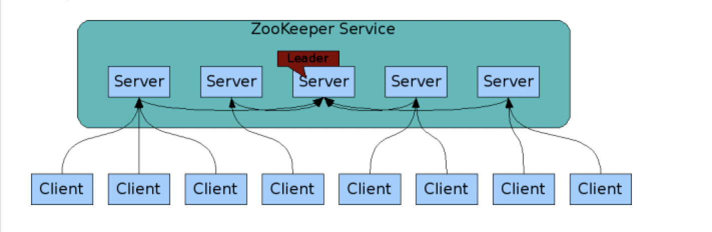
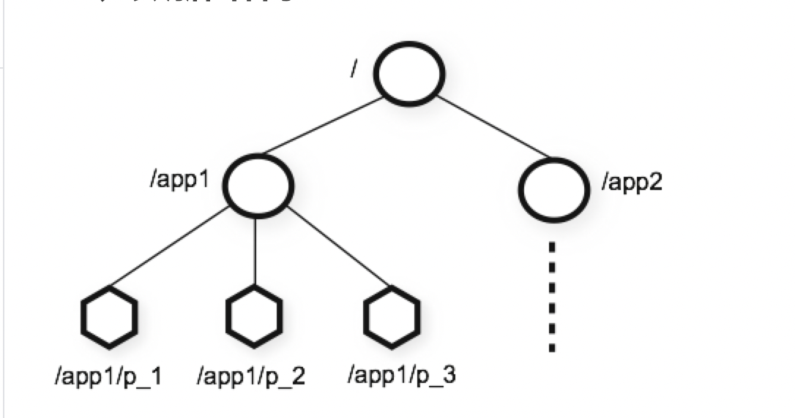
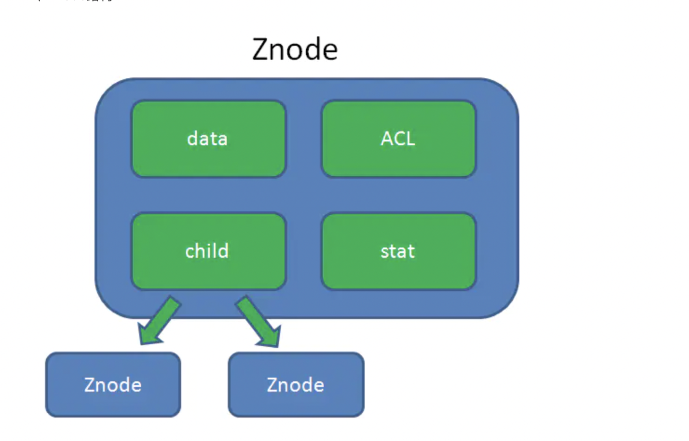
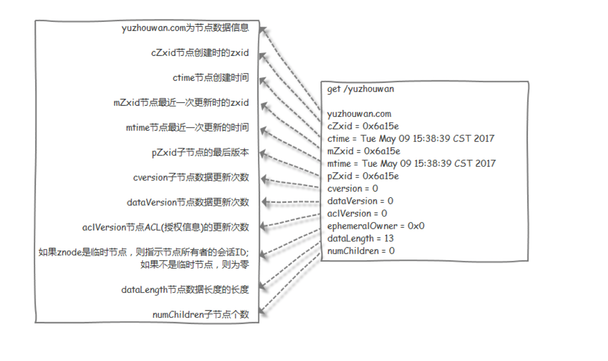
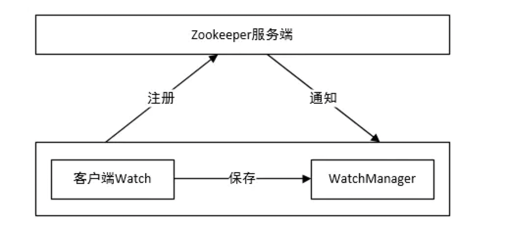
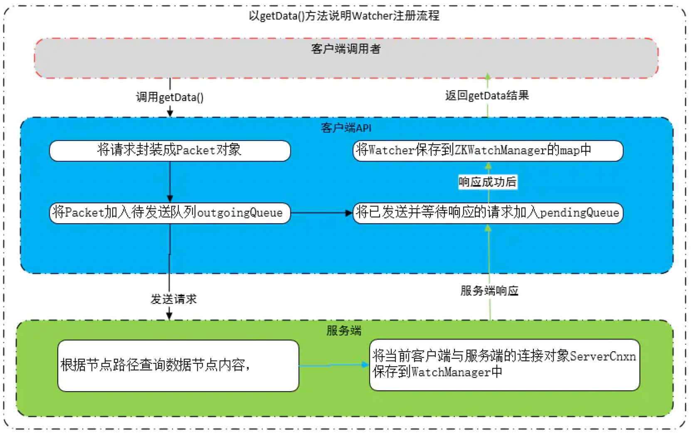
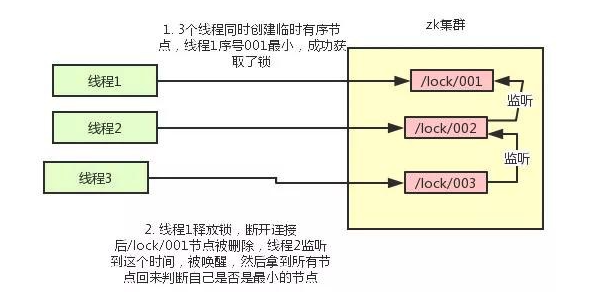

# 一、什么是zk
分布式服务的协调服务：  
1、配置管理。  
2、分布式锁。  
3、集群选举。  
4、消息订阅。  

<!--more-->  

# 二、基本架构

- 一主多从，主服务支持读写，从服务只支持读，客户端写都需要经过主服务。


# 三、数据结构
- 整体结构  


> 结构类似于树，每个节点对应的数据结构是znode，每个node的数据最大不能超过1M

- znode  


> data：存储的是数据信息  
> ACL：记录了znode的访问权限  
> stat：znode的元数据，例如事务ID、版本号、时间戳、大小等  
> child：子节点引用，可以有多个子节点 
> 节点：节点的数据大小不超过1M，适用于读多写少的情况

- 示例


- znode类型：  
    - PERSISTENT：持久化节点  
    - PERSISTENT_SEQUENTIAL：持久化排序节点  
    - EPHEMERAL：临时节点（一种特殊的znode，只要创建znode的会话处于活跃状态，就会存在；当session结束时，就会删除。在实现分布式锁时非常有用）
    - EPHEMERAL_SEQUENTIAL：临时排序节点 

- 节点基本操作
    - create
    - delete
    - setData
    - exists：读操作
    - getData：读操作
    - getChildren：读操作
    - 读操作，可以选择设置watch
    - 写操作，会触发相应节点注册的watch
    
- 应用
    - 分组管理：path结构
    - 统一命名：sequential
    - 同步：临时节点


# 四、数据一致性和高可用
采用了ZAB协议（zookeeper atomic broadcast：原子广播协议），这种协议非常类似于一致性协议paxos和raft。  
首先了解三种状态：
- 1、looking：选举状态
- 2、following：follwer（从节点）的状态
- 3、leading：leader（主节点）的状态  

最大ZXID的概念：就是当前节点的最新事务编号  
- 1、ZXID=epoch+计数，由这两部分组成.高32位是epoch，低32位是epoch内的自增id
- 2、epoch：纪元的意思，选举阶段会发送自己的epoch并与接收的epoch对比，若自身的小则重新发送并携带已知最大的epoch。


## 4.1、集群故障恢复：
***两种情况：***  
1、Leader节点运行后会周期性地向Follower发送心跳信息（称之为ping），如果一个Follower未收到Leader节点的心跳信息，Follower节点的状态会从FOLLOWING转变为LOOKING，此时该follower会发起重新选主。  
2、leader会检测follower返回的节点状态，若多数节点状态未响应，此时需要重新发起选主。
### 一、选举阶段
**步骤一：**  

> 1、每个server发出一个投票，格式：（myid, zxid）= （机器编号，ZXID）  
> 2、节点1比对节点2和节点3的投票都小于自身，此时不做处理。  
> 3、节点2判断发现节点1比自己大、节点3比自己小，将重新投票  
> 4、节点3判断发现节点1比自己大、节点2比自己大，将重新投票，给最大的投票 
 
**步骤二：**  

> 1、节点2、节点3重新投票，投票给1  
> 2、开始统计投票，节点1收到半数的投票，此时为leader，其他的变更为follower  


### 二、发现阶段
发现阶段，用于在从节点中发现最新的ZXID和事务日志。或许有人会问：既然Leader被选为主节点，已经是集群里数据最新的了，为什么还要从节点中寻找最新事务呢？
这是为了防止某些意外情况，比如因网络原因在上一阶段产生多个Leader的情况。

所以这一阶段，Leader集思广益，接收所有Follower发来各自的最新epoch值。Leader从中选出最大的epoch，基于此值加1，生成新的epoch分发给各个Follower。

各个Follower收到全新的epoch后，返回ACK给Leader，带上各自最大的ZXID和历史事务日志。Leader选出最大的ZXID，并更新自身历史日志。

### 三、同步阶段
同步阶段，把Leader刚才收集得到的最新历史事务日志，同步给集群中所有的Follower。只有当半数Follower同步成功，这个准Leader才能成为正式的Leader。

***自此，故障恢复正式完成。***

## 4.2、数据一致性
当更新节点，zk是如果保证所有节点的数据一致？

> 写入数据，就涉及到了ZAB协议的Broadcast广播阶段。

Broadcast过程如下：
  
    1、客户端发出写入数据请求给任意Follower。
    2、Follower把写入数据请求转发给Leader。
    3、Leader采用二阶段提交方式，先发送Propose广播给Follower。
    4、Follower接到Propose消息，写入日志成功后，返回ACK消息给Leader。
    5、Leader接到半数以上ACK消息，返回成功给客户端，并且广播Commit请求给Follower。

# 五、watch机制


***watch类型：***  
zk状态的watch 事件:
```
KeeperState:
    Unknown (-1),
    Disconnected (0),
    SyncConnected (3),
    AuthFailed (4),
    ConnectedReadOnly (5),
    SaslAuthenticated(6),
    Expired (-112);
```
zk节点的watch 事件：
```
EventType
    None (-1),
    NodeCreated (1),
    NodeDeleted (2),
    NodeDataChanged (3),
    NodeChildrenChanged (4);
```

***整体流程：***  
客户端将watch注册到服务器，并将该watch保存至当前客户端的watchManager中。当服务器发现数据节点发生变更，则通知客户端，此时客户端接收消息后会调用watchManager中的相应watch进行相应逻辑处理。

> 客户端watch管理器（ZKWatchManager），数据结构：
```
//ZKWatchManager维护了三个map，key代表数据节点的绝对路径，value代表注册在当前节点上的watcher集合
//代表节点上内容数据、状态信息变更相关监听
private final Map<String, Set<Watcher>> dataWatches =
    new HashMap<String, Set<Watcher>>();
//代表节点变更相关监听
private final Map<String, Set<Watcher>> existWatches =
    new HashMap<String, Set<Watcher>>();
//代表节点子列表变更相关监听
private final Map<String, Set<Watcher>> childWatches =
    new HashMap<String, Set<Watcher>>();
```
> 服务端watch管理器（WatchManager），数据结构：
```
//WatchManager维护了两个map
//说明：WatchManager中的Watcher对象不是客户端用户定义的Watcher，
//     而是服务端中实现了Watcher接口的ServerCnxn抽象类，
//     该抽象类代表了一个客户端与服务端的连接

//key代表数据节点路径，value代表客户端连接的集合，该map作用为：
//通过一个指定znode路径可找到其映射的所有客户端，当znode发生变更时
//可快速通知所有注册了当前Watcher的客户端
private final HashMap<String, HashSet<Watcher>> watchTable =
    new HashMap<String, HashSet<Watcher>>();

//key代表一个客户端与服务端的连接，value代表当前客户端监听的所有数据节点路径
//该map作用为：当一个连接彻底断开时，可快速找到当前连接对应的所有
//注册了监听的节点，以便移除当前客户端对节点的Watcher
private final HashMap<Watcher, HashSet<String>> watch2Paths =
    new HashMap<Watcher, HashSet<String>>();
```
> 注册过程



# 六、分布式锁

## 6.1 使用"临时"实现
利用同级节点唯一性，多个进程去zk创建相同名称的节点，只有一个能够成功，创建失败的通过zk的watch机制监听节点的状态，一但监听到节点删除事件，会再次触发所有进程的写锁，这里会有惊群效应，会影响到性能。


## 6.2 使用"临时有序节点"实现
***思想图：***  


    总体思想：
    1、每个客户端都去创建临时节点，等待创建callBack
    2、创建成功callBack，此时去获取锁目录下的节点数量，等待获取数据的callBack
    3、数据返回callBack，对数据进行排序，判断当前节点大小
    4、若当前节点是第一个，则代表获得了锁；否则，监听前一个节点，添加watch（解决惊群问题）
    5、监听到watch事件，则继续循环获取节点列表。

***实现图：***


    1、zk.create，等待callBack ---> 
    2、然后获得所有节点，等待callBack; callBack返回后，去节点排序--->
    3、然后判断当前节点的大小，若是第一个，则获取到了锁，执行业务代码；否则监听前一个节点 --->
    4、然后循环去判断当前节点所处的位置。

***代码实现：***
```
//Children2Callback
@Override
public void processResult(int rc, String path, Object ctx, List<String> children, Stat stat) {
    //获得所目录的所有有序节点，然后排序，然后取自己在有序list中的index
    if (children == null) {
        System.out.println(ctx.toString() + "list null");
    } else {
        try {
            Collections.sort(children);
            int i = children.indexOf(lockName);
            if (i < 1) {
                System.out.println(threadName + " i am first...");
                zk.setData("/", threadName.getBytes(), -1);
                cc.countDown();
            } else {
                System.out.println(threadName + " watch " + children.get(i - 1));
                //监听前一个节点，关注前一个的删除事件
                zk.exists("/" + children.get(i - 1), this);
            }
        } catch (Exception e) {
            e.printStackTrace();
        }
    }
}
```

