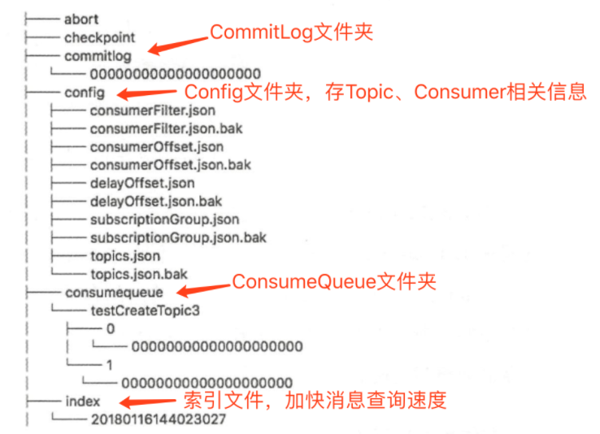

# 一、注册中心对比
| MQ      | 实现方式   | 部署方式|
|---      | ---       |  ---   |
|RocketMQ | NameServer| 集群部署，各节点不会进行数据交换|
|kafka    | zookeeper |一主多从，主服务器将数据同步至从服务器 |
| DMQ     | zookeeper |一主多从，主服务器将数据同步至从服务器 |

<!--more-->  

## 1、RocketMQ
> NameServer：
1. topicQueueTable：topic消息队列路由信息，消息发送时根据路由表进行负载均衡
2. brokerAddrTable：broker基础信息，包含brokerName，所属集群名称，主备broker地址；
一个broker和所有的NameServer连接
3. clusterAddrTable：Broker集群信息，存储集群中所有Broker名称
4. brokerLiveTable：broker状态信息。NameServer每次收到心跳包会暂时替换该信息。
5. filterServerTable：broker上的过滤服务列表

## 2、kafka
> Zookeeper

1. **broker注册：** /brokers/ids，保存Broker服务列表，如/brokers/ids/[0...N]，并保存broker的IP地址和端口
2. **topic注册：** 每个topic都会以/brokers/topics/[topic_name]的形式记录在Zookeeper
3. **consumer注册：** 消费者组也会向Zookeeper进行注册，Zookeeper会为其分配节点来保存相关数据，节点路径为/consumers/{group_id}，
Zookeeper可以记录分区跟消费者的关系，以及分区的offset。

## 3、DMQ
> Zookeeper

1. **topic注册：** /topic/topic1...topicN：主题号节点，注册所有的主题号及其订阅者
2. **server注册：**/node/node1...nodeN：服务节点，注册所有的server节点        
    

# 二、服务端对比
主要功能：消息存储、高可用、请求分发、

## 2.1、架构对比
### RocketMQ架构
rocketmq的服务端是broker，主要负责消息的存储、投递和查询以及服务高可用保证

1. 单台Master部署；
1. 多台Master部署；
1. 多Master多Slave部署。

Broker分为Master与Slave，一个Master可以对应多个Slave，但是一个Slave只能对应一个Master，Master与Slave 的对应关系通过指定相同的BrokerName，不同的BrokerId 来定义，**BrokerId为0表示Master，非0表示Slave**

### kafka架构
kafka集群节点也称做broker，接收生产者的消息，为消息设置偏移量，并提交消息保存到磁盘内。

* **controller broker**: 
    * broker的协调者，追踪集群中的其他Broker，并在合适的时候处理新加入的和失败的Broker节点、Rebalance分区、分配新的leader分区等
    * Kafka集群中始终只有一个Controller Broker
    * Broker 在启动时，会尝试去 ZooKeeper 中创建 /controller 节点。Kafka 当前选举控制器的规则是：第一个成功创建 /controller 节点的 Broker 会被指定为控制器。
    其他节点会监听该临时节点（watch机制）

broker在controller重新选举上，会导致集群不可用。
ZK性能问题，惊群效应

### DMQ架构
DMQ集群节点称为server，负责数据的存储、发送等功能。

## 2.2、消息存储对比
### RocketMQ
* 消息的基本概念：
    * topic：表示一类消息的集合，每个主题包含若干条消息，每条消息只能属于一个主题，是RocketMQ进行消息订阅的基本单位。
        * MessageQueue：在创建Topic的时候会让我们指定MessageQueue的数量，简单来说就是指定Topic中的队列数量。本质上是一个数据分片机制。
        * topic可以存放在多个broker内，每个broker内可以有多个messageQueue.
    * message：消息系统所传输信息的物理载体，生产和消费数据的最小单位，每条消息必须属于一个主题。RocketMQ中每个消息拥有唯一的Message ID，且可以携带具有业务标识的Key。系统提供了通过Message ID和Key查询消息的功能。
    * tag：标签

**关联关系：**

生产者先获取topic下的messageQueue，Broker在收到一条消息的时候，写入Commit Log的同时，还会将当前这条消息在commit log中的offset、消息的size和对应的Tag的Hash写入到consumer queue文件中去。
一个broker有多个commitlog文件。

使用文件存储，三个跟消息存储相关的文件：CommitLog、ConsumeQueue、IndexFile
1. **CommitLog**：消息主体以及元数据的存储主体，存储Producer端写入的消息主体内容,消息内容不是定长的。单个文件大小默认1G ，文件名长度为20位，左边补零，剩余为起始偏移量，比如00000000000000000000代表了第一个文件，起始偏移量为0，文件大小为1G=1073741824；当第一个文件写满了，第二个文件为00000000001073741824，起始偏移量为1073741824，以此类推。消息主要是顺序写入日志文件，当文件满了，写入下一个文件；
1. **ConsumeQueue**：消息消费队列，引入的目的主要是提高消息消费的性能，由于RocketMQ是基于主题topic的订阅模式，消息消费是针对主题进行的，如果要遍历commitlog文件中根据topic检索消息是非常低效的。Consumer即可根据ConsumeQueue来查找待消费的消息。其中，ConsumeQueue（逻辑消费队列）作为消费消息的索引，保存了指定Topic下的队列消息在CommitLog中的起始物理偏移量offset，消息大小size和消息Tag的HashCode值。consumequeue文件可以看成是基于topic的commitlog索引文件，故consumequeue文件夹的组织方式如下：topic/queue/file三层组织结构，具体存储路径为：$HOME/store/consumequeue/{topic}/{queueId}/{fileName}。同样consumequeue文件采取定长设计，每一个条目共20个字节，分别为8字节的commitlog物理偏移量、4字节的消息长度、8字节tag hashcode，单个文件由30W个条目组成，可以像数组一样随机访问每一个条目，每个ConsumeQueue文件大小约5.72M；
1. **IndexFile**：IndexFile（索引文件）提供了一种可以通过key或时间区间来查询消息的方法。Index文件的存储位置是：$HOME \store\index${fileName}，文件名fileName是以创建时的时间戳命名的，固定的单个IndexFile文件大小约为400M，一个IndexFile可以保存 2000W个索引，IndexFile的底层存储设计为在文件系统中实现HashMap结构，故rocketmq的索引文件其底层实现为hash索引。

**broker文件存储结构如下：**

### kafka
Kafka部分名词解释如下：
1. Broker：消息中间件处理结点，一个Kafka节点就是一个broker，多个broker可以组成一个Kafka集群。
1. Topic：一类消息，例如page view日志、click日志等都可以以topic的形式存在，Kafka集群能够同时负责多个topic的分发。
1. Partition：topic物理上的分组，一个topic可以分为多个partition，每个partition是一个有序的队列。
1. Segment：partition物理上由多个segment组成，下面2.2和2.3有详细说明。
1. offset：每个partition都由一系列有序的、不可变的消息组成，这些消息被连续的追加到partition中。partition中的每个消息都有一个连续的序列号叫做offset,用于partition唯一标识一条消息.

### DMQ
1. 采用数据库存储，一条数据对应一个clientID，即一条相同的信息会存储多遍。
2. 性能不如文件存储，数据库是瓶颈。    
    

    