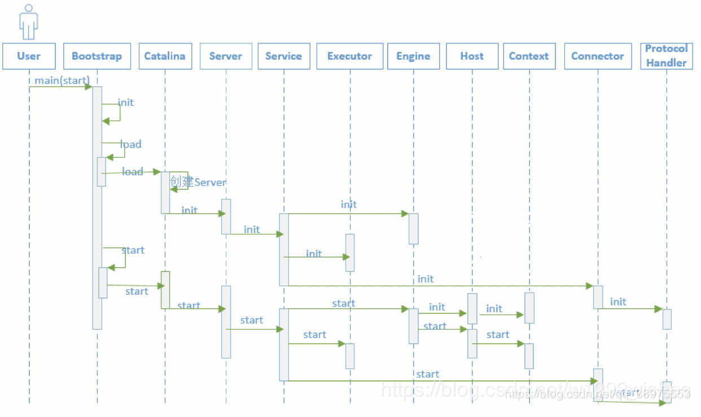

# 一、tomcat的启动过程
* 执行start.sh，实际将执行catalina.sh，
java命令执行Bootstrap类的main方法，将start作为参数传入

# 二、Load过程
## 1.1、Boostrap.java
```
public static void main(String args[]) {
    synchronized (daemonLock) {
        Bootstrap daemon = new Bootstrap();
        if (command.equals("startd")) {
            args[args.length - 1] = "start";
            daemon.load(args);
            daemon.start();
        }
    }
```
执行Boostrap的main方法，此时tomcat就在JVM作为一个线程启动了。

分成两步
> * 1、资源初始化，load()，绑定serverSocket
> * 2、资源启动，start()，connector创建acceptor连接线程池。    

执行Load方法
```
/**
 * Load daemon.
 */
private void load(String[] arguments) throws Exception {
    // Call the load() method
    String methodName = "load";
    Method method = catalinaDaemon.getClass().getMethod(methodName, paramTypes);
```
通过反射，执行Catalina.java的load方法    

## 1.2、Catalina.java
```
public void load() {
    //首先利用Digester类解析server.xml文件，得到容器的配置，并创建相应的对象，并关联父子容器。依次创建的是StandardServer、StandardService、StandardEngine、StandardHost。
    Digester digester = createStartDigester();
    InputSource inputSource = null;
    InputStream inputStream = null;
    File file = null;
    try {
        //解析server.xml
        file = new File("conf/server.xml");
        inputStream = new FileInputStream(file);
        inputSource = new InputSource(file.toURI().toURL().toString());
    } catch (Exception e) {
    }
    
    // Start the new server
    try {
        getServer().init();
    } catch (LifecycleException e) {
    }
}
```
1. 解析server.xml文件，首先利用Digester类解析server.xml文件，得到容器的配置，并创建相应的对象，并关联父子容器。
    依次创建的是StandardServer、StandardService、StandardEngine、StandardHost。。
2. 然后拿到StandardServer实例调用init()方法初始化Tomcat容器的一系列组件。一些容器初始化的的时候，都会调用其子容器的init()方法，初始化它的子容器。
    顺序是StandardServer、StandardService、StandardEngine、Connector。
    每个容器都在初始化自身相关设置的同时，将子容器初始化。

## 1.3、StandardServer:
实际的server实现是StandardServer
```
protected void initInternal() throws LifecycleException {
    // Register global String cache
    // Note although the cache is global, if there are multiple Servers
    // present in the JVM (may happen when embedding) then the same cache
    // will be registered under multiple names
    onameStringCache = register(new StringCache(), "type=StringCache");
    // Register the MBeanFactory
    MBeanFactory factory = new MBeanFactory();
    factory.setContainer(this);
    onameMBeanFactory = register(factory, "type=MBeanFactory");
    // Register the naming resources
    globalNamingResources.init();
    
    // Initialize our defined Services
    for (int i = 0; i < services.length; i++) {
        services[i].init();
    }
}
```
1. 加载Server、Service、Connector、Container、Engine、Host、Context、Wrapper一系列的容器。
2. 初始化service，从server的初始化上看，一个server有多个service。

## 1.4、StandardService:
实际的service实现是StandardService
```
protected void initInternal() throws LifecycleException {
    if (engine != null) {
        engine.init();
    }
    // Initialize any Executors
    for (Executor executor : findExecutors()) {
        if (executor instanceof JmxEnabled) {
            ((JmxEnabled) executor).setDomain(getDomain());
        }
        executor.init();
    }
    // Initialize mapper listener
    mapperListener.init();
    // Initialize our defined Connectors
    synchronized (connectorsLock) {
        for (Connector connector : connectors) {
            try {
                connector.init();
            } catch (Exception e) {
                String message = sm.getString(
                        "standardService.connector.initFailed", connector);
                log.error(message, e);
                if (Boolean.getBoolean("org.apache.catalina.startup.EXIT_ON_INIT_FAILURE"))
                    throw new LifecycleException(message);
}}}}
```
1. service执行engine的初始化。(engine继承Container，所以实际是进行container的初始化)
2. 然后创建一组线程池。executor是Tomcat自己实现的线程池。【】
3. 然后进行连接器(connector)的初始化（一组连接器，server.xml中配置的多个connector，对应了端口号和协议）

## 1.5、Connector:连接器
```
protected void initInternal() throws LifecycleException {
    // Initialize adapter
    adapter = new CoyoteAdapter(this);
    protocolHandler.setAdapter(adapter);
    try {
        protocolHandler.init();
    } 
}
```

1. 创建adapter适配器，当processor解析socket之后生成的Request和Response不能直接传入到容器中，需要通过adapter
将Request和Response转换成ServletRequest和ServletResponse.
2. 初始化protocolHandler，有两个重要组件：Endpoint和Processer
    * Endpoint：端口监听，接收Socket后进行解析，基于TCP/IP协议。
    * Processer：用来实现HTTP协议。将Endpoint的socket字节流解析成Tomcat的Request和Response，并通过Adapter交给容器处理。
#############
* connector在解析server.xml时创建，看connector的构造器，会生成Http11Protocol协议解析器。
* Http11Protocol的构造器，会创建NIOEndPoint
* EndPoint.init，会bind绑定端口，等待请求、接收请求
* EndPoint内有processor处理线程。


## 1.6、protocolHandler:协议处理器
```
public void init() throws Exception {
    endpoint.init();
}
```
初始化终端

## 1.7、endpoint:终端
```
public void init() throws Exception {
    if (bindOnInit) {
        bind();
        bindState = BindState.BOUND_ON_INIT;
    }
}
终端的初始化，需要创建socket并绑定端口号。

public void bind() throws Exception {
    if (!getUseInheritedChannel()) {
        serverSock = ServerSocketChannel.open();
        socketProperties.setProperties(serverSock.socket());
        InetSocketAddress addr = (getAddress()!=null?new InetSocketAddress(getAddress(),getPort()):new InetSocketAddress(getPort()));
        serverSock.socket().bind(addr,getAcceptCount());
    } else {
        // Retrieve the channel provided by the OS
        Channel ic = System.inheritedChannel();
        if (ic instanceof ServerSocketChannel) {
            serverSock = (ServerSocketChannel) ic;
        }
        if (serverSock == null) {
            throw new IllegalArgumentException(sm.getString("endpoint.init.bind.inherited"));
        }
    }
    serverSock.configureBlocking(true); //mimic APR behavior
    selectorPool.open();
}

EndPoint结构：
```

# 三、start过程


## 初始化过程总结：


参考
[Tomcat整体架构浅析](https://blog.csdn.net/cx520forever/article/details/52743166)