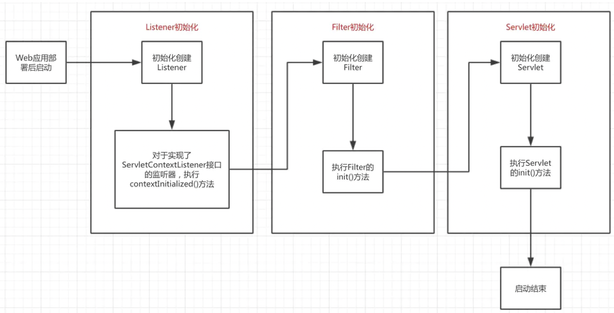

# 一、解析顺序
先解析server.xml，再解析web.xml


# 二、server.xml解析，在加载阶段

Catalina的load方法，此时会去解析server.xml文件

<!--more-->
```
public void load() {
    // Create and execute our Digester
    Digester digester = createStartDigester();
    file = configFile();
    inputStream = new FileInputStream(file);
    inputSource = new InputSource(file.toURI().toURL().toString());
    inputSource.setByteStream(inputStream);
    digester.push(this);
    digester.parse(inputSource);//解析流，进行类
}    

protected Digester createStartDigester() {
    long t1=System.currentTimeMillis();
    // Initialize the digester
    Digester digester = new Digester();
    digester.setValidating(false);
    digester.setRulesValidation(true);
    Map<Class<?>, List<String>> fakeAttributes = new HashMap<>();
    List<String> objectAttrs = new ArrayList<>();
    objectAttrs.add("className");
    fakeAttributes.put(Object.class, objectAttrs);
    // Ignore attribute added by Eclipse for its internal tracking
    List<String> contextAttrs = new ArrayList<>();
    contextAttrs.add("source");
    fakeAttributes.put(StandardContext.class, contextAttrs);
    digester.setFakeAttributes(fakeAttributes);
    digester.setUseContextClassLoader(true);

    //创建StandardServer对象，设置其对象的属性，调用父节点Catalina的setServer方法将Server添加到Catalina中。
    digester.addObjectCreate("Server",
                             "org.apache.catalina.core.StandardServer",
                             "className");
    digester.addSetProperties("Server");
    digester.addSetNext("Server",
                        "setServer",
                        "org.apache.catalina.Server");

    digester.addObjectCreate("Server/GlobalNamingResources",
                             "org.apache.catalina.deploy.NamingResourcesImpl");
    digester.addSetProperties("Server/GlobalNamingResources");
    digester.addSetNext("Server/GlobalNamingResources",
                        "setGlobalNamingResources",
                        "org.apache.catalina.deploy.NamingResourcesImpl");

    digester.addObjectCreate("Server/Listener",
                             null, // MUST be specified in the element
                             "className");
    digester.addSetProperties("Server/Listener");
    digester.addSetNext("Server/Listener",
                        "addLifecycleListener",
                        "org.apache.catalina.LifecycleListener");

    digester.addObjectCreate("Server/Service",
                             "org.apache.catalina.core.StandardService",
                             "className");
    digester.addSetProperties("Server/Service");
    digester.addSetNext("Server/Service",
                        "addService",
                        "org.apache.catalina.Service");

    digester.addObjectCreate("Server/Service/Listener",
                             null, // MUST be specified in the element
                             "className");
    digester.addSetProperties("Server/Service/Listener");
    digester.addSetNext("Server/Service/Listener",
                        "addLifecycleListener",
                        "org.apache.catalina.LifecycleListener");

    //Executor
    digester.addObjectCreate("Server/Service/Executor",
                     "org.apache.catalina.core.StandardThreadExecutor",
                     "className");
    digester.addSetProperties("Server/Service/Executor");

    digester.addSetNext("Server/Service/Executor",
                        "addExecutor",
                        "org.apache.catalina.Executor");


    digester.addRule("Server/Service/Connector",
                     new ConnectorCreateRule());
    digester.addRule("Server/Service/Connector",
                     new SetAllPropertiesRule(new String[]{"executor", "sslImplementationName"}));
    digester.addSetNext("Server/Service/Connector",
                        "addConnector",
                        "org.apache.catalina.connector.Connector");

    digester.addObjectCreate("Server/Service/Connector/SSLHostConfig",
                             "org.apache.tomcat.util.net.SSLHostConfig");
    digester.addSetProperties("Server/Service/Connector/SSLHostConfig");
    digester.addSetNext("Server/Service/Connector/SSLHostConfig",
            "addSslHostConfig",
            "org.apache.tomcat.util.net.SSLHostConfig");

    digester.addRule("Server/Service/Connector/SSLHostConfig/Certificate",
                     new CertificateCreateRule());
    digester.addRule("Server/Service/Connector/SSLHostConfig/Certificate",
                     new SetAllPropertiesRule(new String[]{"type"}));
    digester.addSetNext("Server/Service/Connector/SSLHostConfig/Certificate",
                        "addCertificate",
                        "org.apache.tomcat.util.net.SSLHostConfigCertificate");

    digester.addObjectCreate("Server/Service/Connector/SSLHostConfig/OpenSSLConf",
                             "org.apache.tomcat.util.net.openssl.OpenSSLConf");
    digester.addSetProperties("Server/Service/Connector/SSLHostConfig/OpenSSLConf");
    digester.addSetNext("Server/Service/Connector/SSLHostConfig/OpenSSLConf",
                        "setOpenSslConf",
                        "org.apache.tomcat.util.net.openssl.OpenSSLConf");

    digester.addObjectCreate("Server/Service/Connector/SSLHostConfig/OpenSSLConf/OpenSSLConfCmd",
                             "org.apache.tomcat.util.net.openssl.OpenSSLConfCmd");
    digester.addSetProperties("Server/Service/Connector/SSLHostConfig/OpenSSLConf/OpenSSLConfCmd");
    digester.addSetNext("Server/Service/Connector/SSLHostConfig/OpenSSLConf/OpenSSLConfCmd",
                        "addCmd",
                        "org.apache.tomcat.util.net.openssl.OpenSSLConfCmd");

    digester.addObjectCreate("Server/Service/Connector/Listener",
                             null, // MUST be specified in the element
                             "className");
    digester.addSetProperties("Server/Service/Connector/Listener");
    digester.addSetNext("Server/Service/Connector/Listener",
                        "addLifecycleListener",
                        "org.apache.catalina.LifecycleListener");

    digester.addObjectCreate("Server/Service/Connector/UpgradeProtocol",
                              null, // MUST be specified in the element
                              "className");
    digester.addSetProperties("Server/Service/Connector/UpgradeProtocol");
    digester.addSetNext("Server/Service/Connector/UpgradeProtocol",
                        "addUpgradeProtocol",
                        "org.apache.coyote.UpgradeProtocol");

    // Add RuleSets for nested elements
    digester.addRuleSet(new NamingRuleSet("Server/GlobalNamingResources/"));
    //EngineRuleSet中，将实例化StandardEngine
    digester.addRuleSet(new EngineRuleSet("Server/Service/"));
    //HostRuleSet中，将实例化StandardHost
    digester.addRuleSet(new HostRuleSet("Server/Service/Engine/"))
    //ContextRuleSet中，将实例化StandardContext
    digester.addRuleSet(new ContextRuleSet("Server/Service/Engine/Host/"));
    addClusterRuleSet(digester, "Server/Service/Engine/Host/Cluster/");
    digester.addRuleSet(new NamingRuleSet("Server/Service/Engine/Host/Context/"));

    // When the 'engine' is found, set the parentClassLoader.
    digester.addRule("Server/Service/Engine",
                     new SetParentClassLoaderRule(parentClassLoader));
    addClusterRuleSet(digester, "Server/Service/Engine/Cluster/");

    long t2=System.currentTimeMillis();
    if (log.isDebugEnabled()) {
        log.debug("Digester for server.xml created " + ( t2-t1 ));
    }
    return digester;
}
```
server.xml的解析，主要是去创建相应的实例对象，并设置层级关系。

 
## 2.1、StandardContext的创建时机

```
ContextRuleSet
/**
 * <p>Add the set of Rule instances defined in this RuleSet to the
 * specified <code>Digester</code> instance, associating them with
 * our namespace URI (if any).  This method should only be called
 * by a Digester instance.</p>
 *
 * @param digester Digester instance to which the new Rule instances
 *  should be added.
 */
 //只能被Digester
public void addRuleInstances(Digester digester) {
 
    // 1. 创建Context实例，通过server.xml配置Context时，create是true，需要创建Context实例；通过HostConfig创建Context时，create为false，此时仅需要解析节点即可
    if (create) {
        digester.addObjectCreate(prefix + "Context",
                "org.apache.catalina.core.StandardContext", "className");
        digester.addSetProperties(prefix + "Context");
    } else {
        digester.addSetProperties(prefix + "Context", new String[]{"path", "docBase"});
    }
 
    if (create) {
        digester.addRule(prefix + "Context",
                         new LifecycleListenerRule
                             ("org.apache.catalina.startup.ContextConfig",
                              "configClass"));
        digester.addSetNext(prefix + "Context",
                            "addChild",
                            "org.apache.catalina.Container");
    }
 
    // 2. 为Context添加生命周期监听器
    digester.addObjectCreate(prefix + "Context/Listener",
                             null, // MUST be specified in the element
                             "className");
    digester.addSetProperties(prefix + "Context/Listener");
    digester.addSetNext(prefix + "Context/Listener",
                        "addLifecycleListener",
                        "org.apache.catalina.LifecycleListener");
 
    // 3. 为Context指定类加载器，默认为org.apache.catalina.loader.WebappLoader
    digester.addObjectCreate(prefix + "Context/Loader",
                        "org.apache.catalina.loader.WebappLoader",
                        "className");
    digester.addSetProperties(prefix + "Context/Loader");
    digester.addSetNext(prefix + "Context/Loader",
                        "setLoader",
                        "org.apache.catalina.Loader");
 
    // 4. 为Context添加会话管理器，默认实现为StandardManager
    digester.addObjectCreate(prefix + "Context/Manager",
                             "org.apache.catalina.session.StandardManager",
                             "className");
    digester.addSetProperties(prefix + "Context/Manager");
    digester.addSetNext(prefix + "Context/Manager",
                        "setManager",
                        "org.apache.catalina.Manager");
 
    digester.addObjectCreate(prefix + "Context/Manager/Store",
                             null, // MUST be specified in the element
                             "className");
    digester.addSetProperties(prefix + "Context/Manager/Store");
    digester.addSetNext(prefix + "Context/Manager/Store",
                        "setStore",
                        "org.apache.catalina.Store");
 
    digester.addObjectCreate(prefix + "Context/Manager/SessionIdGenerator",
                             "org.apache.catalina.util.StandardSessionIdGenerator",
                             "className");
    digester.addSetProperties(prefix + "Context/Manager/SessionIdGenerator");
    digester.addSetNext(prefix + "Context/Manager/SessionIdGenerator",
                        "setSessionIdGenerator",
                        "org.apache.catalina.SessionIdGenerator");
 
    //5. 为Context添加初始化参数，通过该配置，为Context添加初始化参数
    digester.addObjectCreate(prefix + "Context/Parameter",
                             "org.apache.tomcat.util.descriptor.web.ApplicationParameter");
    digester.addSetProperties(prefix + "Context/Parameter");
    digester.addSetNext(prefix + "Context/Parameter",
                        "addApplicationParameter",
                        "org.apache.tomcat.util.descriptor.web.ApplicationParameter");
 
    // 6. 为Context添加安全配置以及web资源配置
    digester.addRuleSet(new RealmRuleSet(prefix + "Context/"));
 
    digester.addObjectCreate(prefix + "Context/Resources",
                             "org.apache.catalina.webresources.StandardRoot",
                             "className");
    digester.addSetProperties(prefix + "Context/Resources");
    digester.addSetNext(prefix + "Context/Resources",
                        "setResources",
                        "org.apache.catalina.WebResourceRoot");
 
    digester.addObjectCreate(prefix + "Context/Resources/PreResources",
                             null, // MUST be specified in the element
                             "className");
    digester.addSetProperties(prefix + "Context/Resources/PreResources");
    digester.addSetNext(prefix + "Context/Resources/PreResources",
                        "addPreResources",
                        "org.apache.catalina.WebResourceSet");
 
    digester.addObjectCreate(prefix + "Context/Resources/JarResources",
                             null, // MUST be specified in the element
                             "className");
    digester.addSetProperties(prefix + "Context/Resources/JarResources");
    digester.addSetNext(prefix + "Context/Resources/JarResources",
                        "addJarResources",
                        "org.apache.catalina.WebResourceSet");
 
    digester.addObjectCreate(prefix + "Context/Resources/PostResources",
                             null, // MUST be specified in the element
                             "className");
    digester.addSetProperties(prefix + "Context/Resources/PostResources");
    digester.addSetNext(prefix + "Context/Resources/PostResources",
                        "addPostResources",
                        "org.apache.catalina.WebResourceSet");
 
    // 7. 为Context添加资源连接，默认为ContextResourceLink，用于J2EE命名服务
    digester.addObjectCreate(prefix + "Context/ResourceLink",
            "org.apache.tomcat.util.descriptor.web.ContextResourceLink");
    digester.addSetProperties(prefix + "Context/ResourceLink");
    digester.addRule(prefix + "Context/ResourceLink",
            new SetNextNamingRule("addResourceLink",
                    "org.apache.tomcat.util.descriptor.web.ContextResourceLink"));
 
    // 8. 为Context添加Valve
    digester.addObjectCreate(prefix + "Context/Valve",
                             null, // MUST be specified in the element
                             "className");
    digester.addSetProperties(prefix + "Context/Valve");
    digester.addSetNext(prefix + "Context/Valve",
                        "addValve",
                        "org.apache.catalina.Valve");
 
    // 9. 为Context添加守护资源配置
    digester.addCallMethod(prefix + "Context/WatchedResource",
                           "addWatchedResource", 0);
 
    digester.addCallMethod(prefix + "Context/WrapperLifecycle",
                           "addWrapperLifecycle", 0);
 
    digester.addCallMethod(prefix + "Context/WrapperListener",
                           "addWrapperListener", 0);
 
    digester.addObjectCreate(prefix + "Context/JarScanner",
                             "org.apache.tomcat.util.scan.StandardJarScanner",
                             "className");
    digester.addSetProperties(prefix + "Context/JarScanner");
    digester.addSetNext(prefix + "Context/JarScanner",
                        "setJarScanner",
                        "org.apache.tomcat.JarScanner");
 
    digester.addObjectCreate(prefix + "Context/JarScanner/JarScanFilter",
                             "org.apache.tomcat.util.scan.StandardJarScanFilter",
                             "className");
    digester.addSetProperties(prefix + "Context/JarScanner/JarScanFilter");
    digester.addSetNext(prefix + "Context/JarScanner/JarScanFilter",
                        "setJarScanFilter",
                        "org.apache.tomcat.JarScanFilter");
 
    // 10. 为Context添加Cookie处理器
    digester.addObjectCreate(prefix + "Context/CookieProcessor",
                             "org.apache.tomcat.util.http.Rfc6265CookieProcessor",
                             "className");
    digester.addSetProperties(prefix + "Context/CookieProcessor");
    digester.addSetNext(prefix + "Context/CookieProcessor",
                        "setCookieProcessor",
                        "org.apache.tomcat.util.http.CookieProcessor");
}
```
ContextRuleSet定义了创建规则，digester会通过规则创建StandardContext对象


# 三、web.xml的解析时机，在启动阶段
## 1. StandardServer.startInternal()方法
```
protected void startInternal() throws LifecycleException {
    //通知容器启动事件
    fireLifecycleEvent(CONFIGURE_START_EVENT, null);
    setState(LifecycleState.STARTING);
    globalNamingResources.start();
    // Start our defined Services
    synchronized (servicesLock) {
        for (int i = 0; i < services.length; i++) {
            services[i].start();
        }
    }
}
```
## 2. StandardContext.startInternal()方法
```
protected synchronized void startInternal() throws LifecycleException {
    // Notify our interested LifecycleListeners
    //1、通知容器启动事件，去解析web.xml
    fireLifecycleEvent(Lifecycle.CONFIGURE_START_EVENT, null);
    //2、进行listener的创建和启动
    if (ok) {
        if (!listenerStart()) {
            log.error(sm.getString("standardContext.listenerFail"));
            ok = false;
        }
    }
    // 3、filter的创建和启动
    if (ok) {
        if (!filterStart()) {
            log.error(sm.getString("standardContext.filterFail"));
            ok = false;
        }
    }
    //加载和实例化servlet
    // Load and initialize all "load on startup" servlets
    if (ok) {
        if (!loadOnStartup(findChildren())){
            log.error(sm.getString("standardContext.servletFail"));
            ok = false;
        }
    }
}

```
## 3、ContextConfig.lifecycleEvent()方法
触发事件，进行文件的解析
```
public void lifecycleEvent(LifecycleEvent event) {
    // Process the event that has occurred
    if (event.getType().equals(Lifecycle.CONFIGURE_START_EVENT)) {
        //进行配置文件的解析，ContextConfig事件
        configureStart();
    } else if (event.getType().equals(Lifecycle.BEFORE_START_EVENT)) {
     

}
```


### 3.1、ContextConfig事件
```
/**
 * Process a "contextConfig" event for this Context.
 */
protected synchronized void configureStart() {
    // Called from StandardContext.start()

    if (log.isDebugEnabled()) {
        log.debug(sm.getString("contextConfig.start"));
    }

    if (log.isDebugEnabled()) {
        log.debug(sm.getString("contextConfig.xmlSettings",
                context.getName(),
                Boolean.valueOf(context.getXmlValidation()),
                Boolean.valueOf(context.getXmlNamespaceAware())));
    }
    //进行web.xml的具体解析工作
    webConfig();

    if (!context.getIgnoreAnnotations()) {
        applicationAnnotationsConfig();
    }
    if (ok) {
        validateSecurityRoles();
    }

    // Configure an authenticator if we need one
    if (ok) {
        authenticatorConfig();
    }

    // Dump the contents of this pipeline if requested
    if (log.isDebugEnabled()) {
        log.debug("Pipeline Configuration:");
        Pipeline pipeline = context.getPipeline();
        Valve valves[] = null;
        if (pipeline != null) {
            valves = pipeline.getValves();
        }
        if (valves != null) {
            for (int i = 0; i < valves.length; i++) {
                log.debug("  " + valves[i].getClass().getName());
            }
        }
        log.debug("======================");
    }

    // Make our application available if no problems were encountered
    if (ok) {
        context.setConfigured(true);
    } else {
        log.error(sm.getString("contextConfig.unavailable"));
        context.setConfigured(false);
    }
}
```


### 3.2、webConfig()方法，会根据web.xml中的配置进行listen，filter，servlet的信息设置
```
private void configureContext(WebXml webxml) {
    
    //filter的解析，此处未进行创建
    for (FilterDef filter : webxml.getFilters().values()) {
        if (filter.getAsyncSupported() == null) {
            filter.setAsyncSupported("false");
        }
        context.addFilterDef(filter);
    }
    //listen解析，此处未进行创建
    for (String listener : webxml.getListeners()) {
        context.addApplicationListener(listener);
    }
    
    //创建wraper，servlet并未创建
    for (ServletDef servlet : webxml.getServlets().values()) {
        Wrapper wrapper = context.createWrapper();
        if (servlet.getLoadOnStartup() != null) {
            wrapper.setLoadOnStartup(servlet.getLoadOnStartup().intValue());
        }
        if (servlet.getEnabled() != null) {
            wrapper.setEnabled(servlet.getEnabled().booleanValue());
        }
        wrapper.setName(servlet.getServletName());
        Map<String,String> params = servlet.getParameterMap();
        for (Entry<String, String> entry : params.entrySet()) {
            wrapper.addInitParameter(entry.getKey(), entry.getValue());
        }
        wrapper.setRunAs(servlet.getRunAs());
        Set<SecurityRoleRef> roleRefs = servlet.getSecurityRoleRefs();
        for (SecurityRoleRef roleRef : roleRefs) {
            wrapper.addSecurityReference(
                    roleRef.getName(), roleRef.getLink());
        }
        wrapper.setServletClass(servlet.getServletClass());
        MultipartDef multipartdef = servlet.getMultipartDef();
        if (multipartdef != null) {
            if (multipartdef.getMaxFileSize() != null &&
                    multipartdef.getMaxRequestSize()!= null &&
                    multipartdef.getFileSizeThreshold() != null) {
                wrapper.setMultipartConfigElement(new MultipartConfigElement(
                        multipartdef.getLocation(),
                        Long.parseLong(multipartdef.getMaxFileSize()),
                        Long.parseLong(multipartdef.getMaxRequestSize()),
                        Integer.parseInt(
                                multipartdef.getFileSizeThreshold())));
            } else {
                wrapper.setMultipartConfigElement(new MultipartConfigElement(
                        multipartdef.getLocation()));
            }
        }
        if (servlet.getAsyncSupported() != null) {
            wrapper.setAsyncSupported(
                    servlet.getAsyncSupported().booleanValue());
        }
        wrapper.setOverridable(servlet.isOverridable());
        context.addChild(wrapper);
    }
}
```

### 3.3、listen filter servlet的创建
StandardContext.startInternal()方法进行web.xml解析后，就会进行listen和filter和servlet的创建
```
public boolean listenerStart() {
     // Instantiate the required listeners
    String listeners[] = findApplicationListeners();
    Object results[] = new Object[listeners.length];
    boolean ok = true;
    for (int i = 0; i < results.length; i++) {
        if (getLogger().isDebugEnabled())
            getLogger().debug(" Configuring event listener class '" +
                listeners[i] + "'");
        try {
            String listener = listeners[i];
            results[i] = getInstanceManager().newInstance(listener);
        } catch (Throwable t) {
            t = ExceptionUtils.unwrapInvocationTargetException(t);
            ExceptionUtils.handleThrowable(t);
            getLogger().error(sm.getString("standardContext.applicationListener", listeners[i]), t);
            ok = false;
        }
    }   
}    


public boolean filterStart() {
    if (getLogger().isDebugEnabled()) {
        getLogger().debug("Starting filters");
    }
    // Instantiate and record a FilterConfig for each defined filter
    boolean ok = true;
    synchronized (filterConfigs) {
        filterConfigs.clear();
        for (Entry<String,FilterDef> entry : filterDefs.entrySet()) {
            String name = entry.getKey();
            if (getLogger().isDebugEnabled()) {
                getLogger().debug(" Starting filter '" + name + "'");
            }
            try {
                ApplicationFilterConfig filterConfig = new ApplicationFilterConfig(this, entry.getValue());
                filterConfigs.put(name, filterConfig);
            } catch (Throwable t) {
                t = ExceptionUtils.unwrapInvocationTargetException(t);
                ExceptionUtils.handleThrowable(t);
                getLogger().error(sm.getString(
                        "standardContext.filterStart", name), t);
                ok = false;
            }
        }
    }
    return ok;
}
```


当然这种加载只是针对配置了 load-on-startup 属性的 Servlet 而言，
其它一般 Servlet 的加载和初始化会推迟到真正请求访问 web 应用而第一次调用该 Servlet 时，
下面会看到这种情况下代码分析。
```
public boolean loadOnStartup(Container children[]) {

    // Collect "load on startup" servlets that need to be initialized
    TreeMap<Integer, ArrayList<Wrapper>> map = new TreeMap<>();
    for (int i = 0; i < children.length; i++) {
        Wrapper wrapper = (Wrapper) children[i];
        int loadOnStartup = wrapper.getLoadOnStartup();
        if (loadOnStartup < 0)
            continue;
        Integer key = Integer.valueOf(loadOnStartup);
        ArrayList<Wrapper> list = map.get(key);
        if (list == null) {
            list = new ArrayList<>();
            map.put(key, list);
        }
        list.add(wrapper);
    }

    // Load the collected "load on startup" servlets
    for (ArrayList<Wrapper> list : map.values()) {
        for (Wrapper wrapper : list) {
            try {
                wrapper.load();
            } catch (ServletException e) {            }
        }
    }
    return true;
}
//StandardWrapper
public synchronized void load() throws ServletException {
    instance = loadServlet();
    if (!instanceInitialized) {
        //Servlet servlet = instanceManager.newInstance(servletClass);
        initServlet(instance);
    }
}
```

> servlet执行时机
1. servlet = wrapper.allocate(); 调用StandardWrapper#allocate()方法，获取到servlet实例
2. ApplicationFilterChain filterChain = ApplicationFilterFactory.createFilterChain(request, wrapper, servlet);为当前请求创建一个过滤链，（非异步情况下）并调用filterChain.doFilter(request.getRequest(), response.getResponse());
3. filter#doFilter()、servlet#service()的执行是在filterChain.doFilter(request.getRequest(), response.getResponse());代码内部执行的。

> sevletRequestListener执行时机
```
StandardHostValve.invoke
// context.fireRequestInitEvent，会去通知Listener
public final void invoke(Request request, Response response)
    throws IOException, ServletException {
    try {
        context.bind(Globals.IS_SECURITY_ENABLED, MY_CLASSLOADER);
        if (!asyncAtStart && !context.fireRequestInitEvent(request.getRequest())) {
            return;
        }
}     
```   

//请求过来时，会去执行listener
```
public boolean fireRequestInitEvent(ServletRequest request) {
    Object instances[] = getApplicationEventListeners();
    if ((instances != null) && (instances.length > 0)) {
        ServletRequestEvent event = new ServletRequestEvent(getServletContext(), request);
            try {
                listener.requestInitialized(event);
            } catch (Throwable t) {
            }
        }
    }
    return true;
}
```

# 五、请求执行过程
StandardContext.startInternal()方法进行web.xml解析后，就会进行listen和filter和servlet（ServletWarpper）的创建
1. StandardHostValve.invoke，会调用StanardContext.fireRequestInitEvent
2. StandardContext.fireRequestInitEvent的 **listener（servletListener）** 的requestInitialized方法
3. 然后StandardContextValve.invoke，根据URL选择servlet
4. 然后StandardWrapperValve.invoke
    1. 会先判断servlet是否存在，不存在则创建。非load-on-startup类型的servlet会在第一次请求时创建。
    2. 执行过滤链，当所有的过滤器执行完成后，最后一个过滤器会调用步骤3
    3. 执行servlet.service方法


> 多种listener
1. ServletContextListener：监听ServletContext域对象的创建和销毁
2. HttpSessionListener：接口用于监听HttpSession对象的创建和销毁
3. ServletRequestListener：接口用于监听ServletRequest 对象的创建和销毁


listener -> filter -> servlet：执行顺序




