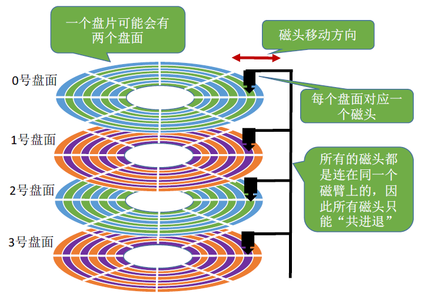
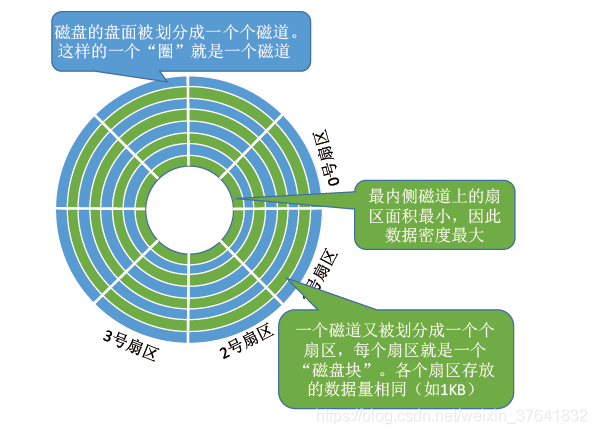
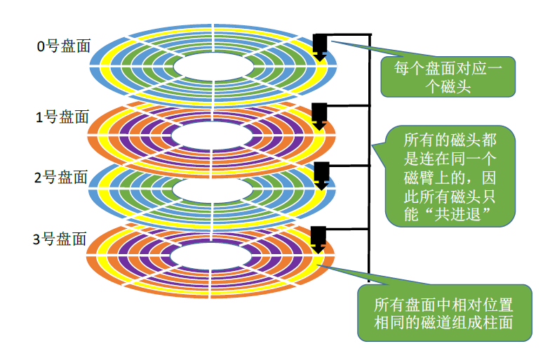

# 一、磁盘

## 1.1、结构
- 盘片
- 盘面
  - 扇区
- 柱面

<!--more-->  

### 1.1.1、盘片
一个<code>磁盘</code>（如一个 1T 的机械硬盘）由多个<code>盘片</code>（如下图中的 0 号盘片）叠加而成。

<code>盘片</code>的表面涂有磁性物质，这些磁性物质用来记录二进制数据。因为正反两面都可涂上磁性物质，故一个盘片可能会有两个<code>盘面</code>。

### 1.1.2、盘面
每个盘面被划分为一个个磁道，每个磁道又划分为一个个<code>扇区</code>。如下图：

其中，最内侧磁道上的扇区面积最小，因此数据密度最大。

### 1.1.3、柱面
每个盘面对应一个磁头。所有的磁头都是连在同一个磁臂上的，因此所有磁头只能“共进退”。

所有盘面中相对位置相同的磁道组成柱面。如下图，

## 1.2、磁盘的物理地址
由上，可用（柱面号，盘面号，扇区号）来定位任意一个“磁盘块”。

在“文件的物理结构”小节中，我们经常提到文件数据存放在外存中的几号块（逻辑地址），这个块号就可以转换成（柱面号，盘面号，扇区号）的地址形式。

可根据该地址读取一个“块”，操作如下：
① 根据“柱面号”移动磁臂，让磁头指向指定柱面；
② 激活指定盘面对应的磁头；
③ 磁盘旋转的过程中，指定的扇区会从磁头下面划过，这样就完成了对指定扇区的读/写。

# 二、局部性原理
局部性原理是计算机科学中的一个重要概念，它主要包括时间局部性和空间局部性。
- **时间局部性**是指如果一个存储位置被访问，那么在不久的将来，很可能会再次访问这个位置。例如，在循环中使用的变量，由于循环体可能会多次执行，这个变量会在一段时间内被频繁访问。
- **空间局部性**是指一旦一个存储位置被访问，那么它附近的存储位置也很可能会被访问。比如，在访问数组中的一个元素时，很可能会接着访问该元素相邻的其他元素。

# 三、局部性原理在计算机系统中的应用
## 3.1、缓存（Cache）技术
现代计算机处理器都有缓存，缓存利用了局部性原理来提高数据访问速度。当处理器需要访问内存中的数据时，它首先会在缓存中查找。由于时间和空间局部性，很可能所需的数据已经在缓存中（缓存命中）。例如，一级缓存（L1 Cache）通常存储处理器最常访问的数据和指令，它的速度非常快，几乎和处理器的速度相同。如果数据在 L1 Cache 中，处理器可以快速地获取数据，而不需要等待从较慢的主内存中读取。

## 3.2、预取（Prefetching）技术
预取技术也是基于局部性原理。处理器或者存储系统可以预测接下来可能会访问的数据，并提前将它们从内存中读取到缓存或者其他高速存储区域。例如，在访问数组元素时，如果检测到空间局部性，系统可以预取数组中后续的几个元素，这样当程序真正需要访问这些元素时，就可以快速获取，减少了等待时间。

## 3.3、指令流水线（Instruction Pipeline）
在处理器的指令流水线设计中，局部性原理也起到了作用。因为程序具有时间局部性，很多指令会被重复执行或者顺序执行，指令流水线可以通过提前获取和处理这些指令来提高处理器的性能。例如，在一个循环中，指令流水线可以提前获取下一次循环所需的指令，利用时间局部性来提高执行效率。

参考文章：
[图解 磁盘的结构](https://blog.csdn.net/weixin_37641832/article/details/103217311)