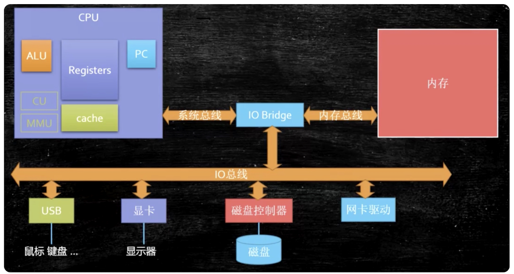
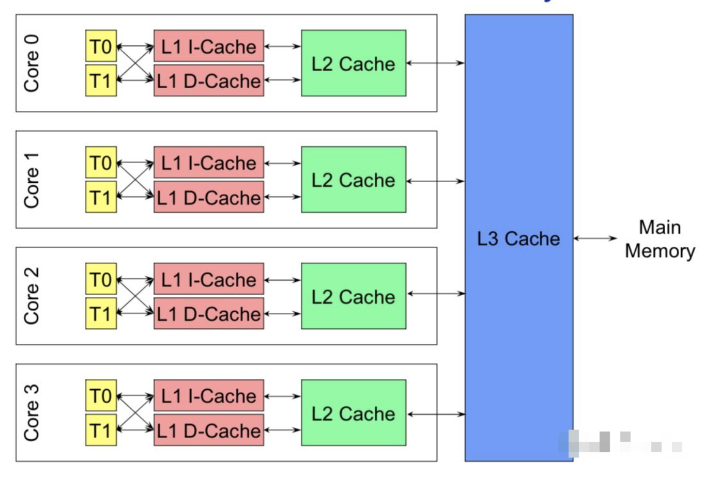
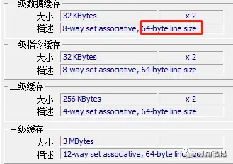
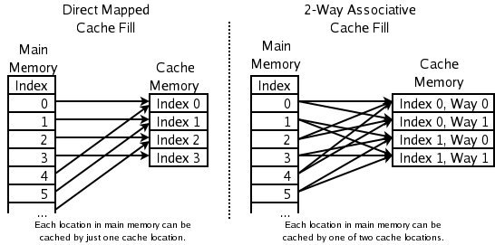
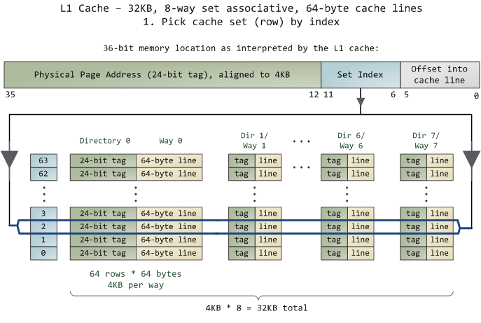

# 一、基本组成


<!--more-->  

1. PC：程序计数器，记录当前指令地址。
2. Registers：寄存器，暂时存储数据，种类繁多。
3. ALU：运算单元。
4. CU：control unit，控制单元。
5. MMU：memory management unit，内存控制单元。
6. Cache：缓存，解决CPU运行速度过快，内存读取速度跟不上的问题。

# 二、CPU缓存
缓存，解决CPU运行速度过快，内存读取速度跟不上的问题。如下图为一个4核CPU的缓存结构：

- L1 cache和 L2 cache  单核私有
  - L1缓存分成两种，一种是指令缓存，一种是数据缓存
- L3 cache 多核共享

## 2.1、各级缓存大小

Cache Line是最小单位（64Bytes），所以先把Cache分布多个Cache Line，比如：L1有32KB，那么，32KB/64B = 512 个 Cache Line。

## 2.2、缓存行结构
缓存行（Cache Line）也叫缓存块，是 CPU 缓存与主内存之间数据传输的基本单位。当 CPU 从主内存读取数据时，并不是读取单个字节或单个字，而是按照缓存行的大小整块地读取数据并存储到缓存中。同样，当 CPU 将数据写回主内存时，也是以缓存行为单位进行写操作。这种机制是基于计算机系统中的局部性原理，即程序在一段时间内倾向于访问相邻的数据。

缓存行结构如下：
```
+-------------------------------------------------------------+   
|  tag （24 bits） |   data block(cache line 64bytes) |  flag  |   
+-------------------------------------------------------------+
```
- **tag**：每条 Cache Line 前都会有一个独立分配的 24 bits来存的 tag，保存了内存地址的一部分，是用来验证是否缓存命中的。
- **data block**：就是从内存中拷贝过来的数据，也就是我们说的cache line【缓存行，内存的最小管理单位】，通常大小是64字节【Java中可存8个long】。
- **flag**：是一些标志位，比如缓存是否失效，写dirty等等。

缓存由多个缓存行组成。实际上LEVEL1_ICACHE_SIZE这个数据，是用data block来算的，并不包括tag和flag占用的大小，比如64 x 512 = 32768，表示LEVEL1_ICACHE_SIZE可以缓存512个cache line。

## 2.3、内存地址与 Cache 地址的映射
Cache的数据放置的策略决定了内存中的数据块会拷贝到CPU Cache中的哪个位置上，因为Cache的大小远远小于内存，所以，需要有一种地址关联的算法，能够让内存中的数据可以被映射到Cache中来。这个有点像内存地址从逻辑地址向物理地址映射的方法，但不完全一样。

### 2.3.1、映射方法如下
- 一种方法是，任何一个内存地址的数据可以被缓存在任何一个Cache Line里，这种方法是最灵活的，但是，如果我们要知道一个内存是否存在于Cache中，我们就需要进行O(n)复杂度的Cache遍历，这是很没有效率的。
- 另一种方法，为了降低缓存搜索算法，我们需要使用像Hash Table这样的数据结构，最简单的hash table就是做“求模运算”，比如：我们的L1 Cache有512个Cache Line，那么，公式：（内存地址 mod 512）* 64 就可以直接找到所在的Cache地址的偏移了。但是，这样的方式需要我们的程序对内存地址的访问要非常地平均，不然冲突就会非常严重。这成了一种非常理想的情况了。
- 为了避免上述的两种方案的问题，于是就要容忍一定的hash冲突，也就出现了 N-Way 关联。也就是把连续的N个Cache Line绑成一组，然后，先把找到相关的组，然后再在这个组内找到相关的Cache Line。这叫 Set Associativity。如下图所示。
  

#### N-way映射
缓存将一个内存地址分成下面几个部分：
```
+-------------------------------------------------+   
|  tag (24bits) | index (6bits)| offset (6bits)   |   
+-------------------------------------------------+
```
- **Tag：** 每条 Cache Line 前都会有一个独立分配的 24 bits来存的 tag，其就是内存地址的前24bits
- **Index：** 内存地址后续的6个bits则是在这一Way的是Cache Line 索引，2^6 = 64 刚好可以索引64条Cache Line
- **Offset：** 再往后的6bits用于表示在Cache Line 里的偏移量

示例：
Intel 大多数处理器的L1 Cache都是32KB，8-Way 组相联，Cache Line 是64 Bytes。这意味着，
- 32KB的可以分成，32KB / 64 = 512 条 Cache Line。
- 因为有8 Way，于是会每一Way 有 512 / 8 = 64 条 Cache Line。
- 于是每一路就有 64 x 64 = 4096 Byts 的内存。

1. 当拿到一个内存地址的时候，先拿出中间的 6bits 来，找到是哪组。
2. 然后，在这一个8组的cache line中，再进行O(n) n=8 的遍历，主是要匹配前24bits的tag。如果匹配中了，就算命中，如果没有匹配到，那就是cache miss，如果是读操作，就需要进向后面的缓存进行访问了。L2/L3同样是这样的算法。而淘汰算法有两种，一种是随机一种是LRU。现在一般都是以LRU的算法（通过增加一个访问计数器来实现）


# 三、缓存读取
1、先从缓存读取，l1 -> l2 -> l3   
2、如果缓存中不存在，则去内存中读取，内存存在，则返回。（从内存读取数据，按块读取，每次读取64字节）   
3、内存不存在，则触发缺页中断，去磁盘读取数据。（内存按页管理，每页4KB）   
4、然后读取磁盘，磁盘按块读取。（每次从磁盘读取，都是读取的一页或者是多页）

# 四、缓存问题

## 4.1、缓存一致性问题
例如x,y两个变量同时加入到两个CPU内，在各自CPU内运行，数据 x 在 CPU 第0核的缓存上被更新了，那么其它CPU核上对于这个数据 x 的值也要被更新，这就是缓存一致性的问题。


### 4.1.1、解决方案

#### 4.1.1.1、缓存一致性协议：mesi
CPU 层级的保证一致性的一种方式，协议的状态如下：
> modify：被修改，其他CPU变成无效
> exclusive：只有一个CPU读取独占，另外一个CPU也来读取时变成shared
> shared：多个CPU共享
> invalid：数据被修改了，当前CPU无效

下面是个示例

| 当前操作              | 	CPU0   | 	CPU1   | 	Memory |                                          	说明 |
|:------------------|---------|---------|---------|---------------------------------------------:|
| CPU0   read(x)    | x=1 (E) |         | x=1     |               只有一个CPU有 x 变量，所以，状态是 Exclusive |
| CPU1   read(x)    | x=1 (S) | x=1 (S) | x=1     |                 有两个CPU都读取 x 变量，所以状态变成 Shared |
| CPU0   write(x,9) | x=9 (M) | x=1 (I) | x=1     | 变量改变，在CPU0中状态,变成 Modified；在CPU1中状态变成 Invalid |
| 变量 x 写回内存     | x=9 (M) | X=1 (I) | x=9	    |                                      目前的状态不变 |
| CPU1 read(x)      | x=9(S)  | x=9 (S) | x=9	    |                 变量同步到所有的Cache中，   状态回到Shared |

MESI 这种协议在数据更新后，会标记其它共享的CPU缓存的数据拷贝为Invalid状态，然后当其它CPU再次read的时候，就会出现 cache miss 的问题，此时再从内存中更新数据。

##### 1 总线嗅探技术
###### 定义
总线嗅探（Bus Snooping）是一种用于维护多核处理器中缓存一致性的技术。在多核系统中，每个核心都有自己的缓存，当一个核心修改了其缓存中的数据时，其他核心缓存中的相同数据副本可能会变得不一致。总线嗅探技术就是通过监控系统总线的活动，来检测其他核心对共享数据的修改，从而保证各个核心缓存中的数据一致性。

###### 基本原理
每个核心的缓存控制器都连接到系统总线上，并且能够 “嗅探”（监听）总线上的数据传输和内存访问操作。当一个核心对其缓存中的共享数据进行写操作时，这个写操作会通过总线传播。其他核心的缓存控制器通过嗅探总线，能够检测到这个写操作，然后根据预先定义的缓存一致性协议（如 MESI 协议）来更新自己缓存中的数据状态，以保持数据的一致性。


> volatile和MESI
> 常见疑问
> 为什么有了MESI，还需要volatile?
> MESI：解决的数据一致性
> volatile：解决的是顺序一致性


## 4.2、伪共享问题
例如CPU1只需要读取X，CPU2只需要读取Y，但是两个CPU都读取到了不需要的数据。多个线程读写同一个缓存行的数据而导致的缓存失效，相互覆盖导致缓存失效未命中，性能问题。

### 4.2.1、伪共享示例
如下示例中，4个线程往longs数组中写数据：
伪共享的表现：不同线程的变量可能在同一个缓存行上，缓存行64bytes，可以存放8个long
```java
public class FalseSharingExample {

    public static final int NUM_THREADS = 4;
    public static final long ITERATIONS = 50L * 1000L * 1000L;
    
    private static final VolatileLong[] longs;

    static {
        longs = new VolatileLong[NUM_THREADS];
        for (int i = 0; i < longs.length; i++) {
            longs[i] = new VolatileLong();
        }
    }
    
    public static class VolatileLong {
        public volatile long value = 0L;
        // 伪共享的表现：不同线程的变量可能在同一个缓存行上，缓存行64bytes，可以存放8个long
    }

    public static void main(String[] args) throws Exception {
        Thread[] threads = new Thread[NUM_THREADS];
        for (int i = 0; i < threads.length; i++) {
            threads[i] = new Thread(new Writer(i));
        }

        long start = System.currentTimeMillis();
        for (Thread t : threads) {
            t.start();
        }
        for (Thread t : threads) {
            t.join();
        }
        long duration = System.currentTimeMillis() - start;
        System.out.println("Duration with False Sharing: " + duration + " ms");
    }

    public static class Writer implements Runnable {
        private final int threadId;

        public Writer(int threadId) {
            this.threadId = threadId;
        }

        @Override
        public void run() {
            long i = ITERATIONS + 1;
            while (0 != --i) {
                longs[threadId].value = i;
            }
        }
    }

    
}
```
执行结果：
```
Duration with False Sharing: 2518 ms
```

### 3.2.2、伪共享解决
为了消除伪共享，可以通过填充（padding）或对齐（alignment）技术，确保每个线程的变量位于不同的缓存行中。以下是修改后的示例，展示了如何使用填充字段来消除伪共享：
```java
public class FalseSharingFixed {
    public static final int NUM_THREADS = 4;
    public static final long ITERATIONS = 50L * 1000L * 1000L;

    private static final PaddedVolatileLong[] longs;

    static {
        longs = new PaddedVolatileLong[NUM_THREADS];
        for (int i = 0; i < longs.length; i++) {
            longs[i] = new PaddedVolatileLong();
        }
    }
    //静态内部类，8个long类型，恰好64bytes
    public static class PaddedVolatileLong {
        public volatile long value = 0L;
        // 填充字段，确保每个变量位于不同的缓存行中
        public long p1, p2, p3, p4, p5, p6, p7;
    }

    public static void main(String[] args) throws Exception {
        Thread[] threads = new Thread[NUM_THREADS];
        for (int i = 0; i < threads.length; i++) {
            threads[i] = new Thread(new Writer(i));
        }

        long start = System.currentTimeMillis();
        for (Thread t : threads) {
            t.start();
        }
        for (Thread t : threads) {
            t.join();
        }
        long duration = System.currentTimeMillis() - start;
        System.out.println("Duration with Padding: " + duration + " ms");
    }

    public static class Writer implements Runnable {
        private final int threadId;

        public Writer(int threadId) {
            this.threadId = threadId;
        }

        @Override
        public void run() {
            long i = ITERATIONS + 1;
            while (0 != --i) {
                longs[threadId].value = i;
            }
        }
    }
}
```
执行结果：
```dtd
Duration with Padding: 1497 ms
```

> 从解决方案的执行结果上看，可以提高很多性能。

### 4.2.3、java中的解决方案

    1、字节填充：保证不同线程变量存在不同的cache line内。

> java6解决方案
```
public class PaddingObject {
    //实例数据
    public volatile long value=0L;
    //填充，为什么只有6个long，因为对象的对象头=8字节
    public long p1,p2,p3,p4,p5,p6;
}
```

> java7解决方案
```
public class AbstractPaddingObject {
    //填充，为什么只有6个long，因为对象的对象头=8字节
    public long p1,p2,p3,p4,p5,p6;
}

public class PaddingObject extends AbstractPaddingObject{
    //实例数据
    public volatile long value=0L;
}
因为Java7因为JVM的优化，会将填充代码优化掉，从而又回到了伪共享的问题，
使用继承来解决这个问题。
```

> java8解决方案
```
@Retention(RetentionPolicy.RUNTIME)
@Target(ElementType.FIELD, ElementType.Type)
public @interface Contended {
    String value() default "";
}
同时需要开启JVM参数：-XX:-RestrictContended=false
```

# 五、CPU指令重排


## 5.1、如何禁止指令重排
方案：内存屏障

内存屏障的作用：
* 禁止指令重排序
* 内存可见

## 5.2、内存屏障的实现
### 1. CPU硬件实现方式（x86架构下）
> 内存屏障
* sfence：强制store屏障之前的指令都先执行完，并且store缓冲区的数据写入到内存。
* lfence：强制Load屏障之前的指令都先执行完，并且一直等到CPU将Load指令执行完。
* mfence：mixed屏障，混合屏障，复合了sfence, lfence的功能。
> lock指令
* 使用总线锁来实现
### 2.JVM层面规范
依赖CPU硬件层面的实现。
> 4个内存屏障
* LoadLoad：Load1;LoadLoad;Load2，Load2指令的执行，需要Load1之前的语句区别执行完成。
* LoadStore：Load1;LoadStore;Store，Store语句的执行，需要Load1语句读取完毕。
* StoreLoad：Store1;StoreLoad;Load2，Load2语句的执行，需要Store1之前的所有语句执行完成并其他处理器对数据可见。
* StoreStore：Store1;StoreStore;Store2，Store2指令的执行，需要Store1之前的所有语句执行完成并其他处理器对数据可见。
> 

# 六、CPU负载和利用率
从“分类”中找到linux相关系列，查看后续文章。