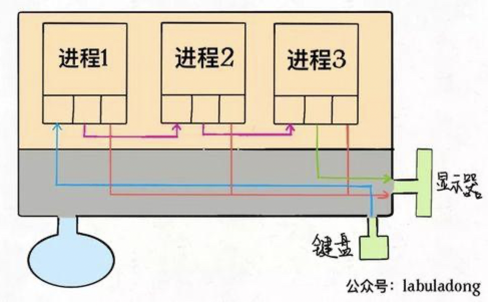
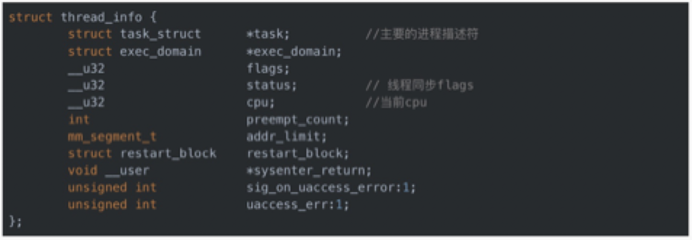
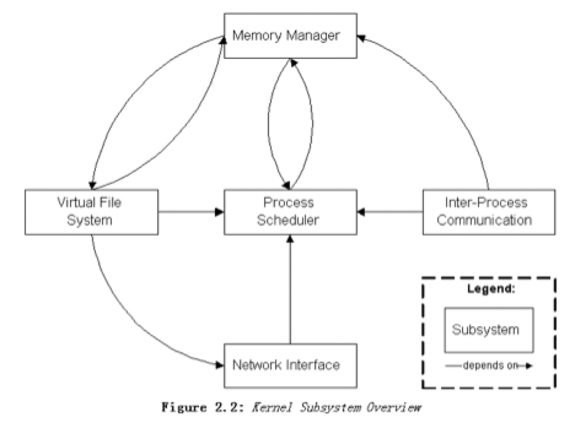

# 一、什么是进程，进程和线程的区别
* 进程：是操作系统进行资源分配的基本单位
* 线程：是操作系统进行任务执行调度的基本单位
* 纤程（协程）：运行在用户空间，不与内核进行交互。（不会创建内核进程）

**区别：** 进程和线程在操作系统中都是一个进程，线程共享进程的内存空间，没有独立的内存空间。

进程空间天然独立，不会互相篡改数据，但是对共享数据的操作时，还是需要进行加锁处理；

<!--more-->  

# 二、进程实现
进程结构、进程创建、thread_info、task_list、虚拟内存、Linux内核架构等内容进行描述
## 1、进程结构
进程描述符（PCB=process control block），task_struct是PCB的具体实现。进程的执行，对于CPU来说，也是代码段。

Linux内核通过一个被称为**进程描述符的<code>task_struct</code>** 结构体来管理进程，这个结构体包含了一个进程所需的所有信息。mm_struct中的pgd为页表，就是前面讲的一级页表。task_struct中有一个结构体被称为**内存描述符的<code>mm_struct</code>**，描述了一个进程的整个虚拟地址空间。每个进程正是因为都有自己的mm_struct，才使得每个进程都有自己独立的虚拟的地址空间

- **<code>task_struct</code>**：进程描述符
- **<code>mm_struct</code>**： Linux 内核中用于表示进程内存管理信息的一个关键数据结构。描述了**一个进程的整个虚拟地址空间**。每个进程正是因为都有自己的mm_struct，才使得每个进程都有自己独立的虚拟的地址空间
    - **<code>pgd</code>**：Page Global Directory，在 x86 架构的 Linux 系统中，采用多级页表结构，pgd是顶级页目录。
    - **<code>mmap</code>**：**链表头（通常是struct vm_area_struct *mmap）** 用于将所有通过mmap系统调用创建的内存区域（vm_area_struct）链接在一起。同时，为了更高效地查找和管理这些区域，还可能使用**红黑树（例如struct rb_root mm_rb）**。在插入新的vm_area_struct时，内核会根据内存区域的起始地址等信息将其插入到链表和红黑树中。这样，当需要查找一个特定的内存区域（比如根据虚拟地址查找对应的区域）时，可以通过遍历链表或者在红黑树中查找来定位。
- **<code>vm_area_struct</code>**：表示进程地址空间中的一个连续的虚拟内存区域。一个进程的地址空间通常由多个这样的区域组成，每个区域有不同的属性和用途。
    - **<code>vm_start</code>**：指向这个区域的起始处。
    - **<code>vm_end</code>**：指向这个区域的结束处。
    - **<code>vm_prot</code>**：描述这个区域内包含的所有页的读写许可权限。
    - **<code>vm_flags</code>**：描述这个区域内的页面是与其他进程共享的，还是这个进程私有的（还描述了其他一些信息）。
    - **<code>vm_next</code>**：指向链表中下—区域结构。

task_struct具体结构：


task_struct代码实现：  
```
sched.sh文件 
struct task_struct { 
    long state; // 进程状态 
    struct mm_struct *mm; // 虚拟内存结构体 
    pid_t pid; // 进程号 
    struct task_struct *parent; // 指向父进程的指针
    struct list_head children; // 子进程列表 
    struct fs_struct *fs; // 存放文件系统信息的指针 
    struct files_struct *files;// 一个数组，包含该进程打开的文件指针 
};

```

**files：** 每个进程创建时，都会默认填充前三个值：   
* files[0]：代表标准输入流
* files[1]：代表标准输出流
* files[2]：代表标准错误输出流

**理解管道：** 一个进程的输出是另外一个进程的输入


## 2、进程创建
### 2.1、内核创建方式
task_struct的创建，Linux2.6之后，通过slab分配器动态生成task_struct。


1、高速缓存会被划分为slab。   
2、task_struct的创建，会先从未满的slab中申请，直到满了才会去空的slab中申请创建。
### 2.2、对外暴露接口创建方式
fork()、exec()等函数进行创建

#### fork()
创建示例如下：
```
main{  
    pid_t pid;  
    printf("fork!");
    pid=fork(); 
    if (pid < 0)  
        printf("error in fork!");  
    else if (pid == 0)  
        printf("i am the child process, my process id is %d\n",getpid());  
    else  
        printf("i am the parent process, my process id is %\/n",getpid());  
}
```
fork()：一个父进程会创建一个子进程，子进程共享父进程的内存空间及指针记录。

执行流程：
- 由于在复制时复制了父进程的堆栈段，所以两个进程都停留在fork函数中，等待返回。
- 因此fork函数会返回两次，一次是在父进程中返回，另一次是在子进程中返回，这两次的返回值是不一样的。

fork函数返回的值为什么在父子进程中不同。
- “ 其实就相当于链表，进程形成了链表，父进程的fork函数返回的值指向子进程的进程id, 因为子进程没有子进程，所以其fork函数返回的值为0 .


#### execl()
创建示例如下：
```
int main(){
    execl("/bin/ls", "ls", "-l", NULL);
    perror("execl");
    exit(1);
}
```
A进程中调用exec函数族函数，将A进程的代码段替换成了ls程序的代码段，则A进程下的代码则不会执行，也不会返回结果。


## 3、thread_info
快速获取task_struct：  
* 1、有的硬件系统，有专门的寄存器来存储。
* 2、寄存器不富余的体系，只能在栈的尾端创建thread_info结构。



操作系统，将所有的进程都放入一个双向链表结构的任务列表中（task_list）

## 4、虚拟内存
task_struct中的mm_struct结构代表着虚拟内存。


**为什么需要虚拟内存：**  
1. 多线程环境下，内存空间小，易不足，若想不影响其他进程，则只能将其他进程的内容拷贝至磁盘中持久化，但是会导致耗时增加。
2. 多线程环境下，若直接使用物理内存，则进程的数据可能被其他进程修改，导致进程运行的不准确。

**为了解决上述问题**，将进程进行隔离，使用了虚拟内存，各进程之间不受影响，使每个进程都能拥有所有的物理内存空间。

### 4.1、虚拟内存实现


Linux为每个进程维护了一个单独的虚拟地址空间，分成内核空间和用户空间。（进程之间空间是天然独立的，互不影响；子进程共享父进程的空间，则会导致子进程数据的相互篡改）
* 内核空间：高地址空间的1GB，用于运行内核代码和数据和保存进程的相关信息。俗称内核态。
* 用户空间：低地址空间的3GB，运行用户进程的代码和数据。俗称用户态。
* 每次内核调用，都会进行空间切换，数据拷贝，这个操作是耗时的。
* 虚拟内存到物理内存的映射，通过mmu（内存管理单元）操作。

**写时复制：Copy On Write技术实现原理：**   
```
1. fork()之后，复制出来的子进程有自己的task_struct结构和pid,  
2. kernel把父进程中所有的内存页的权限都设为read-only，  
3. 然后子进程的地址空间指向父进程。当父子进程都只读内存时，相安无事。   
4. 当其中某个进程写内存时，CPU硬件检测到内存页是read-only的，   
5. 于是触发页异常中断（page-fault），陷入kernel的一个中断例程。   
6. 中断例程中，kernel就会把触发的异常的页复制一份，于是父子进程各自持有独立的一份，  
7. 父进程会对原有的物理空间进行修改，而子进程会使用拷贝后的新物理空间。
```
在**fork**函数调用时，父进程和子进程会被内核分配不同的虚拟内存空间，所以从进程的角度看它们访问的是不同的内存：
* 在虚拟内存空间进行读操作时，内核会将虚拟内存映射到物理内存上，父子进程共享了物理上的内存空间；
* 当父进程对共享的内存进行修改时，共享的内存会以页为单位进行拷贝，父进程会对原有的物理空间进行修改，而子进程会使用拷贝后的新物理空间；
* 当子进程对共享的内存进行修改时，子进程会在拷贝后的新物理空间上进行修改，而不会改动原有的物理空间，避免影响父进程的内存空间；

## 5、僵尸进程

### 5.1、产生过程
#### 1、子进程结束
当一个子进程完成它的任务并终止时，它会向父进程发送一个终止信号，告知自己已经结束。此时，子进程的大部分资源（如内存、文件描述符等）已经被释放。

#### 2、父进程未及时处理
如果父进程没有及时调用相应的系统调用来获取子进程的终止状态（通常使用wait或waitpid系统调用），那么子进程虽然已经终止，但它的进程控制块（PCB）等一些信息仍然会保留在系统中，这个子进程就成为了僵尸进程。

### 5.2、僵尸进程的危害

#### 资源浪费
- **进程表项占用：** 在操作系统中，每个进程都在进程表（也称为进程控制块 PCB，在 Linux 中是task_struct结构）中有一个对应的表项。僵尸进程虽然已经终止了其主要执行任务，但它的进程表项仍然存在。这些表项包含了进程的相关信息，如进程 ID、退出状态、父进程 ID 等。僵尸进程会一直占用这些表项，导致进程表资源的浪费。如果系统中存在大量的僵尸进程，随着时间的推移，可能会耗尽进程表的可用空间，使得新进程无法正常创建。
- **内核资源占用：** 僵尸进程还会占用一些内核资源。例如，与进程相关的内核数据结构（如内存管理结构、文件描述符等）可能不会立即被释放。在 Linux 系统中，每个进程都有自己的文件描述符表，僵尸进程可能会保留一些打开的文件描述符，阻止这些文件描述符被重新分配给其他进程。这会造成内核资源的低效利用，影响系统的整体性能。

#### 对父进程的影响
- **父进程等待状态异常：** 僵尸进程的存在可能会导致父进程处于异常的等待状态。正常情况下，父进程应该使用wait或waitpid系统调用去回收子进程的资源，包括获取子进程的退出状态等信息。如果父进程没有正确地回收僵尸进程，它可能会一直等待子进程结束，从而阻塞自身的正常执行。例如，在一个多进程的服务器程序中，如果父进程负责创建和管理子进程，当子进程变成僵尸进程后，父进程可能会因为等待子进程而无法响应新的客户端请求，影响服务器的服务质量。
- **信号处理问题：** 僵尸进程可能会影响父进程的信号处理机制。在一些操作系统中，当子进程结束时会向父进程发送SIGCHLD信号，通知父进程去回收子进程。如果父进程没有正确处理这个信号，或者没有及时回收僵尸进程，可能会导致信号队列的堆积。当信号队列满时，后续的信号可能会丢失，这可能会使父进程错过一些重要的事件通知，进一步影响系统的正常运行。

#### 系统性能和稳定性下降
- **系统资源耗尽风险：** 如前面提到的，大量僵尸进程会逐渐消耗系统的进程表资源和其他内核资源。当系统资源被耗尽时，整个系统可能会出现故障。例如，新的关键进程可能无法创建，导致系统无法提供某些基本服务。在极端情况下，系统可能会因为无法分配必要的资源而崩溃。
- **系统负载增加：** 僵尸进程会使系统的负载看起来比实际情况更高。系统负载是衡量系统繁忙程度的一个指标，它通常考虑了运行中的进程数量等因素。由于僵尸进程会占据进程表项，系统在统计进程数量时会将它们计算在内，这可能会误导系统管理员认为系统处于高负载状态，而实际上系统的有效工作进程可能并没有那么多。这种错误的判断可能会导致管理员采取不必要的措施来优化系统，浪费时间和精力。

### 5.3、避免僵尸进程
1. 父进程使用wait()或者waitpid()之类的函数等待子进程退出
2. 使用信号函数sigaction为SIGCHLD设置wait处理函数
3. fork两次用孙子进程去完成子进程的任务

## 6、孤儿进程
孤儿进程是指在父进程已经结束（正常退出或者异常终止），而子进程还在运行的进程。

### 6.1、产生过程
当一个父进程由于某种原因退出时，它的子进程会收到一个信号（在 Linux 中通常是SIGHUP信号，用于通知进程其控制终端已经关闭）。此时，子进程的父进程 ID 会被操作系统修改为init进程的进程 ID（1），这样这个子进程就成为了孤儿进程，由init进程来 “照顾”。例如，在一个简单的脚本程序中，父进程创建一个子进程后，父进程提前退出，那么子进程就会变成孤儿进程。

### 6.2、影响
- **资源回收责任转移：** 孤儿进程的主要影响是其资源回收责任从原来的父进程转移到了init进程。这是一种保护机制，确保子进程结束后能够被正确地回收资源。由于init进程会定期调用wait或waitpid系统调用检查并回收它所收养的孤儿进程，所以孤儿进程不会像僵尸进程那样导致系统资源的长期占用。例如，孤儿进程所占用的内存、文件描述符等资源，在孤儿进程结束后会由init进程负责回收，不会造成资源浪费。
- **对系统稳定性的积极影响：** 相比僵尸进程可能导致的系统资源耗尽和性能下降，孤儿进程在一定程度上对系统稳定性是有积极作用的。因为它们不会一直占用进程表项而不被回收，只要init进程正常工作，孤儿进程结束后就能够释放资源，使得系统能够持续有效地运行。不过，如果init进程出现问题，例如由于软件故障或者系统错误而无法正常回收孤儿进程，那么孤儿进程也可能会对系统造成负面影响，如导致系统资源的浪费。
- **对程序逻辑的潜在影响：** 在程序设计方面，孤儿进程的出现可能会改变程序原本的逻辑。如果程序依赖于父进程来进行某些操作，如传递数据、同步信号等，当子进程变成孤儿进程后，这些操作可能无法按照预期进行。例如，一个子进程原本需要将计算结果返回给父进程，但父进程提前退出，子进程变成孤儿进程后，就需要考虑新的结果传递方式，或者直接放弃这种传递方式，这可能需要对程序进行重新设计或者调整。

# 三、Linux内核架构

进程调度器：process scheduler，持有了task_list，然后管理这些进程链表。维护了一个current指针，指向当前正在执行的进程。  
**抢占式和非抢占式。**

# 四、进程状态
* task_running：正在运行或就绪
* task_intermptible：可中断的休眠，等待资源、信号，一旦满足，由中断变为就绪
* task_unintermptible：不可中断的休眠，信号无法唤醒，只有当资源满足时可唤醒。
* task_stoped：进程被停止执行
* task_traced：表示进程被debugger等进程监视

# 五、中断
CPU暂停当前线程执行，执行中断请求。
**中断类型：** 
* 同步中断（软中断）：由CPU控制单元产生，之所以称为同步，因为只有当一条指令执行完成后，才会执行中断指令。
* 异步中断（硬中断）：由硬件设备产生的中断信号，随机产生。


# 六、缺页

1. 含义：PTE有晓位=0，虚拟内存中的虚拟页没有被缓存在物理内存中，称为缺页。
2. 具体表现：malloc()和mmap()函数调用，在分配时只建立的虚拟内存空间（在进程堆中分配），并没有分配虚拟内存对应的物理内存。当进程服务这些虚拟内存时，mmu（内存管理单元）无法解析，将报出page fault错误，缺页中断，然后进程进行空间切换，由用户态切换至内核态，然后由内核处理。
3. 处理方式：根据缺页类型，CPU判断物理内存中是否有当前所需页帧，如果存在，进行映射；如果不存在，则去磁盘读取保存至内存，再建立映射。


