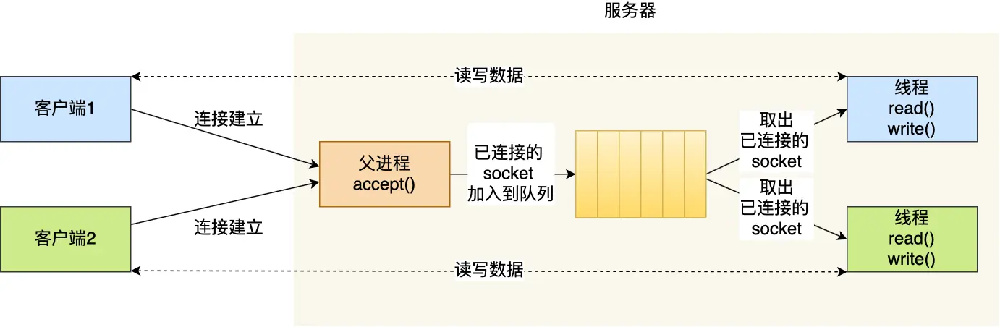
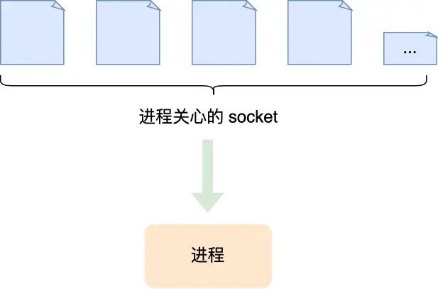

# 一、I/O模型
I/O（Input/Output）模型是指操作系统**处理输入输出操作的不同方式**。在计算机系统中，很多操作涉及到数据的输入和输出，比如从磁盘读取文件、从网络接收数据等。不同的 I/O 模型会影响程序的性能和资源利用效率。
- 磁盘IO
- 内存IO
- 网络IO

<!--more-->  

# 二、IO操作的2个阶段

操作系统完成IO操作的2个过程
- **数据准备阶段：** 操作系统准备数据，把IO外部设备的数据，加载到内核缓冲区
- **数据copy阶段：** 操作系统copy数据，将内核缓冲区的数据，copy到用户进程缓冲区

# 三、先了解一下同步、异步、阻塞、非阻塞的相关概念。

## 3.1、同步：一般指的是程序的顺序执行
同步操作是指在一个任务执行过程中，调用者必须等待这个任务完成后才能继续执行其他操作。简单来说，就是一步一步按照顺序执行，前面的操作没有结束，后面的操作就不能开始。
```java
    public class TestClass{
        public static void main(String[] args) {
            A();
        }
        public static void A() {
            System.out.println("A执行");
            B();
            System.out.println("A执行完成");
        }
        
        public static void B() {
            System.out.println("B执行");
            while(true) {
                ....
            }
            System.out.println("B执行完成");
        }
    }
```
从该例子中，只有当B()执行完成后，A()方法才会输出"A执行完成"，这就是同步。
    整个处理过程顺序执行，当各个过程都执行完毕，并返回结果。是一种线性执行的方式，执行的流程不能跨越
    
## 3.2、异步：ajax就是最好的例子
异步操作是指调用者发起一个任务后，不用等待这个任务完成就可以继续执行其他操作。当任务完成后，系统会通过某种方式（如回调函数、事件通知等）通知调用者任务已经完成。
```
    function ajaxTest() {
        console.log("方法开始执行");
        $.ajax({
            url: "/A/remoteCall",
            type: "post",
            success: function (data) {
                while(true) {
                    console.log("方法开始执行");
                }
            }
        });
        console.log("方法执行结束");
    }
```

方法执行，不需要等待ajax的返回结果。

    
## 3.3、阻塞：一般指的是线程的状态
当一个操作是阻塞式操作时，执行这个操作的线程（或进程）会被挂起，直到这个操作完成。在阻塞期间，线程不能执行其他任务。
```Java
    public Result export) {
            try {
                InputStream inputStream = new ByteArrayInputStream(ExcelUtil.getInstance().export(excelDataList, map, groupIdNameMap).toByteArray());
                FileCopyUtils.copy(inputStream, outputStream);
            } catch (Exception e) {
                log.error("导出Excel出错了", e);
                result.setMessage("操作失败!");
                result.setStatus(REST_STATUS.FAILD_EXCEPTION);
            }
            return result;
        }
```


>例如导出中，操作系统读取文件返回花较长时间，程序不会往下执行，进入阻塞状态。    
    
## 3.4、非阻塞
非阻塞操作是指当执行一个操作时，如果操作不能立即完成，系统不会让线程（或进程）等待，而是返回一个提示（如错误码），线程可以继续执行其他操作。

<font color=red>**同步 / 异步主要关注的是任务的执行顺序和通知机制，而阻塞 / 非阻塞主要关注的是线程（或进程）在操作执行过程中的状态。**</font>

More info: [参考文章](https://www.jianshu.com/p/aed6067eeac9)    
    
# 四、Linux IO模型
1. 阻塞IO（bloking IO）
2. 非阻塞IO（non-blocking IO）
3. 多路复用IO（multiplexing IO）
4. 信号驱动式IO（signal-driven IO）
5. 异步IO（asynchronous IO）                


## 4.1、同步阻塞IO

- 两个步骤：

   1. 步骤一：用户空间的应用程序执行一个系统调用（recvform），linux kernel开始IO的第一阶段：准备数据。这会导致应用程序阻塞（进程自己选择的阻塞），什么也不干，直到数据准备好。
   2. 步骤二：当kernel一直等到数据准备好了，它就会将数据从kernel中拷贝到用户内存，然后kernel返回结果，用户进程才解除block的状态，重新运行起来。数据从内核复制到用户进程，最后进程再处理数据，在等待数据到处理数据的两个阶段，整个进程都被阻塞。

## 4.2、同步非阻塞IO

>同步非阻塞就是通过轮训的方式（轮训执行系统调用），去判断数据是否准备好（轮训者：程序进程）
需要注意，拷贝数据整个过程，进程仍然是属于阻塞的状态。


## 4.3、IO多路复用


>强调一点就是，IO多路复用模型并没有涉及到非阻塞，进程在发出select后，要一直阻塞等待其监听的所有IO操作至少有一个数据准备好才返回，强调阻塞状态，不存在非阻塞。
而在 Java NIO中也可以实现多路复用，主要是利用多路复用器 Selector，与这里的 select函数类型，Selector会不断轮询注册在其上的通道Channel，如果有某一个Channel上面发生读或写事件，这个Channel处于就绪状态，就会被Selector轮询出来。关于Java NIO实现多路复用更多的介绍请查询相关文章。


# 五、IO多路复用
我们以最简单 socket 网络模型，一步一步的到 I/O 多路复用。

## 5.1、最基本的 Socket 模型
要想客户端和服务器能在网络中通信，那必须得使用 Socket  编程，它是进程间通信里比较特别的方式，特别之处在于它是可以跨主机间通信。

<code>Socket</code>的中文名叫作插口，咋一看还挺迷惑的。事实上，双方要进行网络通信前，各自得创建一个 Socket，这相当于客户端和服务器都开了一个“口子”，双方读取和发送数据的时候，都通过这个“口子”。这样一看，是不是觉得很像弄了一根网线，一头插在客户端，一头插在服务端，然后进行通信。

如下为socket示例：
```java
//服务端
public class BioServer {
    public static void main(String[] args) {
        byte[] bs = new byte[1024];
        try {
            //服务端的监听socket，只负责监听连接，监听的端口是：9878
            ServerSocket serverSocket = new ServerSocket();
            serverSocket.bind(new InetSocketAddress(9878));
            while (true) {//可以进行下一次的通信
                System.out.println("等待连接");
                Socket accept = serverSocket.accept();//服务端进程将阻塞(将释放CPU资源)，直至连接请求过来，然后会生成一个socket
                //accept，这个socket是负责和客户端数据交换的
                System.out.println("连接成功");
                System.out.println("等待数据");
                int readCount = accept.getInputStream().read(bs);//read也将阻塞
                System.out.println("数据获取成功");
                System.out.println("读取的数量=" + readCount);
                String content = bs.toString();
                System.out.println("读取的内容为：" + content);
            }
        } catch (IOException e) {
            e.printStackTrace();
        }
    }
}
//客户端
public class BioClient {
    public static void main(String[] args) {
        Socket socket = new Socket();
        socket.connect(new InetSocketAddress("127.0.0.1", 9878));
    }
}
```
TCP 协议的 Socket 程序的调用整个过程如下图：

- 服务端会有2种socket
  - 监听socket：即绑定端口的socket，监听客户端的请求。
  - 连接socket：服务端监听到有客户端连接时，accept()方法会生成一个新的连接socket

TCP Socket 调用流程是最简单、最基本的，<font color=green>**它基本只能一对一通信，因为使用的是同步阻塞的方式**</font>，当服务端在还没处理完一个客户端的网络 I/O 时，或者 读写操作发生阻塞时，其他客户端是无法与服务端连接的。

## 5.2、如何服务更多的用户？
可如果我们服务器只能服务一个客户，那这样就太浪费资源了，于是我们要改进这个网络 I/O 模型，以支持更多的客户端。
在改进网络 I/O 模型前，我先来提一个问题，你知道服务器单机理论最大能连接多少个客户端？
相信你知道 TCP 连接是由四元组唯一确认的，这个四元组就是：
```
本机IP, 本机端口, 对端IP, 对端端口
```
服务器作为服务方，通常会在本地固定监听一个端口，等待客户端的连接。因此服务器的本地 IP 和端口是固定的，于是对于服务端 TCP 连接的四元组只有对端 IP 和端口是会变化的，所以
```
最大 TCP 连接数 = 客户端 IP 数×客户端端口数
```
对于 IPv4，客户端的 IP 数最多为 2 的 32 次方，客户端的端口数最多为 2 的 16 次方，也就是
> 服务端单机最大 TCP 连接数约为 2 的 48 次方

这个理论值相当“丰满”，但是服务器肯定承载不了那么大的连接数，主要会受两个方面的限制：
- **文件描述符** ，Socket 实际上是一个文件，也就会对应一个文件描述符。在 Linux 下，单个进程打开的文件描述符数是有限制的，没有经过修改的值一般都是 1024，不过我们可以通过 ulimit 增大文件描述符的数目；
- **系统内存**，每个 TCP 连接在内核中都有对应的数据结构，意味着每个连接都是会占用一定内存的；

那如果服务器的内存只有 2 GB，网卡是千兆的，能支持并发 1 万请求吗？
> 并发 1 万请求，也就是经典的 C10K 问题 ，C 是 Client 单词首字母缩写，C10K 就是单机同时处理 1 万个请求的问题。
从硬件资源角度看，对于 2GB 内存千兆网卡的服务器，如果每个请求处理占用不到 200KB 的内存和 100Kbit 的网络带宽就可以满足并发 1 万个请求。

不过，要想真正实现 C10K 的服务器，要考虑的地方在于服务器的网络 I/O 模型，效率低的模型，会加重系统开销，从而会离 C10K 的目标越来越远。

### 5.2.1、多进程模型【升级1】
多线程模型，也就是为每个客户端分配一个进程来处理请求。

服务器的主进程负责监听客户的连接，一旦与客户端连接完成，accept() 函数就会返回一个「已连接 Socket」，这时就通过<code>fork()</code> 函数创建一个子进程，实际上就把父进程所有相关的东西都<strong>复制</strong>一份，包括文件描述符、内存地址空间、程序计数器、执行的代码等。

缺点：
> 这种用多个进程来应付多个客户端的方式，在应对 100 个客户端还是可行的，但是当客户端数量高达一万时，肯定扛不住的，因为每产生一个进程，必会占据一定的系统资源，而且进程间上下文切换的“包袱”是很重的，性能会大打折扣。进程的上下文切换不仅包含了虚拟内存、栈、全局变量等用户空间的资源，还包括了内核堆栈、寄存器等内核空间的资源。

### 5.2.2、多线程模型【升级2】
既然进程间上下文切换的“包袱”很重，那我们就搞个比较轻量级的模型来应对多用户的请求

当服务器与客户端 TCP 完成连接后，通过<code>pthread_create()</code> 函数创建线程，然后将「已连接 Socket」的文件描述符传递给线程函数，接着在线程里和客户端进行通信，从而达到并发处理的目的。

如果每来一个连接就创建一个线程，线程运行完后，还得操作系统还得销毁线程，虽说线程切换的上写文开销不大，但是如果频繁创建和销毁线程，系统开销也是不小的。那么，我们可以使用<strong>线程池</strong>的方式来避免线程的频繁创建和销毁，所谓的线程池，就是提前创建若干个线程，这样当由新连接建立时，将这个已连接的 Socket 放入到一个队列里，然后线程池里的线程负责从队列中取出「已连接 Socket 」进行处理。


> 上面基于进程或者线程模型的，其实还是有问题的。新到来一个 TCP 连接，就需要分配一个进程或者线程，那么如果要达到 C10K，意味着要一台机器维护 1 万个连接，相当于要维护 1 万个进程/线程，操作系统就算死扛也是扛不住的。

### 5.2.3、多路复用【升级3】
既然为每个请求分配一个进程/线程的方式不合适，那有没有可能只使用一个进程来维护多个 Socket 呢？答案是有的，那就是：多路复用。

不管是多进程模型还是多线程模型，都是需要用户进程或线程去主动的获取socket，多路复用的思想就是使用一个内核进程来维护多个socket。



## 5.3、多路复用实现

### 5.3.1、selector
当使用select函数的时候，先通知内核挂起进程，一旦一个或者多个IO事情发生，控制权将返回给应用程序，然后由应用程序进行IO处理。
> 定期轮询，将管理的fd发送给内核，交给内核管理

那么IO事件都包含哪些
- 标准输入文件描述符可以读
- 已连接套接字准备好可以写
- 如果一个IO事件等待超过10秒，发生超时

select使用方法
```dtd
int select(int maxfdp, fd_set *readset, fd_set *writeset, fd_set *exceptset,struct timeval *timeout);
```
- **readset：** 管理的读fd
- **writeset：** 管理的写fd
- **exceptset：** 管理的异常fd

select 会遍历每个集合的前 nfds 个描述符，分别找到可以读取、可以写入、发生错误的描述符，统称为“就绪”的描述符。然后用找到的子集替换参数中的对应集合，返回所有就绪描述符的总数

缺点
- 只能支持1024个fd【内核以数组方式存储】
- 每次需更新，重复传递fd
- 每次内核被调用后，都需要遍历一遍所有的fd ：O(n)的时间复杂度


### 5.3.2、poll
> 鉴于select所支持的描述符有限，随后提出poll解决这个问题

还是先看声明
```
int poll(struct pollfd *fds, nfds_t nfds, int timeout);
```
- fds：文件描述符数组
- nfds：表示fds数组中元素的个数。

再看pollfd结构
```
struct pollfd {
    int   fd;         /* 文件描述符 */
    short events;     /* 描述符待检测的事件 */
    short revents;    /* returned events */
};
```
相对优点
- 不限制文件描述符个数【用户态通过数组方式传递文件描述符，在内核会转为链表方式存储，没有最大数量的限制】

缺点
- 每次需更新，重复传递fd
- 每次内核被调用后，都需要遍历一遍所有的fd ：O(n)的时间复杂度


### 5.3.3、epoll
epoll 是 Linux 内核中用于高效处理 I/O 多路复用的机制。它的基本原理是基于事件驱动，通过在内核中维护一个事件表来实现对多个文件描述符（file descriptor）的监视。

在The Linux Programming Interface有张图展示三种IO复用技术在面对不同文件描述符时的差异


#### 5.3.3.1、编程三步骤
当应用程序使用 epoll 时：
- 首先通过epoll_create系统调用创建一个 epoll 实例，这个实例可以看作是一个包含了文件描述符和相关事件的 “容器”。
- 然后使用epoll_ctl系统调用向这个容器中添加、修改或删除要监视的文件描述符及其对应的事件类型（如可读、可写、异常等）。
- 最后，通过epoll_wait系统调用阻塞等待事件的发生。当有文件描述符上的事件发生时，epoll_wait会返回，并且返回的信息中包含了发生事件的文件描述符和对应的事件类型。

##### 1. epoll_create
首先通过epoll_create系统调用创建一个 epoll 实例，这个实例可以看作是一个包含了文件描述符和相关事件的 “容器”。
```
int epoll_create(int size);
```

##### 2. epoll_ctl
然后使用epoll_ctl系统调用向这个容器中添加、修改或删除要监视的文件描述符及其对应的事件类型（如可读、可写、异常等）。
```
int epoll_ctl(int epfd, int op, int fd, struct epoll_event *event);
```

##### 3. epoll_wait
最后，通过epoll_wait系统调用阻塞等待事件的发生。当有文件描述符上的事件发生时，epoll_wait会返回，并且返回的信息中包含了发生事件的文件描述符和对应的事件类型。
```dtd
int epoll_wait(int epfd, struct epoll_event *events, int maxevents, int timeout);
//返回值: 成功返回的是一个大于 0 的数，表示事件的个数；返回 0 表示的是超时时间到；若出错返回 -1
```

#### 5.3.3.2、epoll的底层实现
- 当我们使用epoll_fd增加一个fd的时候，内核会为我们创建一个epitem实例，将这个实例作为<font color=red>**红黑树**</font>的节点。
- 随后查找的每一个fd是否有事件发生就是通过红黑树的epitem来操作
- epoll维护一个<font color=red>**链表**</font>来记录就绪事件，内核会当每个文件有事件发生的时候将自己登记到这个就绪列表，然后通过内核自身的文件file-eventpoll之间的回调和唤醒机制，减少对内核描述字的遍历，大俗事件通知和检测的效率

More info:[参考文章](https://www.jianshu.com/p/486b0965c296)