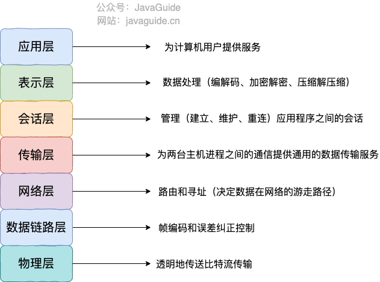
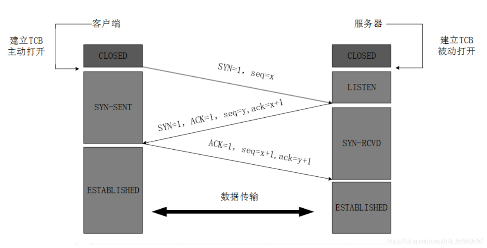
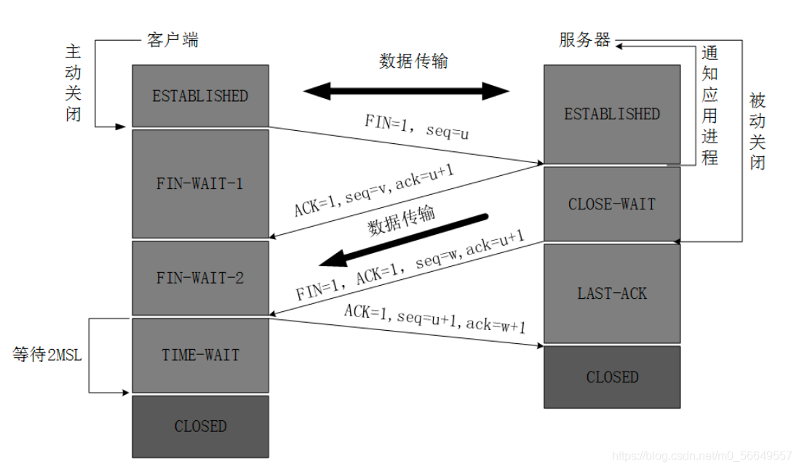

# 一、TCP
传输控制协议（TCP，Transmission Control Protocol）是一种面向连接的、可靠的、基于字节流的传输层通信协议

<!--more-->  

# 二、OSI七层模型
**OSI 七层模型** 是国际标准化组织提出一个网络分层模型，其大体结构以及每一层提供的功能如下图所示：

OSI 的七层体系结构概念清楚，理论也很完整，但是它比较复杂而且不实用，而且有些功能在多个层中重复出现。

**再来一个比较生动的图片：**

# 三、TCP/IP 四层模型

TCP/IP 四层模型 是目前被广泛采用的一种模型,我们可以将 TCP / IP 模型看作是 OSI 七层模型的精简版本，由以下 4 层组成：
1. 应用层
2. 传输层
3. 网络层
4. 网络接口层

需要注意的是，我们并不能将 TCP/IP 四层模型 和 OSI 七层模型完全精确地匹配起来，不过可以简单将两者对应起来，如下图所示：

## 3.1、应用层常见协议：
- <strong>HTTP（Hypertext Transfer Protocol，超文本传输协议）</strong>：基于 TCP 协议，是一种用于传输超文本和多媒体内容的协议，主要是为 Web 浏览器与 Web 服务器之间的通信而设计的。当我们使用浏览器浏览网页的时候，我们网页就是通过 HTTP 请求进行加载的。
- <strong>SMTP（Simple Mail Transfer Protocol，简单邮件发送协议）</strong>：基于 TCP 协议，是一种用于发送电子邮件的协议。注意 ⚠️：SMTP 协议只负责邮件的发送，而不是接收。要从邮件服务器接收邮件，需要使用 POP3 或 IMAP 协议。
- <strong>POP3/IMAP（邮件接收协议）</strong>：基于 TCP 协议，两者都是负责邮件接收的协议。IMAP 协议是比 POP3 更新的协议，它在功能和性能上都更加强大。IMAP 支持邮件搜索、标记、分类、归档等高级功能，而且可以在多个设备之间同步邮件状态。几乎所有现代电子邮件客户端和服务器都支持 IMAP。
- <strong>FTP（File Transfer Protocol，文件传输协议）</strong> : 基于 TCP 协议，是一种用于在计算机之间传输文件的协议，可以屏蔽操作系统和文件存储方式。注意 ⚠️：FTP 是一种不安全的协议，因为它在传输过程中不会对数据进行加密。建议在传输敏感数据时使用更安全的协议，如 SFTP。
- <strong>Telnet（远程登陆协议）</strong>：基于 TCP 协议，用于通过一个终端登陆到其他服务器。Telnet 协议的最大缺点之一是所有数据（包括用户名和密码）均以明文形式发送，这有潜在的安全风险。这就是为什么如今很少使用 Telnet，而是使用一种称为 SSH 的非常安全的网络传输协议的主要原因。
- <strong>SSH（Secure Shell Protocol，安全的网络传输协议）</strong>：基于 TCP 协议，通过加密和认证机制实现安全的访问和文件传输等业务
- <strong>RTP（Real-time Transport Protocol，实时传输协议）</strong>：通常基于 UDP 协议，但也支持 TCP 协议。它提供了端到端的实时传输数据的功能，但不包含资源预留存、不保证实时传输质量，这些功能由 WebRTC 实现。
- <strong>DNS（Domain Name System，域名管理系统）</strong>: 基于 UDP 协议，用于解决域名和 IP 地址的映射问题。

## 3.2、传输层
传输层的主要任务就是负责向两台终端设备进程之间的通信提供通用的数据传输服务。

传输层常见协议：
- <code>TCP（Transmission Control Protocol，传输控制协议 ）</code>：提供 面向连接 的，可靠 的数据传输服务。
- <code>UDP（User Datagram Protocol，用户数据协议）</code>：提供 无连接 的，尽最大努力 的数据传输服务（不保证数据传输的可靠性），简单高效。

## 3.3、网络层
网络层负责为分组交换网上的不同主机提供通信服务。

网络层常见协议：
- <strong>IP（Internet Protocol，网际协议）</strong>：TCP/IP 协议中最重要的协议之一，主要作用是定义数据包的格式、对数据包进行路由和寻址，以便它们可以跨网络传播并到达正确的目的地。目前 IP 协议主要分为两种，一种是过去的 IPv4，另一种是较新的 IPv6，目前这两种协议都在使用，但后者已经被提议来取代前者。
- <strong>ARP（Address Resolution Protocol，地址解析协议）</strong>：ARP 协议解决的是网络层地址和链路层地址之间的转换问题。因为一个 IP 数据报在物理上传输的过程中，总是需要知道下一跳（物理上的下一个目的地）该去往何处，但 IP 地址属于逻辑地址，而 MAC 地址才是物理地址，ARP 协议解决了 IP 地址转 MAC 地址的一些问题。
- <strong>ICMP（Internet Control Message Protocol，互联网控制报文协议）</strong>：一种用于传输网络状态和错误消息的协议，常用于网络诊断和故障排除。例如，Ping 工具就使用了 ICMP 协议来测试网络连通性。
- <strong>NAT（Network Address Translation，网络地址转换协议）</strong>：NAT 协议的应用场景如同它的名称——网络地址转换，应用于内部网到外部网的地址转换过程中。具体地说，在一个小的子网（局域网，LAN）内，各主机使用的是同一个 LAN 下的 IP 地址，但在该 LAN 以外，在广域网（WAN）中，需要一个统一的 IP 地址来标识该 LAN 在整个 Internet 上的位置。
- <strong>OSPF（Open Shortest Path First，开放式最短路径优先）</strong> ）：一种内部网关协议（Interior Gateway Protocol，IGP），也是广泛使用的一种动态路由协议，基于链路状态算法，考虑了链路的带宽、延迟等因素来选择最佳路径。
- <strong>RIP(Routing Information Protocol，路由信息协议）</strong>：一种内部网关协议（Interior Gateway Protocol，IGP），也是一种动态路由协议，基于距离向量算法，使用固定的跳数作为度量标准，选择跳数最少的路径作为最佳路径。
- <strong>BGP（Border Gateway Protocol，边界网关协议）</strong>：一种用来在路由选择域之间交换网络层可达性信息（Network Layer Reachability Information，NLRI）的路由选择协议，具有高度的灵活性和可扩展性。

# 四、详解TCP
为了准确无误地把数据送达目标处，TCP 协议采用了三次握手策略。

## 4.1、标志位

- SYN（synchronous）
发送/同步标志，用来建立连接，和 ACK 标志位搭配使用
A 请求与 B 建立连接时，SYN=1，ACK=0；B 确认与 A 建立连接时，SYN=1，ACK=1
- seq（序列号，Sequence Number）
是一个 32 位的字段，用于标识 TCP 报文段（segment）中数据部分第一个字节的编号
发送端将字节流分割成多个 TCP 报文段进行发送。每个报文段都有自己的seq值，接收端根据这些序列号来还原字节流的正确顺序。
- ACK（acknowledgement）
确认标志，表示确认收到请求
- PSH（push）
表示推送操作，就是指数据包到达接收端以后，不对其进行队列处理，而是尽可能的将数据交给应用程序处理
- FIN（finish）
结束标志，表示关闭一个 TCP 连接
- RST（reset）
重置复位标志，用于复位对应的 TCP 连接
- URG（urgent）
紧急标志，用于保证 TCP 连接不被中断，并且督促中间层设备尽快处理

## 4.2、三次握手

- **第一次握手：** 客户端请求建立连接，向服务端发送一个同步报文（SYN=1），同时选择一个随机数 seq = x 作为初始序列号
- **第二次握手：** 服务端收到连接请求报文后，如果同意建立连接，则向客户端发送同步确认报文（SYN=1，ACK=1），确认号为 ack = x + 1，同时选择一个随机数 seq = y 作为初始序列号
- **第三次握手：** 客户端收到服务端的确认后，向服务端发送一个确认报文（ACK=1），确认号为 ack = y + 1，序列号为 seq = x + 1

**为什么不是两次握手？**
> 如果只有两次握手，那么服务端向客户端发送 <code>SYN/ACK</code> 报文后，就会认为连接建立。但是如果客户端没有收到报文，那么客户端是没有建立连接的。这就导致服务端会浪费资源。

**为什么不是四次握手？**
> 理论上我们总可以使用更多的通信次数交换相同的信息，使用两次握手无法建立 TCP 连接，而使用三次握手是建立连接所需要的最小次数：

## 4.3、四次握手

- **第一次挥手：** 客户端向服务端发送连接释放报文（FIN=1，ACK=1），主动关闭连接，同时等待服务端的确认
序列号 seq = u，即客户端上次发送的报文的最后一个字节的序号 + 1
确认号 ack = k, 即服务端上次发送的报文的最后一个字节的序号 + 1
- **第二次挥手：** 服务端收到连接释放报文后，立即发出确认报文（ACK=1），序列号 seq = k，确认号 ack = u + 1
- **第三次挥手：** 服务端向客户端发送连接释放报文（FIN=1，ACK=1），主动关闭连接，同时等待 A 的确认
序列号 seq = w，即服务端上次发送的报文的最后一个字节的序号 + 1。如果半关闭状态，服务端没有发送数据，那么 w == k
确认号 ack = u + 1，与第二次挥手相同，因为这段时间客户端没有发送数据
- **第四次挥手：** 客户端收到服务端的连接释放报文后，立即发出确认报文（ACK=1），序列号 seq = u + 1，确认号为 ack = w + 1
此时，客户端就进入了 TIME-WAIT 状态。注意此时客户端到 TCP 连接还没有释放，必须经过 2*MSL（最长报文段寿命）的时间后，才进入 CLOSED 状态。而服务端只要收到客户端发出的确认，就立即进入 CLOSED 状态。可以看到，服务端结束 TCP 连接的时间要比客户端早一些。

**为什么需要四次挥手？**
> 因为 TCP 是全双工的，一方关闭连接后，另一方还可以继续发送数据。所以四次挥手，将断开连接分成两个独立的过程。

**为什么第四次挥手，客户端的 TIME-WAIT 状态必须等待 2MSL 的时间才能返回到 CLOSED 状态？**
> * 确保 ACK 报文能够到达服务端，从而使服务端正常关闭连接。
客户端第四次挥手的 ACK 报文不一定会到达服务端。服务端会超时重传 FIN/ACK 报文，此时如果客户端已经断开了连接，那么就无法响应服务端的二次请求，这样服务端迟迟收不到 FIN/ACK 报文的确认，就无法正常断开连接。
> * 防止已失效的连接请求报文段出现在之后的连接中
> * 2MSL(2 * Maximum Segment Lifetime，两倍的报文段最大存活时间)

**TIME_WAIT 是主动断开连接的一方会进入的状态**

原文链接：https://javaguide.cn/cs-basics/network/osi-and-tcp-ip-model.html