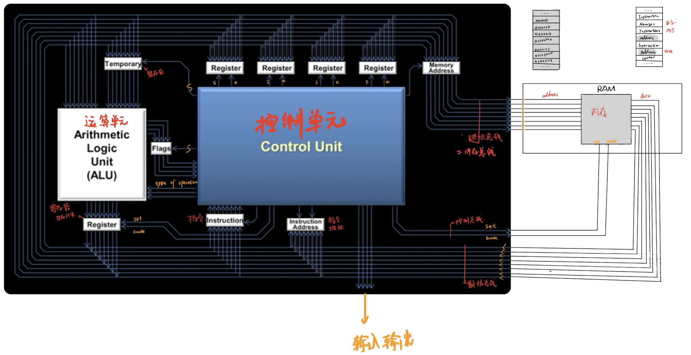
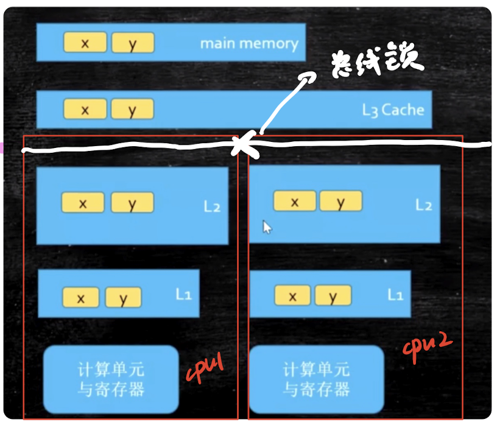
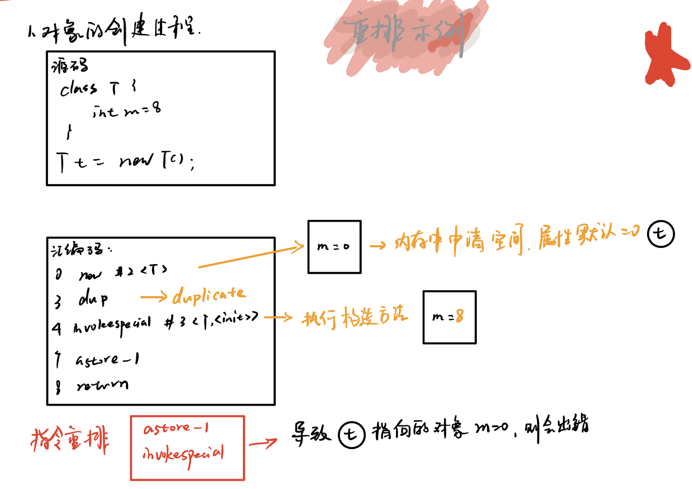

# 一、大概布局


# 二、基本组成


<!--more-->  

1. PC：程序计数器，记录当前指令地址。
2. Registers：寄存器，暂时存储数据，种类繁多。
3. ALU：运算单元。
4. CU：control unit，控制单元。
5. MMU：memory management unit，内存控制单元。
6. Cache：缓存，解决CPU运行速度过快，内存读取速度跟不上的问题。

# 三、CPU缓存


# 四、缓存组成

缓存行（cache line）：CPU cache的最小单位，通常64字节。【Java中可存8个long】    
缓存由多个缓存行组成。


# 五、缓存读取
1、先从缓存读取，l1 -> l2 -> l3   
2、如果缓存中不存在，则去内存中读取，内存存在，则返回。（从内存读取数据，按块读取，每次读取64字节）   
3、内存不存在，则触发缺页中断，去磁盘读取数据。（内存按页管理，每页4KB）   
4、然后读取磁盘，磁盘按块读取。（每次从磁盘读取，都是读取的一页或者是多页）

# 六、缓存问题


## 6.1、缓存一致性问题
例如x,y两个变量同时加入到两个CPU内，在各自CPU内运行，再写入内存导致数据一致性问题。

### 解决方案

> 1、缓存一致性协议：mesi
>* modify：被修改，其他CPU变成无效
>* exclusive：只有一个CPU读取独占，另外一个CPU也来读取时变成shared
>* shared：多个CPU共享
>* invalid：数据被修改了，当前CPU无效

既然MESI解决了缓存一致性，为什么还需要volatile保证可见性？
* 因为在MESI的具体实现的中，如果一个变量修改了需要将其他CPU置为invalid，那么需要通知所有的CPU，
如果其他CPU比较繁忙而返回ack会导致高延迟，所以实现MESI时又引入了store buffer和invalid queue，
在写侧加入store buffer进行写缓存，写完立即返回；在变量状态需要变更侧加入Invalidate Queue来优化更新。

由于store buffer和Invalidate Queue的存在导致了变量状态的变更不及时，所以需要内存屏障

#### 内存屏障
>* 读屏障，清空本地的invalidate queue，保证之前的所有load都已经生效；
>* 写屏障，清空本地的store buffer，使得之前的所有store操作都生效。

> 2、总线锁：效率低

## 6.2、伪共享问题
例如CPU1只需要读取X，CPU2只需要读取Y，但是两个CPU都读取到了不需要的数据。多个线程读写同一个缓存行的数据而导致的缓存失效，
相互覆盖导致缓存失效未命中，性能问题。

### 解决方案

> 1、字节填充：保证不同线程变量存在不同的cache line内。

> java6解决方案
```
public class PaddingObject {
    //实例数据
    public volatile long value=0L;
    //填充，为什么只有6个long，因为对象的对象头=8字节
    public long p1,p2,p3,p4,p5,p6;
}
```

> java7解决方案
```
public class AbstractPaddingObject {
    //填充，为什么只有6个long，因为对象的对象头=8字节
    public long p1,p2,p3,p4,p5,p6;
}

public class PaddingObject extends AbstractPaddingObject{
    //实例数据
    public volatile long value=0L;
}
因为Java7因为JVM的优化，会将填充代码优化掉，从而又回到了伪共享的问题，
使用继承来解决这个问题。
```

> java8解决方案
```
@Retention(RetentionPolicy.RUNTIME)
@Target(ElementType.FIELD, ElementType.Type)
public @interface Contended {
    String value() default "";
}
同时需要开启JVM参数：-XX:-RestrictContended=false
```

# 七、CPU指令重排


## 7.1、如何禁止指令重排
方案：内存屏障

内存屏障的作用：
* 禁止指令重排序
* 内存可见

## 7.2、内存屏障的实现
### 1. CPU硬件实现方式（x86架构下）
> 内存屏障
* sfence：强制store屏障之前的指令都先执行完，并且store缓冲区的数据写入到内存。
* lfence：强制Load屏障之前的指令都先执行完，并且一直等到CPU将Load指令执行完。
* mfence：mixed屏障，混合屏障，复合了sfence, lfence的功能。
> lock指令
* 使用总线锁来实现
### 2.JVM层面规范
依赖CPU硬件层面的实现。
> 4个内存屏障
* LoadLoad：Load1;LoadLoad;Load2，Load2指令的执行，需要Load1之前的语句区别执行完成。
* LoadStore：Load1;LoadStore;Store，Store语句的执行，需要Load1语句读取完毕。
* StoreLoad：Store1;StoreLoad;Load2，Load2语句的执行，需要Store1之前的所有语句执行完成并其他处理器对数据可见。
* StoreStore：Store1;StoreStore;Store2，Store2指令的执行，需要Store1之前的所有语句执行完成并其他处理器对数据可见。
> 

