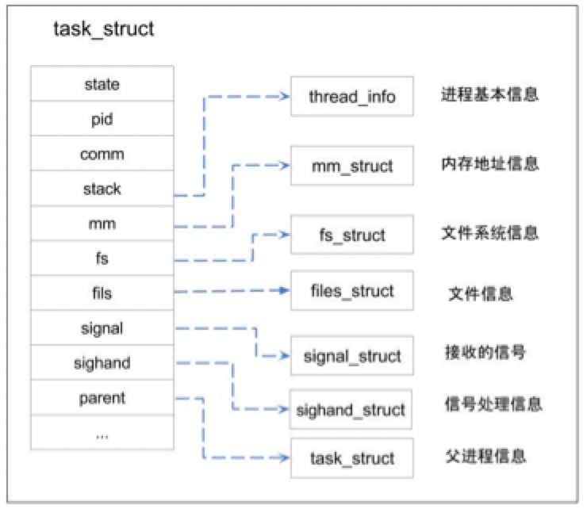

# 一、什么是进程，进程和线程的区别
* 进程：是操作系统进行资源分配的基本单位
* 线程：是操作系统进行任务执行调度的基本单位
* 纤程（协程）：运行在用户空间，不与内核进行交互。（不会创建内核进程）

**区别：** 进程和线程在操作系统中都是一个进程，线程共享进程的内存空间，没有独立的内存空间。

进程空间天然独立，不会互相篡改数据，但是对共享数据的操作时，还是需要进行加锁处理；

<!--more-->  

# 二、进程实现
进程结构、进程创建、thread_info、task_list、虚拟内存、Linux内核架构等内容进行描述
## 1、进程结构
进程描述符（PCB=process control block），task_struct是PCB的具体实现。进程的执行，对于CPU来说，也是代码段。


代码实现   
```
sched.sh文件 
struct task_struct { 
    long state; // 进程状态 
    struct mm_struct *mm; // 虚拟内存结构体 
    pid_t pid; // 进程号 
    struct task_struct *parent; // 指向父进程的指针
    struct list_head children; // 子进程列表 
    struct fs_struct *fs; // 存放文件系统信息的指针 
    struct files_struct *files;// 一个数组，包含该进程打开的文件指针 
};

```

**files：** 每个进程创建时，都会默认填充前三个值：   
* files[0]：代表标准输入流
* files[1]：代表标准输出流
* files[2]：代表标准错误输出流

**理解管道：** 一个进程的输出是另外一个进程的输入


## 2、进程创建
### 2.1、内核创建方式
task_struct的创建，Linux2.6之后，通过slab分配器动态生成task_struct。


1、高速缓存会被划分为slab。   
2、task_struct的创建，会先从未满的slab中申请，直到满了才会去空的slab中申请创建。
### 2.2、对外暴露接口创建方式
fork()、exec()等函数进行创建
```
main{  
    pid_t pid;  
    printf("fork!");
    pid=fork(); 
    if (pid < 0)  
        printf("error in fork!");  
    else if (pid == 0)  
        printf("i am the child process, my process id is %d\n",getpid());  
    else  
        printf("i am the parent process, my process id is %\/n",getpid());  
}
```
* fork()：一个父进程会创建一个子进程，子进程共享父进程的内存空间及指针记录。
* 返回两次结果值，指的是：父进程fork()函数会返回一个值，返回子进程的进程ID；而子进程此时执行节点也是到fork()，
父子进程会继续往下执行，从而产生返回两个值的现象，本质是两个进程执行得到相应的值。

* 由于在复制时复制了父进程的堆栈段，所以两个进程都停留在fork函数中，等待返回。 
因此fork函数会返回两次，一次是在父进程中返回，另一次是在子进程中返回，这两次的返回值是不一样的。
* fork函数返回的值为什么在父子进程中不同。
“ 其实就相当于链表，进程形成了链表，父进程的fork函数返回的值指向子进程的进程id, 因为子进程没有子进程，所以其fork函数返回的值为0 .

```
int main(){
    execl("/bin/ls", "ls", "-l", NULL);
    perror("execl");
    exit(1);
}
```
A进程中调用exec函数族函数，将A进程的代码段替换成了ls程序的代码段，则A进程下的代码则不会执行，也不会返回结果。


## 3、thread_info
快速获取task_struct：  
* 1、有的硬件系统，有专门的寄存器来存储。
* 2、寄存器不富余的体系，只能在栈的尾端创建thread_info结构。


操作系统，将所有的进程都放入一个双向链表结构的任务列表中（task_list）

## 4、虚拟内存
task_struct中的mm_struct结构代表着虚拟内存。


**为什么需要虚拟内存：**  
1. 多线程环境下，内存空间小，易不足，若想不影响其他进程，则只能将其他进程的内容拷贝至磁盘中持久化，但是会导致耗时增加。
2. 多线程环境下，若直接使用物理内存，则进程的数据可能被其他进程修改，导致进程运行的不准确。

**为了解决上述问题**，将进程进行隔离，使用了虚拟内存，各进程之间不受影响，使每个进程都能拥有所有的物理内存空间。

### 4.1、虚拟内存实现


Linux为每个进程维护了一个单独的虚拟地址空间，分成内核空间和用户空间。（进程之间空间是天然独立的，互不影响；子进程共享父进程的空间，则会导致子进程数据的相互篡改）
* 内核空间：高地址空间的1GB，用于运行内核代码和数据和保存进程的相关信息。俗称内核态。
* 用户空间：低地址空间的3GB，运行用户进程的代码和数据。俗称用户态。
* 每次内核调用，都会进行空间切换，数据拷贝，这个操作是耗时的。
* 虚拟内存到物理内存的映射，通过mmu（内存管理单元）操作。

**写时复制：Copy On Write技术实现原理：**   
```
1. fork()之后，复制出来的子进程有自己的task_struct结构和pid,  
2. kernel把父进程中所有的内存页的权限都设为read-only，  
3. 然后子进程的地址空间指向父进程。当父子进程都只读内存时，相安无事。   
4. 当其中某个进程写内存时，CPU硬件检测到内存页是read-only的，   
5. 于是触发页异常中断（page-fault），陷入kernel的一个中断例程。   
6. 中断例程中，kernel就会把触发的异常的页复制一份，于是父子进程各自持有独立的一份，  
7. 父进程会对原有的物理空间进行修改，而子进程会使用拷贝后的新物理空间。
```
在**fork**函数调用时，父进程和子进程会被内核分配不同的虚拟内存空间，所以从进程的角度看它们访问的是不同的内存：
* 在虚拟内存空间进行读操作时，内核会将虚拟内存映射到物理内存上，父子进程共享了物理上的内存空间；
* 当父进程对共享的内存进行修改时，共享的内存会以页为单位进行拷贝，父进程会对原有的物理空间进行修改，而子进程会使用拷贝后的新物理空间；
* 当子进程对共享的内存进行修改时，子进程会在拷贝后的新物理空间上进行修改，而不会改动原有的物理空间，避免影响父进程的内存空间；

# 五、Linux内核架构

进程调度器：process scheduler，持有了task_list，然后管理这些进程链表。维护了一个current指针，指向当前正在执行的进程。  
**抢占式和非抢占式。**

# 六、进程状态
* task_running：正在运行或就绪
* task_intermptible：可中断的休眠，等待资源、信号，一旦满足，由中断变为就绪
* task_unintermptible：不可中断的休眠，信号无法唤醒，只有当资源满足时可唤醒。
* task_stoped：进程被停止执行
* task_traced：表示进程被debugger等进程监视

# 七、中断
CPU暂停当前线程执行，执行中断请求。
**中断类型：** 
* 同步中断（软中断）：由CPU控制单元产生，之所以称为同步，因为只有当一条指令执行完成后，才会执行中断指令。
* 异步中断（硬中断）：由硬件设备产生的中断信号，随机产生。


#八、缺页

1. 含义：PTE有晓位=0，虚拟内存中的虚拟页没有被缓存在物理内存中，称为缺页。
2. 具体表现：malloc()和mmap()函数调用，在分配时只建立的虚拟内存空间（在进程堆中分配），并没有分配虚拟内存对应的物理内存。当进程服务这些虚拟内存时，mmu（内存管理单元）无法解析，将报出page fault错误，缺页中断，然后进程进行空间切换，由用户态切换至内核态，然后由内核处理。
3. 处理方式：根据缺页类型，CPU判断物理内存中是否有当前所需页帧，如果存在，进行映射；如果不存在，则去磁盘读取保存至内存，再建立映射。


