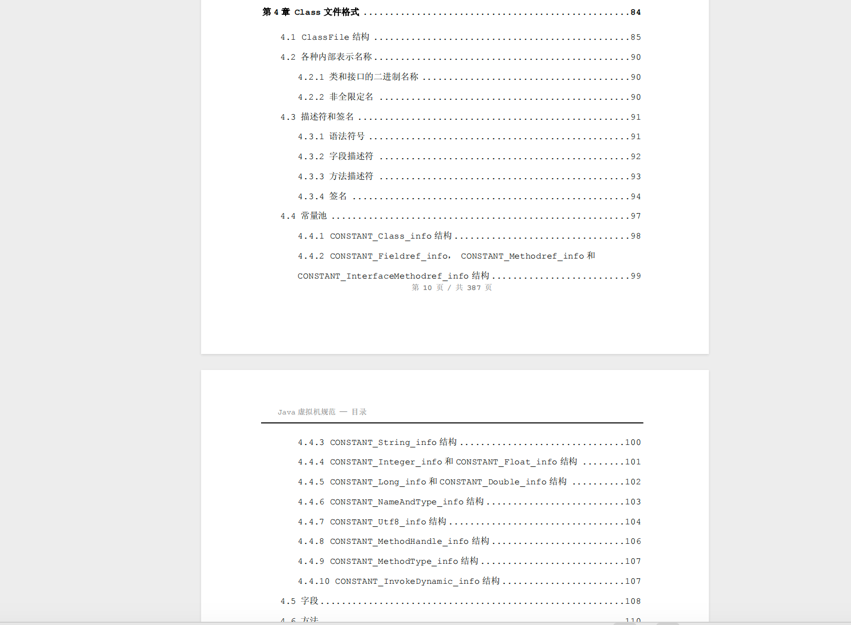

	这是Java虚拟机规范系列的第一篇文章，主要介绍的是虚拟机规范官方文章章节概览。

### 一、虚拟机规范
许多人知道类加载机制、JVM内存模型，但他们可能不知道什么是《Java虚拟机规范》。对于Java开发来说，《Java虚拟机规范》才是最为官方、准确的一个文档，了解这个规范可以让我们更深入地理解JVM。我们平常说的JVM其实更多说的是HotSpot（HotSpot是JVM规范的一种实现），但我们常常将HotSpot与JVM等同起来。正因对于JVM规范认识的不足，所以我专门准备一个系列的文章，带着大家读一读JVM规范。

#### 1.1、定义与概念:
java 虚拟机规范详细定义了 JVM 的体系结构、指令集、寄存器集合、类文件格式、内存管理、垃圾回收等诸多方面的内容。它就像是 JVM 的 “宪法”，规定了 JVM 应该如何运行以及如何处理各种情况。

<!-- more -->

#### 1.2、目的和作用：
定义了Java虚拟机的概念模型和整体架构，确保不同的Java虚拟机实现具有一致的行为和功能，使得Java程序能够在不同的平台上具有可移植性。

#### 1.3、Java虚拟机
Java 虚拟机（Java Virtual Machine，JVM）是一个可以执行 Java 字节码的虚拟机进程。常见的实现有HotSpot、JRockit、OpenJ9。

### 二、关键内容
打开《Java虚拟机规范》目录，我们可以看到规范分为下面几个部分：

---
- 第1章 引言
- 第2章 Java虚拟机结构
- 第3章 为Java虚拟机编译
- 第4章 Class文件格式
- 第5章 加载、链接与初始化
- 第6章 Java虚拟机指令集
- 第7章 操作码助记符

---

#### 第1章 引言

从第1章的目录可以看出，其主要介绍一些历史以及Java虚拟机的基础知识，还有各章节提要，没有什么难度。略过。

#### 第2章 Java虚拟机结构
第2章介绍了Class文件格式、数据类型、原始类型、引用类型、运行时数据区、栈帧、字节码指令等。

在这一部分中，我们比较熟悉的就是运行时数据区了。其实我们习惯性叫Java虚拟机内存模型或内存结构，但在JVM规范中是叫做运行时数据区的。此外栈帧也是非常重要的一个部分，与方法的调用有关。字节码指令则是更加深层次的知识。

此外，数据类型、原始类型、引用类型等也是基础的知识，但用得相对较少。
> 所有在虚拟机规范之中没有明确描述的实现细节，都不应成为虚拟机设计者发挥创造性的牵
绊，设计者可以完全自主决定所有规范中不曾描述的虚拟机内部细节，例如：运行时数据区的内存
如何布局、选用哪种垃圾收集的算法、是否要对虚拟机字节码指令进行一些内部优化操作（如使用
即时编译器把字节码编译为机器码）。

#### 第3章 为Java虚拟机编译
这一章从名字可以看出，写的是如何编译Java文件的，将Java文件编译为字节码文件，最终提供给Java虚拟机使用。

我们之前提到Java虚拟机其实就是将字节码文件翻译成机器码，所以这里就是编译器把Java源码编译成字节码。但是到底如何编译呢？

算数运算要怎么编译？
常量池如何编译？
方法调用如何编译？
……
这一章解决的就是这个问题。

#### 第4章 Class文件格式
前面提到过JVM的输入物料是字节码文件，也就是Class文件，而不是Java文件。也就是说无论是Java语言，还是php语言，只要你能编译出字节码文件，那JVM就能够运行。

那么我们就知道这个Class文件必定是有统一格式的。而这一章节说的内容就是Class文件的格式构成。之前我们写过一个HelloWorld.java文件，将其编译成字节码文件，然后一个字节一个字节地分析其内容。要能分析字节码文件的内容，首先就得弄清楚Class文件的格式。而这一章就是讲解字节码文件格式的。

这一章节也是非常重要的。

#### 第5章 加载、链接与初始化
Java虚拟机规范其实是递进、非常有节奏的。前面第2章讲了JVM的内存结构，之后将如何将源文件（.java）编译成字节码文件（.class）文件，之后将了字节码文件的格式。那么下一步是什么？

下一步就是把字节码文件加载到内存中运行呀！

没错，第5章说的就是这个内容。

首先是加载。《Java虚拟机规范》在这一章中说明了Java虚拟机将如何启动、如何创建、加载类。

其次是链接（包括验证、准备、解析）。首先会验证，字节码文件加载进来了，那么就必须要验证下这个字节码文件是否写对了，不然随便写一个文件就运行，岂不是乱套了。准备是给变量和对象分配内存。校验完数据格式，那么就要针对字节码内容进行解析了，就是读懂这些字节码数据到底要干嘛。这个过程包括了：类与接口解析、字段解析、普通方法解析等等。

之后是初始化。会运行一些初始化的构造方法，用于初始化数据。

最后运行完毕，Java虚拟机退出。

#### 第6章 Java虚拟机指令集

指令集，其实就是一系列指令的集合。例如我们需要给一个局部变量赋予1这个值，即这个动作：int a = 1; 在我们看来，这很简单，但对于机器来说需要很多个动作。

所以Java虚拟机指令集就是将这些常用的动作集中起来，定义成一系列指令，方便我么能使用。

#### 第7章 操作码助记符
提供了一张以操作码值为索引的 Java 虚拟机操作码助记符表。
