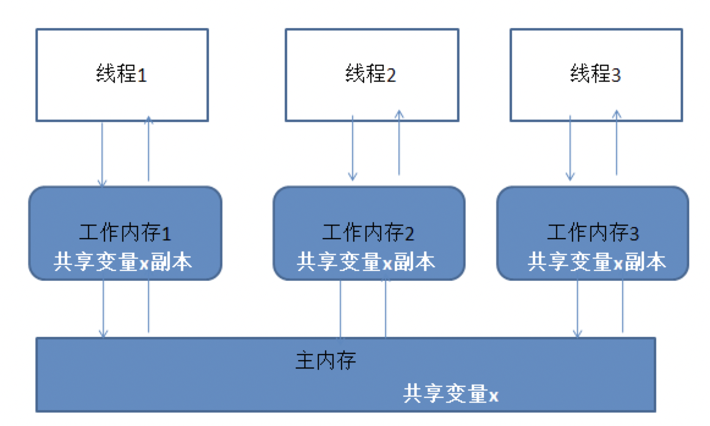

# 一、背景
* linux进程之间内存空间独立，互不影响，只有在两个进程访问共享变量时，才需要加锁，例如数据库等。
* Linux子进程之间共享父进程的内存空间，

例如JVM进程，在Linux系统中，也是一个进程，对应的数据结构：


<!--more-->  

* 而jvm线程在Linux中也是一个进程，在未改变原来数据时共享JVM进程的内存空间，若改变了，同一个数据可能会生成多个副本并且值不一致，那么产生的问题就是虚拟空间往物理内存写入时会产生数据不一致的问题，此时则需要加锁等处理保证数据的一致性。
* 线程数据篡改是怎么产生的？
    * A、B两个线程，有同一变量的数据副本，当A线程更新了物理内存中的数据，B再去更新，则相当于篡改了A线程的数据，此时缓存一致性协议来保证数据一致性。

* 学习中遇到的疑问？
    * 线程数据既然会被篡改（按linux角度的fork函数而言，fork子线程也会对线程数据进行篡改），那么ThreadLocal是如何做到的？
    * 理由如下：
        * 1、Java线程的创建，都是从JVM进程中fork处理的，而不是fork有ThreadLocal的线程。
        * 2、ThreadLocal只属于当前线程，并且当前线程不会fork出子线程，则不会被其他线程篡改。

# 二、多线程环境下，如何防止自己的变量被其他线程篡改？
* ThreadLocal的设计目的是为了当前线程拥有自己的变量，并不是为了解决并发或共享变量的问题。
* ThreadLocal主要作用是做数据隔离，保存到ThreadLocal中的数据只属于当前线程，对于其他线程来说是隔离的。

# 三、实现

```
//使用方式
public static void main(String[] args) {
    new Thread(new Runnable() {
        @Override
        public void run() {
            ThreadLocal<String> threadLocal1 = new ThreadLocal<>();
            threadLocal1.set("value1");
            ThreadLocal<String> threadLocal2 = new ThreadLocal<>();
            threadLocal2.set("value2");
            System.out.println(threadLocal1.get());
            System.out.println(threadLocal2.get());
        }
    }).start();
}

//代码实现
public class Thread implements Runnable {
    //线程属性：threadLocal
    ThreadLocal.ThreadLocalMap threadLocals = null;   
}    
public class ThreadLocal<T> {
    //TheadLocal静态内部类ThreadLocalMap，Entry[]数组，而Entry继承了虚引用
    static class ThreadLocalMap {
        private Entry[] table;
        //构造函数
        ThreadLocalMap(ThreadLocal<?> firstKey, Object firstValue) {
            table = new Entry[INITIAL_CAPACITY];
            int i = firstKey.threadLocalHashCode & (INITIAL_CAPACITY - 1);
            table[i] = new Entry(firstKey, firstValue);
            size = 1;
            setThreshold(INITIAL_CAPACITY);
        }
        static class Entry extends WeakReference<ThreadLocal<?>> {
            Object value;
            Entry(ThreadLocal<?> k, Object v) {
                super(k);
                value = v;
        }
        private Entry getEntry(ThreadLocal<?> key) {
            int i = key.threadLocalHashCode & (table.length - 1);
            Entry e = table[i];
            if (e != null && e.get() == key)
                return e;
            else
                return getEntryAfterMiss(key, i, e);
        }
    }
}
```


* ThreadLocal的实现：每个线程拥有一个ThreadLocalMap映射表，这个映射表的key是ThreadLocal本身，value是实际需要存储的对象。也就是说ThreadLocal实际不存储值，只是作为key去ThreadLocalMap中获取value的值。
* ThreadLocalMap内部是一个数组，Thread指向该数组。Entry的key是ThreadLocal，那么Thread只能有一个相同的ThreadLocal。一个ThreadLocal只能保存一个值。

内存示意图：


1、hash冲突
* 在插入过程中，根据ThreadLocal对象的hash值，定位到table中的位置i，过程如下：
    * 1、如果当前位置是空的，那么正好，就初始化一个Entry对象放在位置i上；
    * 2、不巧，位置i已经有Entry对象了，如果这个Entry对象的key正好是即将设置的key，那么重新设置Entry中的value；
    * 3、很不巧，位置i的Entry对象，和即将设置的key没关系，那么只能找下一个空位置；

这样的话，在get的时候，也会根据ThreadLocal对象的hash值，定位到table中的位置，然后判断该位置Entry对象中的key是否和get的key一致，如果不一致，就判断下一个位置

2、内存泄漏

* 如果key 使用强引用：引用的ThreadLocal的对象被回收了，但是ThreadLocalMap还持有ThreadLocal的强引用，如果没有手动删除，ThreadLocal不会被回收，导致Entry内存泄漏。
* 如果key 使用弱引用：引用的ThreadLocal的对象被回收了，由于ThreadLocalMap持有ThreadLocal的弱引用，即使没有手动删除，ThreadLocal也会被回收。value在下一次ThreadLocalMap调用set,get，remove的时候会被清除。

**ThreadLocalMap内部的Entry[]数组，Entry继承了弱引用，ThreadLocal作为key，Entry弱引用对象指向了ThreadLocal。那么会在下一次GC的时候将弱引用指向的ThreadLocal对象会被回收，此时Entry.key=null，但是还是会有一个强引用指向了value，如果不把value清空，则会导致内存泄漏**

ThreadLocal内存泄漏的根源是：由于ThreadLocalMap的生命周期跟Thread一样长，如果没有手动删除对应key就会导致内存泄漏，而不是因为弱引用。


