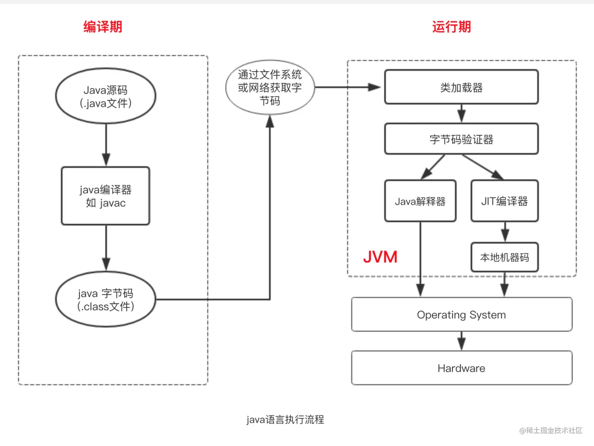

	这是Java虚拟机规范系列的第三篇文章，主要介绍的是虚拟机规范中的虚拟机编译过程、编译原理。

### 一、JAVA 虚拟机编译
Java 虚拟机是为了支持 Java 语言而的设计的。Oracle 的 JDK 包括两部分内容：一部分是将 Java 源代码编译成 Java 虚拟机的指令集的编译器，另一部分是用于 Java 虚拟机的运行时环境。理解编译器是如何与 Java 虚拟机协同工作的，对编译器开发人员来说很有好处，同样也有助于理解 Java 虚拟机本身。

<!-- more -->


#### 1.1、指令
主要指令如下：

| 指令名称        | 作用    |
|:---| ---:|
| javac    | 将java源代码编译成字节码 |
| javap | 反编译字节码  |
| java | 	将字节码加载到jvm中运行|
	
	
#### 1.2、编译过程

##### 1.2.1、基本编译过程
编译过程就是将 .java 源码编译成 .class 字节码，这个过程可以通过软件工具 javac 来实现。


##### 1.2.2、JVM中的编译器 & 解释器
**JAVA编译器（javac.exe）** 的作用是将java源程序编译成中间代码字节码文件，是最基本的开发工具。
**JAVA解释器（java.exe）（英语：Interpreter）**，又译为直译器，是一种电脑程序，能够把高级编程语言一行一行直接转译运行。解释器不会一次把整个程序转译出来，只像一位“中间人”，每次运行程序时都要先转成另一种语言再作运行，因此解释器的程序运行速度比较缓慢。它每转译一行程序叙述就立刻运行，然后再转译下一行，再运行，如此不停地进行下去。
**Java 即时编译器（Just - In - Time Compiler，JIT）** 是 Java 虚拟机（JVM）的一个关键组件。它的主要作用是在程序运行过程中，将热点（频繁执行）的 Java 字节码动态地编译成机器码。



###### 第一次运行代码：编译->解释->生成机器码（即生成Test.class文件）

在运行时，JIT会把翻译过来的机器码保存起来，以备下次使用。

###### 第二次编译：编译->执行（JIT即时编译,不用再生成.class文件，提高运行效率）
未修改源代码的情况下，不用再修改.class文件或生成相应的机器码


##### 1.2.3、即时编译器
为了优化Java的性能 ，JVM在解释器之外引入了即时（Just In Time）编译器：当程序运行时，解释器首先发挥作用，代码可以直接执行。随着时间推移，即时编译器逐渐发挥作用，把越来越多的代码编译优化成本地代码，来获取更高的执行效率。解释器这时可以作为编译运行的降级手段，在一些不可靠的编译优化出现问题时，再切换回解释执行，保证程序可以正常运行。

###### 触发时机
Java虚拟机根据方法的调用次数以及循环回边的执行次数来触发即时编译。循环回边是一个控制流图中的概念，程序中可以简单理解为往回跳转的指令，比如下面这段代码：

循环回边
```java
public void nlp(Object obj) {
  int sum = 0;
  for (int i = 0; i < 200; i++) {
    sum += i;
  }
}
```

上面这段代码经过编译生成下面的字节码。其中，偏移量为18的字节码将往回跳至偏移量为4的字节码中。在解释执行时，每当运行一次该指令，Java虚拟机便会将该方法的循环回边计数器加1。

字节码
```
public void nlp(java.lang.Object);
    Code:
       0: iconst_0
       1: istore_1
       2: iconst_0
       3: istore_2
       4: iload_2
       5: sipush        200
       8: if_icmpge     21
      11: iload_1
      12: iload_2
      13: iadd
      14: istore_1
      15: iinc          2, 1
      18: goto          4
      21: return
```
在即时编译过程中，编译器会识别循环的头部和尾部。上面这段字节码中，循环体的头部和尾部分别为偏移量为11的字节码和偏移量为15的字节码。编译器将在循环体结尾增加循环回边计数器的代码，来对循环进行计数。

当方法的调用次数和循环回边的次数的和，超过由参数-XX:CompileThreshold指定的阈值时（使用C1时，默认值为1500；使用C2时，默认值为10000），就会触发即时编译。

开启分层编译的情况下，-XX:CompileThreshold参数设置的阈值将会失效，触发编译会由以下的条件来判断：

方法调用次数大于由参数-XX:TierXInvocationThreshold指定的阈值乘以系数。
方法调用次数大于由参数-XX:TierXMINInvocationThreshold指定的阈值乘以系数，并且方法调用次数和循环回边次数之和大于由参数-XX:TierXCompileThreshold指定的阈值乘以系数时。
分层编译触发条件公式
```
i > TierXInvocationThreshold * s || (i > TierXMinInvocationThreshold * s  && i + b > TierXCompileThreshold * s) 
i为调用次数，b是循环回边次数
```
上述满足其中一个条件就会触发即时编译，并且JVM会根据当前的编译方法数以及编译线程数动态调整系数s。

###### 编译原理
**方法调用计数与热点探测**     
JVM 内部有一个机制用于统计方法的调用次数。当一个方法的调用次数达到一定的阈值（这个阈值可以根据 JVM 的配置和实现而不同）时，JVM 会将这个方法标记为热点方法。例如，HotSpot JVM 使用了基于计数器的热点探测技术，它有两种计数器：方法调用计数器和回边计数器。方法调用计数器用于统计方法的调用次数，回边计数器用于统计循环体的执行次数。当这些计数器的值超过预设的阈值时，就会触发 JIT 编译。

**字节码编译为机器码**        
一旦一个方法被确定为热点方法，JIT 编译器就会获取这个方法的字节码。它会对字节码进行一系列复杂的编译优化，包括但不限于常量折叠（如将表达式 “2 + 3” 在编译阶段计算为 5）、方法内联（将被调用的方法的代码直接嵌入到调用处）、循环展开（将循环体展开以减少循环控制的开销）等操作。然后，将经过优化后的字节码编译成机器码，并存储在代码缓存（Code Cache）中。之后，当程序再次调用这个热点方法时，就可以直接从代码缓存中获取机器码并执行。


### 二、编译示例

#### 2.1、常量、局部变量的使用和控制结构
spin()是一个很简单的方法，它进行了 100 次空循环：
```java
void spin() {
  int i;
  for (i = 0; i < 100; i++) {
    ; // Loop body is empty
  }
}
```

编译后代码如下：
```
Method void spin()
0 iconst_0 // Push int constant 0 将0推到栈顶
1 istore_1 // Store into local variable 1 (i=0)  将1存储到局部变量表
2 goto 8 // First time through don’t increment
5 iinc 1 1 // Increment local variable 1 by 1 (i++)
8 iload_1 // Push local variable 1 (i)
9 bipush 100 // Push int constant 100
11 if_icmplt 5 // Compare and loop if less than (i < 100)
14 return // Return void when done
```


#### 2.2、同步
Java 虚拟机中的同步（Synchronization）基于进入和退出管程（Monitor）对象实现。无论是显式同步（有明确的 monitorenter 和 monitorexit 指令）还是隐式同步（依赖方法调用和返回指令实现的）都是如此

示例代码：
```java
void onlyMe(Foo f) {
 synchronized(f) {
   doSomething();
 }
}
```

编译后：
```
Method void onlyMe(Foo)
0 aload_1 // Push f                                    将第二个引用类型局部变量（f）推送到栈顶
1 dup // Duplicate it on the stack                     复制栈顶数值并将复制值压入栈顶
2 astore_2 // Store duplicate in local variable 2      将栈顶引用类型数值存入第三个局部变量
3 monitorenter // Enter the monitor associated with f  获得对象的monitor，用于同步方法或同步块
4 aload_0 // Holding the monitor, pass this and...     将第一个引用类型局部变量推送到栈顶
5 invokevirtual #5 // ...call Example.doSomething()V   调用实例方法
8 aload_2 // Push local variable 2 (f)                 将第二个引用类型局部变量推送到栈顶
9 monitorexit // Exit the monitor associated with f
10 goto 18 // Complete the method normally
13 astore_3 // In case of any throw, end up here
14 aload_2 // Push local variable 2 (f)
15 monitorexit // Be sure to exit the monitor!
16 aload_3 // Push thrown exception...
17 athrow // ...then rethrow the value to the invoker
18 return // Return in the normal case
Exception table:
FromTo Target Type
 4 10 13 any
 13 16 13 any
```


参考文章：   
[基本功 | Java即时编译器原理解析及实践](https://tech.meituan.com/2020/10/22/java-jit-practice-in-meituan.html)
