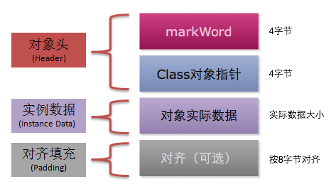
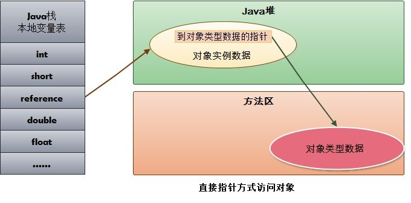
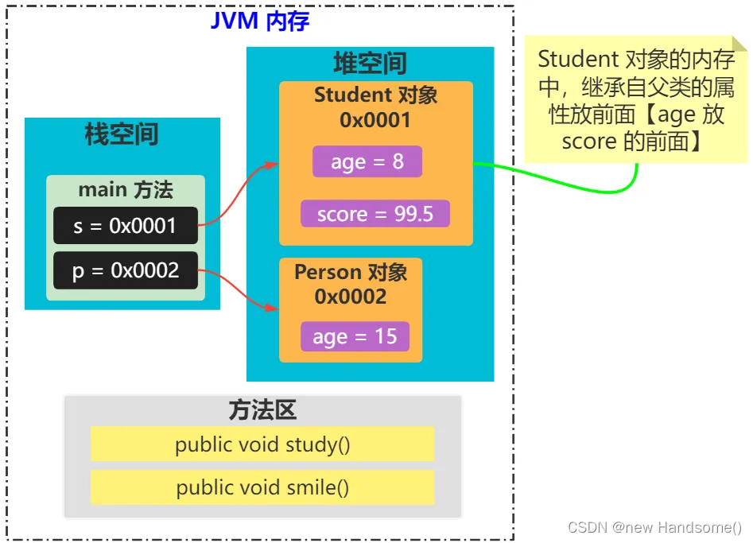

	这是Java虚拟机规范系列的第七篇文章，主要介绍的是虚拟机规范中的对象的hotspot实现。

# 一、对象的内存布局


<!-- more -->

在Hotspot虚拟机里，对象在堆内存中的存储布局可以划分为3个部分：
- 对象头（header）
- 实例数据（instance Data）
- 对齐填充（padding）

**对象头**包括两部分信息：
- 第一部分用于存储对象自身的自身运行时数据（哈希码、GC 分代年龄、锁状态标志等等）。
- 另一部分是类型指针，即对象指向它的类元数据的指针，虚拟机通过这个指针来确定这个对象是那个类的实例。

**实例数据部分**是对象真正存储的有效信息，也是在程序中所定义的各种类型的字段内容。

**对齐填充部分**不是必然存在的，也没有什么特别的含义，仅仅起占位作用。 因为 Hotspot 虚拟机的自动内存管理系统要求对象起始地址必须是 8 字节的整数倍，换句话说就是对象的大小必须是 8 字节的整数倍。而对象头部分正好是 8 字节的倍数（1 倍或 2 倍），因此，当对象实例数据部分没有对齐时，就需要通过对齐填充来补全。


# 二、对象的创建过程

创建对象的过程大致分为 5 步：
- Step1：类加载检查
- Step2：分配内存
- Step3：初始零值
- Step4：设置对象头
- Step5：执行 init

## 2.1、类加载检查
当我们在 Java 程序中 new 一个对象的时候，在底层其实会有大概以下几步：
- 首先它会检查这个指令是否能在常量池中能否定位到一个类的符号引用
- 接着会检查这个符号引用代表的类是否已经被加载、解析、初始化。如果没有会进行一个**类加载**

> 检查完类加载后就是分配内存了。（这里有人可能会问那该对象的具体内存是否确认呢？其实类加载完成后可以确认它所需要的内存了）

## 2.2、分配内存
现在我们已经知道了对象所占的内存，那么虚拟机是如何给对象在 Java 堆中分配内存的呢？主要有两种分配方式：
- 指针碰撞
- 空闲列表

接下来我们详细说说这两种分配内存的方式：

### 2.2.1. 指针碰撞
其实这种方式理解起来比较简单的，假设 Java 堆中的内存是绝对完整的，它会把使用过的内存和未使用过的内存划分开来。此时一边就是使用过的内存，一边就是未使用过的内存；那么他如何去给一个新的对象去划分空闲内存中的某块区域呢？其实很简单，就是借助一个指针（这里是不是呼应上了所谓的指针碰撞）；当我们分配内存的时候就是把指针在空闲的内存区域中移动一个与要被创建对象大小相等的距离。这就是指针碰撞的方式。

> 适用场景：内存规整，不碎片化

### 2.2.2. 空闲列表
这个其实理解起来更为简单。它无非就是指在 Java 堆中的内存并非是规整的（使用的内存和未使用过的内存没有划分开来），比较杂乱无章，此时虚拟机就得需要列表记录内存中哪些是已经使用的哪些是没有使用的，然后在给对象分配内存空间的时候在该列表中找一个足够的内存分给对象实例；并更新维护的列表。这种就叫做空闲列表（Free List）。

> 适用场景：堆内存碎片化

**Tips:** 说到分配内存的两种方式，就顺便提一句，
- 当使用的是Serial``ParNew等压缩整理过程的收集器的时候，系统采用的是指针碰撞的方式。
- 而当使用的是CMS这种基于清除的算法收集器，理论上就只能采用空闲列表。

### 2.2.3. 分配内存如何保证线程安全的
上面我们将给新的对象分配内存的方式以及分配内存前的逻辑大致理完了。你是不是觉得很简单。其实就是这么简单。但是其实我们忽略了一个很重要的问题。我们回想起本篇文中第一段话：Java 程序在运行过程中无时无刻不在创建对象，那么它是如何在并发环境下保证线程安全的呢？接下来我们简单的捋一下其实保证线程安全还是两种方式：
1. 将分配内存空间的动作进行同步处理（虚拟机底层的实现逻辑就是CAS + 失败重试）来保证分配内存空间的原子性。
2. 还有一种就是为每一个线程预先在 Eden 区分配一块儿内存，JVM 在给线程中的对象分配内存时，首先在 TLAB 分配，当对象大于 TLAB 中的剩余内存或 TLAB 的内存已用尽时，再采用上述的 CAS 进行内存分配，这种方式叫做**本地线程分配缓冲 Thread Local Allocation Buffer TLAB**，当本地线程缓冲使用完了，再分配缓存区时才需要同步锁定。至于虚拟机是否使用 TLAB 可通过参数-XX: +/-UseTLAB来控制。


## 2.3、初始零值
当分配完内存后，虚拟机必须将分配到的内存空间（不包含对象头）都初始化为零值。如果使用了 TLAB，那么这一步会在 TLAB 分配时进行。为什么虚拟机要有这番操作呢？

> 主要是为了保证对象的实例字段能够在 Java 代码中可以在不赋值的时候就可以访问直接使用，这样就能使 Java 程序访问这些字段所对应的数据类型的初始零值。

## 2.4、设置对象头
设置对象头，虚拟机要对对象进行必要的设置，例如这个对象是哪个类的实例、如何才能找到类的元数据信息、对象的哈希码、对象的GC分代年龄等信息。这些信息存放在对象的对象头之中

> <font color=#e98787>**虚拟机的视角来看，一个新的对象已经产生了**</font>

## 2.5、执行init
执行完上述操作后，对于 Java 虚拟机来说对象已经创建完了，但是对于 Java 视角来说，对象的创建才刚刚开始，还没有执行init方法。所有的字段还都为零。对象中需要的其它资源和状态信息还没有按照原有的意图去构造好。所以一般来说，new指令之后就会执行init方法，按照 Java 程序员的意图去对对象做一个初始化，这样之后一个真正完整可用的对象才构造出来。

> <font color=#e98787>**把对象按照程序员的意愿进行初始化，这样一个真正可用的对象才算完全产生出来。**</font>


## 对象实例化和初始化的区别

### 1、实例化
实例化主要指的是为对象在内存中分配空间的过程。这是创建一个对象的物理存在的操作，确定对象将占据的实际内存区域。
> 例如，当使用 new 关键字创建一个对象时，Java 虚拟机（JVM）会根据对象的类型和大小，在堆内存中为其分配一块合适的内存空间。

操作过程：
- 首先，JVM 会根据类的信息确定对象所需的内存大小。
- 然后，在堆内存中找到一块足够大的连续空间，并标记为该对象所使用。
- <font color=gray>这个过程就像是在一个仓库中为一个新的物品找到一个合适的存放位置。</font>


### 2、初始化
初始化是指为对象的成员变量赋予初始值，使其达到一个可用的状态。这是设置对象初始状态的操作，确保对象在使用之前具有合理的默认值或特定的值。
初始化可以包括为成员变量赋值、执行构造函数中的代码、调用其他初始化方法等

操作过程
- 对于基本数据类型的成员变量，会赋予相应类型的默认值（例如，int 类型初始化为 0，boolean 类型初始化为 false）。
- 对于引用类型的成员变量，会初始化为 null。
- 然后，执行构造函数中的代码，进一步对成员变量进行赋值或其他初始化操作。构造函数是类的一种特殊方法，用于在创建对象时对对象进行初始化。

> <font color=red>实例化是初始化的前提。必须先为对象分配内存空间（实例化），然后才能在该空间中进行初始化操作</font>

通常，在使用 new 关键字创建对象时，实例化和初始化会依次自动进行

# 三、对象内存分配

栈上分配，需要先开启逃逸分析
> 线程销毁或方法结束自动销毁对象

## 3.1、逃逸分析
Java中的对象不一定是在堆上分配的，因为JVM通过逃逸分析，能够分析出一个新对象的使用范围，并以此确定是否要将这个对象分配到堆上。

它的主要目的是分析对象的作用域，判断对象是否会逃逸出方法、线程等。如果一个对象不会逃逸，那么虚拟机就可以对其进行一些优化，比如栈上分配、标量替换等，从而提高程序的性能。

### 1. 什么时候判断？
主要在编译阶段
编译过程通常包括前端编译和后端编译
- **前端编译：** 将 Java 源代码转换为字节码，例如使用 Java 编译器（javac）进行的操作
- **后端编译：** 在运行时将字节码转换为机器码的过程，常见的如即时编译（Just-In-Time Compilation，JIT）。

#### 逃逸分析在编译阶段的具体过程
在编译期间，编译器会对代码进行静态分析，以确定对象的作用域和生命周期。它会检查对象是否在方法内部创建，并分析对象的引用是否会超出创建它的方法范围。

##### 代码分析
如果对象的引用仅在创建它的方法内部使用，并且不会传递到方法外部，那么该对象被认为没有逃逸。
```java
public User test1() {
    User user = new User();
    user.setId(1);
    user.setName("张三");
    return user;
}

public void test2() {
    User user = new User();
    user.setId(2);
    user.setName("李四");
}
```
    test1()方法构建了user对象，并且返回了user，返回回去的对象肯定是要被外部使用的。这种情况就是user对象逃逸出了test1()方法。
    而test2()方法也是构建了user对象，但是这个对象仅仅是在test2()方法的内部有效，不会在方法外部使用，这种就是user对象没有逃逸。

> 判断一个对象是否是逃逸对象，就看这个对象能否被外部对象访问到


### 2. 优化
如果一个对象不会逃逸，那么虚拟机就可以对其进行一些优化，比如栈上分配、标量替换等，从而提高程序的性能。
#### 栈上分配（Stack Allocation）
对于未逃逸的对象，编译器可以选择在栈上分配对象的内存空间，而不是在堆上分配。因为栈上的内存分配和回收速度更快，并且不需要进行垃圾回收。当方法结束时，栈帧弹出，栈上分配的对象也随之自动回收，减少了垃圾回收的压力。

#### 同步消除（Synchronization Elimination）
如果一个对象被确定为未逃逸，那么对该对象的同步操作（如加锁）就可以消除。因为没有其他线程可以访问到这个对象，不存在同步的必要性，从而减少了同步操作带来的性能开销。

#### 标量替换（Scalar Replacement）
对于未逃逸的对象，如果对象的成员变量可以拆分成多个独立的变量（标量），并且这些标量可以在方法内部直接使用，那么编译器可以将对象分解为这些标量，而不是创建完整的对象。这样可以减少对象的创建和内存占用，提高程序的性能。

分离对象，标量替换
一个线程栈的空间默认也就1M，栈帧空间就更小了，而对象分配需要一块连续的空间，经过计算如果这个对象可以放在栈帧上，但是栈帧的空间不是连续的，对于一个对象来说，这样是不行的，因为对象需要一块连续的空间
**那怎么办呢？**
即便在栈帧中没有一块连续的空间方法下这个对象，他也能够通过其他的方式，让这个对象放到栈帧里面去，这个办法就是标量替换。
**具体怎么做？**
空间不够


    确定要将对象分配到栈上时，即时编译可以将对象打散，将对象替换为一个个很小的局部变量，
    我们将这个打散的过程叫做标量替换。将对象替换为一个个局部变量后，就可以非常方便的在栈上进行分配了。

### 3. 如何开启
```dtd
-XX:+DoEscapeAnalysis   开启逃逸分析
-XX:-DoEscapeAnalysis	关闭逃逸分析  
```
逃逸分析默认是开启的

## 3.2、TLAB
Thread Local Allocation Buffer：线程本地分配缓存
为每一个线程预先在 Eden 区分配一块儿内存，JVM 在给线程中的对象分配内存时，首先在 TLAB 分配，当对象大于 TLAB 中的剩余内存或 TLAB 的内存已用尽时，再采用上述的 CAS 进行内存分配

### TLAB的产生背景和目的
- 多线程竞争问题
在堆内存中进行对象分配时，如果多个线程同时进行对象分配操作，会存在对堆内存空间分配的竞争
这种竞争会导致线程之间的同步开销增加，例如需要使用锁机制来保证分配操作的原子性和一致性。
同步操作会降低内存分配的效率，因为线程可能会因为等待锁而被阻塞，导致系统的吞吐量下降。
- 引入目的
为了减少多线程环境下对象分配时的同步开销，提高对象内存分配的效率，Java虚拟机引入了TLAB。
TLAB允许每个线程在自己的缓冲区中进行对象分配，避免了多个线程同时竞争堆内存中的同一区域，从而减少了线程之间的同步和冲突。

### TLAB的工作原理
缓冲区分配
当一个线程启动时，Java虚拟机会为该线程分配一块TLAB空间。这个空间通常位于Eden区（年轻代的一部分）中，是一块线程私有的内存区域。
例如，假设Eden区的大小为100MB，虚拟机可以为每个线程分配大约1%到2%的Eden区空间作为TLAB，具体大小可以根据虚拟机的参数进行调整。


## 栈上分配和TLAB的对比

- 栈上分配：减少GC压力
- TLAB：加速堆上对象的分配速度

# 四、对象创建方法

- new
- 反射
- 工厂
- clone
- 反序列化

# 五、对象的访问方式

### 句柄访问方式
堆中需要有一块叫做“句柄池”的内存空间，句柄中包含了对象实例数据与类型数据各自的具体地址信息。

引用类型的变量存放的是该对象的句柄地址（reference）。访问对象时，首先需要通过引用类型的变量找到该对象的句柄，然后根据句柄中对象的地址找到对象。

### 直接指针访问方式
引用类型的变量直接存放对象的地址，从而不需要句柄池，通过引用能够直接访问对象。但对象所在的内存空间需要额外的策略存储对象所属的类信息的地址。


> 需要说明的是，HotSpot 采用第二种方式，即直接指针方式来访问对象，只需要一次寻址操作，所以在性能上比句柄访问方式快一倍。但像上面所说，它需要额外的策略来存储对象在方法区中类信息的地址。


# 六、Java继承的内存布局
代码示例：
```java
public class Person {
    public int age;

    public void smile() {
        System.out.println("Person_smile()_age_" + age);
    }
}

class Student extends Person {
    public double score;

    public void study() {
        System.out.println("Student_study()_score_" + score);
    }
}

class MainTest {
    public static void main(String[] args) {
        Student s = new Student();
        s.score = 95.5;
        s.age = 8;
        // Person_smile()_age_8
        s.smile();
        // Student_study()_score_95.5
        s.study();

        Person p = new Person();
        p.age = 15;
        // Person_smile()_age_15
        p.smile();
    }
}
```
继承的内存布局图：

    
    Student 类继承 Person 类后会拥有 Person 类中的 age 属性，age 属性在 Student 对象的内存中也拥有一份
    Student 对象的内存和 Person 对象的内存各种独占，互不干扰


# 七、对象锁
