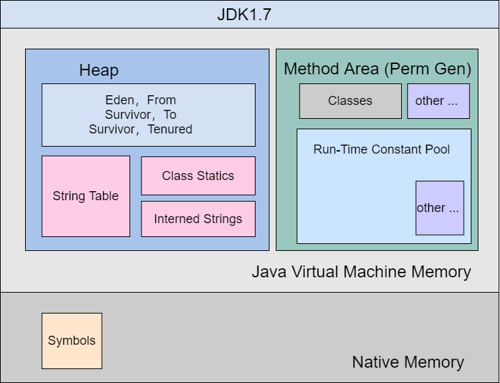
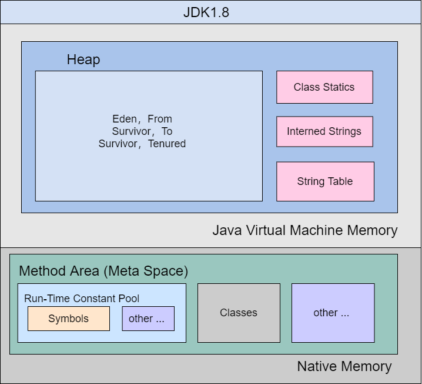

	这是Java虚拟机规范系列的第八篇文章，主要介绍的是虚拟机规范中的“运行时数据区”的hotspot实现。

# 一、引言
在具体讨论JVM的内存结构时，还应该指出，我们通常讨论的都是虚拟机中的实现，这些模型并不是所有虚拟机通用的，比如“Perm Gen（永久代）”就是HotSpot中的概念，JRockit中并没有永久代。

此外，不应该把“永久代”和“方法区”混为一谈，永久代（Perm Gen）只是HotSpot对于Java虚拟机规范中方法区（Method Area）的一种实现，后来被改成了元空间（MetaSpace），文中会具体介绍这些变化。

<!-- more -->


# 二、Hotspot VM的内存模型变迁

## JDK 1.6的内存结构


### 堆 （heap）
下图是HotSpot VM 的堆空间内存划分。分为新生代、老年代和永久代
- **新生代：** Hotspot虚拟机将新生代进一步划分为Eden区和两个Survivor区（S0和S1）
  - **Eden区：** 大多数新对象在Eden区中分配，如果Eden区空间不足时，将触发一次Minor GC。
  - **Survivor区：** Eden区中的存活对象会被复制到Survivor区（S0或S1），两个Survivor区交替使用。每次Minor GC后，存活的对象从一个Survivor区复制到另一个Survivor区或老年代。
  - **eden:survivor-to:survivor-from=8:1:1**
- **老年代：** 老年代存放生命周期较长的对象，当对象在新生代中经过多次GC后仍然存活，就会被移动到老年代。老年代的空间相对较大，垃圾回收频率低，但是回收时间较长。老年代主要采用Major GC或Full GC来进行垃圾回收。
- **永久代：** 在Java 7及之前的版本中，Hotspot虚拟机使用永久代来存放类的元数据、常量池、静态变量等。永久代的大小是固定的，容易导致内存溢出问题。


### 方法区
它存储了每一个类的结构信息，例如运行时常量池（Runtime Constant Pool）、字段和方法数据、构造函数和普通方法的字节码内容、还包括一些在类、实例、接口初始化时用到的特殊方法。
> **运行时常量池：** 运行时常量池是方法区的一部分，它是在类加载后，从类文件中的常量池表解析得到的。<font color=#e98787>它存储了各种字面量和符号引用</font>，这些内容在程序运行过程中发挥重要作用，比如用于方法调用、字段访问等操作的解析。
> 
> **字符串常量池：**  字符串常量池是运行时常量池的一个重要组成部分，专门用于存储字符串字面量。在 Java 中，为了提高性能和节省内存，相同的字符串字面量在字符串常量池中只会存储一份。例如，在代码String s1 = "abc"; String s2 = "abc";中，s1和s2实际上都指向字符串常量池中同一个"abc"字符串对象。

在JDK1.6中，永久代（Perm Gen）作为<font color=red> “方法区（Method area）”</font>的实现，这里保存着类的静态变量（Class statics），字符串常量池（String Table），符号引用（Symbols）和字面量（Interned Strings）。

这个时期的永久代和堆是相邻的，使用连续的物理内存，但是内存空间是隔离的。

永久代的垃圾收集是和老年代捆绑在一起的，因此无论谁满了，都会触发永久代和老年代的垃圾收集。

永久代的内存受到Java虚拟机的管理。


## JDK 1.7的内存结构
在JDK1.7中，Perm Gen的数据开始向Java Heap和Native Heap转移：
- **字符串常量池（String Table）** 转移到了Java Heap
- **字面量（Interned Strings）** 转移到了Java Heap
- **类的静态变量（Class Statics）** 转移到了Java Heap
- **符号引用（Symbols）** 转移到了Native Heap



Java Heap和Native Heap有什么区别？
- Native Heap是操作系统层面的堆区，是JVM进程运行时动态向操作系统申请的内存空间。JVM会在Native Heap中划出一块区域作为Java Heap(也有JVM Heap的说法，本文使用官网的名词)。Java Heap就是Java虚拟机规范里面的Heap。

为什么要转移永久代的数据？
> 因为通常使用PermSize和MaxPermSize设置永久代的大小就决定了永久代的上限，容易遇到OOM，比如使用动态代理时，需要大量加载类文件，这时候很容易就发生java.lang.OutOfMemoryError: PermGen Space的异常。

为了减少永久代的压力，因此JDK1.7开始把数据向堆和本地内存迁移。


## JDK18-metaspace成为method-area的实现
到了JDK1.8，HotSpot直接使用MetaSpace取代了Perm Gen。 自此，HotSpot虚拟机中不再有Perm Gen（永久代），只有MetaSpace（元空间）。

下面直接贴一段Oracle的官方资料中对MetaSpace的描述：   
```dtd
- JDK 8 does not have Permanent Generation
- Class metadata is stored in a new space called Metaspace
- Not contiguous with the Java Heap
- Metaspace is allocated out of native memory
- Maximum space available to the Metaspace is the available system memory
- This can though be limited by MaxMetaspaceSize JVM option
```
可以看到，元空间对比老年代有很多优点，它不再和Java Heap使用相邻的物理内存，直接从本地内存分配空间，元空间大小的上限受限于系统的内存大小，因此发生OOM的概率可以大大降低。当然，我们还是可以使用MaxMetaspaceSize选项来限制MetaSpace的大小。


---
参考文章：   
[从Java的《jvm虚拟机规范》看HotSpot虚拟机的内存结构和变迁](https://blog.csdn.net/HD243608836/article/details/126635394)