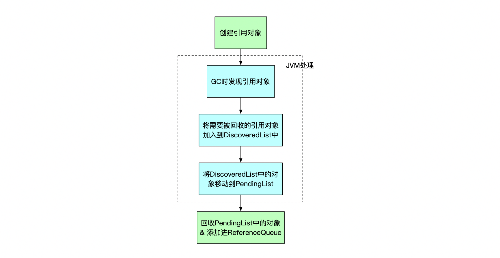
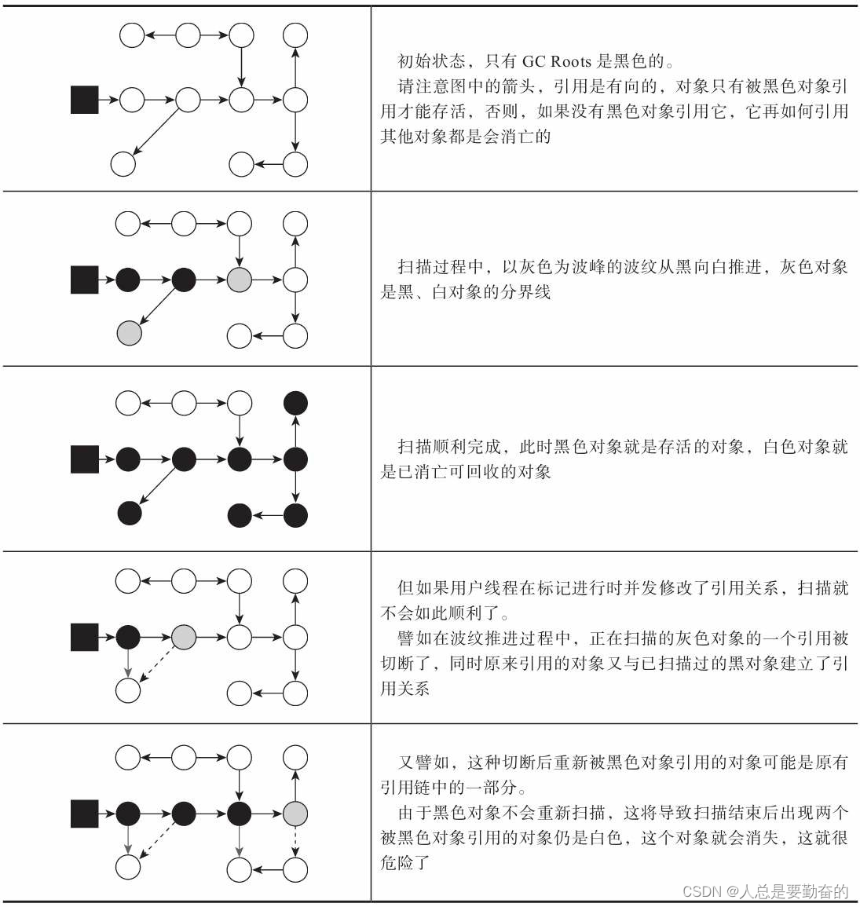

	这是Java虚拟机规范系列的第九篇文章，主要介绍的是虚拟机规范中的垃圾回收的hotspot实现。

# 一、垃圾回收
    对于垃圾回收，规范并没有像字节码执行那样详细地规定具体的算法和操作流程。
<!--more-->

## 1.1、规范的重点和灵活性
Java 虚拟机规范主要侧重于定义 Java 虚拟机的体系结构、字节码指令集、类文件格式等核心内容，目的是确保 Java 程序在不同的虚拟机实现之间的兼容性和可移植性。对于垃圾回收，规范并没有像字节码执行那样详细地规定具体的算法和操作流程。
> 这种灵活性是有意为之的，因为不同的应用场景和硬件平台对垃圾回收的需求差异很大。例如，在服务器端的大型应用中，可能更注重吞吐量，即单位时间内能够处理的任务量，希望垃圾回收的暂停时间（STW）尽可能短；而在一些对实时性要求极高的嵌入式系统中，可能需要垃圾回收器能够快速响应，尽量减少对系统运行的干扰。
## 1.2、提及的相关概念和原则
- **内存区域划分与回收范围：** 规范明确了 Java 虚拟机的运行时内存区域，如堆和方法区是垃圾回收主要涉及的区域。这为虚拟机实现者提供了一个基本的框架，知道在哪些内存区域需要重点考虑垃圾回收机制。例如，堆作为对象实例的主要存储区域，其内存管理和垃圾回收的重要性不言而喻。
- **可达性分析基础：** 虽然没有规定具体的垃圾回收算法，但规范提到了可达性分析的概念，以确定对象是否存活。这是一个重要的原则，通过定义 GC Roots 对象（包括虚拟机栈、方法区中的静态引用和常量引用等）来判断对象是否可被回收。这为垃圾回收器的设计提供了一个理论基础，无论采用何种具体的回收算法，都要以保证不回收仍在使用的对象为前提。
- **正确性和效率要求：** 规范还隐含地提到了对垃圾回收器的正确性和效率要求。垃圾回收过程不能错误地回收仍在使用的对象，这是保证程序正确性的基本条件。同时，要尽量减少对程序正常运行的干扰，这涉及到垃圾回收器的性能优化，如降低 STW 时间等，这是从整体运行效率的角度对垃圾回收进行约束。


# 二、hotspot实现垃圾回收

## 2.1、对象已死？
垃圾收集器在对堆进行回收前，第一件事就是要确定这些对象之中哪些还“存活”着，哪些已经“死去”。然后对“死去”对象进行回收。

有2种方法进行判断：
- 引用计数法
- 可达性分析

### 2.1.1、引用计数法
缺点：循环引用无法解决

### 2.1.2、可达性分析
这个算法的基本思路就是通过一系列称为“GC Roots”的根对象作为起始节点集，从这些节点开始，根据引用关系向下搜索。
- 不可达：某个对象到GC Roots间没有任何引用链路相连，或者用图论的话来说就是从GC Roots到这个对象不可达。

**为GC Roots的对象包括以下几种：**
- **栈帧中的本地变量表中引用的对象**，譬如各个线程被调用的方法堆栈中使用到的 参数、局部变量、临时变量等。
- **在方法区中类静态属性引用的对象**，譬如Java类的引用类型静态变量
- **方法区中常量引用的对象**，譬如字符串常量池（String Table）里的引用
- **本地方法栈中JNI（即通常所说的Native方法）引用的对象**
- **Java虚拟机内部的引用，如基本数据类型对应的Class对象**，一些常驻的异常对象（比如 NullPointExcepiton、OutOfMemoryError）等，还有系统类加载器。
- **所有**被同步锁（synchronized关键字）持有的对象**
- **反映Java虚拟机内部情况的JMXBean、JVMTI中注册的回调、本地代码缓存等


### 2.1.3、引用类型
JDK 1.2版本之后，Java对引用的概念进行了扩充，将引用分为强引用（strongly Re-ference）、软引用（soft reference）、弱引用（weak reference）、和虚引用（phantom reference），这4种引用强度依次逐渐减弱。

<details style="background-color: #dbdbdb;padding: 10px;">
<summary>▲ 点击查看“Java软引用、弱引用、虚引用”</summary>

#### 强引用
是指在程序代码之中普遍存在的引用赋值，即类似“Object obj=new Object()”这种引用关系。无论任何情况下，只要强引用关系还存在，垃圾收集器就永远不会回 收掉被引用的对象。

#### 软引用（SoftReference）
还有用，但非必须的对象：内存不够时才会回收
在系统将要发生内 存溢出异常前，会把这些对象列进回收范围之中进行第二次回收，如果这次回收还没有足够的内存， 才会抛出内存溢出异常。在JDK 1.2版之后提供了SoftReference类来实现软引用。


软引用可以和一个引用队列(ReferenceQueue)联合使用。如果软引用所引用对象被垃圾回收，JAVA虚拟机就会把这个软引用加入到与之关联的引用队列中
垃圾收集线程会在虚拟机抛出OutOfMemoryError之前回收软引用对象，而且虚拟机会尽可能优先回收长时间闲置不用的软引用对象。对那些刚构建的或刚使用过的 **"较新的"软对象会被虚拟机尽可能保留** ，这就是引入引用队列ReferenceQueue的原因
```java
ReferenceQueue queue = new  ReferenceQueue();  
SoftReference  ref=new  SoftReference(aMyObject, queue);
```
会将软应用对象存入queue
##### 使用场景：
高速缓存

#### 弱引用（WeakReference）

非必须对象
被弱引用关联的对象只能生存到下一次垃圾收集发生为止。当垃圾收集器开始工作，无论当前内存是否足够，都会回收掉只被弱引用关联的对象。在JDK 1.2版之后提供了WeakReference类来实现弱引用。
##### 使用场景：
ThreadLocal使用了弱引用

```java
//ThreadLocal类，内部有个静态内部类ThreadLocalMap
public class ThreadLocal<T> {
    //ThreadLocal静态内部类ThreadLocalMap，Entry[]数组，而Entry继承了虚引用
    static class ThreadLocalMap {
        private Entry[] table;
        //Entry继承了弱引用，该弱引用关联了ThreadLocal对象。
        static class Entry extends WeakReference<ThreadLocal<?>> {
            Object value;
            Entry(ThreadLocal<?> k, Object v) {
                super(k);
                value = v;
        }
        private Entry getEntry(ThreadLocal<?> key) {
            int i = key.threadLocalHashCode & (table.length - 1);
            Entry e = table[i];
            if (e != null && e.get() == key)
                return e;
            else
                return getEntryAfterMiss(key, i, e);
        }
    }
}
```


#### 虚引用（PhantomReference）
完全不会对其生存时间构成影响，也无法通过虚引用来取得一个对象实例
```java
public static void main(String[] args) {
    // 新建一个对象
    User obj = new User();
    // 存储被回收的对象
    ReferenceQueue<User> QUEUE = new ReferenceQueue<>();
    // phantomReference使用虚引用指向这个内存空间
    PhantomReference<User> phantomReference = new PhantomReference<>(obj, QUEUE);
    System.out.println(phantomReference.get()); // 获取不到 打印为null
}
```
作用
虚引用的作用就是在对象被GC回收时能得到通知
如何通知呢？就是在对象被回收后，把它的弱引用对象(PhantomReference)存入QUEUE对列中，这样我们查看队列就可以得知某个对象被GC回收了
```java
// 新建一个对象，开辟一个内存空间
User obj = new User();
// 存储被回收的对象的虚引用对象
ReferenceQueue<User> QUEUE = new ReferenceQueue<>();
// phantomReference使用虚引用指向这个内存空间
PhantomReference<User> phantomReference = new PhantomReference<>(obj, QUEUE);
// 释放这个内存空间，此时只剩phantomReference通过虚引用指向它
obj = null;
// 调用gc回收new User的内存空间
System.gc();
// 被清除的队列中取出被回收的对象
while (true) {
    Reference<? extends User> poll = QUEUE.poll();
    if (poll!=null) {
    System.out.println("--obj is recovery--");
    break;
    }
}
```
最终输出“--obj is recovery--”，即我们得到了对象被GC的消息。
其实，虚引用的存在意义就是监控对象是否存活。
##### 使用场景：
资源清理和监控
- **数据库连接管理：** 在数据库应用中，当数据库连接对象不再被使用时，虽然可以依靠数据库连接池的回收机制，但虚引用可以提供额外的保障。
例如，当一个数据库连接对象即将被垃圾回收，虚引用可以触发特定的清理操作，如关闭底层的网络连接、清除与该连接相关的临时数据或缓存等，确保资源被完全释放，防止资源泄漏。

#### Java软引用、弱引用、虚引用原理

##### 1 源码分析
无论是SoftReference、WeakReference，还是PhantomReference，事实上都继承了Reference类。此处先直接贴出Reference的回收过程，

在整个Reference的回收过程中，JVM层和Java层都参与了清理工作。

##### 2 Java层
由于最终的清理工作是由Java层完成的，因此我们先从Java层作为切入点。

##### 2.1 Reference数据结构
我们不妨先来看一看Reference的数据结构，
```java
public abstract class Reference<T> {
    private T referent;
    volatile ReferenceQueue<? super T> queue;
    Reference next;
    transient private Reference<T> discovered;
    private static Reference<Object> pending = null;
}
```
这是Reference的数据结构，其中:
1. referent为引用的对象
2. queue用来存储被清理的引用，此处queue是通过链式来存储的，而next则表示这条链的下一个节点
3. discovered和pending就比较有意思了，它在不同情况下有着不同的含义:
   4. 在平时，discovered表示DiscoveredList 
   5. 在对象回收阶段时，pending和discovered共同组成PendingList，此时discovered相当于next的作用

###### 2.2 Java层回收代码
接下来我们看一下Java层的回收代码，这段代码同样也在Reference.class里面
```java
static boolean tryHandlePending(boolean waitForNotify) {
  Reference<Object> r;
  Cleaner c;
  try {
    synchronized (lock) {
      if (pending != null) {
        r = pending;
        c = r instanceof Cleaner ? (Cleaner) r : null;
        pending = r.discovered;
        r.discovered = null;
      } else {
        if (waitForNotify) {
          lock.wait();
        }
        return waitForNotify;
      }
    }
  } catch (OutOfMemoryError x) {
    Thread.yield();
    return true;
  } catch (InterruptedException x) {
    return true;
  }

  if (c != null) {
    c.clean();
    return true;
  }

  ReferenceQueue<? super Object> q = r.queue;
  if (q != ReferenceQueue.NULL) q.enqueue(r);
  return true;
}

private static class ReferenceHandler extends Thread {
  public void run() {
    while (true) {
      tryHandlePending(true);
    }
  }
}
```
首先看看tryHandlePending方法，可以发现整段逻辑还是比较简单的，如果pending!=null，就清理pending，然后指针移到下一个元素。再配上外层的while(true)，就实现了清理整个PendingList的功能。


##### 3 jvm层
从上面我们已经可以知道了只要引用对象被加入进了PendingList，就会被清理掉，那这些引用对象又会在什么时候、什么情况下被加入到PendingList中呢？这同样也是软引用、弱引用和虚引用的核心区别。
JVM层的核心处理代码在referenceProcessor.cpp中，核心方法为process_discovered_references()，以CMS GC为例，这个方法会在FinalMarking(重新标记)阶段被调用，这段代码的核心逻辑如下:
```java
ReferenceProcessorStats ReferenceProcessor::process_discovered_references(BoolObjectClosure* is_alive, OopClosure* keep_alive, VoidClosure* complete_gc, AbstractRefProcTaskExecutor* task_executor, ReferenceProcessorPhaseTimes* phase_times) {

  double start_time = os::elapsedTime();
  disable_discovery();
  _soft_ref_timestamp_clock = java_lang_ref_SoftReference::clock();
  ReferenceProcessorStats stats(total_count(_discoveredSoftRefs),
                                total_count(_discoveredWeakRefs),
                                total_count(_discoveredFinalRefs),
                                total_count(_discoveredPhantomRefs));

  // 1. 初步处理软引用
  {
    RefProcTotalPhaseTimesTracker tt(RefPhase1, phase_times, this);
    process_soft_ref_reconsider(is_alive, keep_alive, complete_gc,
                                task_executor, phase_times);
  }

  update_soft_ref_master_clock();

  // 2. 处理软引用、弱引用、FinalReference
  {
    RefProcTotalPhaseTimesTracker tt(RefPhase2, phase_times, this);
    process_soft_weak_final_refs(is_alive, keep_alive, complete_gc, task_executor, phase_times);
  }

  // 3. FinalReference的另一端处理逻辑
  {
    RefProcTotalPhaseTimesTracker tt(RefPhase3, phase_times, this);
    process_final_keep_alive(keep_alive, complete_gc, task_executor, phase_times);
  }

  // 4. 处理虚引用
  {
    RefProcTotalPhaseTimesTracker tt(RefPhase4, phase_times, this);
    process_phantom_refs(is_alive, keep_alive, complete_gc, task_executor, phase_times);
  }

  if (task_executor != NULL) {
    task_executor->set_single_threaded_mode();
  }

  phase_times->set_total_time_ms((os::elapsedTime() - start_time) * 1000);

  return stats;
}
```
排除掉我们本次并不关心的FinalReference，我们可以大概看到整体处理是这样的:
1. 初步处理软引用
2. 处理软引用和弱引用
3. 处理虚引用

参考文章：[Java软引用、弱引用、虚引用原理](https://juejin.cn/post/6854573215767855117)
</details>


### 2.1.4、对象生存还是死亡？
即使在可达性分析算法中判定为不可达的对象，也不是“非死不可”的，这时候他们暂时还处于“缓刑”阶段，**要真正宣告一个对象死亡，至少有经历两次标记过程：**
1. 可达性分析，没有与GC roots相连接的引用链，会被**第一次标记。**
2. 随后进行一次筛选，筛选条件是此对象是否有必要执行finalize()方法。
   1. 假如对象没有覆盖finalize()方法，或者finalize()方法已经被虚拟机调用过，那么虚拟机将这两种情况都视为“没有必要执行”
   2. 如果这个对象被判定为确有必要执行finalize()方法，那么该对象将会被放置在一个名为F-Queue的队列之中，由finalizer线程去执行他们的finalize()方法。
   3. finalize()方法：是对象逃脱死亡命运的最后一次机会。可将待回收对象赋值给GC Roots可达的对象引用，从而达到对象再生的目的


### 2.1.5、回收方法区
《Java虚拟机规范》中提到过可以不要求虚拟机在方法区中实现垃圾收集，事实上也确实有未实现或未能完整实现方法区类型卸载的收集器存在（如ZGC，不支持类卸载）。

判定一个类型是否属于“不再使用的类”的条件比较苛刻。需要同时满足下面三个条件：
- **该类的所有实例都已经被回收。** 也就是Java堆中不存在该类及其任何派生子类的实例。
- **加载该类的类加载器已经被回收。** 通常很难达成。
- **该类对应的java.lang.class 对象没有在任何地方被引用，无法在任何地方通过反射访问该类的方法。**

方法区垃圾收集的“性价比”通常是比较低的。

## 2.2、垃圾收集算法

### 2.2.1、分代收集理论
是一套符合大多数程序运行实际情况的经验法则，它建立在两个分代假说至上：
- **弱分代假说：** 绝大数对象都是朝生夕灭的。
- **强分代假说：** 熬过越多次垃圾收集过程的对象就越难以消亡。

两个分代假说共同奠定了多款常用的垃圾收集器的一致的设计原则：收集器应该将Java堆划分出不同的区域，然后将回收对象依据其年龄分配到不同的区域之中存储。

#### 部分收集（Partial GC）

- 新生代收集（Minor GC/Young GC）
指目标只是新生代的垃圾收集
- 老年代收集（Major GC/Old GC）
指目标只是老年代的垃圾收集
- 混合收集（Mixed GC）
指目标是收集整个新生代以及部分老年代的垃圾收集。目前只有G1收 集器会有这种行为。
- 整堆收集（Full GC）
收集整个Java堆和方法区的垃圾收集


### 2.2.2、标记-清除算法
2个阶段，标记阶段+清除阶段
- 缺点
  - **执行效率不稳定：** 因为可能有很多对象需要进行回收，此时耗时高
  - **内存空间碎片化：** 若对象分配空间失败，可能会触发一次新的GC

### 2.2.3、标记-复制算法
为了解决“标记-清除”算法面对大量可回收对象时执行效率低的问题。

将内存按容量划分成大小相等的两块：新生代：Eden:Survivor-from:Survivor-to = 8:1:1
> 每次分配内存只使用Eden和其中一块Survivor。发生垃圾搜集时，将Eden和Survivor中仍 然存活的对象一次性复制到另外一块Survivor空间上，然后直接清理掉Eden和已用过的那块Survivor空间
当Survivor空间不足以容纳一次Minor GC之后存活的对象时，就需要依赖其他内存区域（实 际上大多就是老年代）进行分配担保（Handle Promotion）。

- 缺点
  - 对象存活率较高时就要进行较多的复制操作，效率将会降低
  - 更关键的是，如果 不想浪费50%的空间，就需要有额外的空间进行分配担保，以应对被使用的内存中所有对象都100%存 活的极端情况，所以在老年代一般不能直接选用这种算法。

#### 2.2.3.1、分配担保：
如果另外一块Survivor空间没有足够空间存放上一次新生代收集下来的存活对象，这些对象便将通过分配担保机制直接进入老年代，这对虚拟机来说就是安全的。

### 2.2.4、标记-整理算法
针对老年代对象的存亡特征，提出了“标记-整理”算法：
- 标记过程：和“标记-清除”算法一样
- 整理过程：让所有存活的对象都向内存空间一端移动，然后直接清理掉边界以外的内存。
是否移动对象都存在弊端，移动则内存回收时会更复杂，不移动则内存分配时会 更复杂
对象移动操作必须全程暂停用户应用 程序才能进行
吞吐量
是赋值器（Mutator，可以理解为 使用垃圾收集的用户程序，本书为便于理解，多数地方用“用户程序”或“用户线程”代替）与收集器的 效率总和

## 2.3、HotSpot实现细节
### 根节点枚举
即找出所有的根节点，这一步骤时都是必须暂停用户线程的 “Stop The World“

为了减少停顿时间，不需要一个不漏的检查完所有执行上下文和全局的引用位置，虚拟机应当是有办法直接得到哪些地方存放着对象引用的。在Hotspot的解决方案里，使用一组称为OopMap的数据结构来达到这个目的。
OopMap的数据结构

### 安全点
只有到了安全点，才可以进行垃圾回收
“长时间执行”的最明显特征就是指令序列的复用，例如方法调用、循环跳转、异常跳转 等都属于指令序列复用，所以只有具有这些功能的指令才会产生安全点
另外一个需要考虑的问题是，如何在垃圾收集发生时让所有线程（这里其实不包括 执行JNI调用的线程）都跑到最近的安全点，然后停顿下来
- 抢先式中断
- 主动式中断：主动式中断的思想是当垃圾收集需要中断线程的时候，不直接对线程操作，仅仅简单地设置一 个标志位，各个线程执行过程时会不停地主动去轮询这个标志，一旦发现中断标志为真时就自己在最 近的安全点上主动中断挂起。轮询标志的地方和安全点是重合的，另外还要加上所有创建对象和其他 需要在Java堆上分配内存的地方，这是为了检查是否即将要发生垃圾收集，避免没有足够内存分配新 对象。

### 记忆集与卡表
分代收集理论，**为了解决对象跨代引用所带来的问题**，垃圾收集器在新生代中建立了名为记忆集（Remembered set）的数据结构，**用以避免把整个老年代加进GC Roots扫描范围。**

**记忆集：** 是一种用于记录从非收集区域指向收集区域的指针集合的抽象数据结构。（非收集区域 ->  收集区域）
**卡表：** 是记忆集的一种具体实现，它定义了记忆集的记录精度、与堆内存的映射关系等。卡表最简单的形式可以只是一个**字节数组**。

**卡表何时变脏：** 有其他分代区域中对象引用了本区域对象时，其对应的卡表元素就应该变脏，变脏时间点原则上应该发生在引用类型字段赋值的那一刻。
**卡表如何变脏：** 通过写屏障技术维护卡表状态。


### 并发的可达性分析
想要解决或者降低用户线程的停顿，就要先搞清楚为什么必须在一个能保障一致性的快照上才能进行对象图的遍历？为了解释清楚这个问题，引入三色标记（Tri-color Marking）作为工具来辅助推导.
- **白色：** 表示对象**尚未**被垃圾收集器访问过。在可达性分析之前，所有对象都是白色的，若在分析结束的时候，仍然是白色的对象，表示不可达
- **黑色：** 表示对象**已经**被垃圾收集器访问过，且这个对象的所有引用都已经扫描过。黑色的对象代表已经扫描过，是安全存活的。
- **灰色：** 表示对象**已经**被垃圾收集器访问过，但这个对象上至少存在一个引用还没有被扫描过。

从黑向白推进的过程，如果用户线程此时是冻结的，只有收集器线程在工作，那不会有任何问题。但如果用户线程与收集器是并发工作的呢？下图演示了对象错误标记为已消亡问题：

Wilson于1994年在理论上证明了，当前仅当以下两个条件同时满足时，会产生对象消失问题，即原本应该是黑色的对象被误标为白色：
- 赋值器插入了一条或多条从黑色对象到白色对象的新引用。
- 赋值器删除了全部从灰色对象到该白色对象的直接或间接引用。

因此，需要解决并发扫描时对象消失问题，只需要破坏这两个条件的任意一个即可。由此分别产生了两种解决方案：
- 增量更新：要破坏的是第一个条件，当黑色对象插入新的指向白色对象的引用关系时，就将这个新插入的引用记录下来，等并发扫描结束之后，再将这些记录过的引用关系中的黑色对象为根，重新扫描一次。
  - 简化理解为，黑色对象一旦新插入了指向白色对象的引用之后，它就变回灰色对象。
- 原始快照：要破坏的是第二个条件，当灰色对象要删除指向白色对象的引用关系时，就将这个要删除的引用记录下来，在并发扫描结束之后，再将这些记录过的引用关系中的灰色对象为根，重新扫描一次。
  - 简单理解为，无论引用关系删除与否，都会按照刚刚开始扫描那一刻的对象图快照来进行搜索。

增量更新和原始快照这两种解决方案都有实际应用，譬如，CMS是基于增量更新来做并发标记的；G1则是用原始快照来实现。


# 三、垃圾收集器
《Java虚拟机规范》中对垃圾收集器应该如何实现并没有做出任何规定。因此不同的厂商、不同版本的虚拟机所包含的垃圾收集器都可能会有很大差别。

下一篇完整介绍。