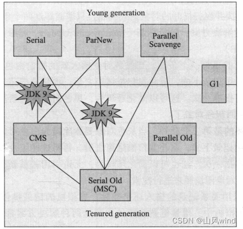
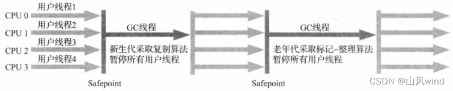
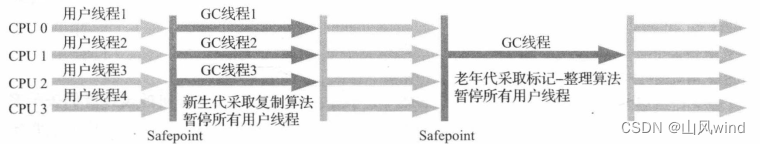
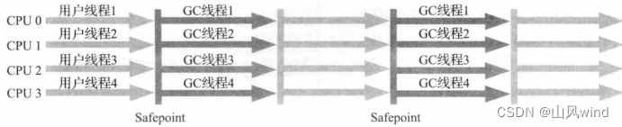
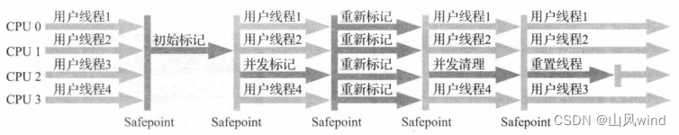
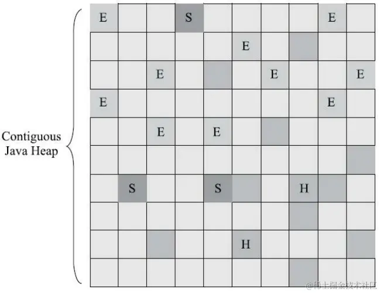
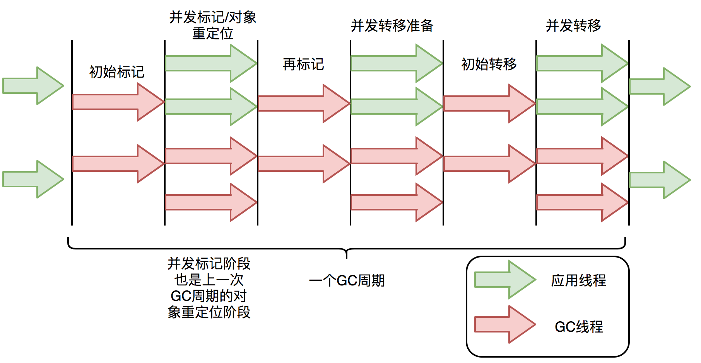

	这是Java虚拟机规范系列的第十篇文章，主要介绍的是经典的垃圾回收器。

# 一、垃圾回收器
    《Java虚拟机规范》中对垃圾收集器应该如何实现并没有做出任何规定。因此不同的厂商、不同版本的虚拟机所包含的垃圾收集器都可能会有很大差别。
<!--more-->


图中展示了七种作用于不同分代的收集器，如果两个收集器之间存在连线，就说明它们可以搭配使用。图中收集器所处的区域，则表示它是属于新生代收集器 or 老年代收集器。


## 1.1、serial收集器 【新生代】


    单线程收集器：使用一个收集线程去完成垃圾收集工作，进行垃圾收集时，必须暂停其他所有工作线程，直到它收集结束。
    简单高效，内存消耗低
    采用复制算法

## 1.2、ParNew收集器 【新生代】
ParNew 收集器实质上是 Serial 收集器的多线程并行版本。ParNew 收集器的工作过程如图所示：


    serial的多线程并行版本
    只有它能和CMS配合使用
    采用复制算法

## 1.3、Parallel Scavenge 【新生代】
关注点与其他收集器不同，它的目标是达到一个可控制的吞吐量（Throughput）。

    吞吐量=用户代码运行时间/(用户代码运行时间+运行垃圾收集时间)
    采用复制算法

## 1.4、Serial Old收集器 【老年代】
老年代收集器，同样是一个单线程收集器。


    采用整理算法

## 1.5、Parallel Old收集器【老年代】
parallel old是parallel scavenge收集器的老年代版本，支持多线程并发收集。


    多线程并发收集
    采用整理算法


## 1.6、CMS【老年代】
Concurrent Mark Sweep收集器，是一种以获取最短回收停顿时间为目标的收集器。标记-清除算法


### 1.6.1、整个收集过程分为四个步骤：
1. 初始标记（CMSinitial mark）
   “Stop The World”
   仅仅只是标记一下GC Roots能直接关联到的对象，速度很快
   在初始阶段的时候，所有的对象都是存放在白色容器中。
   初始标记阶段，GCRoot标记直接关联对象置为灰色
2. 并发标记（CMS concurrent mark）
   并发标记阶段就是从GC Roots的直接关联对象开始遍历整个对象图的过程，这个过程耗时较长但是不需要停顿用户线程，可以与垃圾收集线程一起并发运行
   并发标记阶段，扫描整个引用链，有子节点的话，则当前节点变为黑色，子节点变为灰色
   下次GCRoot起点从灰色节点开始计算
3. 重新标记（CMS remark）
   “Stop The World”
   为了修正并发标记期间，因用户程序继续运作而导致标记产生变动的那一部分对象的 标记记录
4. 并发清除（CMS concurrent sweep）
   清理删除掉标记阶段判断的已经死亡的 对象，由于不需要移动存活对象，所以这个阶段也是可以与用户线程同时并发的


			
### 1.6.2、存在的问题：
#### 碎片化问题
解决方案
- -XX：+UseCMS-CompactAtFullCollection开关参数（默认是开启的，此参数从 JDK 9开始废弃），用于在CMS收集器不得不进行Full GC时开启内存碎片的合并整理过程，由于这个 内存整理必须移动存活对象，（在Shenandoah和ZGC出现前）是无法并发的
- 另外一个参数-XX：CMSFullGCsBefore- Compaction（此参数从JDK 9开始废弃），这个参数的作用是要求CMS收集器在执行过若干次（数量 由参数值决定）不整理空间的Full GC之后，下一次进入Full GC前会先进行碎片整理（默认值为0，表 示每次进入Full GC时都进行碎片整理）。

#### 漏标
假设初始情况
    A黑、B灰、C白
    并发标记过程中，如果线程使B -> C 的指向删除，然后将A -> C，此时会出现漏标问题
漏标解决方案
    CMS
        写屏障+增量更新方式
            在重新标记阶段（所有用户线程暂停），有将B对象变为灰色对象将整个引用链全部扫描。
            缺点：遍历B整个链的效率非常低，有可能会导致用户线程等待的时间非常长。
    G1
        原始快照方式
## 1.7、G1
Garbage First（简称G1）收集器是垃圾收集器技术发展历史上的里程碑式的成果，它开创了收集器而向局部收集的设计思路和基于Region的内存布局形式。


### 结构
堆划分成大小相等的Region
1. region内存大小在1M ~ 32M范围内，2的幂次方，默认个数2048
2. 每一个region都可以扮演新生代的Eden、survivor空间，或者老年代，根据不同类型，再根据不同策略进行回收
3. Region中还有一类特殊的Humongous区域，专门用来存储大对象。
  - G1认为只要大小超过了一个Region容量一半的对象即可判定为大对象。每个Region的大小可以通过参数-XX：G1HeapRegionSize设定，取值范围为1MB～32MB，且应为2的N次幂。而对于那些超过了整个Region容量的超级大对象，将会被存放在N个连续的Humongous Region之中，G1的大多数行为都把Humongous Region作为老年代的一部分来进行看待，如图所示。

### 可预测的停顿时间
因为将region作为垃圾回收的最小单位，每次回收都是region的整数倍，这样就可以避免对堆全部空间的垃圾回收
更具体思路：跟踪各region中的垃圾堆积的价值大小，维护一个优先级列表，优秀收集价值更高的region

用户通过-XX：MaxGCPauseMillis参数指定的停顿时间只意味着垃圾收集发生之前的期望值，但G1收集器要怎么做才能满足用户的期望呢？G1收集器的停顿预测模型是以衰减均值（Decaying Average）为理论基础来实现的，在垃圾收集过程中，Gl收集器会记录每个Region的回收耗时、每个Reaion记忆集里的脏卡数量等各个可测量的步骤花费的成本，并分析得出平均值、标准偏差、置信度等统计信息。这里强调的“衰减平均值”是指它会比普通的平均值更容易受到新数据的影响，平均值代表整体平均状态，但衰减平均值更准确地代表“最近的”平均状态。换句话说，Region的统计状态越新越能决定其回收的价值。然后通过这些信息预测现在开始回收的话，由哪些Region组成回收集才可以在不超过期望停顿时间的约束下获得最高的收益。

### 跨区引用对象
将Java堆分成多个独立Region后，Region里面存在的跨Region引用对象如何解决？

使用记忆集来避免全局扫描： RememberedSets
每个region都有对应的记忆集：G1的记忆集，可以理解成一个哈希表，key是region的起始地址，value是卡表的索引号集合
每次refrence类型的数据写时，都会生成一个写屏障
			然后检查将要写入的引用 指向的对象是否和该Reference类型数据在不同的 Region（其他收集器：检查老年代对象是否引用了新生代对象）
			如果不同，通过 卡表（Card Table）把相关引用信息记录到引用指向对象的所在Region对应的记忆集(Remembered Set) 中
				
**卡表的本质是用来解决跨代引用的问题**
			
当进行垃圾收集时，在GC Roots枚举范围加上记忆集；就可以保证不进行全局扫描了。

### 并发标记阶段如何保证收集线程与用户线程互不干扰地运行？
这里首先要解决的是用户线程改变对象引用关系时，必须保证其不能打破原本的对象图结构，导致标记结果出现错误，CMS收集器采用增量更新算法实现，**而G1 收集器则是通过原始快照（SATB）算法来实现的**。此外，垃圾收集对用户线程的影响还体现在回收过程中新创建对象的内存分配上，程序要继续运行就肯定会持续有新对象被创建，G1为每一个Region设计了两个名为TAMS（Top at Mark Start）的指针，把Region中的一部分空间划分出来用于并发回收过程中的新对象分配，并发回收时新分配的对象地址都必须要在这两个指针位置以上。G1收集器默认在这个地址以上的对象是被隐式标记过的，即默认它们是存活的，不纳入回收范围。与CMS中的"Concurrent Mode Failure"失败会导致Full GC类似，如果内存回收的速度赶不上内存分配的速度，Gl收集器也要被迫冻结用户线程执行，导致Full GC而产生长时间“Stop The World”。

### 工作流程
#### 初始标记  <font color=red>(停顿线程)</font>
仅仅是标记一下GC Roots能直接关联到的对象，并且修改TAMS 指针的值，让下一阶段用户线程并发运行时，能正确地在可用的Region中分配新对象。这个阶段需要 停顿线程，但耗时很短，而且是借用进行Minor GC的时候同步完成的，所以G1收集器在这个阶段实际 并没有额外的停顿。


 
#### 并发标记 
从GC Root开始进行可达性分析，递归扫描整个堆里的对象图，找出要回收的对象，这个阶段耗时较长，但可以并发执行。当对象图扫描完成后，还要重新处理SATB记录下的在并发期间有引用变化的对象
#### 最终标记 <font color=red>(停顿线程)</font>
对用户进程进行另一个短暂的暂停，用于处理并发阶段产生的SATB记录

#### 筛选回收 <font color=red>(涉及对象移动，停顿线程，多条线程进行并行进行)</font>
负责更新Region的统计数据，对各个region的回收价值和成本进行重新计算，然后把决定回收的那一部分region的存活对象复制到新的region，再清理旧的region的整个空间


## 1.8、shenandoah
也是使用基于Region的堆内存布局，同样有着用于存放大对象的humongous region，默认的回收策略也同样是优先处理回收价值最大的Region。

但在管理堆内存方面，它与G1至少有三个明显的不同之处：
- 最重要的当然是支持并发的整理算法，G1 的回收阶段是可以多线程并行的，但不能与用户线程并发，但是shenandoah可以。
- 默认不使用分代收集，换言之，不会有专门的新生代Region或者老年代Region存在，没有实现分代，并不是说分代对shenandoah没有价值，这更多是出于性价比的权衡。
- shenandoah摒弃了在G1中耗费大量内存和计算资源去维护的记忆集，改用名为“连接矩阵”的全局数据结构来记录跨region的引用关系，降低了处理跨代指针时的记忆集维护消耗，也降低了伪共享内存问题的发生概率。
  - 连接矩阵：可以连接是一张二维表格。如果Region N有对象指向Region M，就在表格的N行M列打上标记

### 工作过程
可以划分成九个阶段。
- 初始标记
- 并发标记
- 最终标记
- 并发清理
- 并发回收：该阶段是与其他收集器的核心差异。在这个阶段，把回收集里面的存活对象先复制一份到其他未被使用的Region中。通过读屏障和被称为"brooks pointers“来保障移动对象的同时，支持用户线程对对象的读写访问。
- 初始引用更新：并发回收阶段复制对象结束后，还需要把堆中所有指向旧对象的引用修正到复制后的新地址，这个操作称为引用更新。
- 并发引用更新：
- 最终引用更新：
- 并发清理

## 1.8、ZGC
一款在JDK11中新加入的具有实验性质的低延迟垃圾收集器。

ZGC和shenandoah的目标是高度相似的，都希望在尽可能对吞吐量影响不大的前提下，实现在任意堆内存大小下都可以把垃圾收集的停顿时间限制在十毫秒以内的低延迟。

### 1.8.1、内存布局
也采用基于Region的堆内存布局，ZGC的Region具有动态性：动态创建和销毁，以及动态的区域容量大小。

X64硬件下，3种容量类型
- **小型Region：** 容量固定为2M，存放小于256KB的对象
- **中型Region：** 容量固定为32M，存放大于256KB但小于4M的对象
- **大型Region：** 容量不固定，但是必须是2的整数倍，用于存放4M或更大的对象
- 	每个大型region只存放一个大对象
		
### 1.8.2、关键技术
ZGC通过染色指针和读屏障技术，解决了转移过程中准确访问对象的问题，实现了并发转移。大致原理描述如下：并发转移中“并发”意味着GC线程在转移对象的过程中，应用线程也在不停地访问对象。假设对象发生转移，但对象地址未及时更新，那么应用线程可能访问到旧地址，从而造成错误。而在ZGC中，应用线程访问对象将触发“读屏障”，如果发现对象被移动了，那么“读屏障”会把读出来的指针更新到对象的新地址上，这样应用线程始终访问的都是对象的新地址。那么，JVM是如何判断对象被移动过呢？就是利用对象引用的地址，即着色指针。下面介绍着色指针和读屏障技术细节。

#### 1.8.2.1、如何标志一个对象的？
Hotspot虚拟机的几种收集器有不同的标记实现方案：常见的方案有： 位图（Bitmap）或对象头（Object Header）
- **对象头方式（以 Java 为例）：** 在 Java 虚拟机（JVM）中，对象头是对象在内存中的一部分，用于存储对象的一些元数据，如哈希码、分代年龄等信息。可以利用对象头的部分位来记录对象的标记颜色。有的把标记直接记录在对象头上（如serial收集器）
- **位图方式：** 可以使用位图来记录对象的标记颜色。位图是一种简单的数据结构，由一系列的位（bit）组成。对于堆中的每个对象，可以使用位图中的一个或多个位来表示其颜色。例如，使用 2 位来表示三种颜色，00 表示白色、01 表示灰色、10 表示黑色。 有的把标记记录在与对象相互独立的数据结构上（如G1、Shenandoah使用了一种相当于堆内存的1/64大小的，称为bitmap的结构来记录标记信息）
- **而ZGC的染色指针**是最直接的、最纯粹的，它直接把标记信息记录在引用对象的指针上，这时，与其说可达性分析是遍历对象图来标记对象，还不如说是遍历”引用图“来标记”引用“了。

三色标记算法在现代垃圾回收器（如 G1 垃圾回收器）中得到了广泛应用，通过合理的标记记录方式，能够高效地进行垃圾回收，减少内存泄漏和提高内存利用率。

#### 1.8.2.2、染色指针技术（colored pointer）
<font color=#e98787>**染色指针是一种直接将少量额外信息存储在指针上的技术**</font>
可是为什么指针本身也可以存储额外信息呢？查看下图：


#### 1.8.2.3、读屏障
```dtd
读屏障是JVM向应用代码插入一小段代码的技术。当应用线程从堆中读取对象引用时，就会执行这段代码。需要注意的是，仅“从堆中读取对象引用”才会触发这段代码。
```
读屏障示例：
```
Object o = obj.FieldA   // 从堆中读取引用，需要加入屏障
<Load barrier>
Object p = o  // 无需加入屏障，因为不是从堆中读取引用
o.dosomething() // 无需加入屏障，因为不是从堆中读取引用
int i =  obj.FieldB  //无需加入屏障，因为不是对象引用
```
ZGC中读屏障的代码作用：在对象标记和转移过程中，用于确定对象的引用地址是否满足条件，并作出相应动作。

### 1.8.3、工作流程

与CMS中的ParNew和G1类似，ZGC也采用标记-复制算法，不过ZGC对该算法做了重大改进：ZGC在标记、转移和重定位阶段几乎都是并发的，这是ZGC实现停顿时间小于10ms目标的最关键原因。

ZGC只有三个STW阶段：**初始标记，再标记，初始转移**。其中，初始标记和初始转移分别都只需要扫描所有GC Roots，其处理时间和GC Roots的数量成正比，一般情况耗时非常短；再标记阶段STW时间很短，最多1ms，超过1ms则再次进入并发标记阶段。即，ZGC几乎所有暂停都只依赖于GC Roots集合大小，停顿时间不会随着堆的大小或者活跃对象的大小而增加。与ZGC对比，G1的转移阶段完全STW的，且停顿时间随存活对象的大小增加而增加。


### 1.8.4、总结和区别
- 和Shenandoah的区别：
Shenandoah使用转发指针和读屏障来实现并发整理，ZGC虽然同样用到了读屏障，但用的却是一条与Shenandoah完全不同。

- 和G1的区别：
即，ZGC几乎所有暂停都只依赖于GC Roots集合大小，停顿时间不会随着堆的大小或者活跃对象的大小而增加。与ZGC对比，G1的转移阶段完全STW的，且停顿时间随存活对象的大小增加而增加。