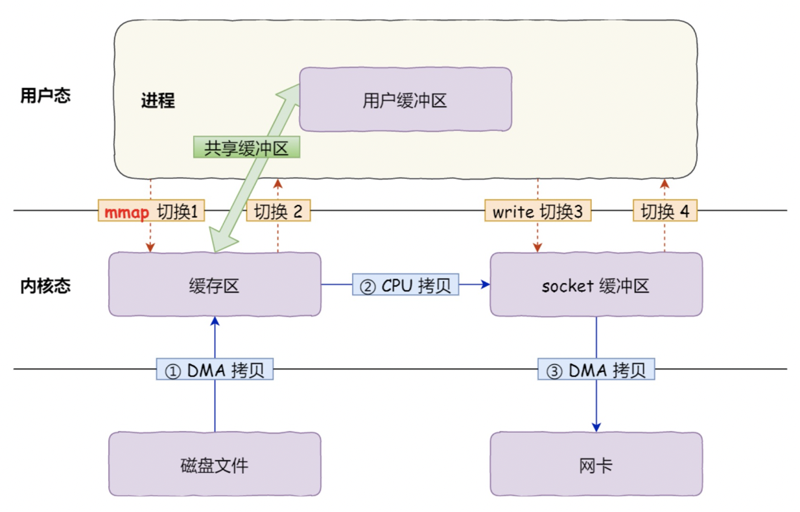

# 一、什么是零拷贝？
减少数据的拷贝。


# 二、前提知识
## 1、Linux进程的虚拟空间
Linux进程的虚拟空间，分成内核空间和用户空间，数据进入进程的过程，是从磁盘拷贝至内核，然后从内核空间拷贝至用户空间。

read、write两个系统调用的过程，从磁盘将数据读入内核空间，然后从内核空间拷贝至用户空间，过程复杂。
* 4次数据拷贝，速率低下。

<!--more-->  

## 2、DMA拷贝
Direct Memory Access，直接内存操作。   
传统数据的传输：使用CPU，CPU负责数据的拷贝传输。

优化数据传输：DMA，专门进行数据传输的硬件

优势：解放CPU


# 三、零拷贝的实现
减少系统调用，减少态的切换。
* mmap
* sendfile
* sendfile + DMA

## 1、mmap
用户空间会和内核空间行程一个映射，这样就不需要将数据从内核态拷贝至用户态，从而减少一次拷贝。    
**映射原理：**
* 就是在用户进程中创建变量vma和物理内存进行映射，而不需要再将数据从page cache再拷贝至用户进程空间

* 4次上下文切换，3次拷贝。
## 2、sendfile
```
include <sys/socket.h>
ssize_t sendfile(int out_fd, int in_fd, off_t *offset, size_t count);
```

它的前两个参数分别是目的端和源端的文件描述符，后面两个参数是源端的偏移量和复制数据的长度，返回值是实际复制数据的长度。
它可以替代前面的**read()**和**write()**这两个系统调用，这样就可以减少一次系统调用

* 2次上下文切换，3次拷贝

## 3、sendfile + DMA
sendfile减少内核空间的CPU拷贝


# 四、Java中的零拷贝
* java NIO的零拷贝实现是基于mmap+write方式
* FileChannel的map方法产生的MappedByteBuffer FileChannel提供了map()方法，
该方法可以在一个打开的文件和MappedByteBuffer之间建立一个虚拟内存映射，MappedByteBuffer继承于ByteBuffer；
该缓冲器的内存是一个文件的内存映射区域。map方法底层是通过mmap实现的，因此将文件内存从磁盘读取到内核缓冲区后，用户空间和内核空间共享该缓冲区。用法如下


## 4.1、从JMM看堆外内存

直接内存：就是基于mmap+write方式实现的零拷贝
* 永久代主要存放以下数据：
    * JVM internal representation of classes and their metadata
    * Class statics
    * Interned strings
    * 运行时常量池
        
* 从 JDK7 开始，JDK 开发者们就有消灭永久代的打算了。有部分数据移到永久代之外了：
    * Symbols => native memory
    * Interned strings => Java Heap
    * Class statics => Java Heap
    * 运行时常量池，还是存放在方法区内
* 到了 JDK8，这个工作终于完成了，彻底废弃了 PermGen，Metaspace 取而代之。
    * 运行时常量池，也移到了metaspace内

### 1、内存分类 
* 堆内内存： on-heap memory  
    * java虚拟机运行时区域堆内存（HeapByteBuffer）。 
    
* 堆外内存：off-heap memory
    * 除java堆之外的所有其他运行时数据区域，包括程序计数器，java虚拟机栈，本地 方法栈，方法区（元数据区），
    运行时常量池，直接内存（DirectByteBuffer）。

### 2、如何申请直接内存 
1. Unsafe.allocateMemory(long var1) 
2. ByteBuffer.allocateDirect(int capacity) 
3. native方法

### 3、源码解析

* DirectByteBuffer：直接内存对象，还归属JVM管理，在堆中。（冰山对象）
* 构建Cleaner对象用于跟踪DirectByteBuffer对象的垃圾回收，以实现当DirectByteBuffer被垃圾回收时，堆外内存也会被释放

### 4、申请&回收
* 申请
    * 通过C的malloc来进行分配
        * 如果内存不够？Bits.reserveMemory(size, cap) 
        * 首先尝试tryReserveMemory，这个方法会释放已经被JVM回收的DirectByteBuffer对象所引用的堆外内存。
        * 如果内存依旧不够，则会尝试System.gc()，产生full GC
        * 如果上面的操作都失败并且重试9次，则抛出OOM异常

* 回收
    * Cleaner是PhantomReference的子类，并通过自身的next和prev字段维护的一个双向链表。
    * PhantomReference的作用在于跟踪垃圾回收过程，并不会对对象的垃圾回收过程造成任何的影响。
    * 所以cleaner = Cleaner.create(this, new Deallocator(base, size, cap)); 用于对当前构造的DirectByteBuffer对象的垃圾回收过程进行跟踪。
    * 当DirectByteBuffer对象从pending状态 ——> enqueue状态时，会触发Cleaner的clean()，而Cleaner的clean()的方法会实现通过unsafe对堆外内存的释放。


[参考](https://www.jianshu.com/p/007052ee3773)