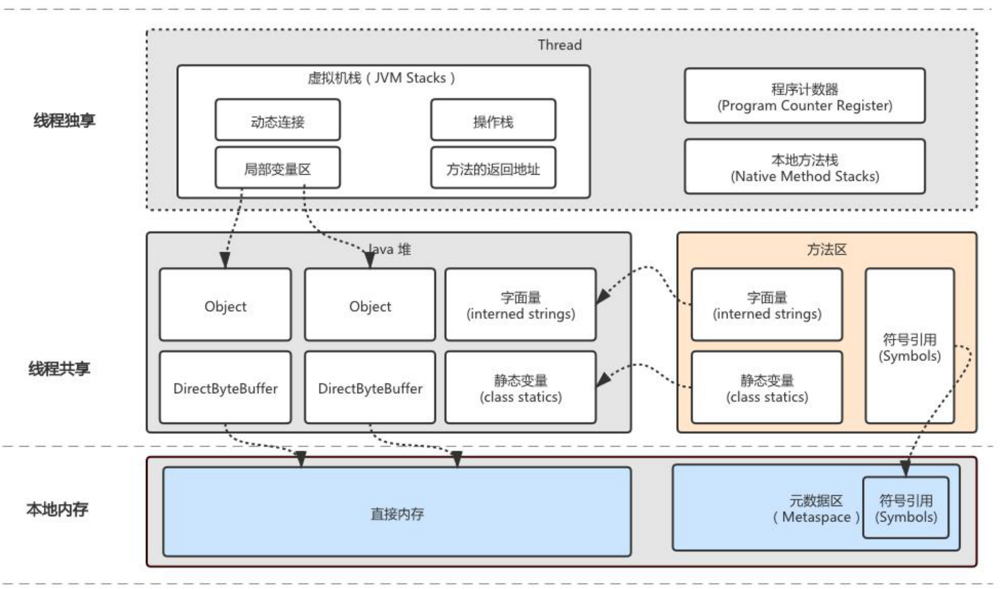

# 一、什么是虚拟机规范
定义Java虚拟机实现的一些基本要求。

# 二、虚拟机结构
从Class文件结构、数据类型、运行时数据区等方面进行了定义，具体实现未定义。

<!--more-->  

# 三、运行时数据区
> PC寄存器、Java虚拟机栈、Java本地方法栈、Java堆、方法区、运行时常量池

## 1、PC寄存器
线程独有，每个线程都有自己的PC寄存器，如果方法不是native的，则保存的是当前所执行字节码的地址。
## 2、Java虚拟机栈
线程独有，每个线程对应一个虚拟机栈，栈和线程同时创建，用于存储栈桢。    
用于存储局部变量和过程结果的地方。   
* 可能发生的异常：
    * 如果线程请求的栈容量超过栈允许的最大容量，则抛出StackOverflowError异常
    * 如果栈允许动态扩展，而此时无法获取更多内存；或者是新的线程创建无法获取内存，此时都会抛出OutOfMemoryError异常
## 3、Java本地方法栈
线程独有，线程创建时会创建一个对应的本地方法栈。（虚拟机可不实现本地方法栈）   
来native方法的执行（支持除Java语音编写）。
* 可能发生的异常：
    * 如果线程请求的栈容量超过栈允许的最大容量，则抛出StackOverflowError异常
    * 如果栈允许动态扩展，而此时无法获取更多内存；或者是新的线程创建无法获取内存，此时都会抛出OutOfMemoryError异常
## 4、Java堆
线程共享，用于存储类实例和数组对象。      
虚拟机规范并未指定具体实现方式及内存管理，方案可自己定义（如垃圾收集，内存管理）   
* 可能发生的异常：
    * 如果实际需要的容量超过堆的最大容量，则抛出OutOfMemoryError异常
## 5、方法区
线程共享，用于存储类的结构信息，例如运行时常量池、字段和方法数据，构造函数和普通方法的字节码数据。     
方法区在虚拟机启动的时候被创建。虚拟机规范中定义为可垃圾回收或者是不回收。   
* 可能发生的异常：
    * 如果实际需要的容量超过堆的最大容量，则抛出OutOfMemoryError异常
### 5.1、运行时常量池
线程共享，每一个运行时常量池都分配在方法区中。类或接口加载到内存中，就会创建运行时常量池。   
是类或接口的常量池的运行时表现形式。   
它包括了若干种不同的常量：从编译期可知的数值字面量到必须运行 期解析后才能获得的方法或字段引用。
* 可能发生的异常：
    * 如果实际需要的容量超过堆的最大容量，则抛出OutOfMemoryError异常

class文件中除了有类的版本、字段、方法、接口等描述信息外，还有一项信息是常量池
用于存放编译期生成的各种字面量和符号引用
    
    字面量：文本字符串、声明为final的常量值
    符号引用：
        1. 类和接口的全限定名
        2. 字段的名称和描述符
        3. 方法的名称和描述符

JDK7将字符串常量池、字符引用、静态变量移动到了堆中，运行时常量池还在方法区内。     
jdk8方法区的实现使用metaspace元空间代替，运行时常量池在元空间内，元空间被放在了直接内存内。     

# 四、栈桢
每一个方法执行都会创建一个栈桢，方法执行完就释放。栈桢存储在虚拟机栈上。
* 结构：
    * 局部变量表
    * 操作数栈
    * 指向类运行时常量池的引用
* 作用：
    * 存储数据和部分过程结果的数据结构，同时也用来处理动态链接、方法返回值和异常分派

## 4.1、局部变量表
栈桢中的一组变量列表，长度编译期间确定，并存储在类或接口的二进制表之中。
long和double需要两个变量来存储，其他的都只需要一个变量。
变量表中的第0个位置存储的是调用该方法所对应实例对象的引用（this关键字，其他的参数从1位置开始）
## 4.2、操作数栈
栈桢中的一个后进先出的栈，长度编译期间确定，并存储在类或接口的二进制表之中。
从局部变量表中或实例对象中获取数据，通过指令入栈出栈，计算并出栈入栈。在方法调用时，用来存储入参及返回结果。
## 4.3、引用
指向类运行时常量池的引用来实现动态链接。
Class文件里边，用符号引用来描述方法调用或访问其他成员变量。
动态链接就是为了将符号引用转换成直接引用。

