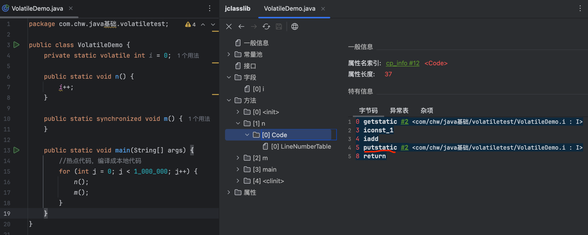
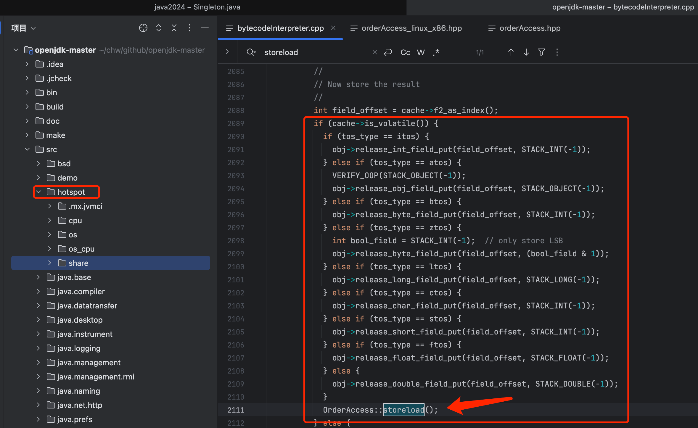
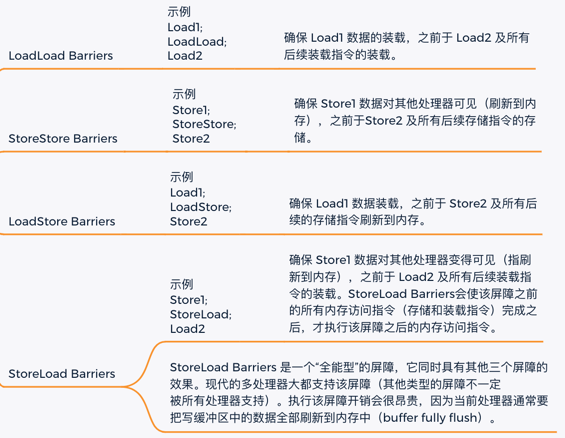
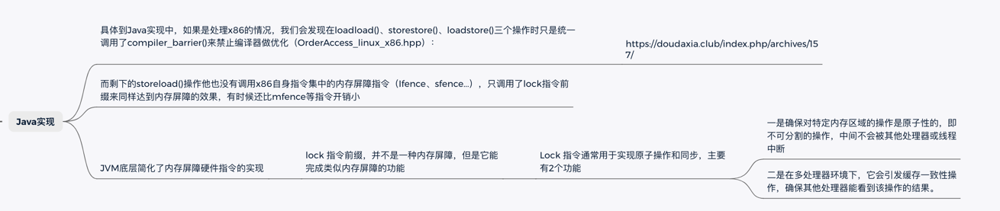
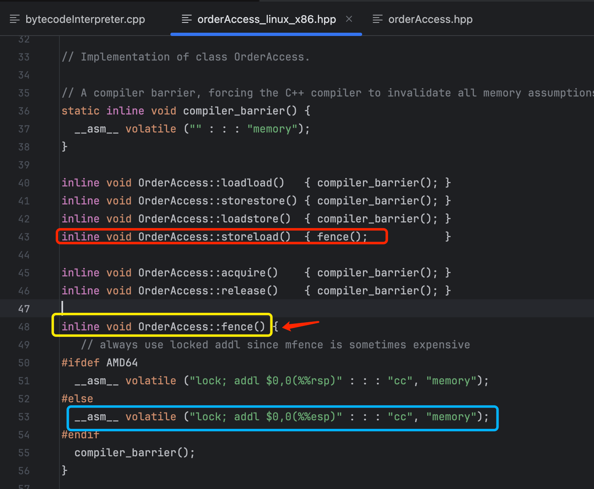
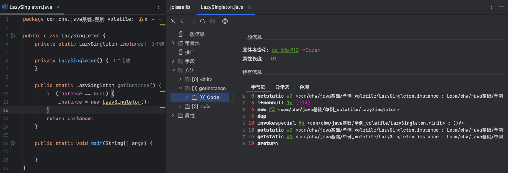
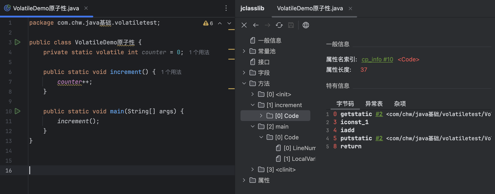

	这是Java内存模型（JMM）系列的第二篇文章，主要介绍的是volatile特性。

# 一、volatile
volatile具备的三大特性
- 可见性
- 禁止指令重排序
- 不保证原子性

<!-- more -->

# 二、原理解析

## 2.1、示例代码
```java
public class VolatileDemo {
    private static volatile int i = 0;

    public static void n() {
        i++;
    }

    public static synchronized void m() {
    }
    
    public static void main(String[] args) {
        //热点代码，编译成本地代码
        for (int j = 0; j < 1_000_000; j++) {
            n();
            m();
        }
    }
}
```

## 2.2、⭐️字节码层面

### 2.2.1、字段标志
volatile关键字JVM是如何知晓的呢：0 getstatic #2 <com/chw/java基础/volatiletest/VolatileDemo.i : I> <font color=red>通过常量池#2的flags</font>
- 字段标志为：ACC_VOLATILE（0x0040 [private:0x0002 static:0x0008 volatile:0x0040]


### 2.2.2、方法字节码

- getstatic是用于获取类的静态变量的值，并将其压入操作数栈。
- putstatic是一条用于设置类的静态变量（static field）值的指令。它会从操作数栈中弹出一个值，并将这个值赋给指定类的静态变量。
- iconst_1是一条将整数常量 1 压入操作数栈的指令。
- iadd是 Java 虚拟机字节码指令集中的一条指令，用于执行整数加法操作。它会从操作数栈（Operand Stack）中弹出两个整数，将这两个整数相加，然后把结果再压入操作数栈。

## 2.3、⭐️汇编代码层面

```dtd
运行时添加参数:-XX:+UnlockDiagnosticVMOptions -XX:+PrintAssembly
```
参考文章：[IDEA 查看运行 Java 代码生成的汇编指令](https://dantefung.github.io/2020/09/21/IDEA%E6%9F%A5%E7%9C%8B%E8%BF%90%E8%A1%8CJava%E4%BB%A3%E7%A0%81%E7%94%9F%E6%88%90%E7%9A%84%E6%B1%87%E7%BC%96%E6%8C%87%E4%BB%A4/)

得到如下汇编代码：
```dtd
0x0000000111b172b8: lock addl $0x0,(%rsp)
```

> 在汇编语言中，lock指令是一种特殊的指令前缀，主要用于多处理器环境下实现对共享内存区域的原子操作。原子操作是指一个操作要么全部执行成功，要么全部不执行，不会出现部分执行的情况。lock指令用于确保在执行后续指令时，处理器独占对内存系统的访问权，防止其他处理器同时访问同一内存区域，从而保证操作的原子性。

## 2.4、⭐️源代码层面
Hotspot对字节码的执行过程：字节码解释器（BytecodeInterpreter) :没有使用编译优化，在运行期就是纯粹地以解释方式执行。

### 2.4.1、BytecodeInterpreter字节码分析
BytecodeInterpreter调用case(_putstatic)解析putStatic字节码：
```dtd
CASE(_putfield):
CASE(_putstatic):
    ......
    if (cache->is_volatile()) { //1: i字段如果带有 ACC_VOLATILE标记
        ......
        OrderAccess::storeload(); -----storeload内存屏障
    }
//1 的调用规则accessFlags.hpp
  bool is_volatile() const{ 
  return (_flags & JVM_ACC_VOLATILE) != 0; } //i标记为Acc_volatile为true
```
**OrderAccess::storeload(); storeload内存屏障**

### 2.4.2、OrderAccess
```dtd
class OrderAccess : AllStatic {
 public: //内存屏障相关方法
  static void     loadload();
  static void     storestore();
  static void     loadstore();
  static void     storeload();

  static void     acquire();
  static void     release();
  static void     fence(); 
```

#### orderAccess_linux_x86.inline.hpp的实现类中对各个方法的实现
```dtd
inline void OrderAccess::loadload()   { acquire(); }
inline void OrderAccess::storestore() { release(); }
inline void OrderAccess::loadstore()  { acquire(); }
inline void OrderAccess::storeload()  { fence(); }

inline void OrderAccess::fence() {
  if (os::is_MP()) { //如果是多处理器 os.hpp中定义
  // return (_processor_count != 1)
    
#ifdef AMD64
    __asm__ volatile ("lock; addl $0,0(%%rsp)" : : : "cc", "memory");
#else
    __asm__ volatile ("lock; addl $0,0(%%esp)" : : : "cc", "memory");
#endif
  }
}
```
- 只有storeLoad调用了<font color=red>**fence()** </font>方法，其他三种方式没有
- <font color=red>**fence函数**</font>中调用了_asm_ (assembler:汇编代码),调用了指令lock addl $0,0(%%rsp) => 调用了lock指令，addl 0：一条空语句

## 2.5、字节码 & 汇编代码
### 2.5.1、字节码的生成和执行
1. 对于 Java 等语言，源代码首先经过编译器编译生成字节码文件（.class 文件）。
2. 字节码文件在运行时由相应的虚拟机（如 JVM）加载并解释执行，或者通过即时编译器（JIT）编译成本地机器码后再执行。
3. 例如，Java 程序在不同的操作系统和硬件平台上，只要有对应的 JVM，都可以运行相同的字节码文件，这体现了字节码的平台无关性。

### 2.5.2、汇编代码的生成和执行
当汇编代码生成后，它需要通过汇编器（Assembler）将其转换为机器码，然后由计算机的硬件直接执行。

### 2.5.3、两者的关联
**JVM 执行字节码文件<font color=#e98787>最终是通过转换成机器码</font>在机器上执行，但通常不是通过先转换成汇编语言这个中间步骤。**

> 在某些特殊情况下，可能会有一些工具或技术可以查看 JVM 生成的机器码对应的汇编语言表示，这只是为了调试、性能分析或深入理解 JVM 的内部工作原理，而不是在正常的执行过程中必须经过的步骤。

### 总结
以上分析可知，volatile关键字在汇编层代码中使用了lock指令保持其在java层可见性，禁止重排序等特性


# 二. 可见性：
对一个volatile变量的读，总是能看到（任意线程）对这个变量最后的写入

## 2.1、volatile 变量的特殊规则
2个语义，做到了可见性和禁止指令重排序。
- <font color=red>volatile写语义【强制刷新到主内存】</font>
当写一个volatile变量时，JMM会将本地内存写入到主存中
- <font color=red>volatile读语义【强制从主内存读取】</font>
当读一个volatile变量时，JMM会将线程的本地内存置为无效，线程接下来将从主存读取变量

## 2.2、硬件层面的支持（缓存一致性协议）
在多核处理器系统中，每个核心都有自己的缓存（Cache）。为了保证volatile变量的可见性，硬件层面会采用缓存一致性协议（如 MESI 协议）。当一个核心修改了volatile变量，这个修改会通过缓存一致性协议通知其他核心，使其他核心对应的缓存中的该变量副本失效。这样，当其他核心要读取这个volatile变量时，就会从主内存（或者通过缓存一致性协议更新后的缓存）获取最新的值，从而保证了volatile变量在硬件层面的可见性。

## 总结
实际是通过lock汇编指令，保证原子性。

# 三. 禁止指令重排序

## 3.1、什么是指令重排序？

### 3.1.1、作用（为什么会有重排序？）
- 为了提升程序的执行效率

### 3.1.2、分类
- 编译器重排序
- 处理器重排序
- 内存系统重排序

#### 1. 编译器重排序
编译器在不改变单线程程序语义的前提下，可以重新安排语句的执行顺序。
- Java中可使用volatile关键字

<font color=gray>禁止重排序是怎么实现的呢？</font>				
- jvm执行字节码文件时，遇到volatile相关数据，JVM是如何解析的呢？
	- BytecodeInterpreter（字节码解释器）是 Java 虚拟机（JVM）中用于解释执行字节码的关键组件。
	  
> 工作原理
> 	读取字节码
>		BytecodeInterpreter 从类加载器加载的字节码文件中按顺序读取字节码指令。
>   	例如，对于一个简单的 Java 方法，字节码解释器会依次处理方法中的每一条指令，如 iload（加载整数到操作数栈）、iadd（整数加法）等。
> 	解释执行指令
>   	对于每一条读取到的字节码指令，解释器根据指令的含义和操作数进行相应的操作。
>   	它维护着一个运行时数据区，包括方法调用栈、操作数栈、局部变量表等，根据字节码指令对这些数据区进行操作。
>   	比如，当遇到 iload 指令时，解释器会从局部变量表中根据指定的索引获取整数，并将其压入操作数栈；当遇到 iadd 指令时，会从操作数栈中弹出两个整数进行加法运算，然后将结果再压回操作数栈。
>
> OrderAccess.storeload()
> 	OrderAccess是一个用于内存访问排序和同步的机制。
>   	OrderAccess::storeload()通常用于确保特定的内存访问顺序，尤其是在多线程环境中
> 		具体实现如Java的Hotspot（基于OpenJDK11）所谓的编译器屏障，那其实就是在C++代码中内嵌了一段汇编：__asm__ volatile ("" : : : "memory")： , 他的意思就是直接向编译器声明禁止汇编内联优化重排

#### 2. 处理器重排序
现代处理器采用了指令级并行技术（Instruction-Level Parallelism， ILP）来将多条指令重叠执行。

如果不存在数据依赖性，处理器可以改变语句对应机器指令的执行顺序。

#### 3. 内存系统重排序
由于处理器使用缓存和读/写缓冲区，这使得加载和存储操作看上去可能是在乱序执行

> 具体到Java实现中，如果是处理x86的情况，我们会发现在loadload()、storestore()、loadstore()三个操作时只是统一调用了compiler_barrier()来禁止编译器做优化（OrderAccess_linux_x86.hpp）：
而剩下的storeload()操作他也没有调用x86自身指令集中的内存屏障指令（Ifence、sfence...），只调用了lock指令前缀来同样达到内存屏障的效果，有时候还比mfence等指令开销小 


### 3.1.3、重排序带来的问题
内存可见性问题


#### 1. 解决办法
1. **禁止编译器重排序：** 禁止特定类型的编译器重排序（不是所有的编译器重排序都要禁止）
2. **禁止处理器重排序：** java 编译器在生成指令序列时，插入特定类型的内存屏障（memory barriers，intel 称之为 memory fence）指令

### 3.1.4、重排序需要满足的规则【2个规则】
1. 数据依赖性
如果2个操作同一个变量，其中一个是写操作，那么这2个操作之间存在数据依赖性
2. as-if-serial
语义：不管怎么重排序（编译器和处理器为了提高并行度），（单线程）程序的执行结果不能被改变。编译器，runtime 和处理器都必须遵守 as-if-serial 语义。
   <font color=#e98787>只对单线程有效，对多线程无效。</font>


## 3.2、处理器重排序和内存屏障指令
背景：现代CPU，都有高速缓冲区，用于提高性能。如下图：

带来的问题：由于写缓冲区仅对自己的处理器可见，处理器重排序，它会导致处理器执行内存操作的顺序可能会与内存实际的操作执行顺序不一致。

### 3.2.1、解决方案

#### 1. CPU的内存屏障（x86架构下）
CPU 内存屏障是一种硬件层面的机制，主要用于确保内存操作的顺序和可见性。在多处理器或多核系统中，由于每个处理器都有自己的缓存，内存操作的顺序可能会因为指令重排序、缓存一致性等问题而变得不确定。内存屏障指令就是用来解决这些问题的。
 
- 类型
  - sfence（存储屏障）
  - lfence（加载屏障）
  - mfence（全屏障）
  
#### 2. JMM内存屏障指令（x86）
JMM 内存屏障是 Java 虚拟机（JVM）为了实现 Java 内存模型所定义的一种抽象概念。它是为了在 Java 程序这种高级语言层面，解决多线程环境下由于编译器重排序、处理器重排序和内存系统重排序可能导致的内存可见性和指令顺序问题。JMM 内存屏障为 Java 程序员提供了一种方式来确保共享变量在多线程之间的正确交互，使得 Java 程序能够在不同的硬件平台和 JVM 实现上保持一致的语义。

- 作用：为了保证内存可见性，java 编译器在生成指令序列的适当位置会插入内存屏障指令来禁止特定类型的处理器重排序。
- 分类：JMM 把内存屏障指令分为下列四类：
- 
  - 

与 CPU 内存屏障的关系：
> JMM 内存屏障是基于 CPU 内存屏障实现的，但它是一种更高层次的抽象。JVM 在字节码执行过程中，根据 Java 程序的语义（如volatile关键字、synchronized关键字等的使用），会在适当的位置插入 JMM 内存屏障。这些 JMM 内存屏障在底层可能会通过 CPU 内存屏障或者其他硬件和软件机制来实现。例如，当 JVM 识别到对volatile变量的写操作时，会在字节码层面插入相应的内存屏障，这些内存屏障在不同的硬件平台上可能会转化为不同的 CPU 内存屏障操作，以确保volatile变量的写操作对其他线程是可见的。
> - 如下图所示：JVM定义的4个内存屏障指令，底层实现是lock汇编指令 

- 


## 3.3、对象创建过程的重排序

### 3.3.1、对象的创建过程：

- 分配内存
- 初始化零值

### 3.3.2、什么是对象创建重排序？
在 Java 虚拟机（JVM）中，对象创建过程在某些情况下可能会出现重排序。对象创建的正常步骤包括<font color=#e98787>分配内存、初始化零值、设置对象头和执行<init>方法</font>。重排序是指 JVM 在不违反 Java 语言规范的前提下，对这些步骤的执行顺序进行重新排列。

例如，在某些优化场景下，JVM 可能会先分配内存，然后设置对象头，接着就将对象的引用返回，而此时<init>方法可能还没有执行，这就导致了对象创建步骤的重排序。

### 3.3.3、懒汉式单例与重排序问题
```java
class Singleton {
    private static Singleton instance;
    private Singleton() {}
    public static Singleton getInstance() {
        if (instance == null) {
            instance = new Singleton();
        }
        return instance;
    }
}
```
- 在这种实现方式中，存在一个潜在的问题，就是对象创建过程中的重排序。`instance = new Singleton();`这一语句在字节码层面包含了多个操作：分配内存、初始化零值、设置对象头和执行`<init>`方法。由于编译器和处理器可能会对这些操作进行重排序，可能会出现一种情况：分配内存和设置对象头后，对象引用就被赋值给`instance`，但此时`<init>`方法还没有执行完，对象还没有完全初始化（外部获取对象的数据是默认值）。
- 懒汉单例字节码

> **分配内存<font color=green>（字节码层面没有直接体现）</font>**
在字节码中并没有直接对应的指令来表示分配内存这一动作。这是因为内存分配是由 Java 虚拟机（JVM）在底层自动完成的，它是一个比较复杂的过程，涉及到 Java 堆（Heap）的管理机制，如指针碰撞（Bump - the - Pointer）或者空闲列表（Free - List）方式。<font color=#e98787>当 JVM 执行new指令时，它会触发内存分配的操作</font>，但字节码本身不会展示具体如何分配内存。
> 
> **初始化零值**
> - 基本数据类型：对于基本数据类型的变量，在字节码中没有专门的指令来初始化零值，因为在 Java 对象的内存布局中，当内存被分配后，JVM 会自动将对象的内存空间（包括对象头和实例数据部分）初始化为零值。例如，int类型的变量会自动初始化为 0，boolean类型的变量会初始化为false，byte、short、char等类型也会有对应的默认零值初始化。
> - 引用类型：对于引用类型的变量，同样会在内存分配后初始化为null，这也是 JVM 自动完成的，<font color=green>字节码中没有单独指令体现这一过程。</font>
> 
> **设置对象头**
<font color=green>在字节码中也没有直接的指令来表示设置对象头</font>。对象头的设置是 JVM 内部的操作，它包含了如哈希码（HashCode）、分代年龄、锁状态标志等信息的设置，以及指向对象所属类元数据的类型指针的设置。这些操作是在对象创建过程中由 JVM 自动完成的，字节码主要关注对象的实例数据部分的操作和方法调用等。
> 
> **执行<init>方法**
调用构造函数的字节码指令：当对象创建时，JVM 会通过invokespecial指令来调用对象的<init>方法（构造函数）。例如，对于一个简单的类class MyClass { private int myVar; public MyClass() { myVar = 1; } }，在字节码中，new指令用于创建对象（触发内存分配等操作），然后会有invokespecial指令来调用MyClass的<init>方法。具体字节码可能如下（使用javap -c命令查看）


**多线程环境下的风险**：在多线程环境中，当一个线程进入`if (instance == null)`判断为`true`后开始创建对象，由于重排序，对象引用可能在对象还没完全初始化时就被其他线程看到。其他线程获取到这个未完全初始化的对象引用后，使用这个对象就可能会出现错误，比如访问到未初始化的成员变量，导致程序出现不可预期的行为。

### 3.3.4、懒汉单例重排序问题解决
volatile + DCL【double check lock，双重检查锁定】
```java
public class Singleton {
    private volatile static Singleton instance;
    /**
    * DCL ： double check lock，双锁检测
    * @return
    */
    public static Singleton getInstance() {
        //线程C，后续执行到这，对象实例化后，直接返回对象，因为没有初始化，会导致获取到的内容为初始值，影响运行结果
        if (instance == null) {
            //A, B 2个线程执行到这，其中A线程获取到锁，B阻塞，防止重复创建
            synchronized (Singleton.class) {
                if (instance == null) {
                    //线程A：new 对象创建过程，有实例化 + 初始化过程，其中实例化时，分配了内存空间，则不为null
                    instance = new Singleton();
                }
            }
        }
    return instance;
    }
}
```
**`volatile`**
- **禁止重排序**：当`instance`变量被声明为`volatile`时，Java虚拟机（JVM）会在对象创建过程中插入内存屏障。禁止指令重排序。
- **可见性**：通过这些内存屏障，`volatile`保证了在多线程环境下，一个线程对`instance`的修改（创建或重新赋值）能够被其他线程及时看到，并且其他线程看到的`instance`对象是已经完全初始化的。这样就避免了因为重排序导致的获取未完全初始化对象的问题，保证了单例模式的正确性。

**synchronized**
- **防止重复创建**： 多线程情况下，通过加锁方式，只能有一个线程去创建对象，其他线程阻塞。


# 四. 不保证原子性
对任意单个volatile变量的读/写操作具有原子性，但是对volatile++这种复合操作不具有原子性

- 在这里，`counter`是一个`volatile`变量，`increment`方法尝试对其进行自增操作。从表面上看，似乎这个操作应该是安全的，但实际上，`counter++`这个操作不是原子操作。
	- 这个操作在字节码层面包含了多个步骤：
		- 首先，通过`getstatic`指令从内存（因为`volatile`属性，每次都从主内存读取）获取`counter`的值。
		- 然后，执行`iconst_1`（将常量1压入操作数栈）和`iadd`（将操作数栈中的两个值相加）指令进行加法运算。
		- 最后，通过`putstatic`指令将新的值写回`counter`的存储位置（同样因为`volatile`属性，会立即刷新到主内存）。


**多线程环境下的问题展示**
- 假设多个线程同时调用`increment`方法。由于`counter++`操作不是原子的，可能会出现以下情况：
	- 线程A读取了`counter`的值（假设为5），在进行加法运算之前，线程B也读取了`counter`的值（同样为5）。
	- 然后线程A完成加法运算得到6，将其写回`counter`；接着线程B也完成加法运算得到6，再将其写回`counter`。
	- 最终结果是，本来期望经过两次自增操作`counter`的值应该为7，但实际上却为6，这就说明了`volatile`变量在这种非原子操作场景下不能保证操作的原子性。

