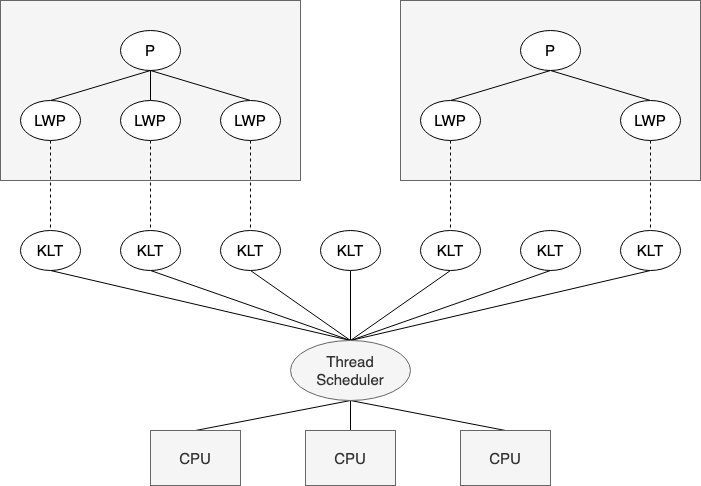
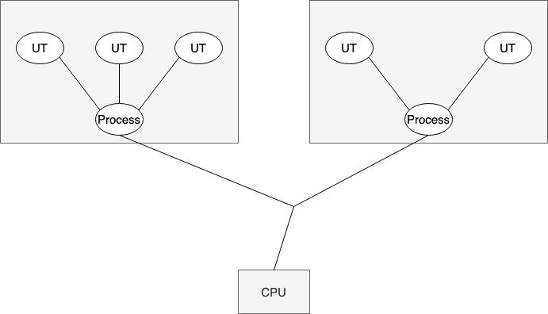
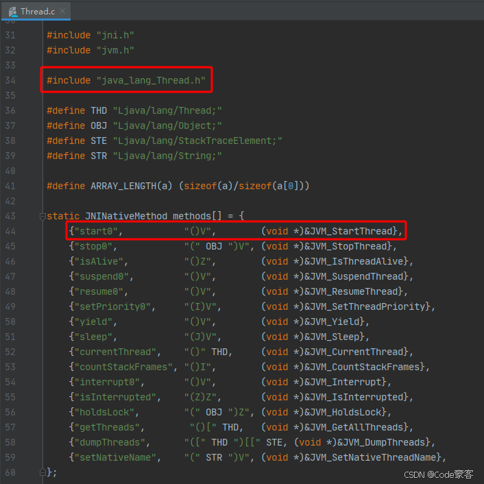
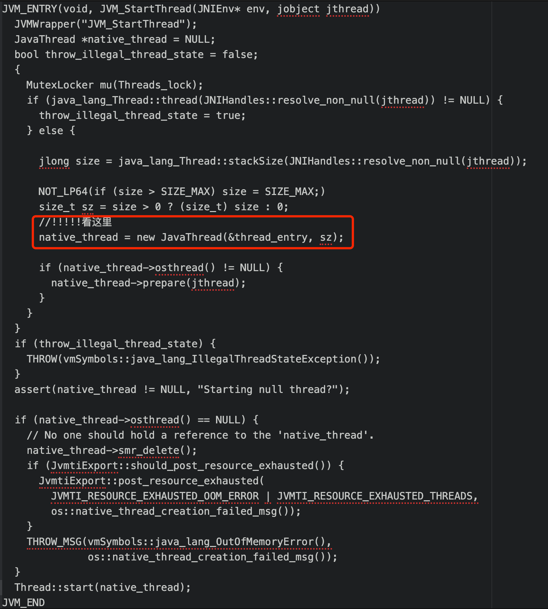
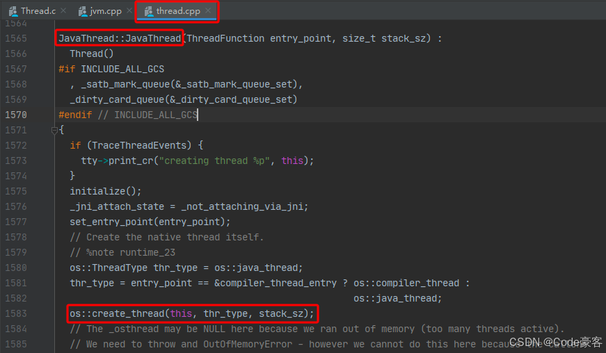
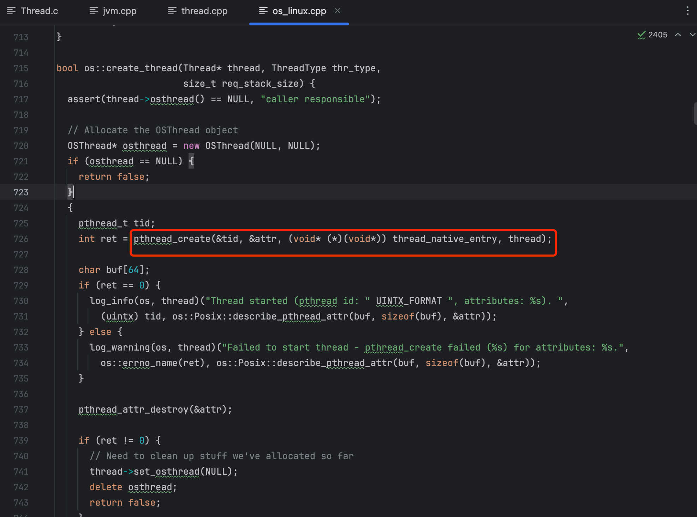
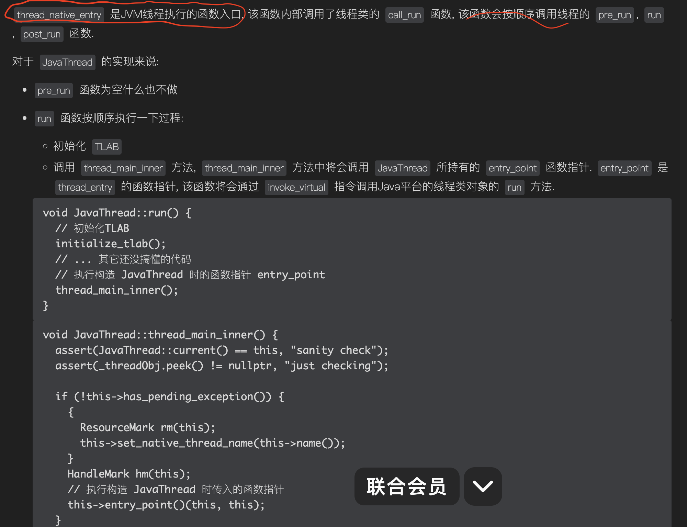
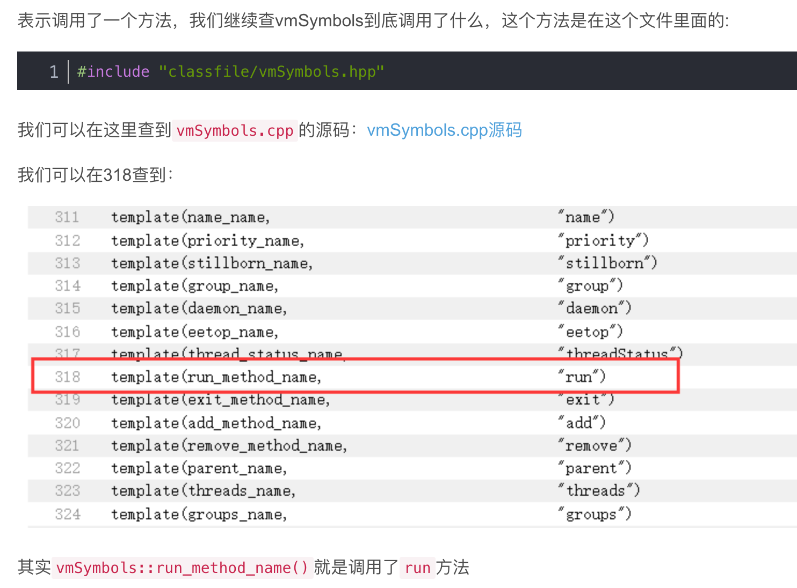
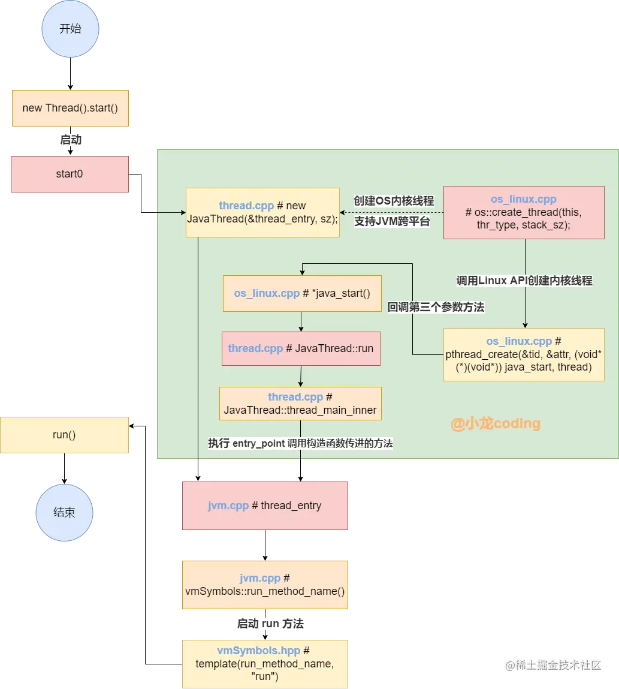
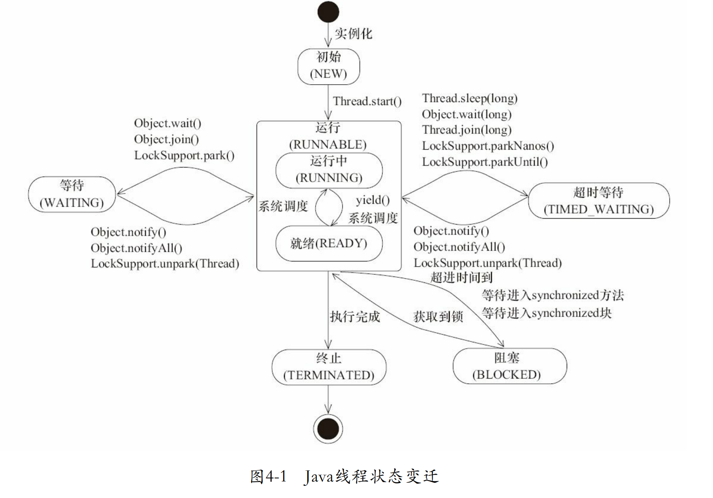

	这是“并发”系列的第一篇文章，主要介绍的是线程。

# 一、并发
并发不一定要依赖多线程，但是在Java里面讨论并发，基本上都与线程脱不开关系。

<!-- more -->

# 二、线程的实现
线程是比进程更轻量级的调度执行单位，线程的引入，可以把一个进程的资源分配和执行调度分开，各个线程共享进程资源（内存地址、文件IO等），又可以独立调度。

**目前线程是Java里面进行处理器资源调度的最基本单位。**

## 2.1、线程的实现方式

### 2.1.1、内核线程实现
**内核线程（Kernel-Level Thread，KLT）：** 由内核来完成线程切换，内核通过调度器对线程进行调度，并负责将线程的任务映射到各个处理器上。 <font color=green>程序一般不会直接去使用内核线程，而是使用内核线程的一种高级接口</font>—— <font color=red>**轻量级进程（Light Weight Process，LWP）**</font>，也就是通常意义上的线程。

- **优点：** 每个LWP都是独立的调度单元。一个LWP被阻塞，不影响其他LWP。
- **缺点：** 基于KLT，耗资源。线程的创建、析构、同步都需要进行系统调用，频繁的用户态、内核态切换。


### 2.1.2、用户线程实现（User Thread，UT）
**广义：** 非内核线程，都可认为是用户线程。（包括LWT，虽然LWT的大多操作都要映射到KLT）
**狭义：** 完全建立在用户空间的线程库上，系统内核不能感知线程存在的实现。UT也只感知到掌管这些UT的进程P。
**优点：** 用户线程的创建、同步、销毁和调度完全在用户态中完成，不需要内核的帮助。
**缺点：** 线程的创建、销毁、切换和调度都是用户必须考虑到问题。“阻塞如何处理”、“多处理器系统中如何将线程映射到其他处理器上”这类问题解决起来将会异常困难。




### 2.1.3、混合模式
混合模式下，即存在用户线程，也存在轻量级进程。用户线程的创建、切换、析构等操作依然廉价，可以支持大规模的用户线程并发，且可以使用内核线程提供的线程调度功能及处理器映射。


### 总结
从通用的应用程序的角度来看看线程是如何实现的：
- 使用内核线程（1:1实现）
- 使用用户线程实现（1:N实现）
- 使用用户线程加轻量级进程混合实现（N:M实现）

线程的实现依赖操作系统支持的线程模型。在主流的操作系统上，hotspot、classic、art等虚拟机默认是 1:1的线程模型。在Solaris平台上，hotspot支持1:1、N：M两种线程模型。

<font color=red>**在 HotSpot JVM 中，pthread_create函数用于创建与 Java 线程对应的 Linux 轻量级进程（LWP）。**</font>

## 2.2、Linux传统进程创建
### 1 fork系统调用
```dtd
#include <stdio.h>
#include <sys/types.h>
#include <unistd.h>
int main() {
  pid_t pid = fork();
  if (pid == -1) {
    // fork失败
    perror("fork");
  } else if (pid == 0) {
    // 子进程
    printf("我是子进程，我的PID是 %d，我的父进程PID是 %d\n", getpid(), getppid());
  } else {
    // 父进程
    printf("我是父进程，我创建的子进程PID是 %d，我的PID是 %d\n", pid, getpid());
  }
  return 0;
}
```
#### 基本原理
fork是在 Linux 中创建进程最基本的系统调用之一。当一个进程调用fork时，操作系统会创建一个新的进程，这个新进程几乎是父进程的副本。它会复制父进程的地址空间（包括代码段、数据段和堆等），使得子进程和父进程有相同的内存内容。
#### 返回值
fork函数会返回两次。在父进程中，它返回子进程的 PID（进程标识符），而在子进程中，它返回 0。这个特性可以被用来区分父进程和子进程，以便它们执行不同的代码路径。

### 2 vfork系统调用
与fork的区别
vfork和fork的主要区别在于vfork创建的子进程会暂时共享父进程的地址空间。这是为了更高效地创建子进程，特别是在子进程会立即调用exec系列函数（用于执行新的程序）的情况下。


### 3 clone系统调用
高级进程创建方式
clone系统调用提供了一种更灵活的进程创建方式。它允许程序员指定子进程与父进程共享的资源种类。通过设置不同的标志位，可以实现从几乎完全复制父进程（类似fork）到只共享部分资源（如只共享地址空间或者只共享文件描述符等）的多种模式。

## 2.3、Linux轻量级进程创建
可以使用clone()系统调用创建轻量级进程。clone()系统调用的参数可以指定新创建的轻量级进程与父进程共享的资源范围。它可以通过设置不同的标志位来决定是否共享地址空间、文件描述符等资源。


## 2.4、Java创建线程原理
通过分析JVM源码梳理Java hotspot虚拟机创建线程的逻辑。
### 2.4.1、示例代码
```java
class MyThread extends Thread {
    @Override
    public void run() {
        System.out.println("a");
    }
}
public static void main(String[] args) {
        MyThread myThread = new MyThread();
        myThread.start();       
    }
```
<font color=red>**start方法才会创建并启动操作系统原生线程。**</font>

### 2.4.2、源码解析
#### 1、start0 native方法

start0 对应的就是 JVM_StartThread 的函数指针, 函数源码在 jvm.cpp 文件中.

#### 2、JVM_StartThread虚拟机函数
JVM_StartThread函数所做的事情主要是:
- 1、创建JavaThread 并初始化：new JavaThread(&thread_entry, sz);
- 2、调用 Thread::start 启动线程：线程状态设置成  <font color=red>RUNNABLE</font>

##### 2.1、创建 JavaThread 并初始化
代码如下：关注入参&thread_entry，是一个回调函数，详细查看后文 
  

##### 2.3、调用 Thread::start 启动线程
Thread::start 设置 Java 的 Thread 类的 threadState 字段的值为 RUNNABLE 对应的值, 并通过 os::start_thread 运行操作系统线程.
```dtd
void Thread::start(Thread* thread) {
  if (thread->is_Java_thread()) {
  // 设置Java平台线程对象的状态
  java_lang_Thread::set_thread_status(JavaThread::cast(thread)->threadObj(),
  JavaThreadStatus::RUNNABLE);
  }
  // 启动OS线程
  os::start_thread(thread);
  }
  void os::start_thread(Thread* thread) {
  OSThread* osthread = thread->osthread();
  osthread->set_state(RUNNABLE);
  // 启动线程, 不同平台实现不同
  pd_start_thread(thread);
}
```

#### 3、new Javathread
这里做了两个动作，
- 1、首先通过 set_entry_point 将要执行的方法thread_entry 函数，使用 entry_point 保存了起来，以便之后调用。
- 2、然后又调用了 os::create_thread 方法，通过调用OS底层创建Java线程对应的内核线程。


#### 4、create_thread
** <font color=gray> os::create_thread(this, thr_type, stack_sz); </font> **

最终，我们发现是调用Linux提供的pthread-create方法：
- 关注第3个入参：thread_native_entry

#### 5、pthread-create
os_linux.cpp的pthread_create， 创建内核线程
> <font color=green>pthread_create是POSIX标准线程库中的一个函数，用于创建新线程。在C语言中，多线程编程成为了许多程序员必备的技能之一，而pthread_create则是实现多线程的关键之一。</font>
> 
> <font color=red>在 HotSpot JVM 中，pthread_create函数用于创建与 Java 线程对应的 Linux 轻量级进程（LWP）。</font>

使用pthread_create函数创建线程。这个函数的原型是
```cpp
int pthread_create(pthread_t *thread, const pthread_attr_t *attr, void *(*start_routine)(void *), void *arg);。
```
- pthread_t *thread：是一个指针，用于存储新创建线程的标识符；
- const pthread_attr_t *attr：可以用于设置线程的属性（如果使用默认属性，可以传递NULL）；
- void *(*start_routine)(void *)： 以函数指针的方式指明新建线程需要执行的函数，该函数的参数最多有 1 个（可以省略不写），形参和返回值的类型都必须为 void
- void *arg：是传递给线程函数的参数。

通过Linux相关文档了解到，当 pthread_create 函数执行创建完线程之后会调用第三个参数（thread_native_entry 方法）传递过去的回调函数。


#### 6、thread_native_entry
**thread_native_entry解析：** 


而这个此刻 entry_point 就是我们 执行 native_thread = new JavaThread(&thread_entry, sz) 创建线程时穿进的构造参数 &thread_entry，我们再回到最开始的这里，接着理解 native_thread = new JavaThread(&thread_entry, sz) 第二步，其入参 &thread_entry 方法内部干了什么：

#### 7、&thread_entry
<font color=red>**thread_entry()函数：** </font> 是一个回调方法，函数逻辑如下
```dtd
static void thread_entry(JavaThread* thread, TRAPS) {
  HandleMark hm(THREAD);
  Handle obj(THREAD, thread->threadObj());
  JavaValue result(T_VOID);
  JavaCalls::call_virtual(&result,
                          obj,
                          SystemDictionary::Thread_klass(),
                          vmSymbols::run_method_name(),
                          vmSymbols::void_method_signature(),
                          THREAD);
}
```
JavaCalls::call_virtual表示调用了call_virtual这个方法。这里面最重要的代码就是这行：执行run()方法
vmSymbols::run_method_name()

可见vmSymbols::run_method_name()就是调用了run方法。


### 线程创建总结：宏观流程分析


# 三、Java线程状态
```
public enum State {
    //新建状态，未启动
    NEW,
    //就绪状态，在JVM中运行，但是在操作系统中可能是等待执行。
    RUNNABLE,
    //阻塞状态，表示线程阻塞于锁
    BLOCKED,
    //等待状态，需要等待其他线程做出一些特定动作（通知或中断）
    WAITING,
   //超时等待，可以在指定的时间后自行返回
   TIMED_WAITING,
   //表示该线程已经执行完毕。
   TERMINATED;
}
```


## 3.1、 NEW
新建状态，未启动，线程被创建出来，但是未调用start()方法

## 3.2、RUNNABLE
就绪状态，在JVM中运行，但是在操作系统中可能是等待执行。线程调用了start()方法
可能对应OS进程的Ready、RUNNING2个状态

## 3.3、BLOCKED
阻塞状态，表示线程阻塞于锁

## 3.4、WAITING
等待状态，需要等待其他线程做出一些特定动作（通知或中断）

## 3.5、TIMED_WAITING
超时等待，可以在指定的时间后自行返回

## 3.6、TERMINATED
表示该线程已经执行完毕。


# 四、线程的相应方法

## 4.1、sleep
线程暂时停止运行，但是未失去对锁的拥有
线程等待指定的时间后，该线程不一定会立马/确定运行
线程等待，进入_EntryList队列中

## 4.2、join
源码分析：
```java
public final synchronized void join(long millis)
  throws InterruptedException {
  long base = System.currentTimeMillis();
  long now = 0;

    if (millis < 0) {
        throw new IllegalArgumentException("timeout value is negative");
    }

    if (millis == 0) {
        while (isAlive()) {
            wait(0);
        }
    } 
}
```
join方法为synchronized方法
使用示例：
```java
public static void main(String[] args) throws InterruptedException {

    Thread t1 = new Thread(()->{
        System.out.println("Thread t1 run");
        count=10;
    });

    t1.start();
    t1.join();//若把这一行注释掉，则打印的count为0

    System.out.println("count="+count);
}
```
<font color=red>主线程，获取t1对象的锁；然后调用wait()方法，则主线程会被阻塞</font>


## 4.3、yield
一个线索、示意调度器当前线程将会放弃他当前的处理器使用权
yield()方法不会使线程失去资源，只是失去了处理器使用权

## 4.4、start

### 如果start()方法调用2次？
在调用 start 之后，threadStatus 的值会改变（threadStatus !=0），再次调用 start 方法会抛出 IllegalThreadStateException 异常。
**会去判断线程的状态，抛出异常**

### 执行原理
查看上文的线程的创建。	
													
## 4.5、run
run()方法只是类的一个普通方法而已，如果直接调用Run方法，程序中依然只有主线程这一个线程，其程序执行路径还是只有一条，还是要顺序执行。

## 4.6、wait()
wait()方法必须在同步代码块或同步方法中被调用，并且这个同步代码块或方法需要使用与当前对象相关的锁。
				当一个线程执行到wait()方法时，它会释放当前持有的对象锁，然后进入等待队列。

# 五、创建线程【start方法才会创建并启动操作系统原生线程】

## 5.1、继承Thread类，并复写run方法
```java
class MyThread extends Thread {
    @Override
    public void run() {
        System.out.println("a");
    }
}

public static void main(String[] args) {
  MyThread myThread = new MyThread();
  myThread.start();       
}
```

## 5.2、实现Runnable接口，复写run方法
```java
class MyRunnable implements Runnable {
    @Override
    public void run() {
        System.out.println("b");
    }
}

public static void main(String[] args) {       
    MyRunnable myRunnable = new MyRunnable();
    Thread thread = new Thread(myRunnable);
    thread.start();
}

```

## 5.3、使用Callable和Future

### 5.3.1、Callable
<font color=red>方法作用：》》》》【具体的任务逻辑，在这里实现】</font>
Callable位于java.util.concurrent包下，它也是一个接口，在它里面也只声明了一个方法，只不过这个方法叫做call()：
```java
public interface Callable<V> {
    /**
    * Computes a result, or throws an exception if unable to do so.
    *
    * @return computed result
    * @throws Exception if unable to compute a result
    */
    V call() throws Exception;
}
```
那么怎么使用Callable呢？一般情况下是配合ExecutorService来使用的，在ExecutorService接口中声明了若干个submit方法的重载版本：
```dtd
<T> Future<T> submit(Callable<T> task);
<T> Future<T> submit(Runnable task, T result);
Future<?> submit(Runnable task);
```
第一个submit方法里面的参数类型就是Callable。

### 5.3.2、Future
<font color=red>方法作用：》》》》【获取Callable任务的执行结果】</font>
Future就是对于具体的Runnable或者Callable任务的<font color=red>**执行结果进行取消、查询是否完成、获取结果**</font>。必要时可以通过get方法获取执行结果，该方法会阻塞直到任务返回结果。

Future类位于java.util.concurrent包下，它是一个接口：
```
public interface Future<V> {
    boolean cancel(boolean mayInterruptIfRunning);
    boolean isCancelled();
    boolean isDone();
    V get() throws InterruptedException, ExecutionException;
    V get(long timeout, TimeUnit unit) throws InterruptedException, ExecutionException, TimeoutException;
}
```

**因为Future只是一个接口，所以是无法直接用来创建对象使用的，因此就有了下面的FutureTask。**

## 5.4、使用 Callable 和 FutureTask

### 5.4.1、FutureTask
我们先来看一下FutureTask的实现：
```
public class FutureTask<V> implements RunnableFuture<V>
```
FutureTask类实现了RunnableFuture接口，我们看一下RunnableFuture接口的实现：
```java
public interface RunnableFuture<V> extends Runnable, Future<V> {
    void run();
}
```
可以看出RunnableFuture继承了Runnable接口和Future接口，而FutureTask实现了RunnableFuture接口。所以它既可以作为Runnable被线程执行，又可以作为Future得到Callable的返回值。

FutureTask提供了2个构造器：
```
public FutureTask(Callable<V> callable) {
}
public FutureTask(Runnable runnable, V result) {
}
```
事实上，FutureTask是Future接口的一个唯一实现类。

### 5.4.2、步骤一：定义 Callable 
<font color=red>方法作用：》》》》【任务逻辑实现】</font>
代码如下
```java
class MyCallable implements Callable
```
Callable内部有call()方法，该方法会返回执行结果


### 5.4.3、步骤二：结合 FutureTask 
我们先来看一下FutureTask的实现：
```java
public class FutureTask<V> implements RunnableFuture<V>
```
FutureTask类实现了RunnableFuture接口，我们看一下RunnableFuture接口的实现：

```java
public interface RunnableFuture<V> extends Runnable, Future<V> {
void run();
}
```
可以看出RunnableFuture继承了Runnable接口和Future接口，而FutureTask实现了RunnableFuture接口。所以它既可以作为Runnable被线程执行，又可以作为Future得到Callable的返回值。


<font color=red>方法作用：》》》》【获取任务结果】</font>
FutureTask实现了Runnable接口，作为一个线程，run()方法内部执行callable接口的call()方法，获取到 任务逻辑实现 的返回结果。


### 5.4.4、步骤三：获取结果
Future 在获取结果时通常是通过阻塞等待的方式实现的。当调用 Future 的 get 方法来获取异步任务的结果时，如果任务还未完成，当前线程会被阻塞，直到任务完成并获取到结果。


## 5.4、线程池