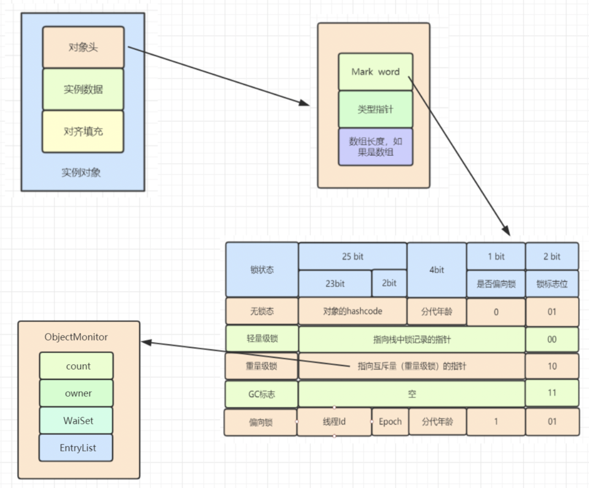
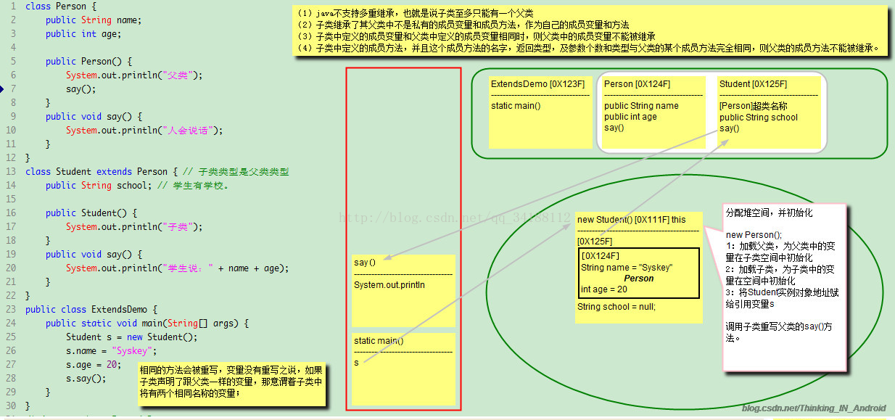

# 一、讲讲对象
从对象结构、对象创建过程、锁升级过程说明
# 二、对象结构
* 对象=对象头+实例数据+数据填充
* 对象头=markword+classpointer+数组大小
* markword=hashcode+GC年龄+锁标识+偏向锁标识
32bit虚拟机:


25bit的hashcode，4bit的GC年龄(0-15岁)，1bit的偏向锁标识，2bit的锁标志位（4种状态） = 32bit

<!--more-->  

# 三、锁升级
从锁的种类，锁的定义等方面进行讲述。
* 无锁：对象默认进来是没有锁的
* 偏向锁：
    1. 锁产生背景：同步代码块，通过经验验证，一般同时只有一个线程使用，从而竞争较少。
    2. 锁实现原理：对象头的markwork中记录当前线程的ID，表示偏向该线程。
    3. 锁升级过程：当线程执行同步代码块，判断对象是否有锁，无锁的话，对象头的markword中记录当前线程的ID（CAS操作），
           表示偏向该线程。线程进入代码块，只需要判断对象的是否偏向该线程（首先判断偏向锁标识，再判断markword中存储的线程ID）。
    4. 锁释放：线程不会主动释放锁，只有当其他线程竞争时，才会继续锁的升级。       
* 轻量级锁：
    1. 锁产生背景：不阻塞线程，通过自旋的方式，提升性能。
    2. 锁实现原理：从线程栈桢中创建Lock Record空间，然后将对象的markword复制到Lock record空间，然后通过CAS操作
    将对象的markword更新为指向Lock record的指针，Lock record的owner指向了markword。
    3. 锁升级过程：当线程自旋超过一定次数时，或者是超过2个线程竞争资源，都会升级成重量级锁。    
    
    * 优点：竞争时，只需要让现场自旋尝试去获取锁，而不需要阻塞线程。
    * 缺点：自旋，适合执行时间短，自旋时间长容易消耗CPU资源。    


* 重量级锁：
1、锁实现原理：通过对象的monitor锁，而monitor锁依赖操作系统的MutexLock（互斥锁）
    将markword的值替换成指向MutexLock的指针
2、monitor锁实现原理:
    1. 每个对象都有监视器
    2. 字节码指令：monitorEnter和monitorExit
    3. c++实现ObjectMonitor，以下为重要属性
        * _owner：监视器持有者
        * _entryList：存放处于blocked状态的线程列表，多个线程同时访问进来会进入这个集合
        * _waitSet：当持有monitor的线程调用wait()方法时，该线程会释放monitor，_owner变量恢复成null，_count会减1，该线程进入_waitSet并等待唤醒。
        * _recursions：锁的重入次数   
        * _count：用来记录当前线程拥有锁的次数  
       
    * 缺点：依赖操作系统的锁，会阻塞线程，唤醒和阻塞都需要用户态和内核态的切换       


# 四、对象内存分配

* 对象头
```
32bit JVM (8字节)
    mark word: 32bit
        在对象未被锁定的状态：25bit hashcode + 4bit 对象分代年龄 + 2bit存储锁标志位 + 1bit 固定为0
    类型指针：32bit
    
64bit JVM (16字节)

    mark word: 64bit
    类型指针：64bit
    
数组长度（Array Length）
    如果对象是一个数组，那么对象头还需要有额外的空间用于存储数组的长度。
    这部分数据的长度也随着JVM架构的不同而不同：32位的JVM上，长度为32位；64位JVM则为64位。
    64位JVM如果开启+UseCompressedOops选项，该区域长度也将由64位压缩至32位。
```
* 实例数据
```
基本类型与引用类型
    boolean             1
    byte                1
    shot                2
    char                2
    int                 4
    float               4
    long                8   
    double              8
```
* 栗子
```
Class A {
    int i;
    byte b;
    String str;
}
```

# 五、对象的继承


这个程序执行的基本流程是：

1. 虚拟机加载Test类，提取类信息到方法区；

2. 通过保存在方法去的字节码，虚拟机开始执行main方法，main函数入栈；

3. 执行Student s = new Student();给student实例对象分配堆空间。又因为实现自己要先实现父类，所以，虚拟机加载person类到方法区，并在堆中为父类成员变量在子类空间中初始化。然后加载student类到方法区，为子类的成员变量分配空间并初始化。

4. 接下来两条语句为成员变量赋值，由于name跟age是从父类继承而来，会被保存在子类父对象中，所以就根据引用变量s持有的引用找到堆中的对象(子类对象)，然后给name跟age赋值。

5. 调用say()方法，通过引用变量s持有的引用找到堆中的实例对象，通过实例对象持有的本类在方法区的引用，找到本类的类型信息，定位到say()方法。say()方法入栈。开始执行say()方法中的字节码。

6. say()方法执行完毕，say方法出栈，程序回到main方法，main方法执行完毕出栈，主线程消亡，虚拟机实例消亡，程序结束。

总结：相同的方法会被重写，变量没有重写之说，如果子类声明了跟父类一样的变量，那意味着子类将有两个相同名称的变量。一个存放在子类实例对象中，一个存放在父类子对象中。父类的private变量，也会被继承并且初始化在子类父对象中，只不过对外不可见。


