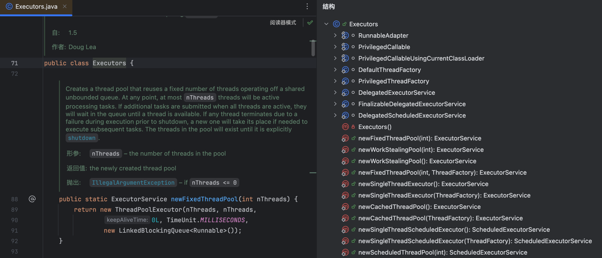
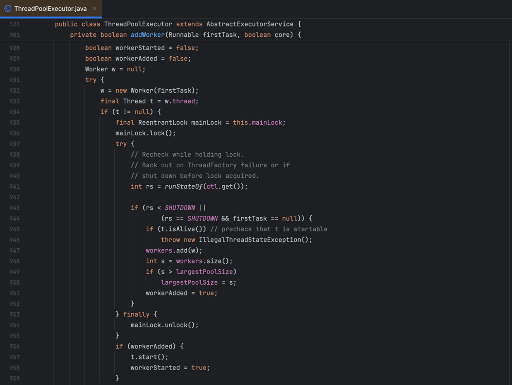
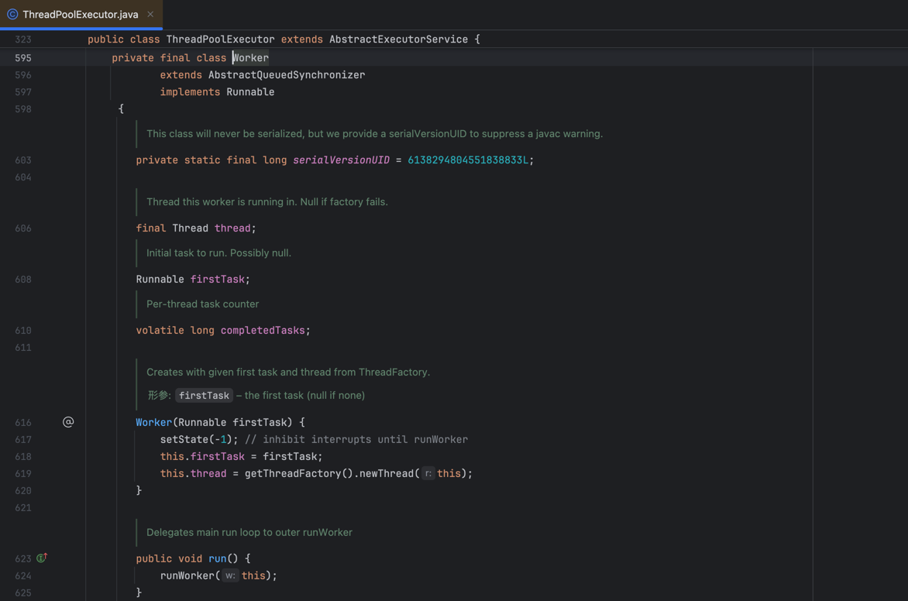
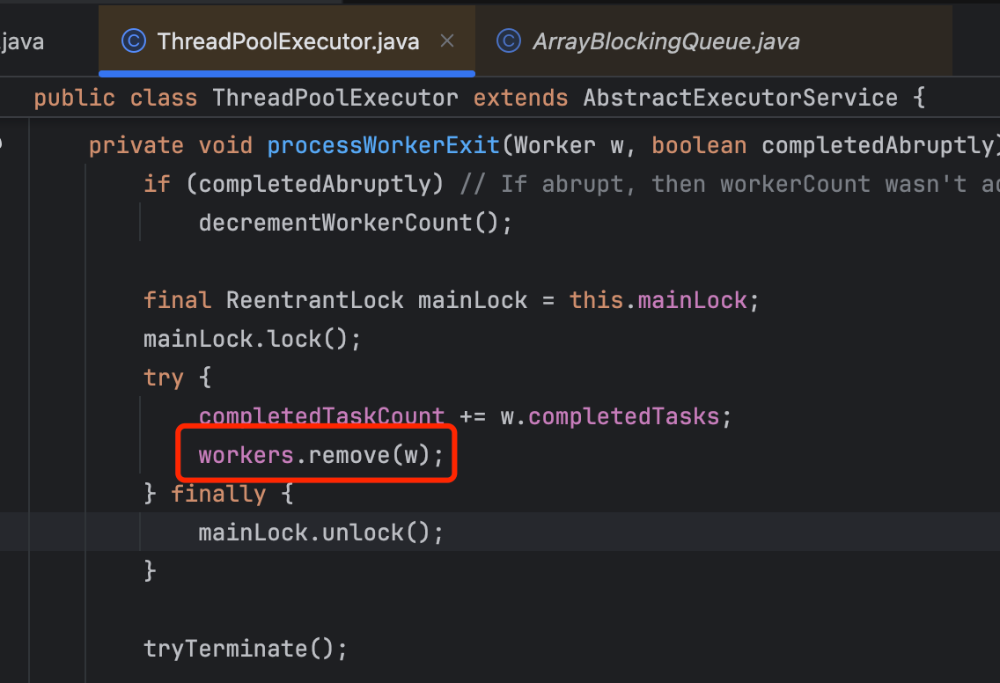
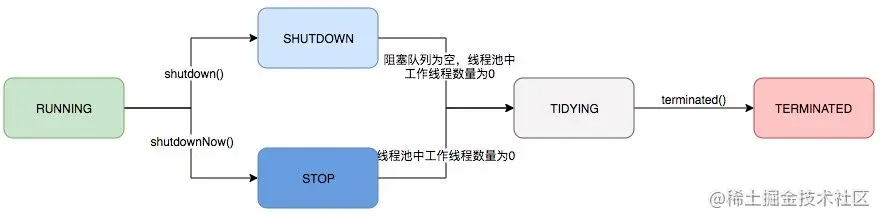

	这是“并发”系列的第二篇文章，主要介绍的是线程池相关内容。

# 一、线程池
池化技术的思想主要是为了减少每次获取资源的消耗，提高对资源的利用率。
这里借用《Java 并发编程的艺术》书中的部分内容来总结一下使用线程池的好处：
- **降低资源消耗。** 通过重复利用已创建的线程降低线程创建和销毁造成的消耗。
- **提高响应速度。** 当任务到达时，任务可以不需要等到线程创建就能立即执行。
- **提高线程的可管理性。** 线程是稀缺资源，如果无限制的创建，不仅会消耗系统资源，还会降低系统的稳定性，使用线程池可以进行统一的分配，调优和监控。

<!-- more -->

# 二、常见的创建线程池方式有以下几种：
1. Executors.newCachedThreadPool()：无限线程池。
2. Executors.newFixedThreadPool(nThreads)：创建固定大小的线程池。
3. Executors.newSingleThreadExecutor()：创建单个线程的线程池。


# 二、Executor 框架介绍
Executor 框架是 Java5 之后引进的，在 Java 5 之后，通过 Executor 来启动线程比使用 Thread 的 start 方法更好，更易管理，效率更好（用线程池实现，节约开销）。

## 2.1、成员分为四个部分：任务、任务执行、任务执行结果以及任务执行工具类
- 任务：实现Callable接口或Runnable接口
- 任务执行部分：ThreadPoolExecutor以及ScheduledThreadPoolExecutor
- 任务执行结果：Future接口以及FutureTask实现类
- 任务执行工厂类：Executors

### 2.1.1、任务(Runnable /Callable)
执行任务需要实现的 Runnable 接口 或 Callable接口。Runnable 接口或 Callable 接口 实现类都可以被 ThreadPoolExecutor 或 ScheduledThreadPoolExecutor 执行。

### 2.1.2、任务的执行(Executor)
如下图所示，包括任务执行机制的核心接口 Executor ，以及继承自 Executor 接口的 ExecutorService 接口。ThreadPoolExecutor 和 ScheduledThreadPoolExecutor 这两个关键类实现了 ExecutorService 接口。


#### Executor代码示例
可以像下面这样执行任务，而不是显示的创建线程（new Thread(new RunnableTask()).start()）：
```
Executor executor = anExecutor();
executor.execute(new RunnableTask1());
executor.execute(new RunnableTask2());

```

#### ExecutorService
ExecutorService继承了Executor，它在Executor的基础上增强了对任务的控制，同时包括对自身生命周期的管理，主要有四类：
- 关闭执行器，禁止任务的提交；
- 监视执行器的状态；
- 提供对异步任务的支持；
- 提供对批处理任务的支持。


#### 小结
- **Executor：** 提交普通的可执行任务
- **ExecutorService：** 提供对线程池生命周期的管理、异步任务的支持
- **ScheduledExecutorService：** 提供对任务的周期性执行支持

### 2.1.3、异步计算的结果(Future)
Future 接口以及 Future 接口的实现类 FutureTask 类都可以代表异步计算的结果。当我们把 Runnable接口 或 Callable 接口 的实现类提交给 ThreadPoolExecutor 或 ScheduledThreadPoolExecutor 执行。（调用 submit() 方法时会返回一个 FutureTask 对象）

### 2.1.4、任务执行工厂类：Executors
Executors提供一个简单工厂和一系列工具方法，它的所有方法都是static的，用户可以根据需要，选择需要创建的执行器实例，Executors一共提供了五类方法：
- 创建和返回设置了具有常用配置的 ExecutorService 实例的方法
- 创建和返回设置了具有常用配置的 ScheduledExecutorService  实例的方法
- 创建和返回 ExecutorService 的包装类实例的方法，这些类可以隐藏子类的特殊实现，只暴露父类的方法
- 创建和返回 将新创建的线程设置为已知状态的ThreadFactory 实例的方法
- 从其他类似闭包的形式中创建和返回 Callable 实例的方法，它们可以在需要 Callable 的方法中使用。
  

Executors内部代码：
```
public class Executors {
    ....
    public static ExecutorService newCachedThreadPool() {
        return new ThreadPoolExecutor(0, Integer.MAX_VALUE,
                                      60L, TimeUnit.SECONDS,
                                      new SynchronousQueue<Runnable>());
    }
    ....
}
```

# 三、ThreadPoolExecutor 类介绍（重要）
线程池实现类 ThreadPoolExecutor 是 Executor 框架最核心的类（底层实现，都是采用了ThreadPoolExecutor对象进行线程池的实例化）。

## 3.1、线程池参数分析
```
ThreadPoolExecutor(
    int corePoolSize, //线程池的核心线程数量
    int maximumPoolSize, //线程池的最大线程数
    long keepAliveTime, //当线程数大于核心线程数时，多余的空闲线程存活的最长时间
    TimeUnit unit, //时间单位
    BlockingQueue<Runnable> workQueue, //任务队列，用来储存等待执行任务的队列
    ThreadFactory threadFactory,//线程工厂，用来创建线程，一般默认即可
    RejectedExecutionHandler handler//拒绝策略，当提交的任务过多而不能及时处理时，我们可以定制策略来处理任务
)
```

这几个核心参数的作用：
* **corePoolSize：** 任务队列未达到队列容量时，最大可以同时运行的线程数量。
* **maximumPoolSize：** 任务队列中存放的任务达到队列容量的时候，当前可以同时运行的线程数量变为最大线程数。
* **workQueue：** 新任务来的时候会先判断当前运行的线程数量是否达到核心线程数，如果达到的话，新任务就会被存放在队列中。
* **keepAliveTime：** 线程池中的线程数量大于 corePoolSize 的时候，如果这时没有新的任务提交，核心线程外的线程不会立即销毁，而是会等待，直到等待的时间超过了 keepAliveTime才会被回收销毁。
* **unit：** keepAliveTime 参数的时间单位。
* **threadFactory：** executor 创建新线程的时候会用到。
* **handler：** 当队列和最大线程池都满了之后的饱和策略。

## 3.2、拒绝策略定义:
如果当前同时运行的线程数量达到最大线程数量并且队列也已经被放满了任务时，ThreadPoolExecutor 定义一些策略:
- **ThreadPoolExecutor.AbortPolicy：** 抛出 RejectedExecutionException来拒绝新任务的处理。
- **ThreadPoolExecutor.CallerRunsPolicy：** 调用执行自己的线程运行任务，也就是直接在调用execute方法的线程中运行(run)被拒绝的任务，如果执行程序已关闭，则会丢弃该任务。因此这种策略会降低对于新任务提交速度，影响程序的整体性能。如果您的应用程序可以承受此延迟并且你要求任何一个任务请求都要被执行的话，你可以选择这个策略。
- **ThreadPoolExecutor.DiscardPolicy：** 不处理新任务，直接丢弃掉。
- **ThreadPoolExecutor.DiscardOldestPolicy：** 此策略将丢弃最早的未处理的任务请求。

举个例子：
Spring 通过 ThreadPoolTaskExecutor 或者我们直接通过 ThreadPoolExecutor 的构造函数创建线程池的时候，当我们不指定 RejectedExecutionHandler 拒绝策略来配置线程池的时候，默认使用的是 AbortPolicy。在这种拒绝策略下，如果队列满了，ThreadPoolExecutor 将抛出 RejectedExecutionException 异常来拒绝新来的任务 ，这代表你将丢失对这个任务的处理。如果不想丢弃任务的话，可以使用CallerRunsPolicy。CallerRunsPolicy 和其他的几个策略不同，它既不会抛弃任务，也不会抛出异常，而是将任务回退给调用者，使用调用者的线程来执行任务
```java
public static class CallerRunsPolicy implements RejectedExecutionHandler {
        public CallerRunsPolicy() { }
        public void rejectedExecution(Runnable r, ThreadPoolExecutor e) {
            if (!e.isShutdown()) {
                // 直接主线程执行，而不是线程池中的线程执行
                r.run();
            }
        }
    }
```

### 3.2.1、自定义拒绝策略
可以通过实现这个接口去定制拒绝策略：
```java
public interface RejectedExecutionHandler {
    void rejectedExecution(Runnable r, ThreadPoolExecutor executor);
} 
```

将任务添加到Redis中：
```java
/**
 * 自定义线程池拒绝策略
 */
@Slf4j
@Component
public class MyThreadRejectedExecutionHandler implements RejectedExecutionHandler {

    @Resource
    private StringRedisTemplate stringRedisTemplate;


    @Override
    public void rejectedExecution(Runnable r, ThreadPoolExecutor executor) {
        // 线程池是否被关闭
        if (executor.isShutdown()) {
            return;
        }
        log.info("==========>1. 执行自定义线程池拒绝策略<==========");
        //获取被拒绝的任务
        RejectTask task = (RejectTask)r;
        String str = JSONUtil.toJsonStr(task);
        //将任务缓存到redis
        stringRedisTemplate.opsForList().leftPush("thread::rejected::list", str);
        log.info("==========>2. 任务序列化到redis <========== {}",task.getMobile());
    }
}
```
问题：任务存在丢失风险。


# 四、线程池原理分析
分析ThreadPoolExecutor的执行过程。
## 4.1、源码分析

### 4.1.1、【提交任务】execute()方法
我们需要首先分析一下 execute方法。 在示例代码中，我们使用 executor.execute(worker)来提交一个任务到线程池中去。
```java
public class ThreadPoolExecutor extends AbstractExecutorService {
   // 存放线程池的运行状态 (runState) 和线程池内有效线程的数量 (workerCount)
   private final AtomicInteger ctl = new AtomicInteger(ctlOf(RUNNING, 0));

    private static int workerCountOf(int c) {
        return c & CAPACITY;
    }
    //任务队列
    private final BlockingQueue<Runnable> workQueue;

    public void execute(Runnable command) {
        // 如果任务为null，则抛出异常。
        if (command == null)
            throw new NullPointerException();
        // ctl 中保存的线程池当前的一些状态信息
        int c = ctl.get();

        //  下面会涉及到 3 步 操作
        // 1.首先判断当前线程池中执行的任务数量是否小于 corePoolSize
        // 如果小于的话，通过addWorker(command, true)新建一个线程，并将任务(command)添加到该线程中；然后，启动该线程从而执行任务。
        if (workerCountOf(c) < corePoolSize) {
            if (addWorker(command, true))
                return;
            c = ctl.get();
        }
        // 2.如果当前执行的任务数量大于等于 corePoolSize 的时候就会走到这里，表明创建新的线程失败。
        // 通过 isRunning 方法判断线程池状态，线程池处于 RUNNING 状态并且队列可以加入任务，该任务才会被加入进去
        if (isRunning(c) && workQueue.offer(command)) {
            int recheck = ctl.get();
            // 再次获取线程池状态，如果线程池状态不是 RUNNING 状态就需要从任务队列中移除任务，并尝试判断线程是否全部执行完毕。同时执行拒绝策略。
            if (!isRunning(recheck) && remove(command))
                reject(command);
                // 如果当前工作线程数量为0，新创建一个线程并执行。
            else if (workerCountOf(recheck) == 0)
                addWorker(null, false);
        }
        //3. 通过addWorker(command, false)新建一个线程，并将任务(command)添加到该线程中；然后，启动该线程从而执行任务。
        // 传入 false 代表增加线程时判断当前线程数是否少于 maxPoolSize
        //如果addWorker(command, false)执行失败，则通过reject()执行相应的拒绝策略的内容。
        else if (!addWorker(command, false))
            reject(command);
    }
}
```

#### 4.1.1.1、【提交任务】执行流程
这里简单分析一下整个流程（对整个逻辑进行了简化，方便理解）：
- 如果当前运行的线程数小于核心线程数，那么就会新建一个线程来执行任务。
- 如果当前运行的线程数等于或大于核心线程数，但是小于最大线程数，那么就把该任务放入到任务队列里等待执行。
- 如果向任务队列投放任务失败（任务队列已经满了），但是当前运行的线程数是小于最大线程数的，就新建一个线程来执行任务。
- 如果当前运行的线程数已经等同于最大线程数了，新建线程将会使当前运行的线程超出最大线程数，那么当前任务会被拒绝，拒绝策略会调用RejectedExecutionHandler.rejectedExecution()方法。
  


### 4.1.2、【创建工作线程】addWorker()   
线程池的主要2个存储数据结构：
- workerSet：线程集合
- workQueue：阻塞队列

当用户向线程池提交一个任务时，线程池会先将任务放入workQueue中。workerSet中的线程会不断的从workQueue中获取线程然后执行。


## 4.3、worker【线程池工作线程】
ThreadPoolExecutor.Worker就是线程池中<font color=red>**执行任务的类**</font>，其继承了AQS并实现Runnable，所以它可以拥有AQS与Runnable的作用。

### 4.3.1、Worker源码如下：

- final Thread thread;//执行任务的线程
- Runnable firstTask;//要执行的任务

### 4.3.2、worker工作流程
Worker实现了Runnable，其run()方法中最终是走到了线程池的runWorker()方法。
```java
public void run() {
    //实际是调用 ThreadPoolExecutor.runWorker()方法
    runWorker(this);
}
```
ThreadPoolExecutor.runWorker()方法：
```
final void runWorker(Worker w) {
        Thread wt = Thread.currentThread();
        Runnable task = w.firstTask;
        w.firstTask = null;
        w.unlock(); // allow interrupts
        //任务是否正常执行完成
        boolean completedAbruptly = true;
        try {
            //如果task为null就通过getTask方法获取阻塞队列中的下一个任务
            //getTask方法一般不会返回null，所以这个while类似于一个无限循环
            //worker对象就通过这个方法的持续运行来不断处理新的任务
            while (task != null || (task = getTask()) != null) {
                //每一次任务的执行都必须获取锁来保证下方临界区代码的线程安全
                w.lock();
                // If pool is stopping, ensure thread is interrupted;
                // if not, ensure thread is not interrupted.  This
                // requires a recheck in second case to deal with
                // shutdownNow race while clearing interrupt
                //如果状态值大于等于STOP（状态值是有序的，即STOP、TIDYING、TERMINATED）且当前线程还没有被中断，则主动中断线程
                if ((runStateAtLeast(ctl.get(), STOP) ||
                     (Thread.interrupted() &&
                      runStateAtLeast(ctl.get(), STOP))) &&
                    !wt.isInterrupted())
                    wt.interrupt();
                try {
                    //执行任务前处理操作，默认是一个空实现；在子类中可以通过重写来改变任务执行前的处理行为
                    beforeExecute(wt, task);
                    //保存任务执行过程中抛出的异常，提供给下面finally块中的afterExecute方法使用
                    Throwable thrown = null;
                    try {
                        task.run();
                    } catch (RuntimeException x) {
                        thrown = x; throw x;
                    } catch (Error x) {
                        thrown = x; throw x;
                    } catch (Throwable x) {
                        //异常包装为Error
                        thrown = x; throw new Error(x);
                    } finally {
                        //任务后处理，同beforeExecute
                        afterExecute(task, thrown);
                    }
                } finally {
                    //将循环变量task设置为null，表示已处理完成
                    task = null;
                    //加当前worker已经完成的任务数
                    w.completedTasks++;
                    w.unlock();
                }
            }
            //将completedAbruptly变量设置为false，表示任务正常处理完成
            completedAbruptly = false;
        } finally {
            //销毁当前的worker对象，并完成一些诸如完成任务数量统计之类的辅助性工作
            //在线程池当前状态小于STOP的情况下会创建一个新的worker来替换被销毁的worker
            processWorkerExit(w, completedAbruptly);
        }
    }
```
在runWorker方法的源代码中<font color=red>**有两个比较重要的方法**</font>调用
- 一个是while条件中对<font color=red>**getTask方法**</font>的调用
- 一个是在方法的最后对<font color=red>**processWorkerExit方法**</font>的调用。

#### getTask()方法
```java
private Runnable getTask() {
    // 通过timeOut变量表示线程是否空闲时间超时了
    boolean timedOut = false;

    // 无限循环
    for (;;) {
        // 获取线程池状态
        int c = ctl.get();
        int rs = runStateOf(c);

        // Check if queue empty only if necessary.
        // 如果 线程池状态>=STOP
        //    或者 (线程池状态==SHUTDOWN && 阻塞队列为空)
        // 则直接减少一个worker计数并返回null（返回null会导致当前worker被销毁）
        if (rs >= SHUTDOWN && (rs >= STOP || workQueue.isEmpty())) {
            decrementWorkerCount();
            return null;
        }

        // 获取线程池中的worker计数
        int wc = workerCountOf(c);

        // 判断当前线程是否会被超时销毁
        // 会被超时销毁的情况：线程池允许核心线程超时 或 当前线程数大于核心线程数
        boolean timed = allowCoreThreadTimeOut || wc > corePoolSize;

        // 如果 (当前线程数大于最大线程数 或 (允许超时销毁 且 当前发生了空闲时间超时))
        //   且 (当前线程数大于1 或 阻塞队列为空) —— 该条件在阻塞队列不为空的情况下保证至少会保留一个线程继续处理任务
        // 则 减少worker计数并返回null（返回null会导致当前worker被销毁）
        if ((wc > maximumPoolSize || (timed && timedOut))
            && (wc > 1 || workQueue.isEmpty())) {
            if (compareAndDecrementWorkerCount(c))
                return null;
            continue;
        }

        try {
            // 从阻塞队列中取出一个任务（如果队列为空会进入阻塞等待状态）
            // 如果允许空闲超时销毁线程的话则带有一个等待的超时时间
            Runnable r = timed ?
                workQueue.poll(keepAliveTime, TimeUnit.NANOSECONDS) :
                workQueue.take();
            // 如果获取到了任务就直接返回该任务，返回后会开始执行该任务
            if (r != null)
                return r;
            // 如果任务为null，则说明发生了等待超时，将空闲时间超时标志设置为true
            timedOut = true;
        } catch (InterruptedException retry) {
            // 如果等待被中断了，那说明空闲时间（等待任务的时间）还没有超时
            timedOut = false;
        }
    }
}
```
getTask方法在阻塞队列中有待执行的任务时会从队列中弹出一个任务并返回，如果阻塞队列为空，那么就会阻塞等待新的任务提交到队列中直到超时（在一些配置下会一直等待而不超时），如果在超时之前获取到了新的任务，那么就会将这个任务作为返回值返回。所以一般getTask方法是不会返回null的，只会阻塞等待下一个任务并在之后将这个新任务作为返回值返回。

当getTask方法返回null时会导致当前Worker退出，当前线程被销毁。在以下情况下getTask方法才会返回null：

- 当前线程池中的线程数超过了最大线程数。这是因为运行时通过调用setMaximumPoolSize修改了最大线程数而导致的结果；
- 线程池处于STOP状态。这种情况下所有线程都应该被立即回收销毁；
- 线程池处于SHUTDOWN状态，且阻塞队列为空。这种情况下已经不会有新的任务被提交到阻塞队列中了，所以线程应该被销毁；
- 线程可以被超时回收的情况下等待新任务超时。线程被超时回收一般有以下两种情况：
  - 超出核心线程数部分的线程等待任务超时
  - 允许核心线程超时（线程池配置）的情况下线程等待任务超时

#### processWorkerExit()方法
```java
private void processWorkerExit(Worker w, boolean completedAbruptly) {
    // 如果completedAbruptly为true则表示任务执行过程中抛出了未处理的异常
    // 所以还没有正确地减少worker计数，这里需要减少一次worker计数
    if (completedAbruptly)
        decrementWorkerCount();

    // 获取线程池的主锁
    final ReentrantLock mainLock = this.mainLock;
    mainLock.lock();
    try {
        // 把将被销毁的线程已完成的任务数累计到线程池的完成任务总数上
        completedTaskCount += w.completedTasks;
        // 从worker集合中去掉将会销毁的worker
        workers.remove(w);
    } finally {
        // 释放线程池主锁
        mainLock.unlock();
    }

    // 尝试结束线程池
    // 这里是为了在关闭线程池时等到所有worker都被回收后再结束线程池
    tryTerminate();

    int c = ctl.get();
    // 如果线程池状态 < STOP，即RUNNING或SHUTDOWN
    // 则需要考虑创建新线程来代替被销毁的线程
    if (runStateLessThan(c, STOP)) {
        // 如果worker是正常执行完的，则要判断一下是否已经满足了最小线程数要求
        // 否则直接创建替代线程
        if (!completedAbruptly) {
            // 如果允许核心线程超时则最小线程数是0，否则最小线程数等于核心线程数
            int min = allowCoreThreadTimeOut ? 0 : corePoolSize;
            // 如果阻塞队列非空，则至少要有一个线程继续执行剩下的任务
            if (min == 0 && ! workQueue.isEmpty())
                min = 1;
            // 如果当前线程数已经满足最小线程数要求
            // 那么就不创建替代线程了
            if (workerCountOf(c) >= min)
                return;
        }

        // 重新创建一个worker来代替被销毁的线程
        addWorker(null, false);
    }
}
```
processWorkerExit方法会销毁当前线程对应的Worker对象，并执行一些累加总处理任务数等辅助操作，但在线程池当前状态小于STOP的情况下会创建一个新的Worker来替换被销毁的Worker。

### 4.3.3、Worker总结
执行时序图：

participant ExecutorService as es
participant ThreadPoolExecutor as tp
participant ThreadPoolExecutor.Worker as tpw

es->tp:提交任务，执行execute()方法
activate tp
tp->tp: 执行addWorker()方法，创建工作线程&执行
activate tp
tp->tpw: new Worker() 创建工作线程
activate tpw
tpw->tpw:this.firstTask = firstTask;\n <font color=red>Worker实现了Runnable，将Worker作为入参去创建thread</font> \n this.thread = getThreadFactory().newThread(this);
tpw-->tp: 返回工作线程
deactivate tpw
tp->tp: workers.add(w)，将工作线程添加到线程集合内
tp->tpw: worker.thread.start()执行工作线程的内部工作线程
activate tpw
tp->tp: addWorker()方法结束
deactivate tp
tp-->es: execute()方法结束
deactivate tp

group worker工作线程的工作流程
tpw->tpw:执行worker.thread.run()方法\n <font color=red>即执行worker.run()方法</font>
activate tp
tpw->tp:执行runWorker()方法
loop while循环，从workQueue队列中获取任务，并执行任务
tp->tp: worker.firstTask
tp->tp: 如果firstTask为空，则调用getTask()
activate tp
tp->tp: workQueue.poll，从任务队列获取任务
tp->tp: 返回任务
deactivate tp
tp->tp: task.run()执行任务
end
tp->tp: 如果while执行遇到异常，执行processWorkerExit()方法
tp-->tpw: 结束
end



# 五、究竟谁负责回收线程池空闲线程？
工作线程的回收，即worker线程的回收。

正确答案是这样的：
> 超过corePoolSize的空闲线程由线程池回收，线程池Worker启动跑第一个任务之后就一直循环遍历线程池任务队列，超过指定超时时间获取不到任务就remove Worker，最后由垃圾回收器回收。

- runWorker()是一个while循环，getTask方法就是从线程池队列取任务，里面就是上面我说到的调用BlockingQueue的poll方法，超时时间即是我们配置线程池事的keepAliveTime。
- 处就是我们本问题真正答案之处了呀！发现没，一旦跳出while循环，即进入到processWorkExit方法，这就是回收Worker，答案终于浮出水面，看下面截图：
  

- 任务队列是BlockingQueue
```java
boolean poll(E e, long timeout, TimeUnit unit)
```
线程池正是利用poll方法的超时时间来决定要不要回收空闲线程的

## 5.1、核心线程池支持回收吗？
allowCoreThreadTimeOut参数，支持核心线程的回收。


# 六、内置的几种线程池
- newFixedThreadPool (固定数目线程的线程池)：
  - 使用无界队列 LinkedBlockingQueue（队列的容量为 Integer.MAX_VALUE）
- newCachedThreadPool(可缓存线程的线程池)：
  - 使用的是同步队列 SynchronousQueue, 允许创建的线程数量为 Integer.MAX_VALUE ，可能会创建大量线程，从而导致 OOM。
- newSingleThreadExecutor(单线程的线程池)：
  - 使用无界队列 LinkedBlockingQueue（队列的容量为 Integer.MAX_VALUE）
- newScheduledThreadPool(定时及周期执行的线程池)：
  - 使用的DelayedWorkQueue（延迟阻塞队列）作为线程池的任务队列。
  - 会按照延迟的时间长短对任务进行排序，内部采用的是“堆”的数据结构，可以保证每次出队的任务都是当前队列中执行时间最靠前的


# 七、线程池状态

1. RUNNING：运行状态，能够接收新任务，并处理已添加的任务。
2. SHUTDOWN：不接收新任务，但是已有任务继续执行。
3. STOP：不接收新任务，不处理已添加的任务，并会中断正在执行的任务。
4. TIDYING：最终做到队列中的任务为空。
5. TERMINATED：终止状态。

线程池运行的状态，并不是用户显式设置的，而是伴随着线程池的运行，由内部来维护。
线程池内部使用一个变量维护两个值：**运行状态(runState)和线程数量 (workerCount)**。
在具体实现中，线程池将运行状态(runState)、线程数量 (workerCount)两个关键参数的维护放在了一起，使用ctl变量，如下代码所示：
```java
private final AtomicInteger ctl = new AtomicInteger(ctlOf(RUNNING, 0));
```
ctl这个AtomicInteger类型，是对线程池的<font color=red>**运行状态**</font>和<font color=red>**线程池中有效线程的数量**</font>进行控制的一个字段，它同时包含两部分的信息：
- 线程池的运行状态 (runState) 
- 线程池内有效线程的数量 (workerCount)

高3位保存runState，低29位保存workerCount，两个变量之间互不干扰

关于内部封装的获取生命周期状态、获取线程池线程数量的**计算方法**如以下代码所示:
```java
private static int runStateOf(int c)     { return c & ~CAPACITY; } //计算当前运行状态
private static int workerCountOf(int c)  { return c & CAPACITY; }  //计算当前线程数量
private static int ctlOf(int rs, int wc) { return rs | wc; }   //通过状态和线程数生成ctl
```


# 八、execute()和submit()方法的区别
1. execute()：提交不需要返回结果的任务。
2. submit()：提交需要返回结果的任务。


# 九、相关问题及答案

## 9.1、当线程池里的线程执行异常会发生什么？
一个线程出现异常不会影响线程池里面其他线程的正常执行，该异常线程不是被回收而是线程池把这个线程移除掉，同时创建一个新的线程放到线程池中【<font color=red>**主要逻辑在processWorkExit方法**</font>】。

## 9.2、如果线上突然宕机，阻塞队列中的任务怎么办？
存在的问题：阻塞队列中的所有任务会丢失
- 保证任务不丢失的思路
  - 我们可以在提交任务前先进行落库处理，当宕机重启后，再拿出待处理的任务继续执行。
  - 使用消息队列

## 9.3、你知道如果线程池的队列满了之后会发生什么事情吗？
保证任务100%被处理的思路： 自定义拒绝策略，把任务交给其他负载低的线程池进行处理，或者放入消息队列交给其他线程池处理 / 阻塞队列处理完毕后处理消息队列中的任务

