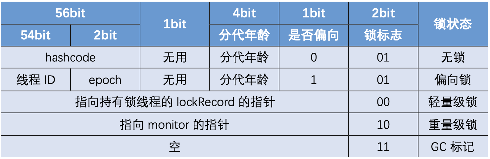
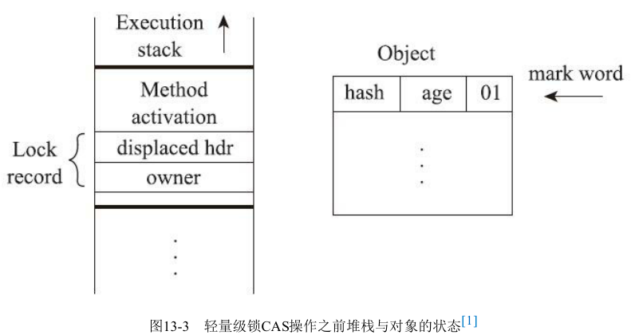
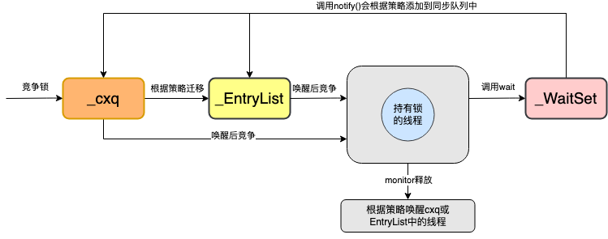
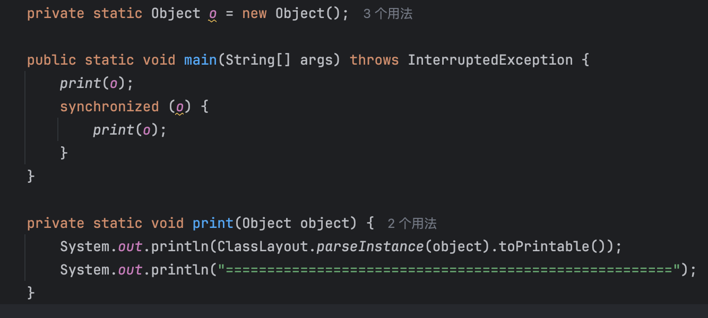
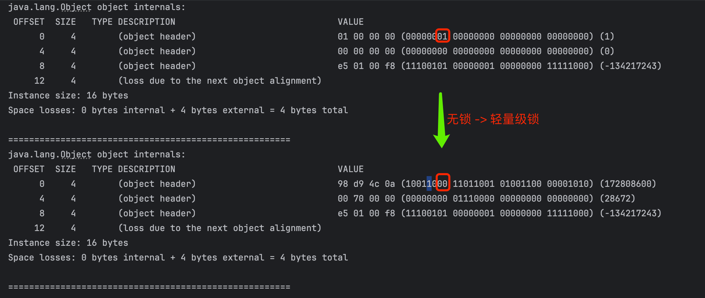
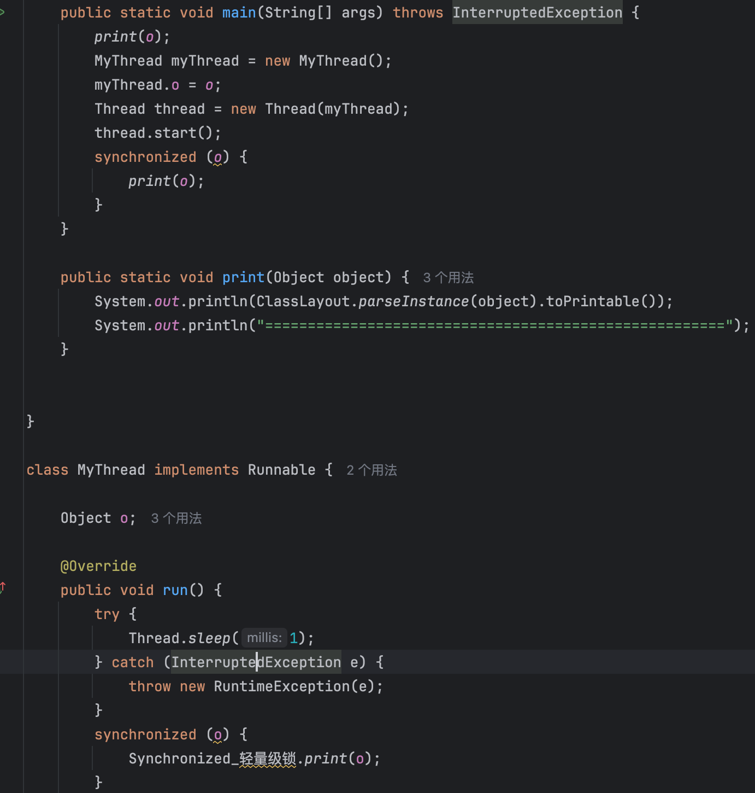
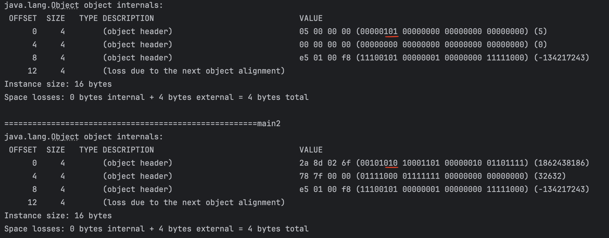

	这是“并发”系列的第四篇文章，主要介绍的是synchronized相关内容。

# 一、synchronized
synchronized 是 Java 中的一个关键字，翻译成中文是同步的意思，主要解决的是多个线程之间访问资源的同步性，可以保证被它修饰的方法或者代码块在任意时刻只能有一个线程执行。

<!-- more -->

在 Java 早期版本中，synchronized 属于 重量级锁，效率低下。这是因为监视器锁（monitor）是依赖于底层的操作系统的 Mutex Lock 来实现的，Java 的线程是映射到操作系统的原生线程之上的。如果要挂起或者唤醒一个线程，都需要操作系统帮忙完成，而操作系统实现线程之间的切换时需要从用户态转换到内核态，这个状态之间的转换需要相对比较长的时间，时间成本相对较高。

不过，在 Java 6 之后， synchronized 引入了大量的优化如自旋锁、适应性自旋锁、锁消除、锁粗化、偏向锁、轻量级锁等技术来减少锁操作的开销，这些优化让 synchronized 锁的效率提升了很多。因此， synchronized 还是可以在实际项目中使用的，像 JDK 源码、很多开源框架都大量使用了 synchronized 。

关于偏向锁多补充一点：由于偏向锁增加了 JVM 的复杂性，同时也并没有为所有应用都带来性能提升。因此，在 JDK15 中，偏向锁被默认关闭（仍然可以使用 -XX:+UseBiasedLocking 启用偏向锁），在 JDK18 中，偏向锁已经被彻底废弃（无法通过命令行打开）。

# 二、Synchronized的使用
先写过个demo，大致过一下synchronized的使用，包含同步代码块、实例方法和静态方法。
```java
public synchronized void test1(){
}
public void test2(){
  synchronized(new Test()){
  }
}
public static synchronized void test3(){
}
```
反编译可查看字节码：
```cpp
public synchronized void test1();
    descriptor: ()V
    flags: ACC_PUBLIC, ACC_SYNCHRONIZED    // here

  public void test2();
    descriptor: ()
    flags: ACC_PUBLIC
    Code:
      stack=2, locals=3, args_size=1
         0: new           #2                  // class com/easy/helloworld/Test
         3: dup
         4: invokespecial #3                  // Method "<init>":()V
         7: dup
         8: astore_1
         9: monitorenter                   // here
        10: aload_1
        11: monitorexit                    // here
        12: goto          20
        15: astore_2
        16: aload_1
        17: monitorexit                    // here
        18: aload_2
        19: athrow
        20: return

  public static synchronized void test3();
    descriptor: ()V
    flags: ACC_PUBLIC, ACC_STATIC, ACC_SYNCHRONIZED   // here
```
可以观察到：
- 同步代码：通过moniterenter、moniterexit 关联到到一个monitor对象，进入时设置Owner为当前线程，计数+1、退出-1。除了正常出口的 monitorexit，还在异常处理代码里插入了 monitorexit。
- 实例方法：隐式调用moniterenter、moniterexit
- 静态方法：隐式调用moniterenter、moniterexit


## 2.1、Moniterenter、Moniterexit
monitorenter和monitorexit这两个jvm指令，主要是基于 Mark Word和ObjectMonitor来实现的。

### 2.1.1、Mark Word
在 JVM 中，对象在内存中分为三块区域：
- 对象内存布局
  - 
- **对象头：** 由Mark Word和Klass Point构成。
  - **Mark Word（标记字段）**：用于存储对象自身的运行时数据，例如存储对象的HashCode，分代年龄、锁标志位等信息，是synchronized实现轻量级锁和偏向锁的关键。 64位JVM的Mark Word组成如下：
    - 
  - **Klass Point（类型指针）**：对象指向它的类元数据的指针，虚拟机通过这个指针来确定这个对象是哪个类的实例。

在JDK 1.6之前,synchronized只有传统的锁机制，直接关联到monitor对象，存在性能上的瓶颈。在JDK 1.6后，为了提高锁的获取与释放效率，JVM引入了两种锁机制：偏向锁和轻量级锁。它们的引入是为了解决在没有多线程竞争或基本没有竞争的场景下因使用传统锁机制带来的性能开销问题。这几种锁的实现和转换正是依靠对象头中的Mark Word。

#### 2.1.1.1、锁的状态
- 无锁态
  - 在没有使用synchronized关键字或其他同步机制的情况下，UnlockedObject的实例在多线程环境下就处于无锁状态
- 偏向锁
  - 偏向锁是 Java 6 引入的一种优化机制，用于减少在没有竞争的情况下获取和释放锁的开销。当一个线程首次访问一个对象的同步代码块时，JVM 会将对象头中的偏向锁标志位设置为偏向该线程。
- 轻量级锁
  - 当有第二个线程尝试访问已经被偏向的对象的同步代码块时，偏向锁会升级为轻量级锁。
- 重量级锁
  - 当多个线程频繁竞争轻量级锁，导致自旋次数过多（JVM 内部有一定的自旋阈值判断）或者有线程长时间无法获取轻量级锁时，轻量级锁会膨胀为重量级锁

### 2.1.2、ObjectMonitor结构体定义（部分关键成员变量）
在 HotSpot JVM 源码中，ObjectMonitor是一个非常重要的结构体，用于实现对象的监视器（monitor）相关功能，它包含了许多关键的成员变量，以下是一些主要部分：
```cpp
class ObjectMonitor {
  // 记录拥有该监视器的线程
  volatile markOop _owner;
  // 等待获取该监视器的线程队列（双向链表）
  WaitQueue _WaitSet;
  // 等待被唤醒的线程队列（单向链表），用于实现Object.wait()相关的等待机制
  ObjectWaiter * volatile _EntryList;
  // 重入计数
  intptr_t _count;
  // 用于区分不同的锁状态等标记位
  intptr_t _recursions;
  // 其他成员变量用于更复杂的同步和等待逻辑，如自旋等
  //...
};
```
- **_owner变量：** 这是一个指向拥有该监视器的线程的指针（通过markOop类型来表示，markOop与对象头相关，用于存储对象的一些标记信息）。当一个线程成功获取对象的监视器（通过monitorenter指令）时，这个变量会被设置为指向该线程，用于标识当前持有锁的线程。
- **_WaitSet变量：** 这是一个等待队列，用于存放那些调用了Object.wait()方法而进入等待状态的线程。这些线程会等待其他线程执行Object.notify()或Object.notifyAll()来唤醒它们。_WaitSet通常是一个双向链表结构，方便线程的插入和移除操作。
- **_EntryList变量：** 它是一个用于存放等待获取监视器的线程的单向链表。当一个线程尝试获取监视器但发现已经被其他线程持有（在重量级锁情况下）时，这个线程会被放入_EntryList中，等待当前持有锁的线程释放锁。
- **_count和_recursions变量：** _count主要用于记录锁的重入次数，类似于monitorenter指令的重入计数。_recursions变量也用于类似的重入相关的记录，在一些复杂的锁状态判断和操作中有重要作用。

#### 2.1.2.1、ObjectMonitor的主要方法及逻辑（以enter和exit方法为例）

##### enter方法（与monitorenter指令相关）
```cpp
void ObjectMonitor::enter(TRAPS) {
    Thread * const Self = THREAD;
    void * cur = Atomic::cmpxchg_ptr(Self, &_owner, NULL);
    if (cur == NULL) {
        // 如果当前没有线程持有监视器，成功获取，设置重入计数等
        _count = 1;
        _recursions = 0;
        return;
    }
    if (cur == Self) {
        // 重入情况，增加重入计数
        _count++;
        return;
    }
    // 处理多个线程竞争锁的情况，将线程放入等待队列等复杂逻辑
    //...
}
```
- 首先，enter方法尝试通过原子操作Atomic::cmpxchg_ptr（这是一个比较并交换操作，类似于CAS）来获取监视器。如果交换成功（即当前没有线程持有监视器，&_owner的值为NULL），那么当前线程成功获取监视器，将_count设置为 1，表示获取了一次锁，_recursions设置为 0（在一些复杂的重入判断场景下会用到）。
- 如果发现&_owner指向当前线程自己，说明是锁的重入情况，此时只需将_count增加 1，允许线程再次进入同步代码块执行。
- 当有其他线程已经持有监视器时，会进入复杂的竞争处理逻辑，可能涉及将线程放入_EntryList等待队列等操作，这部分代码省略了一些细节，在完整的enter方法中会有更详细的关于等待队列的操作以及根据不同的策略（如公平锁或非公平锁策略）来处理线程等待的情况。


##### exit方法（与monitorexit指令相关）
```cpp
void ObjectMonitor::exit(TRAPS) {
    Thread * const Self = THREAD;
    if (THREAD!= _owner) {
        // 如果当前线程不是持有监视器的线程，抛出异常
        //...
        return;
    }
    _count--;
    if (_count == 0) {
        // 当重入计数为0时，完全释放监视器
        _recursions = 0;
        // 唤醒等待队列中的线程等复杂逻辑
        //...
    }
}
```
- 首先，exit方法会检查当前线程是否是持有监视器的线程（通过比较THREAD和_owner）。如果不是，可能会抛出异常（在实际代码中有更详细的异常处理逻辑），因为只有持有监视器的线程才能执行exit操作来释放锁。
- 然后，将_count减 1，用于记录锁的重入次数递减。当_count变为 0 时，表示当前线程已经完全释放了监视器。此时会将_recursions也设置为 0，并进入唤醒等待队列中的线程等复杂逻辑，包括从_EntryList中选择合适的线程（根据公平锁或非公平锁策略）来唤醒，使其有机会获取监视器。这部分逻辑涉及到对等待队列的操作以及与操作系统调度相关的一些交互，以确保线程能够正确地获取和释放监视器。

这些ObjectMonitor的源码细节展示了 JVM 是如何在底层实现对象的监视器机制，从而支持 Java 中的synchronized关键字相关的同步操作，确保在多线程环境下代码执行的正确性和数据的安全性。

## 2.2、偏向锁
引入偏向锁的目的：
> 在没有多线程竞争的情况下，尽量减少不必要的轻量级锁的执行。轻量级锁的获取及释放依赖多次CAS原子指令，而偏向锁只依赖一次CAS原子指令。但在多线程竞争时，需要进行偏向锁撤销步骤，因此其撤销的开销必须小于节省下来的CAS开销，否则偏向锁并不能带来收益。JDK 1.6中默认开启偏向锁，可以通过-XX:-UseBiasedLocking来禁用偏向锁。

### 2.2.1、进入偏向锁


### 2.2.2、偏向锁获取流程
下面开始偏向锁获取流程分析，代码在bytecodeInterpreter.cpp#1816。注意本文代码都有所删减。
```cpp
CASE(_monitorenter): {
  // lockee 就是锁对象
  oop lockee = STACK_OBJECT(-1);
  // derefing's lockee ought to provoke implicit null check
  CHECK_NULL(lockee);
  // code 1：找到一个空闲的Lock Record
  BasicObjectLock* limit = istate->monitor_base();
  BasicObjectLock* most_recent = (BasicObjectLock*) istate->stack_base();
  BasicObjectLock* entry = NULL;
  while (most_recent != limit ) {
    if (most_recent->obj() == NULL) entry = most_recent;
    else if (most_recent->obj() == lockee) break;
    most_recent++;
  }
  //entry不为null，代表还有空闲的Lock Record
  if (entry != NULL) {
    // code 2：将Lock Record的obj指针指向锁对象
    entry->set_obj(lockee);
    int success = false;
    uintptr_t epoch_mask_in_place = (uintptr_t)markOopDesc::epoch_mask_in_place;
	// markoop即对象头的mark word
    markOop mark = lockee->mark();
    intptr_t hash = (intptr_t) markOopDesc::no_hash;
    // code 3：如果锁对象的mark word的状态是偏向模式
    if (mark->has_bias_pattern()) {
      uintptr_t thread_ident;
      uintptr_t anticipated_bias_locking_value;
      thread_ident = (uintptr_t)istate->thread();
     // code 4：这里有几步操作，下文分析
      anticipated_bias_locking_value =
        (((uintptr_t)lockee->klass()->prototype_header() | thread_ident) ^ (uintptr_t)mark) &
        ~((uintptr_t) markOopDesc::age_mask_in_place);
	 // code 5：如果偏向的线程是自己且epoch等于class的epoch
      if  (anticipated_bias_locking_value == 0) {
        // already biased towards this thread, nothing to do
        if (PrintBiasedLockingStatistics) {
          (* BiasedLocking::biased_lock_entry_count_addr())++;
        }
        success = true;
      }
       // code 6：如果偏向模式关闭，则尝试撤销偏向锁
      else if ((anticipated_bias_locking_value & markOopDesc::biased_lock_mask_in_place) != 0) {
        markOop header = lockee->klass()->prototype_header();
        if (hash != markOopDesc::no_hash) {
          header = header->copy_set_hash(hash);
        }
        // 利用CAS操作将mark word替换为class中的mark word
        if (Atomic::cmpxchg_ptr(header, lockee->mark_addr(), mark) == mark) {
          if (PrintBiasedLockingStatistics)
            (*BiasedLocking::revoked_lock_entry_count_addr())++;
        }
      }
         // code 7：如果epoch不等于class中的epoch，则尝试重偏向
      else if ((anticipated_bias_locking_value & epoch_mask_in_place) !=0) {
        // 构造一个偏向当前线程的mark word
        markOop new_header = (markOop) ( (intptr_t) lockee->klass()->prototype_header() | thread_ident);
        if (hash != markOopDesc::no_hash) {
          new_header = new_header->copy_set_hash(hash);
        }
        // CAS替换对象头的mark word
        if (Atomic::cmpxchg_ptr((void*)new_header, lockee->mark_addr(), mark) == mark) {
          if (PrintBiasedLockingStatistics)
            (* BiasedLocking::rebiased_lock_entry_count_addr())++;
        }
        else {
          // 重偏向失败，代表存在多线程竞争，则调用monitorenter方法进行锁升级
          CALL_VM(InterpreterRuntime::monitorenter(THREAD, entry), handle_exception);
        }
        success = true;
      }
      else {
         // 走到这里说明当前要么偏向别的线程，要么是匿名偏向（即没有偏向任何线程）
       	// code 8：下面构建一个匿名偏向的mark word，尝试用CAS指令替换掉锁对象的mark word
        markOop header = (markOop) ((uintptr_t) mark & ((uintptr_t)markOopDesc::biased_lock_mask_in_place |(uintptr_t)markOopDesc::age_mask_in_place |epoch_mask_in_place));
        if (hash != markOopDesc::no_hash) {
          header = header->copy_set_hash(hash);
        }
        markOop new_header = (markOop) ((uintptr_t) header | thread_ident);
        // debugging hint
        DEBUG_ONLY(entry->lock()->set_displaced_header((markOop) (uintptr_t) 0xdeaddead);)
        if (Atomic::cmpxchg_ptr((void*)new_header, lockee->mark_addr(), header) == header) {
           // CAS修改成功
          if (PrintBiasedLockingStatistics)
            (* BiasedLocking::anonymously_biased_lock_entry_count_addr())++;
        }
        else {
          // 如果修改失败说明存在多线程竞争，所以进入monitorenter方法
          CALL_VM(InterpreterRuntime::monitorenter(THREAD, entry), handle_exception);
        }
        success = true;
      }
    }

    // 如果偏向线程不是当前线程或没有开启偏向模式等原因都会导致success==false
    if (!success) {
      // 轻量级锁的逻辑
      //code 9: 构造一个无锁状态的Displaced Mark Word，并将Lock Record的lock指向它
      markOop displaced = lockee->mark()->set_unlocked();
      entry->lock()->set_displaced_header(displaced);
      //如果指定了-XX:+UseHeavyMonitors，则call_vm=true，代表禁用偏向锁和轻量级锁
      bool call_vm = UseHeavyMonitors;
      // 利用CAS将对象头的mark word替换为指向Lock Record的指针
      if (call_vm || Atomic::cmpxchg_ptr(entry, lockee->mark_addr(), displaced) != displaced) {
        // 判断是不是锁重入
        if (!call_vm && THREAD->is_lock_owned((address) displaced->clear_lock_bits())) {		//code 10: 如果是锁重入，则直接将Displaced Mark Word设置为null
          entry->lock()->set_displaced_header(NULL);
        } else {
          CALL_VM(InterpreterRuntime::monitorenter(THREAD, entry), handle_exception);
        }
      }
    }
    UPDATE_PC_AND_TOS_AND_CONTINUE(1, -1);
  } else {
    // lock record不够，重新执行
    istate->set_msg(more_monitors);
    UPDATE_PC_AND_RETURN(0); // Re-execute
  }
}
```

偏向锁流程：
- 步骤 1、从当前线程的栈中找到一个空闲的Lock Record，并指向当前锁对象。
- 步骤 2、获取对象的markOop数据mark，即对象头的Mark Word；
- 步骤 3、判断锁对象的mark word是否是偏向模式，即低3位是否为101。若不是，进入步骤4。若是，计算anticipated_bias_locking_value，判断偏向状态：
  - 步骤 3.1、anticipated_bias_locking_value若为0，代表偏向的线程是当前线程且mark word的epoch等于class的epoch，这种情况下直接执行同步代码块，什么都不用做。
  - 步骤 3.2、判断class的prototype_header是否为非偏向模式。若为非偏向模式，CAS尝试将对象恢复为无锁状态。无论cas是否成功都会进入轻量级锁逻辑。
  - 步骤 3.3、如果epoch偏向时间戳已过期，则需要重偏向。利用CAS指令将锁对象的mark word替换为一个偏向当前线程且epoch为类的epoch的新的mark word。
  - 步骤 3.4、CAS将偏向线程改为当前线程，如果当前是匿名偏向（即对象头中的bit field存储的Thread ID为空）且无并发冲突，则能修改成功获取偏向锁，否则进入锁升级的逻辑。
- 步骤 4、走到一步会进行轻量级锁逻辑。构造一个无锁状态的mark word，然后存储到Lock Record。设置为无锁状态的原因是：轻量级锁解锁时是将对象头的mark wordcas替换为Lock Record中的Displaced Mark Word，所以设置为无锁状态。如果是锁重入，则将Lock Record的Displaced Mark Word设置为null，放到栈帧中，起到计数作用。

以上是偏向锁加锁的大致流程，如果当前锁已偏向其他线程||epoch值过期||class偏向模式关闭||获取偏向锁的过程中存在并发冲突，都会进入到InterpreterRuntime::monitorenter方法， 在该方法中会进行偏向锁撤销和升级。流程如下图所示：


**Issue：** 有的同学可能会问了，对象一开始不是无锁状态吗，为什么上述偏向锁逻辑没有判断无锁状态的锁对象（001）？
> 只有匿名偏向的对象才能进入偏向锁模式。<font color=red>JVM启动时会延时初始化偏向锁，默认是4000ms。</font>初始化后会将所有加载的Klass的prototype header修改为匿名偏向样式。当创建一个对象时，会通过Klass的prototype_header来初始化该对象的对象头。简单的说，偏向锁初始化结束后，后续所有对象的对象头都为匿名偏向样式，在此之前创建的对象则为无锁状态。而对于无锁状态的锁对象，如果有竞争，会直接进入到轻量级锁。这也是为什么JVM启动前4秒对象会直接进入到轻量级锁的原因。

**为什么需要延迟初始化？**
> <font color=red>JVM启动时必不可免会有大量sync的操作，而偏向锁并不是都有利</font>。如果开启了偏向锁，会发生大量锁撤销和锁升级操作，大大降低JVM启动效率。

因此，我们可以明确地说，只有锁对象处于匿名偏向状态，线程才能拿到到我们通常意义上的偏向锁。而处于无锁状态的锁对象，只能进入到轻量级锁状态。

### 2.2.3、偏向锁的撤销
偏向锁的 **撤销（revoke）**  是一个很特殊的操作，为了执行撤销操作，需要等待全局安全点，此时所有的工作线程都停止了执行。偏向锁的撤销操作并不是将对象恢复到无锁可偏向的状态（**注意区分偏向锁撤销和释放这两个概念，撤销的触发见上图**），而是在偏向锁的获取过程中，发现竞争时，直接将一个被偏向的对象升级到被加了轻量级锁的状态。这个操作的具体完成方式如下：
```cpp
IRT_ENTRY_NO_ASYNC(void, InterpreterRuntime::monitorenter(JavaThread* thread, BasicObjectLock* elem))  
  ...
  Handle h_obj(thread, elem->obj());
  assert(Universe::heap()->is_in_reserved_or_null(h_obj()),
         "must be NULL or an object");
    // 开启了偏向锁
  if (UseBiasedLocking) {
    // Retry fast entry if bias is revoked to avoid unnecessary inflation
    ObjectSynchronizer::fast_enter(h_obj, elem->lock(), true, CHECK);
  } else {
    ObjectSynchronizer::slow_enter(h_obj, elem->lock(), CHECK);
  }
  ...
```
如果开启了JVM偏向锁，则会进入到ObjectSynchronizer::fast_enter方法中。
```cpp
void ObjectSynchronizer::fast_enter(Handle obj, BasicLock* lock, bool attempt_rebias, TRAPS) {  
 //再次校验
 if (UseBiasedLocking) {
    if (!SafepointSynchronize::is_at_safepoint()) {
      //不在安全点的执行
      BiasedLocking::Condition cond = BiasedLocking::revoke_and_rebias(obj, attempt_rebias, THREAD);
      if (cond == BiasedLocking::BIAS_REVOKED_AND_REBIASED) {
        return;
      }
    } else {
      assert(!attempt_rebias, "can not rebias toward VM thread");    
      //批量撤销,底层调用bulk_revoke_or_rebias_at_safepoint
      BiasedLocking::revoke_at_safepoint(obj);
    }
    assert(!obj->mark()->has_bias_pattern(), "biases should be revoked by now");
 }
 slow_enter (obj, lock, THREAD) ;
}
```
主要看BiasedLocking::revoke_and_rebias方法。这个方法的主要作用像它的方法名：撤销或者重偏向。第一个参数封装了锁对象和当前线程，第二个参数代表是否允许重偏向，这里是true。
```cpp
BiasedLocking::Condition BiasedLocking::revoke_and_rebias(Handle obj, bool attempt_rebias, TRAPS) {  
  assert(!SafepointSynchronize::is_at_safepoint(), "must not be called while at safepoint");
  markOop mark = obj->mark(); //获取锁对象的对象头
  if (mark->is_biased_anonymously() && !attempt_rebias) {
    // 如果锁对象为匿名偏向状态且不允许重偏向下，进入该分支。在一个非全局安全点进行偏向锁撤销
    markOop biased_value       = mark;
    // 创建一个匿名偏向的markword
    markOop unbiased_prototype = markOopDesc::prototype()->set_age(mark->age());
    // 通过cas重新设置偏向锁状态
    markOop res_mark = (markOop) Atomic::cmpxchg_ptr(unbiased_prototype, obj->mark_addr(), mark);
    if (res_mark == biased_value) {// 如果CAS成功，返回偏向锁撤销状态
      return BIAS_REVOKED;
    }
  } else if (mark->has_bias_pattern()) {
    // 锁为偏向模式（101）会走到这里 
    Klass* k = obj->klass(); 
    markOop prototype_header = k->prototype_header();
    // 如果对应class关闭了偏向模式
    if (!prototype_header->has_bias_pattern()) {
      markOop biased_value       = mark;
      // CAS更新对象头markword为非偏向锁
      markOop res_mark = (markOop) Atomic::cmpxchg_ptr(prototype_header, obj->mark_addr(), mark);
      assert(!(*(obj->mark_addr()))->has_bias_pattern(), "even if we raced, should still be revoked");
      return BIAS_REVOKED; // 返回偏向锁撤销状态
    } else if (prototype_header->bias_epoch() != mark->bias_epoch()) {
      // 如果epoch过期，则进入当前分支
      if (attempt_rebias) {
        // 如果允许重偏
        assert(THREAD->is_Java_thread(), "");
        markOop biased_value       = mark;
        markOop rebiased_prototype = markOopDesc::encode((JavaThread*) THREAD, mark->age(), prototype_header->bias_epoch());
        // 通过CAS操作， 将本线程的 ThreadID 、时间戳、分代年龄尝试写入对象头中
        markOop res_mark = (markOop) Atomic::cmpxchg_ptr(rebiased_prototype, obj->mark_addr(), mark);
        if (res_mark == biased_value) { //CAS成功，则返回撤销和重新偏向状态
          return BIAS_REVOKED_AND_REBIASED;
        }
      } else {
        // 如果不允许尝试获取偏向锁，进入该分支取消偏向
        // 通过CAS操作更新分代年龄
        markOop biased_value       = mark;
        markOop unbiased_prototype = markOopDesc::prototype()->set_age(mark->age());
        markOop res_mark = (markOop) Atomic::cmpxchg_ptr(unbiased_prototype, obj->mark_addr(), mark);
        if (res_mark == biased_value) { //如果CAS操作成功，返回偏向锁撤销状态
          return BIAS_REVOKED;
        }
      }
    }
  }
  //执行到这里有以下两种情况：
  //1.对象不是偏向模式
  //2.上面的cas操作失败
  HeuristicsResult heuristics = update_heuristics(obj(), attempt_rebias);
  if (heuristics == HR_NOT_BIASED) {
    // 非偏向从这出去
    // 轻量级锁、重量级锁
    return NOT_BIASED;
  } else if (heuristics == HR_SINGLE_REVOKE) {
    // 撤销单个线程
    // Mark，最常见的执行分支
    // Mark，最常见的执行分支
    // Mark，最常见的执行分支
    Klass *k = obj->klass();
    markOop prototype_header = k->prototype_header();
    if (mark->biased_locker() == THREAD &&
        prototype_header->bias_epoch() == mark->bias_epoch()) {
      // 偏向当前线程且不过期
      // 这里撤销的是偏向当前线程的锁，调用Object#hashcode方法时也会走到这一步
      // 因为只要遍历当前线程的栈就能拿到lock record了，所以不需要等到safe point再撤销。
      ResourceMark rm;
      if (TraceBiasedLocking) {
        tty->print_cr("Revoking bias by walking my own stack:");
      }
      BiasedLocking::Condition cond = revoke_bias(obj(), false, false, (JavaThread*) THREAD);
      ((JavaThread*) THREAD)->set_cached_monitor_info(NULL);
      assert(cond == BIAS_REVOKED, "why not?");
      return cond;
    } else {
      // 下面代码最终会在safepoint调用revoke_bias方法撤销偏向
      VM_RevokeBias revoke(&obj, (JavaThread*) THREAD);
      VMThread::execute(&revoke);
      return revoke.status_code();
    }
  }
  assert((heuristics == HR_BULK_REVOKE) ||
         (heuristics == HR_BULK_REBIAS), "?");
   //批量撤销、批量重偏向的逻辑
  VM_BulkRevokeBias bulk_revoke(&obj, (JavaThread*) THREAD,
                                (heuristics == HR_BULK_REBIAS),
                                attempt_rebias);
  VMThread::execute(&bulk_revoke);
  return bulk_revoke.status_code();
}
```
这块代码注释写的算是比较清楚，只简单介绍下最常见的情况：锁已经偏向线程A，此时线程B尝试获取锁。这种情况下会走到Mark标记的分支。如果需要撤销的是当前线程，只要遍历当前线程的栈就能拿到lock record，可以直接调用revoke_bias，不需要等到safe point再撤销。在调用Object#hashcode时，也会走到该分支将为偏向锁的锁对象直接恢复为无锁状态。若不是当前线程，会被push到VM Thread中等到safepoint的时候再执行。

VMThread内部维护了一个VMOperationQueue类型的队列，用于保存内部提交的VM线程操作VM_operation。GC、偏向锁的撤销等操作都是在这里被执行。

撤销调用的revoke_bias方法的代码就不贴了。大致逻辑是：
- 步骤 1、查看偏向的线程是否存活，如果已经死亡，则直接撤销偏向锁。JVM维护了一个集合存放所有存活的线程，通过遍历该集合判断某个线程是否存活。
- 步骤 2、偏向的线程是否还在同步块中，如果不在，则撤销偏向锁。如果在同步块中，执行步骤3。这里是否在同步块的判断基于上文提到的偏向锁的重入计数方式：在偏向锁的获取中，每次进入同步块的时候都会在栈中找到第一个可用（即栈中最高的）的Lock Record，将其obj字段指向锁对象。每次解锁的时候都会把最低的Lock Record移除掉，所以可以通过遍历线程栈中的Lock Record来判断是否还在同步块中。轻量级锁的重入也是基于Lock Record的计数来判断。
- 步骤 3、升级为轻量级锁。将偏向线程所有相关Lock Record的Displaced Mark Word设置为null，再将最高位的Lock Record的Displaced Mark Word 设置为无锁状态，然后将对象头指向最高位的Lock Record。这里没有用到CAS指令，因为是在safepoint，可以直接升级成轻量级锁。

### 2.2.4、偏向锁的释放
偏向锁的释放可参考bytecodeInterpreter.cpp#1923，这里也不贴了。偏向锁的释放只要将对应Lock Record释放就好了，但这里的释放并不会将mark word里面的thread ID去掉，这样做是为了下一次更方便的加锁。而轻量级锁则需要将Displaced Mark Word替换到对象头的mark word中。如果CAS失败或者是重量级锁则进入到InterpreterRuntime::monitorexit方法中。

### 2.2.5、批量重偏向与撤销
从上节偏向锁的加锁解锁过程中可以看出，当只有一个线程反复进入同步块时，偏向锁带来的性能开销基本可以忽略，但是当有其他线程尝试获得锁时，就需要等到safe point时将偏向锁撤销为无锁状态或升级为轻量级/重量级锁。因此，JVM中增加了一种批量重偏向/撤销的机制以减少锁撤销的开销，而mark word中的epoch也是在这里被大量应用，这里不展开说明。但无论怎么优化，偏向锁的撤销仍有一定不可避免的成本。如果业务场景存在大量多线程竞争，那偏向锁的存在不仅不能提高性能，而且会导致性能下降（**偏向锁并不都有利，jdk15默认不开启**）。

## 2.3、轻量级锁
引入轻量级锁的目的：在多线程交替执行同步块的情况下，尽量避免重量级锁使用的操作系统互斥量带来的开销，但是如果多个线程在同一时刻进入临界区，会导致轻量级锁膨胀升级重量级锁，所以轻量级锁的出现并非是要替代重量级锁。

### 2.3.1、轻量级锁的实现
在线程栈桢中创建Lock Record空间，将对象的mark word拷贝至Lock Record空间内，然后通过CAS操作将Mark Word更新为指向Lock Record的指针，Lock Record的owner指向对象的Mark Word
- 栈桢创建Lock Record空间
- Mark word拷贝至Lock Record
- Mark Word记录Lock Record的指针
- lock Record的owner保存Mark Word

虚拟机将使用CAS操作尝试把对象的Mark word更新为指向Lock Record的指针


### 2.3.1、进入轻量级锁
轻量级锁在上文或多或少已经涉及到，其获取流程入口为bytecodeInterpreter.cpp#1816。前大半部分都是偏向锁逻辑，还有一部分为轻量级锁逻辑。在偏向锁逻辑中，cas失败会执行到InterpreterRuntime::monitorenter。在轻量级锁逻辑中，如果当前线程不是轻量级锁的重入，也会执行到InterpreterRuntime::monitorenter。我们再看看InterpreterRuntime::monitorenter方法：
```cpp
IRT_ENTRY_NO_ASYNC(void, InterpreterRuntime::monitorenter(JavaThread* thread, BasicObjectLock* elem))  
  ...
  Handle h_obj(thread, elem->obj());
  assert(Universe::heap()->is_in_reserved_or_null(h_obj()),
         "must be NULL or an object");
  if (UseBiasedLocking) {
    // Retry fast entry if bias is revoked to avoid unnecessary inflation
    ObjectSynchronizer::fast_enter(h_obj, elem->lock(), true, CHECK);
  } else {
    ObjectSynchronizer::slow_enter(h_obj, elem->lock(), CHECK);
  }
  ...
IRT_END  
```

### 2.3.2、轻量级锁的释放
轻量级锁释放的入口在bytecodeInterpreter.cpp#1923。

轻量级锁释放时需要将Displaced Mark Word替换回对象头的mark word中。如果CAS失败或者是重量级锁则进入到InterpreterRuntime::monitorexit方法中。monitorexit直接调用slow_exit方法释放Lock Record。直接看slow_exit：
```cpp
IRT_ENTRY_NO_ASYNC(void, InterpreterRuntime::monitorexit(JavaThread* thread, BasicObjectLock* elem))  
  Handle h_obj(thread, elem->obj());
  assert(Universe::heap()->is_in_reserved_or_null(h_obj()),
         "must be NULL or an object");
  if (elem == NULL || h_obj()->is_unlocked()) {
    THROW(vmSymbols::java_lang_IllegalMonitorStateException());
  }
  // 直接调用slow_exit
  ObjectSynchronizer::slow_exit(h_obj(), elem->lock(), thread);
  // Free entry. This must be done here, since a pending exception might be installed on
  // exit. If it is not cleared, the exception handling code will try to unlock the monitor again.
  elem->set_obj(NULL);
IRT_END

void ObjectSynchronizer::slow_exit(oop object, BasicLock* lock, TRAPS) {  
  fast_exit (object, lock, THREAD) ;
}

void ObjectSynchronizer::fast_exit(oop object, BasicLock* lock, TRAPS) {  
  ...
  // displaced header就是对象mark word的拷贝
  markOop dhw = lock->displaced_header();
  markOop mark ;
  if (dhw == NULL) {
     // 什么也不做
     // Recursive stack-lock. 递归堆栈锁
     // Diagnostics -- Could be: stack-locked, inflating, inflated. 
     ...
     return ;
  }
  mark = object->mark() ;
  // 此处为轻量级锁的释放过程，使用CAS方式解锁。
  // 如果对象被当前线程堆栈锁定，尝试将displaced header和锁对象中的MarkWord替换回来。
  // If the object is stack-locked by the current thread, try to
  // swing the displaced header from the box back to the mark.
  if (mark == (markOop) lock) {
     assert (dhw->is_neutral(), "invariant") ;
     if ((markOop) Atomic::cmpxchg_ptr (dhw, object->mark_addr(), mark) == mark) {
        TEVENT (fast_exit: release stacklock) ;
        return;
     }
  }
  //走到这里说明已经是重量级锁或者解锁时发生了竞争，膨胀后再调用monitor的exit方法释放
  ObjectSynchronizer::inflate(THREAD, object)->exit (true, THREAD) ;
}
```
最后执行的是如果是fast_exit方法。如果是轻量级锁，尝试cas替换mark word。若解锁时有竞争，会调用inflate方法进行重量级锁膨胀，升级到到重量级锁后再执行exit方法。


## 2.4、重量级锁

### 2.4.1、重量级锁的进入
重量级锁通过对象内部的监视器（monitor）实现，其依赖于底层操作系统的Mutex Lock实现，需要额外的用户态到内核态切换的开销。由上文分析，slow_enter获取轻量级锁未成功时，会在inflate中完成锁膨胀：

```cpp
ObjectMonitor * ATTR ObjectSynchronizer::inflate (Thread * Self, oop object) {  
  ...
  for (;;) {
      const markOop mark = object->mark() ;
      assert (!mark->has_bias_pattern(), "invariant") ;  
      // mark是以下状态中的一种：
      // *  Inflated（重量级锁状态）     - 直接返回
      // *  Stack-locked（轻量级锁状态） - 膨胀
      // *  INFLATING（膨胀中）    - 忙等待直到膨胀完成
      // *  Neutral（无锁状态）      - 膨胀
      // *  BIASED（偏向锁）       - 非法状态，在这里不会出现

      // CASE: inflated
      if (mark->has_monitor()) {
          // 已经是重量级锁状态了，直接返回
          ObjectMonitor * inf = mark->monitor() ;
          ...
          return inf ;
      }
      // CASE: inflation in progress
      if (mark == markOopDesc::INFLATING()) {
         // 正在膨胀中，说明另一个线程正在进行锁膨胀，continue重试
         TEVENT (Inflate: spin while INFLATING) ;
         // 在该方法中会进行spin/yield/park等操作完成自旋动作 
         ReadStableMark(object) ;
         continue ;
      }
      // 当前是轻量级锁，后面分析
      // CASE: stack-locked
          if (mark->has_locker()) {
        ...
      }
      // 无锁状态
      // CASE: neutral
      // 分配以及初始化ObjectMonitor对象
      ObjectMonitor * m = omAlloc (Self) ;
      // prepare m for installation - set monitor to initial state
      m->Recycle();
      m->set_header(mark);
      // owner为NULL
      m->set_owner(NULL);
      m->set_object(object);
      m->OwnerIsThread = 1 ;
      m->_recursions   = 0 ;
      m->_Responsible  = NULL ;
      m->_SpinDuration = ObjectMonitor::Knob_SpinLimit ;       // consider: keep metastats by type/class
        // 用CAS替换对象头的mark word为重量级锁状态
      if (Atomic::cmpxchg_ptr (markOopDesc::encode(m), object->mark_addr(), mark) != mark) {
          // 不成功说明有另外一个线程在执行inflate，释放monitor对象
          m->set_object (NULL) ;
          m->set_owner  (NULL) ;
          m->OwnerIsThread = 0 ;
          m->Recycle() ;
          omRelease (Self, m, true) ;
          m = NULL ;
          continue ;
          // interference - the markword changed - just retry.
          // The state-transitions are one-way, so there's no chance of
          // live-lock -- "Inflated" is an absorbing state.
      }

      ...
      return m ;
}
```
inflate其中是一个for循环，主要是为了处理多线程同时调用inflate的情况。然后会根据锁对象的状态进行不同的处理：
1. 已经是重量级状态，说明膨胀已经完成，返回并继续执行ObjectMonitor::enter方法。
2. 如果是轻量级锁则需要进行膨胀操作。
3. 如果是膨胀中状态，则进行忙等待。
4. 如果是无锁状态则需要进行膨胀操作。

轻量级锁膨胀流程如下：
```cpp
if (mark->has_locker()) {  
  // 步骤1
  // 当前轻量级锁状态，先分配一个ObjectMonitor对象，并初始化值
  ObjectMonitor * m = omAlloc (Self) ;          
  m->Recycle();
  m->_Responsible  = NULL ;
  m->OwnerIsThread = 0 ;
  m->_recursions   = 0 ;
  m->_SpinDuration = ObjectMonitor::Knob_SpinLimit ;   // Consider: maintain by type/class
  // 步骤2
  // 将锁对象的mark word设置为INFLATING (0)状态 
  markOop cmp = (markOop) Atomic::cmpxchg_ptr (markOopDesc::INFLATING(), object->mark_addr(), mark) ;
  if (cmp != mark) {
    omRelease (Self, m, true) ;
    continue ;       // Interference -- just retry
  }
  // 步骤3
  // 栈中的displaced mark word
  markOop dmw = mark->displaced_mark_helper() ;
  assert (dmw->is_neutral(), "invariant") ;
  // 设置monitor的字段
  m->set_header(dmw) ;
  // owner为Lock Record
  m->set_owner(mark->locker());
  m->set_object(object);
  ...
  // 步骤4
  // 将锁对象头设置为重量级锁状态
  object->release_set_mark(markOopDesc::encode(m));
  ...
  return m ;
}
```
- **步骤 1、** 调用omAlloc获取一个可用的ObjectMonitor对象。在omAlloc方法中会先从线程私有的monitor集合omFreeList中分配对象，如果omFreeList中已经没有monitor对象，则从JVM全局的gFreeList中分配一批monitor到omFreeList中；
- **步骤 2、** 通过CAS尝试将Mark Word设置为markOopDesc:INFLATING，标识当前锁正在膨胀中。如果CAS失败，说明同一时刻其它线程已经将Mark Word设置为markOopDesc:INFLATING，当前线程进行自旋等待膨胀完成。
- **步骤 3、** 如果CAS成功，设置monitor的各个字段：设置monitor的header字段为displaced mark word，owner字段为Lock Record，obj字段为锁对象等；
- **步骤 4、** 设置锁对象头的mark word为重量级锁状态，指向第一步分配的monitor对象；


### 2.4.2、monitor竞争
当锁膨胀inflate执行完并返回对应的ObjectMonitor时，并不表示该线程竞争到了锁，真正的锁竞争发生在ObjectMonitor::enter方法中。
```cpp
void ATTR ObjectMonitor::enter(TRAPS) {  
  Thread * const Self = THREAD ;
  void * cur ;
  // 步骤1
  // owner为null，如果能CAS设置成功，则当前线程直接获得锁
  cur = Atomic::cmpxchg_ptr (Self, &_owner, NULL) ;
  if (cur == NULL) {
     ...
     return ;
  }
  // 如果是重入的情况
  if (cur == Self) {
     // TODO-FIXME: check for integer overflow!  BUGID 6557169.
     _recursions ++ ;
     return ;
  }
  // 步骤2
  // 如果当前线程是之前持有轻量级锁的线程
  // 上节轻量级锁膨胀将owner指向之前Lock Record的指针
  // 这里利用owner判断是否第一次进入。
  if (Self->is_lock_owned ((address)cur)) {
    assert (_recursions == 0, "internal state error");
    // 重入计数重置为1
    _recursions = 1 ;
    // 设置owner字段为当前线程
    _owner = Self ;
    OwnerIsThread = 1 ;
    return ;
  }
  ...
  // 步骤3
  // 在调用系统的同步操作之前，先尝试自旋获得锁
  if (Knob_SpinEarly && TrySpin (Self) > 0) {    
     ...
     //自旋的过程中获得了锁，则直接返回
     Self->_Stalled = 0 ;
     return ;
  }
  ...
  { 
    ...
    // 步骤4
    for (;;) {
      jt->set_suspend_equivalent();
      // 在该方法中调用系统同步操作
      EnterI (THREAD) ;
      ...
    }
    Self->set_current_pending_monitor(NULL); 
  }
  ...
}
```
- **步骤 1、** 当前是无锁、锁重入，简单操作后返回。
- **步骤 2、** 当前线程是之前持有轻量级锁的线程，则为首次进入，设置recursions为1，owner为当前线程，该线程成功获得锁并返回。
- **步骤 3、** 先自旋尝试获得锁，尽可能减少同步操作带来的开销。
- **步骤 4、** 调用EnterI方法。

这里注意，轻量级锁膨胀成功时，会把owner字段设置为Lock Record的指针，并在竞争时判断。这么做的原因是，假设当前线程A持有锁对象的锁，线程B进入同步代码块，并把锁对象升级为重量级锁。但此时，线程A可能还在执行，并无法感知其持有锁对象的变化。因此，需要线程B在执行ObjectMonitor::enter时，将自己放入到阻塞等列等待。并需要线程A第二次进入、或者退出的时候对monitor进行一些操作，以此保证代码块的同步。

这里有个**自旋**操作，直接看TrySpin对应的方法：
```cpp
// TrySpin对应的方法
int ObjectMonitor::TrySpin_VaryDuration (Thread * Self) {  
    // Dumb, brutal spin.  Good for comparative measurements against adaptive spinning.
    int ctr = Knob_FixedSpin ;  // 固定自旋次数
    if (ctr != 0) {
        while (--ctr >= 0) {
            if (TryLock (Self) > 0) return 1 ;
            //当一个线程在自旋等待获取锁时，调用SpinPause()可以让线程暂停执行一小段时间，以减少 CPU 资源的过度占用，同时也给其他线程足够的时间来释放锁。
            SpinPause () ;
        }
        return 0 ;
    }
    // 上一次自旋次数
    for (ctr = Knob_PreSpin + 1; --ctr >= 0 ; ) {
      if (TryLock(Self) > 0) {  // 尝试获取锁
        // Increase _SpinDuration ...
        // Note that we don't clamp SpinDuration precisely at SpinLimit.
        // Raising _SpurDuration to the poverty line is key.
        int x = _SpinDuration ;
        if (x < Knob_SpinLimit) {
           if (x < Knob_Poverty) x = Knob_Poverty ;
           _SpinDuration = x + Knob_BonusB ;
        }
        return 1 ;
      }
      ...
      ...
```
从方法名和注释可以看出，这就是自适应自旋，和网上说的轻量级锁cas失败会自旋的说法并不一致。实际上，无论是轻量级锁cas自旋还是重量级锁cas自旋，都是在用户态尽可能减少同步操作带来的开销，并没有太多本质上的区别。 到此为止，我们可以再结合上述的内容，整理出如下的状态转换图：


### 2.4.3、monitor等待
ObjectMonitor竞争失败的线程，通过自旋执行ObjectMonitor::EnterI方法等待锁的释放，EnterI方法的部分逻辑实现如下：
```cpp
void ATTR ObjectMonitor::EnterI (TRAPS) {  
        // 尝试自旋
    if (TrySpin (Self) > 0) {
        ...
        return ;
    }
    ...
    // 将线程封装成node节点中
    ObjectWaiter node(Self) ;
    Self->_ParkEvent->reset() ;
    node._prev   = (ObjectWaiter *) 0xBAD ;
    node.TState  = ObjectWaiter::TS_CXQ ;
    // 将node节点插入到_cxq队列的头部，cxq是一个单向链表
    ObjectWaiter * nxt ;
    for (;;) {
        node._next = nxt = _cxq ;
        if (Atomic::cmpxchg_ptr (&node, &_cxq, nxt) == nxt) break ;
        // CAS失败的话 再尝试获得锁，这样可以降低插入到_cxq队列的频率
        if (TryLock (Self) > 0) {
            ...
            return ;
        }
    }
        ...
}
```
EnterI大致原理：一个ObjectMonitor对象包括两个同步队列（_cxq和_EntryList） ，以及一个等待队列_WaitSet。cxq、EntryList 、WaitSet都是由ObjectWaiter构成的链表结构。其中，_cxq为单向链表，_EntryList为双向链表。



# 三、锁升级过程示例

## 3.1、未开启偏向

### 3.1.1、'无锁' 升级成 '轻量级锁'
示例：1个线程，执行synchronized代码

当无锁状态的对象，在进入synchronized之后（不考虑有其他线程并发），会升级成轻量级锁，升级的过程就是加锁。


### 3.1.1、'轻量级锁' 升级成 '重量级锁'
示例：2个线程竞争

对象头锁标识变更如下：无锁 -> 轻量级锁 -> 重量级锁

先假设一个比较简单的场景，此次场景中我们有了两个线程A和B，同时去争抢当前的锁对象，因为对象的mw一开始是无锁状态的，所以两个线程都先把mw记录在自己栈帧中的lr中，然后都去尝试CAS去交换锁对象的mw，又因为CAS只有一个线程可以成功，所以另一个线程必定是不成功的。我们这里假设线程A是拿到锁的那个线程。我还是先用文字版分视角描述下膨胀这个过程：

线程A视角：
1. 看到锁对象的mw是无锁。
2. 把锁对象的mw记录在自己栈帧的lr中。
3. CAS去替换锁对象的mw。
4. 成功，进入同步代码块。

线程B视角：
1. 看到锁对象的mw是无锁。
2. 把锁对象的mw记录在自己栈帧的lr中。
3. CAS去替换锁对象的mw。
4. 失败，意识到有线程并发。
5. 重新获取锁对象的mw(指向线程A栈帧中的lr)。
6. 创建Monitor对象。
7. CAS去更新锁对象的mw，将其改为膨胀中的状态。
8. 成功，对Monitor对象的字段进行赋值。
9. 将锁对象的mw指向该Monitor。

当线程B的9做完以后，轻量级锁就膨胀结束了。此时锁对象的mw就是重量级锁的状态了。而且还能看到9这一步，并没有使用CAS，原因就在于JVM大叔设计的膨胀中状态，该状态使用CAS更新的，也就是只有一个线程能成功更新，所以变相也只有那一个线程能把锁对象的mw更新成Monitor，也就不需要CAS了。

## 3.2、开启偏向锁
开启偏向锁命令如下：
```dtd
-XX:+UseBiasedLocking              开启偏向锁
-XX:BiasedLockingStartupDelay=0    设置偏向锁的延迟启动时间【偏向锁并不是在 JVM 启动时就立即生效，而是有一个延迟，通过这个参数可以调整这个延迟时间。】
```

偏向锁的mw分布

|锁状态	|54bit	| 2bit |	1bit |	4bit |	1bit |	2bit |
| :---        |    :----:   |    :----:   |  :----:   |  :----:   |  :----:   |        ---: |
|偏向锁	|threadID |	epoch |	- | 分代年龄	 | 1 |	01 |

### 3.2.1、可偏向-无锁【匿名偏向】 to 可偏向-有锁
在聊偏向锁之前，还是得先介绍一个概念，偏向锁也是有无锁状态的。上面的mw分布中可以看到偏向锁的锁标识是<font color=red>**101**</font>，有了该标识充其量说明当前对象是可偏向的。当我们使用-XX:+UseBiasedLocking和-XX:BiasedLockingStartupDelay=0启动轻量级锁的代码demo后，控制台会得到如下的输出：

在还未进入synchronized中时，对象的mw记录的就是可偏向-无锁（源码里叫匿名偏向）的状态，其中的threadID是0，进入同步代码块之后，才记录了threadID，变更为‘可偏向-有锁’。


### 3.2.3、偏向锁 to  轻量级锁


### 3.2.3、偏向锁 to  重量级锁
2个线程



### 3.2.4、偏向锁 to 轻量级锁  to 重量级锁
```java
public class Synchronized_偏向锁_to_重量级锁 {

    private static Object o = new Object();

    public static void main(String[] args) throws InterruptedException {
        print(o, "初始状态");
        MyThread myThread = new MyThread();
        myThread.o = o;
        myThread.sleepTime = 1;
        myThread.name = "myThread";
        Thread thread = new Thread(myThread);
        thread.start();

        MyThread myThread2 = new MyThread();
        myThread2.o = o;
        myThread2.sleepTime = 3;
        myThread2.name = "myThread2";
        Thread thread2 = new Thread(myThread2);
        thread2.start();

        MyThread myThread3 = new MyThread();
        myThread3.o = o;
        myThread3.sleepTime = 5;
        myThread3.name = "myThread3";
        Thread thread3 = new Thread(myThread3);
        thread3.start();
    }

    public static void print(Object object, String name) {
        System.out.println("======================================================" + name);
        System.out.println(ClassLayout.parseInstance(object).toPrintable());
    }
}
```
对象头如下：
```dtd
======================================================初始状态
# WARNING: Unable to attach Serviceability Agent. You can try again with escalated privileges. Two options: a) use -Djol.tryWithSudo=true to try with sudo; b) echo 0 | sudo tee /proc/sys/kernel/yama/ptrace_scope
java.lang.Object object internals:
 OFFSET  SIZE   TYPE DESCRIPTION                               VALUE
      0     4        (object header)                           05 00 00 00 (00000101[可偏向-无锁] 00000000 00000000 00000000) (5)
      4     4        (object header)                           00 00 00 00 (00000000 00000000 00000000 00000000) (0)
      8     4        (object header)                           e5 01 00 f8 (11100101 00000001 00000000 11111000) (-134217243)
     12     4        (loss due to the next object alignment)
Instance size: 16 bytes
Space losses: 0 bytes internal + 4 bytes external = 4 bytes total

======================================================myThread
java.lang.Object object internals:
 OFFSET  SIZE   TYPE DESCRIPTION                               VALUE
      0     4        (object header)                           05 60 16 2c (00000101[可偏向-有锁] 01100000 00010110 00101100) (739663877)
      4     4        (object header)                           ca 7f 00 00 (11001010 01111111 00000000 00000000) (32714)
      8     4        (object header)                           e5 01 00 f8 (11100101 00000001 00000000 11111000) (-134217243)
     12     4        (loss due to the next object alignment)
Instance size: 16 bytes
Space losses: 0 bytes internal + 4 bytes external = 4 bytes total

======================================================myThread2
java.lang.Object object internals:
 OFFSET  SIZE   TYPE DESCRIPTION                               VALUE
      0     4        (object header)                           60 b9 aa 05 (01100000[轻量级锁] 10111001 10101010 00000101) (95074656)
      4     4        (object header)                           00 70 00 00 (00000000 01110000 00000000 00000000) (28672)
      8     4        (object header)                           e5 01 00 f8 (11100101 00000001 00000000 11111000) (-134217243)
     12     4        (loss due to the next object alignment)
Instance size: 16 bytes
Space losses: 0 bytes internal + 4 bytes external = 4 bytes total

======================================================myThread3
java.lang.Object object internals:
 OFFSET  SIZE   TYPE DESCRIPTION                               VALUE
      0     4        (object header)                           0a e4 82 2c (00001010[重量级锁] 11100100 10000010 00101100) (746775562)
      4     4        (object header)                           ca 7f 00 00 (11001010 01111111 00000000 00000000) (32714)
      8     4        (object header)                           e5 01 00 f8 (11100101 00000001 00000000 11111000) (-134217243)
     12     4        (loss due to the next object alignment)
Instance size: 16 bytes
Space losses: 0 bytes internal + 4 bytes external = 4 bytes total
```

## 3.3、总结
锁升级的路线有两条：
1. 无锁 -》轻量级锁 -》重量级锁
2. ‘可偏向-无锁’ -》‘可偏向-有锁’ -》轻量级锁-》重量级锁

偏向锁和轻量级锁无法应对线程竞争，遇到竞争时就会膨胀成重量级锁，当膨胀成重量级锁之后，需要获取锁对象的线程会先进行自旋尝试，失败的话就会进入Monitor中的队列挂起，等待唤醒。

# 四、总结
1. HotSpot中，只用到了模板解释器，并没有用到字节码解释器，monitorenter的实际入口位于templateTablex8664.cpp#3667。本文的分析是基于字节码解释器的，因此部分结论不能作为实际执行情况。本章的内容只能作为Synchronized锁升级原理、各类锁的适用场景的一种窥探。
2. **再次强调，无锁状态只能升级为轻量级锁，匿名偏向状态才能进入到偏向锁。**
3. 偏向锁并不都有利，其适用于单个线程重入的场景，原因为：偏向锁的撤销需要进入safepoint，开销较大。需要进入safepoint是由于，偏向锁的撤销需要对锁对象的lock record进行操作，而lock record要到其他线程的栈帧中遍历寻找。在非safepoint，栈帧是动态的，会引入更多的问题。目前看来，偏向锁存在的价值是为历史遗留的Collection类如Vector和HashTable等做优化，迟早药丸。Java 15中默认不开启。
4. 执行Object类的hashcode方法，偏向锁撤销并且锁会膨胀为轻量级锁或者重量锁。执行Object类的wait/notify/notifyall方法，偏向锁撤销并膨胀成重量级锁。
5. **轻量级锁适用于两个线程的交替执行场景**：线程A进入轻量级锁，退出同步代码块并释放锁，会将锁对象恢复为无锁状态；线程B再进入锁，发现为无锁状态，会cas尝试获取该锁对象的轻量级锁。如果有竞争，则直接膨胀为重量级锁，没有自旋操作，详情看10。
6. 唤醒策略依赖于QMode。重量级锁获取失败后，线程会加入cxq队列。当线程释放锁时，会从cxq或EntryList中挑选一个线程唤醒。线程获得锁后调用Object#wait方法，则会将线程加入到WaitSet中。当被Object#notify唤醒后，会将线程从WaitSet移动到cxq或EntryList中去。
7. 重量级锁，会将线程放进等待队列，等待操作系统调度。而偏向锁和轻量级锁，未交由操作系统调度，依然处于用户态，只是采用CAS无锁竞争的方式获取锁。CAS通过Unsafe类中compareAndSwap方法，jni调用C++方法，通过汇编指令锁住cpu中的北桥信号。
8. 许多文章声称一个对象关联到一个monitor，这个说法不够准确。如果对象已经是重量级锁了，对象头的确指向了一个monitor。但对于正在膨胀的锁，会先从线程私有的monitor集合omFreeList中分配对象。如果omFreeList中已经没有monitor对象，再从JVM全局的gFreeList中分配一批monitor到omFreeList中。
9. 在编译期间还有锁消除和锁粗化这两步锁优化操作，本章没做介绍。
10. 字节码实现中没有体现轻量级锁自旋逻辑。这可能是模板解释器中的实现，或者是jvm在不同平台、不同jvm版本的不同实现。但本文分析的字节码链路中没有发现该逻辑，倒是发现了重量级锁会自适应自旋竞争锁。因此个人对轻量级锁自适应自旋的说法存疑，至少hotspot jdk8u字节码实现中没有这个逻辑。但两者都是在用户态进行自适应自旋，以尽可能减少同步操作带来的开销，没有太多本质上的区别，并不需要特别关心。

在 JDK15 中，偏向锁被默认关闭（仍然可以使用 -XX:+UseBiasedLocking 启用偏向锁），在 JDK18 中，偏向锁已经被彻底废弃（无法通过命令行打开）。

在官方声明中，主要原因有两个方面：
- 性能收益不明显：
  - 偏向锁是 HotSpot 虚拟机的一项优化技术，可以提升单线程对同步代码块的访问性能。
  - 受益于偏向锁的应用程序通常使用了早期的 Java 集合 API，例如 HashTable、Vector，在这些集合类中通过 synchronized 来控制同步，这样在单线程频繁访问时，通过偏向锁会减少同步开销。
  - 随着 JDK 的发展，出现了 ConcurrentHashMap 高性能的集合类，在集合类内部进行了许多性能优化，此时偏向锁带来的性能收益就不明显了。偏向锁仅仅在单线程访问同步代码块的场景中可以获得性能收益。如果存在多线程竞争，就需要 撤销偏向锁 ，这个操作的性能开销是比较昂贵的。
  - 偏向锁的撤销需要等待进入到全局安全点（safe point），该状态下所有线程都是暂停的，此时去检查线程状态并进行偏向锁的撤销。
- JVM 内部代码维护成本太高：偏向锁将许多复杂代码引入到同步子系统，并且对其他的 HotSpot 组件也具有侵入性。这种复杂性为理解代码、系统重构带来了困难，因此， OpenJDK 官方希望禁用、废弃并删除偏向锁。

参考文章：
[Synchronized底层实现](https://cloud.tencent.com/developer/article/1484167)
[Java锁与线程的那些事](https://tech.youzan.com/javasuo-yu-xian-cheng-de-na-xie-shi/)
[全网最细synchronized讲解-黄金](https://mp.weixin.qq.com/s?__biz=Mzg4MDA0OTE0MQ==&mid=2247483835&idx=1&sn=6ea8c07ed4326c16aca209bd75e42484&chksm=cf7a6f21f80de637aab5d6ed88f381b84b6e158d4391c69d3d9f90689b143bcfe7ee23c57c70&cur_album_id=1416858826862706691&scene=189#wechat_redirect)