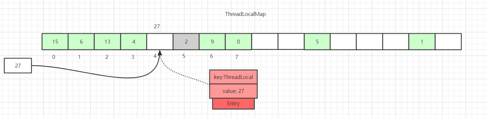
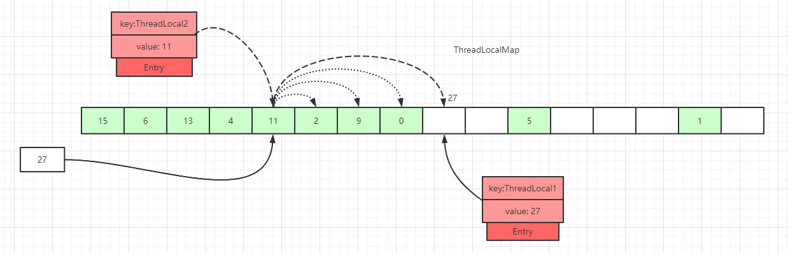
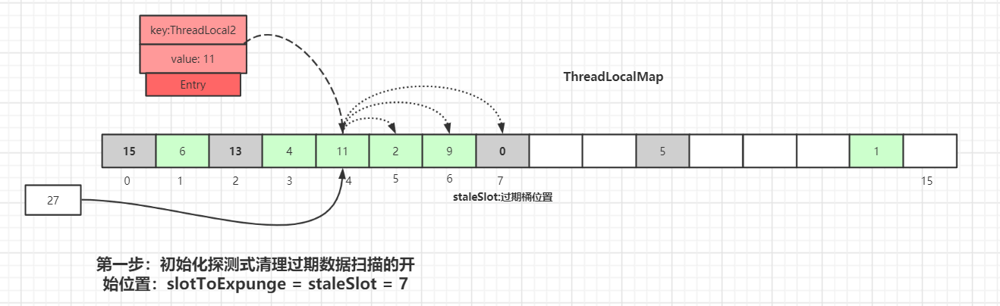
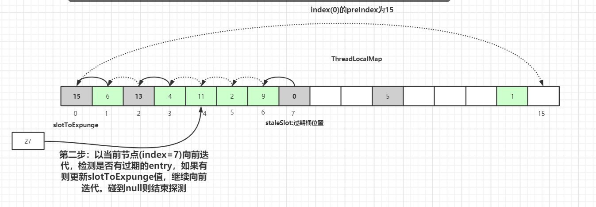
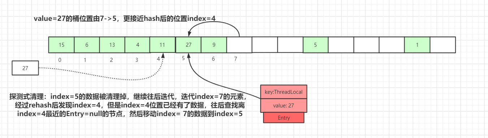
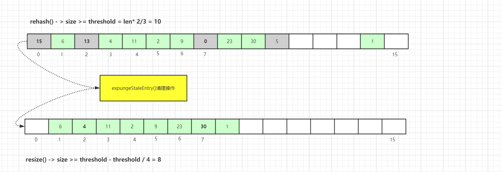

	这是“并发”系列的第五篇文章，主要介绍的是ThreadLocal相关内容。

# 一、设计目的
- 为了使线程有自己的数据，并不是为了解决并发或共享变量的问题。
- 主要作用是做数据隔离。保存到ThreadLocal中的数据只属于当前线程，对于其他线程来说是隔离的。

<!-- more -->


# 二、使用示例
```java
public static void main(String[] args) {
  new Thread(new Runnable() {
    @Override
    public void run() {
      ThreadLocal<String> threadLocal1 = new ThreadLocal<>();
      threadLocal1.set("value1");
      threadLocal1.set("1111");//新值会覆盖旧值
      ThreadLocal<String> threadLocal2 = new ThreadLocal<>();
      threadLocal2.set("value2");
      System.out.println(threadLocal1.get());
      System.out.println(threadLocal2.get());
    }
  }).start();
}
```
一个线程内部创建了2个ThreadLocal变量，存储了2个值。
- 每一个ThreadLocal变量，只能存储一个值。


# 三、ThreadLocal原理
从源码角度进行分析。
## 3.1、数据结构
Thread和ThreadLocal源码如下：
```java
//Thread类有一个类型为ThreadLocal.ThreadLocalMap的实例变量threadLocals，也就是说每个线程有一个自己的ThreadLocalMap。
public class Thread implements Runnable {
    //线程属性：threadLocal
    ThreadLocal.ThreadLocalMap threadLocals = null;   
}
//ThreadLocal类，内部有个静态内部类ThreadLocalMap
public class ThreadLocal<T> {
    //ThreadLocal静态内部类ThreadLocalMap，Entry[]数组，而Entry继承了虚引用
    static class ThreadLocalMap {
        private Entry[] table;
        //构造函数
        ThreadLocalMap(ThreadLocal<?> firstKey, Object firstValue) {
            table = new Entry[INITIAL_CAPACITY];
            int i = firstKey.threadLocalHashCode & (INITIAL_CAPACITY - 1);
            table[i] = new Entry(firstKey, firstValue);
            size = 1;
            setThreshold(INITIAL_CAPACITY);
        }
        static class Entry extends WeakReference<ThreadLocal<?>> {
            Object value;
            Entry(ThreadLocal<?> k, Object v) {
                super(k);
                value = v;
        }
        private Entry getEntry(ThreadLocal<?> key) {
            int i = key.threadLocalHashCode & (table.length - 1);
            Entry e = table[i];
            if (e != null && e.get() == key)
                return e;
            else
                return getEntryAfterMiss(key, i, e);
        }
    }
}
```
ThreadLocal数据结构如下图：

- **Thread类**有一个类型为ThreadLocal.ThreadLocalMap的实例变量threadLocals，也就是说每个线程有一个自己的ThreadLocalMap。
- **ThreadLocal类**，内部有个静态内部类ThreadLocalMap
  - **ThreadLocalMap类内部成员变量**：Entry[] table数组
  - **ThreadLocalMap类内部类**：Entry，继承了WeakReference（弱引用），
    - WeakReference<ThreadLocal<?>>：Entry弱引用，指向了ThreadLocal对象。
    - Entry弱引用对象的**key=ThreadLocal变量，value=实际需要存储的对象**
  - <font color=red>**ThreadLocal实际不存储值，只是作为key去ThreadLocalMap中获取value的值。**</font>
  - Entry的key是ThreadLocal，那么Thread只能有一个相同的ThreadLocal。一个ThreadLocal只能保存一个值。

内存示意图如下：

- 栈中存在2个引用：指向Thread的引用 + 指向ThreadLocal的引用
- Entry弱引用对象的key是ThreadLocal对象（弱引用指向ThreadLocal对象）


## 3.2、ThreadLocal.set()方法源码详解
源码如下：
```java
public class ThreadLocal<T> {
    public void set(T value) {
        Thread t = Thread.currentThread();
        ThreadLocalMap map = getMap(t);
        if (map != null)
            //调用ThreadLocalMap的set()方法，key=ThreadLocal, value = value
            map.set(this, value);
        else
            createMap(t, value);
    }

    void createMap(Thread t, T firstValue) {
        t.threadLocals = new ThreadLocalMap(this, firstValue);
    }

    //返回Thread的threadLocals
    ThreadLocalMap getMap(Thread t) {
        return t.threadLocals;
    }
}
```
ThreadLocal中的set方法原理如上图所示，很简单，主要是判断ThreadLocalMap是否存在，然后使用ThreadLocal中的set方法进行数据处理。

> <font color=red>**ThreadLocalMap的set()方法，查看后文章节**</font>

## 3.3、ThreadLocalMap Hash 算法
ThreadLocalMap中hash算法很简单，这里i就是当前 key 在散列表中对应的数组下标位置。这里最关键的就是threadLocalHashCode值的计算，ThreadLocal中有一个属性为HASH_INCREMENT = 0x61c88647
```java
public class ThreadLocal<T> {
    private final int threadLocalHashCode = nextHashCode();
    private static AtomicInteger nextHashCode = new AtomicInteger();
    private static final int HASH_INCREMENT = 0x61c88647;

    private static int nextHashCode() {
        return nextHashCode.getAndAdd(HASH_INCREMENT);
    }
}
static class ThreadLocalMap {
  private void set(ThreadLocal<?> key, Object value) {
      Entry[] tab = table;
      int len = tab.length;
      int i = key.threadLocalHashCode & (len - 1);
  }
}
```
每当创建一个ThreadLocal对象，这个ThreadLocal.nextHashCode 这个值就会增长 0x61c88647 。这个值很特殊，它是斐波那契数 也叫 黄金分割数。hash增量为 这个数字，带来的好处就是 hash 分布非常均匀。

我们自己可以尝试下：

可以看到产生的哈希码分布很均匀，这里不去细纠斐波那契具体算法，感兴趣的可以自行查阅相关资料。

## 3.4、ThreadLocalMap Hash 冲突
虽然ThreadLocalMap中使用了黄金分割数来作为hash计算因子，大大减少了Hash冲突的概率，但是仍然会存在冲突。

HashMap中解决冲突的方法是在数组上构造一个链表结构，冲突的数据挂载到链表上，如果链表长度超过一定数量则会转化成红黑树。
而 ThreadLocalMap 中并没有链表结构，所以这里不能使用 HashMap 解决冲突的方式了。

如上图所示，如果我们插入一个<code>value=27</code>的数据，通过<code>hash</code>计算后应该落入槽位 4 中，而槽位 4 已经有了<code> Entry</code> 数据。
- 此时就会线性向后查找，一直找到 <code>Entry </code>为 <code>null </code>的槽位才会停止查找，将当前元素放入此槽位中。
- 当然迭代过程中还有其他的情况，比如遇到了 <code>Entry</code> 不为 <code>null</code> 且 <code>key</code> 值相等的情况，还有 <code>Entry </code>中的 <code>key</code> 值为 <code>null </code>的情况等等都会有不同的处理，后面会一一详细讲解。
- 这里还画了一个<code>Entry</code>中的<code>key</code>为<code>null</code>的数据（<code>Entry=2</code> 的灰色块数据），因为<code>key</code>值是弱引用类型，所以会有这种数据存在。在<code>set</code>过程中，如果遇到了<code>key</code>过期的<code>Entry</code>数据，实际上是会进行一轮探测式清理操作的，具体操作方式后面会讲到。

## 3.5、ThreadLocalMap set方法
```java
//ThreadLocalMap的set()方法
static class ThreadLocalMap {
    private void set(ThreadLocal<?> key, Object value) {
        Entry[] tab = table;
        int len = tab.length;
        int i = key.threadLocalHashCode & (len - 1);
        for (Entry e = tab[i];
             e != null;
             e = tab[i = nextIndex(i, len)]) {
            ThreadLocal<?> k = e.get();
            //情况2：槽位数据不为空，key值与当前ThreadLocal通过hash计算获取的key值一致：
            if (k == key) {
                e.value = value;
                return;
            }
            //情况3：槽位数据不为空，key过期的Entry：
            if (k == null) {
                replaceStaleEntry(key, value, i);//方法内部会调用expungeStaleEntry()方法，进行过期 key 的探测式清理流程
                return;
            }
            //情况4：key未过期的entry,继续for循环往下寻找
        }
        //情况1：tab[i]为null，直接赋值
        tab[i] = new Entry(key, value);
        int sz = ++size;
        if (!cleanSomeSlots(i, sz) && sz >= threshold)
            rehash();
    }
}
```
往ThreadLocalMap中set数据（新增或者更新数据）分为好几种情况，针对不同的情况我们画图来说明。

### 3.5.1、第一种情况： 通过hash计算后的槽位对应的Entry数据为空

这里直接将数据放到该槽位即可。

### 3.5.2、第二种情况： 槽位数据不为空，key值与当前ThreadLocal通过hash计算获取的key值一致：

hash冲突，这里直接更新该槽位的数据。

### 3.5.3、第三种情况： 槽位数据不为空，往后遍历过程中，在找到Entry为null的槽位之前，没有遇到key过期的Entry：

遍历散列数组，线性往后查找，如果找到Entry为null的槽位，则将数据放入该槽位中，或者往后遍历过程中，遇到了key 值相等的数据，直接更新即可。

### 3.5.4、第四种情况： 数据过期
槽位数据不为空，往后遍历过程中，在找到Entry为null的槽位之前，遇到key过期的Entry，如下图，往后遍历过程中，遇到了index=7的槽位数据Entry的key=null：

> **key过期的判定标准：**
>
>   **基于弱引用回收机制：** 由于Entry对ThreadLocal是弱引用，如果一个ThreadLocal对象除了被Entry弱引用外，没有其他强引用，那么当垃圾回收发生时，这个ThreadLocal对象可能会被回收。此时，从ThreadLocalMap的角度看，这个Entry的key就相当于过期了。

散列数组下标为 7 位置对应的Entry数据key为null，表明此数据key值已经被垃圾回收掉了，此时就会执行<code>replaceStaleEntry()</code>方法，该方法含义是替换过期数据的逻辑，以index=7位起点开始遍历，进行探测式数据清理工作。

初始化探测式清理过期数据扫描的开始位置：<code>slotToExpunge = staleSlot = 7</code>

以当前<code>staleSlot</code>开始 向前迭代查找，找其他过期的数据，然后更新过期数据起始扫描下标<code>slotToExpunge</code>。for循环迭代，直到碰到Entry为null结束。

如果找到了过期的数据，继续向前迭代，直到遇到Entry=null的槽位才停止迭代，如下图所示，slotToExpunge 被更新为 0：

向前迭代的操作是为了更新探测清理过期数据的起始下标slotToExpunge的值。


## 3.6、ThreadLocalMap过期 key 的探测式清理流程
ThreadLocalMap的两种过期key数据清理方式：**探测式清理**和**启发式清理**。

### 3.6.1、探测式清理
也就是<code>expungeStaleEntry()</code>方法，遍历散列数组，从开始位置向后探测清理过期数据，将过期数据的Entry设置为null，沿途中碰到未过期的数据则将此数据rehash后重新在table数组中定位，如果定位的位置已经有了数据，则会将未过期的数据放到最靠近此位置的Entry=null的桶中，使rehash后的Entry数据距离正确的桶的位置更近一些。操作逻辑如下：

如上图，set(27) 经过 hash 计算后应该落到index=4的桶中，由于index=4桶已经有了数据，所以往后迭代最终数据放入到index=7的桶中，放入后一段时间后index=5中的Entry数据key变为了null

如果再有其他数据set到map中，就会触发探测式清理操作。

如上图，执行探测式清理后，index=5的数据被清理掉，继续往后迭代，到index=7的元素时，经过rehash后发现该元素正确的index=4，而此位置已经有了数据，往后查找离index=4最近的Entry=null的节点(刚被探测式清理掉的数据：index=5)，找到后移动index= 7的数据到index=5中，此时桶的位置离正确的位置index=4更近了。

经过一轮探测式清理后，key过期的数据会被清理掉，没过期的数据经过rehash重定位后所处的桶位置理论上更接近i= key.hashCode & (tab.len - 1)的位置。这种优化会提高整个散列表查询性能。

expungeStaleEntry实现源代码：
```java
private int expungeStaleEntry(int staleSlot) {
    Entry[] tab = table;
    int len = tab.length;

    tab[staleSlot].value = null;
    tab[staleSlot] = null;
    size--;

    Entry e;
    int i;
    for (i = nextIndex(staleSlot, len);
         (e = tab[i]) != null;
         i = nextIndex(i, len)) {
        ThreadLocal<?> k = e.get();
        if (k == null) {
            e.value = null;
            tab[i] = null;
            size--;
        } else {
            int h = k.threadLocalHashCode & (len - 1);
            if (h != i) {
                tab[i] = null;

                while (tab[h] != null)
                    h = nextIndex(h, len);
                tab[h] = e;
            }
        }
    }
    return i;
}
```


## 3.7、ThreadLocalMap 扩容机制
在ThreadLocalMap.set()方法的最后，如果执行完启发式清理工作后，未清理到任何数据，且当前散列数组中Entry的数量已经达到了列表的扩容阈值<code>=(len*2/3)</code>，就开始执行rehash()逻辑：
- 初始化大小：<code>INITIAL_CAPACITY = 16</code>，即散列数组长度 = 16
- 扩容阈值：<code>threshold = INITIAL_CAPACITY * 2 / 3</code>，即<code>threshold=16*2/3=10</code>
- <font color=red>**扩容时机：**</font>执行完启发式清理工作后，散列数组中的Entry数量 > threshold
- <font color=red>**扩容大小：**</font>newLen = oldTab.length * 2;
```java
if (!cleanSomeSlots(i, sz) && sz >= threshold) {
    rehash();
}
```
接着看下rehash()具体实现：
```java
private void rehash() {
    expungeStaleEntries();

    if (size >= threshold - threshold / 4)
        resize();
}

private void expungeStaleEntries() {
    Entry[] tab = table;
    int len = tab.length;
    for (int j = 0; j < len; j++) {
        Entry e = tab[j];
        if (e != null && e.get() == null)
            expungeStaleEntry(j);
    }
}
```
这里首先是会进行探测式清理工作，从table的起始位置往后清理，上面有分析清理的详细流程。清理完成之后，table中可能有一些key为null的Entry数据被清理掉，所以此时通过判断<code>size >= threshold - threshold / 4 </code>也就是<code>size >= threshold * 3/4 </code>来决定是否扩容。

我们还记得上面进行rehash()的阈值是size >= threshold，所以当面试官套路我们ThreadLocalMap扩容机制的时候 我们一定要说清楚这两个步骤：

接着看看具体的resize()方法，为了方便演示，我们以oldTab.len=8来举例：

扩容后的tab的大小为oldLen * 2，然后遍历老的散列表，重新计算hash位置，然后放到新的tab数组中，如果出现hash冲突则往后寻找最近的entry为null的槽位，遍历完成之后，oldTab中所有的entry数据都已经放入到新的tab中了。重新计算tab下次扩容的阈值，具体代码如下：
```java
private void resize() {
    Entry[] oldTab = table;
    int oldLen = oldTab.length;
    int newLen = oldLen * 2;
    Entry[] newTab = new Entry[newLen];
    int count = 0;

    for (int j = 0; j < oldLen; ++j) {
        Entry e = oldTab[j];
        if (e != null) {
            ThreadLocal<?> k = e.get();
            if (k == null) {
                e.value = null;
            } else {
                int h = k.threadLocalHashCode & (newLen - 1);
                while (newTab[h] != null)
                    h = nextIndex(h, newLen);
                newTab[h] = e;
                count++;
            }
        }
    }

    setThreshold(newLen);
    size = count;
    table = newTab;
}
```

## 3.8、ThreadLocalMap.get()详解
示例：
```java
public static void main(String[] args) {
    ThreadLocal<String> th = new ThreadLocal<>();
    th.set("a");
    th.get();
}
```
源码分析：
```java
public class ThreadLocal<T> {
    public T get() {
        Thread t = Thread.currentThread();
        ThreadLocalMap map = getMap(t);
        if (map != null) {
            ThreadLocalMap.Entry e = map.getEntry(this);
            if (e != null) {
                @SuppressWarnings("unchecked")
                T result = (T) e.value;
                return result;
            }
        }
        return setInitialValue();
    }
}

static class ThreadLocalMap {
    private Entry getEntry(ThreadLocal<?> key) {
        int i = key.threadLocalHashCode & (table.length - 1);
        Entry e = table[i];
        if (e != null && e.get() == key)
            return e;
        else
            return getEntryAfterMiss(key, i, e);
    }

    private Entry getEntryAfterMiss(ThreadLocal<?> key, int i, Entry e) {
        Entry[] tab = table;
        int len = tab.length;

        while (e != null) {
            ThreadLocal<?> k = e.get();
            if (k == key)
                return e;
            if (k == null)
                expungeStaleEntry(i);
            else
                i = nextIndex(i, len);
            e = tab[i];
        }
        return null;
    }
}
```
第一种情况： 通过查找key值计算出散列表中slot位置，然后该slot位置中的Entry.key和查找的key一致，则直接返回：
第二种情况： slot位置中的Entry.key和要查找的key不一致：

我们以get(ThreadLocal1)为例，通过hash计算后，正确的slot位置应该是 4，而index=4的槽位已经有了数据，且key值不等于ThreadLocal1，所以需要继续往后迭代查找。迭代到index=5的数据时，此时Entry.key=null，触发一次探测式数据回收操作，执行expungeStaleEntry()方法，执行完后，index 5,8的数据都会被回收，而index 6,7的数据都会前移。index 6,7前移之后，继续从 index=5 往后迭代，于是就在 index=6 找到了key值相等的Entry数据，


## 3.9、ThreadLocalMap过期 key 的启发式清理流程
上面多次提及到<code>ThreadLocalMap</code>过期 key 的两种清理方式：**探测式清理(<code>expungeStaleEntry()</code>)、启发式清理(<code>cleanSomeSlots()</code>)**

探测式清理是以当前Entry 往后清理，遇到值为null则结束清理，属于线性探测清理。

而启发式清理被作者定义为：Heuristically scan some cells looking for stale entries

具体代码如下：
```java
//方法会以i为起始点，在一个循环中检查n个槽（或者在满足一定条件下的部分槽）
private boolean cleanSomeSlots(int i, int n) {
    boolean removed = false;
    Entry[] tab = table;
    int len = tab.length;
    do {
        i = nextIndex(i, len);
        Entry e = tab[i];
        if (e != null && e.get() == null) {
            n = len;
            removed = true;
            i = expungeStaleEntry(i);
        }
    } while ( (n >>>= 1) != 0);
    return removed;
}
```

# 四、InheritableThreadLocal
我们使用ThreadLocal的时候，在异步场景下是无法给子线程共享父线程中创建的线程副本数据的。

为了解决这个问题，JDK 中还有一个InheritableThreadLocal类，我们来看一个例子：
```java
public class InheritableThreadLocalDemo {
    public static void main(String[] args) {
        ThreadLocal<String> ThreadLocal = new ThreadLocal<>();
        ThreadLocal<String> inheritableThreadLocal = new InheritableThreadLocal<>();
        ThreadLocal.set("父类数据:threadLocal");
        inheritableThreadLocal.set("父类数据:inheritableThreadLocal");

        new Thread(new Runnable() {
            @Override
            public void run() {
                System.out.println("子线程获取父类ThreadLocal数据：" + ThreadLocal.get());
                System.out.println("子线程获取父类inheritableThreadLocal数据：" + inheritableThreadLocal.get());
            }
        }).start();
    }
}
```
打印结果：
```dtd
子线程获取父类ThreadLocal数据：null
子线程获取父类inheritableThreadLocal数据：父类数据:inheritableThreadLocal
```
实现原理是子线程是通过在父线程中通过调用new Thread()方法来创建子线程，Thread#init方法在Thread的构造方法中被调用。在init方法中拷贝父线程数据到子线程中：
```java
public class Thread implements Runnable {
    private void init(ThreadGroup g, Runnable target, String name,
                      long stackSize, AccessControlContext acc,
                      boolean inheritThreadLocals) {
        if (name == null) {
            throw new NullPointerException("name cannot be null");
        }

        if (inheritThreadLocals && parent.inheritableThreadLocals != null)
            this.inheritableThreadLocals =
                    ThreadLocal.createInheritedMap(parent.inheritableThreadLocals);
        this.stackSize = stackSize;
        tid = nextThreadID();
    }
}
```

# 五、存在的问题

## 5.1、内存泄露

### 内存泄漏的根源是：
> 由于ThreadLocalMap的生命周期跟Thread一样长，如果没有手动删除对应key就会导致内存泄漏，而<font color=red>**不是因为弱引用**</font>。

Entry继承了弱引用，该弱引用关联了ThreadLocal对象。
```java
//ThreadLocal类，内部有个静态内部类ThreadLocalMap
public class ThreadLocal<T> {
    //ThreadLocal静态内部类ThreadLocalMap，Entry[]数组，而Entry继承了虚引用
    static class ThreadLocalMap {
        private Entry[] table;
        //Entry继承了弱引用，该弱引用关联了ThreadLocal对象。
        static class Entry extends WeakReference<ThreadLocal<?>> {
            Object value;
            Entry(ThreadLocal<?> k, Object v) {
                super(k);
                value = v;
        }
    }
}
```

弱引用：
> 当一个对象只有弱引用指向它时，这个对象在垃圾回收器进行垃圾回收时就可能被回收，即使 Java 虚拟机（JVM）的堆内存空间还比较充足。
> 
> 不过，由于垃圾回收器是一个优先级很低的线程，因此不一定会很快发现那些只具有弱引用的对象。

这就导致了一个问题，ThreadLocal在没有外部强引用时，发生GC时会被回收，如果创建ThreadLocal的线程一直持续运行，那么这个Entry对象中的value就有可能一直得不到回收，发生内存泄露。就比如线程池里面的线程，线程都是复用的。

如果线程回收了，thread对象的成员变量（threadLocals会被回收），但是实际应用中，我们一般使用线程池，而线程池本身是重复利用的，所以还是会造成内存泄露的问题。

参考文章：
[ThreadLocal 详解](https://javaguide.cn/java/concurrent/threadlocal.html)