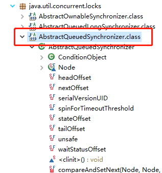
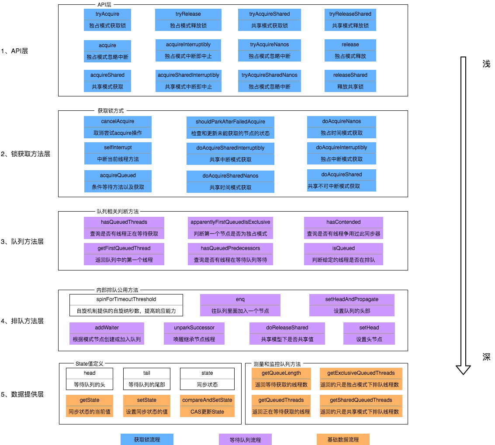

	这是“并发”系列的第六篇文章，主要介绍的是AQS相关内容。
    【AQS：是并发包下的一个基础组件，用来实现各种锁、各种同步器的基础组件】

# 一、什么是AQS？

AQS 的全称为 <code>AbstractQueuedSynchronizer</code> ，翻译过来的意思就是**抽象队列同步器**。这个类在 <code>java.util.concurrent.locks</code> 包下面。
<!-- more -->

在并发编程中，锁是一种常用的保证线程安全的方法。Java 中常用的锁主要有两类，一种是 Synchronized 修饰的锁，被称为 Java 内置锁或监视器锁。另一种就是在 J2SE 1.5版本之后的 java.util.concurrent包（下称j.u.c包）中的各类同步器，包括 ReentrantLock（可重入锁），ReentrantReadWriteLock（可重入读写锁），Semaphore（信号量），CountDownLatch 等。这些同步器都是基于 AbstractQueuedSynchronizer（下称 AQS）这个简单的框架来构建的，而 AQS 类的核心数据结构是一种名为 Craig, Landin, and Hagersten locks（下称 CLH 锁）的变体

# 二、AQS原理

## 2.1、对AQS的理解？

是并发包下的一个基础组件，**用来实现各种锁、各种同步器的基础组件**。

核心思想是，如果被请求的共享资源是空闲的，那么就会将当前请求的资源的线程设置成当前线程，并将共享变量的状态设置为独享状态；如果请求的共享资源被占用，那么就需要一套线程阻塞等待及被唤醒和锁分配的机制。这个机制就是基于CLH锁<code>（Craig, Landin, and Hagersten locks）</code>实现的。


## 2.2、AQS源码

### 2.2.1、数据结构分析
```java
public abstract class AbstractQueuedSynchronizer extends AbstractOwnableSynchronizer implements java.io.Serializable {
    //同步队列的头结点
    private transient volatile Node head;
    //同步队列的尾节点
    private transient volatile Node tail;
    //同步状态
    private volatile int state;
    //内部类：队列节点
    static final class Node {
        /** Marker to indicate a node is waiting in shared mode */
        static final Node SHARED = new Node();
        /** Marker to indicate a node is waiting in exclusive mode */
        static final Node EXCLUSIVE = null;
        /** waitStatus value to indicate thread has cancelled */
        static final int CANCELLED =  1;
        /** waitStatus value to indicate successor's thread needs unparking */
        static final int SIGNAL    = -1;
        /** waitStatus value to indicate thread is waiting on condition */
        static final int CONDITION = -2;
        /** waitStatus value to indicate the next acquireShared should unconditionally propagate */
        static final int PROPAGATE = -3;
        volatile int waitStatus;
        //前置节点
        volatile Node prev;
        //后置节点
        volatile Node next;
        //线程
        volatile Thread thread;
        //等待队列
        Node nextWaiter;
    }
}
```
从state、exclusiveOwnerThread、CLH双向FIFO队列（阻塞队列）、ConditionObject等部分做说明

#### 2.2.1.1、state
表示**同步状态**，由 volatile 修饰，用于展示当前临界资源的获取情况，默认=0

##### 独占模式
state = 1，同时只能有一个线程占用，独占模式下，先去判断state的值
- 如果 state !=0 ：阻塞，表示资源被其他线程占用
- 如果 state ==0 ：CAS尝试设置成1（可以去抢占锁）

##### 共享模式
将state的值设置大于1，判断state的值：
- 如果 state == 0 ：false，阻塞，表示没有多余资源
- 如果 state != 0 ：state-1，可以获取到资源


#### 2.2.1.2、exclusiveOwnerThread
该成员变量，继承自父类<code>AbstractOwnableSynchronizer</code>，在独占模式下，记录锁的拥有者。

#### 2.2.1.3、CLH双向FIFO队列【同步队列】
CLH 锁是对自旋锁的一种改进，有效的解决了以上的两个缺点。首先它将线程组织成一个队列，保证先请求的线程先获得锁，避免了饥饿问题。其次锁状态去中心化，让每个线程在不同的状态变量中自旋，这样当一个线程释放它的锁时，只能使其后续线程的高速缓存失效，缩小了影响范围，从而减少了CPU 的开销。
> 自旋锁的缺点
> 锁饥饿问题：锁竞争激烈的情况下，可能会一直获取不到锁
> 性能问题：锁竞争激烈情况下，性能会较差

##### 1. CLH锁结构如下：

类似一个链表队列，所有请求获取锁的线程会排列在链表队列中，自旋访问队列中前一个节点的状态。每一个 CLH 节点有两个属性：

- 所代表的线程
- 标识是否持有锁的状态变量

##### 2. AQS 对 CLH 队列锁的改造
AQS 中使用的 等待队列 是 CLH 锁队列的变体（接下来简称为 CLH 变体队列）。
AQS 中的对 CLH 锁数据结构的改进主要包括三方面：
- 扩展每个节点的状态
- 显式的维护前驱节点
- 后继节点以及诸如出队节点显式设为 null 等辅助 GC 的优化。

###### CLH变体结构

CLH双向FIFO队列节点，通过Node节点来实现，Node节点的属性如下：
- **前置节点：** volatile Node prev;
- **后置节点：** volatile Node next;
- **线程：** volatile Thread thread;
- **指向下一个处于CONDITION状态的节点：** Node nextWaiter;

##### Node 节点 waitStatus 状态含义

| 状态名       | 值  |                                                                 描述 |
|:----------|----|-------------------------------------------------------------------:|
| SIGNAL    | -1 |                                                          表示该节点正常等待 |
| PROPAGATE | -3 |                                           应将 releaseShared 传播到其他节点 |
| CONDITION | -2 |                                              	该节点位于条件队列，不能用于同步队列节点 |
| CANCELLED | 1  |                                                由于超时、中断或其他原因，该节点被取消 |
|           | 0  |                                                     加入队列的新节点的初始状态。 |

如果 waitStatus > 0 ，表明节点的状态已经取消等待获取资源。
如果 waitStatus < 0 ，表明节点的处于有效的等待状态。
因此在 AQS 的源码中，经常使用 > 0 、 < 0 来对 waitStatus 进行判断。


#### 2.2.1.4、ConditionObject【等待队列】
ConditionObject是java.util.concurrent.locks.AbstractQueuedSynchronizer（AQS）中的一个内部类。ConditionObject提供了一种类似于Object.wait()和Object.notify()/Object.notifyAll()的功能，但更加灵活和强大，用于实现线程间的条件等待和唤醒机制。
```java
public abstract class AbstractQueuedSynchronizer extends AbstractOwnableSynchronizer implements java.io.Serializable {
    public class ConditionObject implements Condition, java.io.Serializable {
        private static final long serialVersionUID = 1173984872572414699L;
        /** First node of condition queue. */
        private transient Node firstWaiter;
        /** Last node of condition queue. */
        private transient Node lastWaiter;
    }
}
```
- firstWaiter：等待队列头节点
- lastWaiter：等待队列尾节点

##### signal方法
```java
public final void signal() {
    if (!isHeldExclusively())
        throw new IllegalMonitorStateException();
    Node first = firstWaiter;
    if (first != null)
        doSignal(first);
}
private void doSignal(Node first) {
    do {
        if ( (firstWaiter = first.nextWaiter) == null)
            lastWaiter = null;
        first.nextWaiter = null;
    } while (!transferForSignal(first) &&
            (first = firstWaiter) != null);
}
```
从条件队列移动到同步队列

调用condition的signal方法时，将会把等待队列的首节点移到同步队列的尾部，然后唤醒该节点。被唤醒，并不代表就会从await方法返回，也不代表该节点的线程能获取到锁，它一样需要加入到锁的竞争acquireQueued方法中去，只有成功竞争到锁，才能从await方法返回。

##### 同步队列和等待队列

aqs内存在1个同步队列和多个等待队列
- Condition接口的主要实现类是AQS的内部类ConditionObject，每个Condition对象都包含一个等待队列
- 队列是Condition对象实现等待/通知的关键
- 当位于Condition条件队列中的线程被其他线程signal后，该线程就会从条件队列中移动到AQS的阻塞队列（同步队列）中

**同步队列和等待队列的区别**
- 只有在线程获取锁资源的前提下，才能进入等待队列
- 只有加入同步队列后，才能去抢占资源

**应用场景**：
- 生产者-消费者模式

### 2.2.2、AQS结构总结
AQS(AbstractQueuedSynchronizer)的核心原理图：


### 2.2.3、常见方法

AQS 使用了模板方法模式，自定义同步器时需要重写下面几个 AQS 提供的钩子方法：
```java
//独占方式。尝试获取资源，成功则返回true，失败则返回false。
protected boolean tryAcquire(int)
//独占方式。尝试释放资源，成功则返回true，失败则返回false。
protected boolean tryRelease(int)
//共享方式。尝试获取资源。负数表示失败；0表示成功，但没有剩余可用资源；正数表示成功，且有剩余资源。
protected int tryAcquireShared(int)
//共享方式。尝试释放资源，成功则返回true，失败则返回false。
protected boolean tryReleaseShared(int)
//该线程是否正在独占资源。只有用到condition才需要去实现它。
protected boolean isHeldExclusively()
```
常见的各种锁、各种同步器，例如CountDownLatch、ReentrantLock，都实现了这些模板方法。
> 什么是钩子方法呢？ 钩子方法是一种被声明在抽象类中的方法，一般使用 protected 关键字修饰，它可以是空方法（由子类实现），也可以是默认实现的方法。模板设计模式通过钩子方法控制固定步骤的实现。

#### 2.2.3.1、acquire()方法
这个方法是<code>AQS</code>中的一个核心方法，用于**以独占方式获取同步状态**。它尝试获取由<code>arg</code>指定数量的同步资源（在不同的锁实现中，这个arg可能有不同的含义，通常可以理解为锁的许可数量）。如果获取成功，当前线程将占有这些资源；如果获取失败，线程会被阻塞，并被添加到 AQS 维护的同步队列中等待获取资源。
```java
public final void acquire(int arg) {
    if (!tryAcquire(arg) &&
        acquireQueued(addWaiter(Node.EXCLUSIVE), arg))
        selfInterrupt();
}
```
实现原理
- 首先，它会调用<code>tryAcquire(int arg)</code>方法（这个方法是一个**模板方法，由 AQS 的子类实现**）来尝试获取同步状态。
- 如果<code>tryAcquire(int arg)</code>返回true，说明获取成功，方法结束，当前线程可以继续执行。
- 如果tryAcquire(int arg)返回false，意味着获取同步状态失败。
  - **addWaiter()：** 此时，会创建一个Node对象（Node是 AQS 用于构建队列的内部类）来代表当前线程，并将其添加到同步队列的尾部。
  - **acquireQueued()：** 然后，线程会进入一个循环，在这个循环中不断检查自己是否可以获取同步状态。这个循环的主要操作包括：检查前驱节点是否是头节点（因为在独占锁模式下，只有头节点的下一个节点有机会获取同步状态），如果是，就再次调用<code>tryAcquire(int arg)</code>尝试获取；同时，会处理一些节点状态的更新，比如将前驱节点的状态设置为SIGNAL（表示当前节点需要被唤醒）。


#### 2.2.3.1、acquireInterruptibly()方法
与<code>acquire(int arg)</code>类似，它也是用于**以独占方式获取同步状态**，但这个方法是可以被中断的。也就是说，当一个线程在等待获取同步状态的过程中，如果收到中断信号，它会抛出<code>InterruptedException</code>异常，而不是像<code>acquire(int arg)</code>那样一直等待。
```Java
public final void acquireInterruptibly(int arg) throws InterruptedException {
    if (Thread.interrupted())
        throw new InterruptedException();
    if (!tryAcquire(arg))
        doAcquireInterruptibly(arg);
}
private void doAcquireInterruptibly(int arg)
        throws InterruptedException {
    final Node node = addWaiter(Node.EXCLUSIVE);
    boolean failed = true;
    try {
        for (;;) {
            final Node p = node.predecessor();
            if (p == head && tryAcquire(arg)) {
                setHead(node);
                p.next = null; // help GC
                failed = false;
                return;
            }
            if (shouldParkAfterFailedAcquire(p, node) &&
                    parkAndCheckInterrupt())
                throw new InterruptedException();
        }
    } finally {
        if (failed)
            cancelAcquire(node);
    }
}
```
实现原理：
- 首先，它也会调用<code>tryAcquire(int arg)</code>方法来尝试获取同步状态。如果获取成功，方法结束。
- 如果获取失败，会创建一个Node对象并将其添加到同步队列中，就像<code>acquire(int arg)</code>一样。但是，在循环等待获取同步状态的过程中，它会检查线程是否被中断。如果被中断，会抛出InterruptedException异常。具体来说，它会检查Thread.interrupted()（这个方法会清除当前线程的中断状态），如果返回true，就会抛出异常。同时，在抛出异常之前，会进行一些清理工作，比如尝试从同步队列中移除代表当前线程的Node对象。

**使用场景**
- 当一个线程执行一个长时间运行的任务，如文件下载、数据处理或复杂的计算任务时，可能需要获取一个锁来保证对共享资源（如存储下载进度的变量、数据处理的中间结果等）的独占访问。如果使用acquireInterruptibly方法来获取锁，那么当用户想要取消这个任务（例如通过用户界面的取消按钮发送中断信号）时，线程能够及时响应中断。
- ReentrantLock锁中，提供了<code>lockInterruptibly()</code>方法。

# 三、AQS的相关实现
还是需要基于相应的实现来更深层次的理解AQS，例如ReentrantLock、CountDownLatch。相应实现文章在接下来的文章进行说明。

参考文章：
[AQS 详解](https://javaguide.cn/java/concurrent/aqs.html)