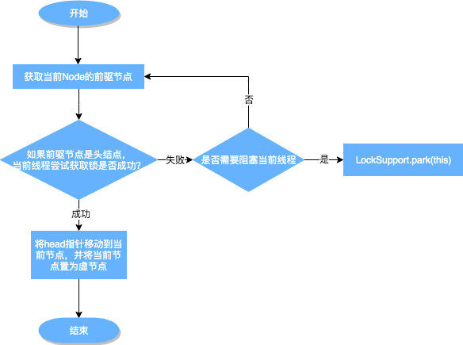

	这是“并发”系列的第七篇文章，主要介绍的是AQS的ReentrantLock独享锁实现。

# 一、什么是AQS？
AQS 的全称为 <code>AbstractQueuedSynchronizer</code> ，翻译过来的意思就是**抽象队列同步器**。是并发包下的一个基础组件，**用来实现各种锁、各种同步器的基础组件**。
<!-- more -->

在并发编程中，锁是一种常用的保证线程安全的方法。Java 中常用的锁主要有两类，一种是 Synchronized 修饰的锁，被称为 Java 内置锁或监视器锁。另一种就是在 J2SE 1.5版本之后的 java.util.concurrent包（下称j.u.c包）中的各类同步器，包括 ReentrantLock（可重入锁），ReentrantReadWriteLock（可重入读写锁），Semaphore（信号量），CountDownLatch 等。这些同步器都是基于 AbstractQueuedSynchronizer（下称 AQS）这个简单的框架来构建的，而 AQS 类的核心数据结构是一种名为 Craig, Landin, and Hagersten locks（下称 CLH 锁）的变体

# 二、ReentrantLock
<code>ReentrantLock</code>意思为可重入锁，指的是一个线程能够对一个临界资源重复加锁。为了帮助大家更好地理解ReentrantLock的特性，我们先将ReentrantLock跟常用的Synchronized进行比较，其特性如下（蓝色部分为本篇文章主要剖析的点）：


## 2.1、底层实现
<code>ReentrantLock</code>的底层就是由AQS来实现的。源码如下：
- 内部抽象类Sync，继承AQS
  - 非公平锁：NonfairSync继承了Sync
  - 公平锁：FairSync继承了Sync

```java
public class ReentrantLock implements Lock, java.io.Serializable {
    //无参默认构造函数，创建的是非公平同步器
    public ReentrantLock() {
      sync = new NonfairSync();
    }
    private final Sync sync;//同步器
    //ReentrantLock内部抽象类Sync，继承了AQS
    abstract static class Sync extends AbstractQueuedSynchronizer {
        //抽象方法-加锁
        abstract void lock();
        //非公平锁的实现
        final boolean nonfairTryAcquire(int acquires) {
            final Thread current = Thread.currentThread();
            int c = getState();
            if (c == 0) {
                //新到达的线程会直接尝试获取锁，不管同步队列中是否已经有等待的线程。这可能导致某些线程长时间等待，因为新到达的线程可能不断插队获取锁。
                if (compareAndSetState(0, acquires)) {
                    setExclusiveOwnerThread(current);//如果 CAS 更新成功，就将锁的持有者设置为当前线程
                    return true;
                }
            } else if (current == getExclusiveOwnerThread()) {//如果当前线程和锁的持有线程相同，说明发生了「锁的重入」
                int nextc = c + acquires;
                if (nextc < 0) // overflow
                    throw new Error("Maximum lock count exceeded");
                setState(nextc);//将锁的重入次数加 1
                return true;
            }
            return false;
        }
    }
    //非公平同步器 ---Sync同步器的实现
    static final class NonfairSync extends Sync {
        //实现了Sync同步器的lock()方法
        final void lock() {
            //这体现了非公平锁 “插队” 的特性，新到来的线程不会按照先来后到的顺序去排队等待，而是先尝试直接获取锁，有可能立刻获取成功并执行后续操作，节省了等待时间。
            if (compareAndSetState(0, 1))
                setExclusiveOwnerThread(Thread.currentThread());
            else
                acquire(1);
        }
        protected final boolean tryAcquire(int acquires) {
            //采用了非公平模式获取资源
            return nonfairTryAcquire(acquires);
        }
    }
    //公平同步器 ---Sync同步器的实现
    static final class FairSync extends Sync {
        final void lock() {
            acquire(1);
        }
        protected final boolean tryAcquire(int acquires) {
            final Thread current = Thread.currentThread();
            int c = getState();
            if (c == 0) {
                if (!hasQueuedPredecessors() &&
                        compareAndSetState(0, acquires)) {
                    setExclusiveOwnerThread(current);
                    return true;
                }
            } else if (current == getExclusiveOwnerThread()) {
                int nextc = c + acquires;
                if (nextc < 0)
                    throw new Error("Maximum lock count exceeded");
                setState(nextc);
                return true;
            }
            return false;
        }
    }
}
```
NonfairSync：内部会先通过CAS去尝试获取锁，这是一种非公平模式。跟Sync的nonfairTryAcquire是一样的，都是非公平模式。

# 三、通过ReentrantLock理解AQS

## 3.1、ReentrantLock的使用示例
```java
private final ReentrantLock lock = new ReentrantLock();
public void produce() throws InterruptedException {
    lock.lock();
    try {
        //具体业务逻辑
    } finally {
        lock.unlock();
    }
}
```
lock对象默认的是非公平锁<code>NonfairSync</code>，从lock()方法出发：

### 3.1.1、加锁
#### 3.1.1.1、第一步，分析<code>lock()</code>方法：
- lock()方法内部：首先会以非公平模式去CAS获取锁
- 如果获取锁成功，则设置setExclusiveOwnerThread()，即占用资源的线程设置成当前线程。
- 如果获取锁失败，然后执行AQS的<code>acquire()</code>方法。

#### 3.1.1.2、第二步：分析AQS的<code>acquire()</code>方法
```java
public final void acquire(int arg) {
    if (!tryAcquire(arg) &&
        acquireQueued(addWaiter(Node.EXCLUSIVE), arg))
        selfInterrupt();
}
```
- tryAcquire()方法：AQS抽象类的子类实现，即ReentrantLock的内部类Sync
- acquireQueued()方法：AQS的方法，
- addWaiter()方法：AQS的方法，
- selfInterrupt()方法：


#### 3.1.1.3、第三步：分析tryAcquire()方法
需要分析ReentrantLock的内部类 <code>NonfairSync</code> 的tryAcquire()方法，
```java
static final class NonfairSync extends Sync {
    //实现了Sync同步器的lock()方法
    final void lock() {
        //这体现了非公平锁 “插队” 的特性，新到来的线程不会按照先来后到的顺序去排队等待，而是先尝试直接获取锁，有可能立刻获取成功并执行后续操作，节省了等待时间。
        if (compareAndSetState(0, 1))
            setExclusiveOwnerThread(Thread.currentThread());
        else
            acquire(1);
    }
    protected final boolean tryAcquire(int acquires) {
        //采用了非公平模式获取资源
        return nonfairTryAcquire(acquires);
    }
}
```
tryAcquire()方法，以非公平模式去获取资源，获取资源失败，tryAcquire()方法返回false，则进入第4步，即**线程加入队列的时机**在获取锁失败时。

#### 3.1.1.4、第四步：addWaiter()
在执行<code>acquireQueued(addWaiter(Node.EXCLUSIVE), arg)</code>方法时，入参为Node节点，该Node节点由<code>addWaiter(Node.EXCLUSIVE)</code>返回。addWaiter()源码如下：
```java
private Node addWaiter(Node mode) {
  Node node = new Node(Thread.currentThread(), mode);
  // Try the fast path of enq; backup to full enq on failure
  Node pred = tail;
  if (pred != null) {
    node.prev = pred;
    if (compareAndSetTail(pred, node)) {
      pred.next = node;
      return node;
    }
  }
  enq(node);
  return node;
}
```
如何加入队列？ 主要的流程如下：
- 通过当前的线程和锁模式新建一个节点。
- Pred指针指向尾节点Tail。
- 如果Pred指针不是Null（说明等待队列中有元素）
  - 将New中Node的Prev指针指向Pred。
  - 通过compareAndSetTail方法，完成尾节点的设置。这个方法主要是对tailOffset和Expect进行比较，如果tailOffset的Node和Expect的Node地址是相同的，那么设置Tail的值为Update的值。
- 如果Pred指针是Null（说明等待队列中没有元素）
  - 需要看一下Enq的方法。
```java
private Node enq(final Node node) {
  // 开始自旋，直至加入队列
    for (;;) {
        Node t = tail;
        if (t == null) { // Must initialize
            if (compareAndSetHead(new Node()))
                tail = head;
        } else {
            node.prev = t;
            if (compareAndSetTail(t, node)) {
                t.next = node;
                return t;
            }
        }
    }
}
```
  - 一个for循环，直至添加到队列中才会结束。
    - 具体逻辑：如果没有被初始化，需要进行初始化一个头结点出来。但请注意，初始化的头结点并不是当前线程节点，而是调用了无参构造函数的节点。如果经历了初始化或者并发导致队列中有元素，则与之前的方法相同。其实，addWaiter就是一个在双端链表添加尾节点的操作，需要注意的是，双端链表的头结点是一个无参构造函数的头结点。


#### 3.1.1.5、第五步：分析acquireQueued()
addWaiter()这个方法其实就是把对应的线程以Node的数据结构形式加入到双端队列里，返回的是一个包含该线程的Node。而这个Node会作为参数，进入到<code>acquireQueued</code>方法中。<code>acquireQueued</code>方法可以对排队中的线程进行“获锁”操作。源码如下：
```java
//入参1 Node node：代表同步队列节点
//入参2 arg：
final boolean acquireQueued(final Node node, int arg) {
  // 标记是否成功拿到资源
  boolean failed = true;
  try {
    // 标记等待过程中是否中断过
    boolean interrupted = false;
    // 开始自旋，要么获取锁，要么中断
    for (;;) {
      // 获取当前节点的前驱节点
      final Node p = node.predecessor();
      // 如果p是头结点，说明当前节点在真实数据队列的首部，就尝试获取锁（别忘了头结点是虚节点）
      if (p == head && tryAcquire(arg)) {
        // 获取锁成功，头指针移动到当前node
        setHead(node);
        p.next = null; // help GC
        failed = false;
        return interrupted;
      }
      // 说明p为头节点且当前没有获取到锁（可能是非公平锁被抢占了）或者是p不为头结点，这个时候就要判断当前node是否要被阻塞（被阻塞条件：前驱节点的waitStatus为-1，表示前驱节点正常等待），防止无限循环浪费资源。具体两个方法下面细细分析
      if (shouldParkAfterFailedAcquire(p, node) &&
              parkAndCheckInterrupt())
        interrupted = true;
    }
  } finally {
    if (failed)
      cancelAcquire(node);
  }
}
```
##### “何时出队列？”和“如何出队列？”
“何时出队列？”：
- 获取到锁时，通过setHead()方法，移动头指针到当前node，然后出队列。

“如何出队列？”
- setHead方法是把当前节点置为虚节点。

##### 1. setHead(node)源码如下：
```java
// java.util.concurrent.locks.AbstractQueuedSynchronizer
private void setHead(Node node) {
	head = node;
	node.thread = null;
	node.prev = null;
}
```
注：setHead方法是把当前节点置为虚节点，但并没有修改waitStatus，因为它是一直需要用的数据。

##### 2. shouldParkAfterFailedAcquire()方法如下
当线程尝试获取同步资源（例如通过acquire方法）失败后，会调用shouldParkAfterFailedAcquire方法来决定是否要将当前线程阻塞。其核心目的是为了高效地管理等待获取资源的线程，避免线程在不断地循环检查资源是否可用而浪费 CPU 资源。
```java
// java.util.concurrent.locks.AbstractQueuedSynchronizer
// 靠前驱节点判断当前线程是否应该被阻塞
private static boolean shouldParkAfterFailedAcquire(Node pred, Node node) {
	// 获取头结点的节点状态
	int ws = pred.waitStatus;
	// 说明头结点处于唤醒状态
	if (ws == Node.SIGNAL)
		return true; 
	// 通过枚举值我们知道waitStatus>0是取消状态
	if (ws > 0) {
		do {
			// 循环向前查找取消节点，把取消节点从队列中剔除
			node.prev = pred = pred.prev;
		} while (pred.waitStatus > 0);
		pred.next = node;
	} else {
		// 设置前任节点等待状态为SIGNAL
		compareAndSetWaitStatus(pred, ws, Node.SIGNAL);
	}
	return false;
}
```
##### 3. parkAndCheckInterrupt()方法如下：
parkAndCheckInterrupt主要用于挂起当前线程，阻塞调用栈，返回当前线程的中断状态。
```java
private final boolean parkAndCheckInterrupt() {
  LockSupport.park(this);
  return Thread.interrupted();
}
```

##### 3.1.1.5.1、acquireQueued整体流程：

从上图可以看出，跳出当前循环的条件是当“前置节点是头结点，且当前线程获取锁成功”。为了防止因死循环导致CPU资源被浪费，我们会判断前置节点的状态来决定是否要将当前线程挂起，具体挂起流程用流程图表示如下（shouldParkAfterFailedAcquire流程）：

从队列中释放节点的疑虑打消了，那么又有新问题了：
- <code>shouldParkAfterFailedAcquire</code>中取消节点是怎么生成的呢【CANCELLED状态节点生成】？什么时候会把一个节点的waitStatus设置为-1？
- 是在什么时间释放节点通知到被挂起的线程呢？

#### 加锁总结：
总的来说，一个线程获取锁失败了，被放入等待队列，acquireQueued会把放入队列中的线程不断去获取锁，直到获取成功或者不再需要获取（中断）。

#### CANCELLED状态节点生成
acquireQueued方法中的Finally代码：
```java
// java.util.concurrent.locks.AbstractQueuedSynchronizer
final boolean acquireQueued(final Node node, int arg) {
	boolean failed = true;
	try {
    ...
		for (;;) {
			final Node p = node.predecessor();
			if (p == head && tryAcquire(arg)) {
				...
				failed = false;
                ...
			}
			...
	} finally {
        //failed：标记是否成功拿到资源
		if (failed)
			cancelAcquire(node);
		}
}
```
通过cancelAcquire方法，将Node的状态标记为CANCELLED。接下来，我们逐行来分析这个方法的原理：
```java
// java.util.concurrent.locks.AbstractQueuedSynchronizer
private void cancelAcquire(Node node) {
  // 将无效节点过滤
  if (node == null)
      return;
  // 设置该节点不关联任何线程，也就是虚节点
  node.thread = null;
  Node pred = node.prev;
  // 通过前驱节点，跳过取消状态的node
  while (pred.waitStatus > 0)
      node.prev = pred = pred.prev;
  // 获取过滤后的前驱节点的后继节点
  Node predNext = pred.next;
  // 把当前node的状态设置为CANCELLED
  node.waitStatus = Node.CANCELLED;
  // 如果当前节点是尾节点，将从后往前的第一个非取消状态的节点设置为尾节点
  // 更新失败的话，则进入else，如果更新成功，将tail的后继节点设置为null
  if (node == tail && compareAndSetTail(node, pred)) {
      compareAndSetNext(pred, predNext, null);
  } else {
    int ws;
    // 如果当前节点不是head的后继节点，1:判断当前节点前驱节点的是否为SIGNAL，2:如果不是，则把前驱节点设置为SINGAL看是否成功
    // 如果1和2中有一个为true，再判断当前节点的线程是否为null
    // 如果上述条件都满足，把当前节点的前驱节点的后继指针指向当前节点的后继节点
    if (pred != head && ((ws = pred.waitStatus) == Node.SIGNAL || (ws <= 0 && compareAndSetWaitStatus(pred, ws, Node.SIGNAL))) && pred.thread != null) {
        Node next = node.next;
        if (next != null && next.waitStatus <= 0)
            compareAndSetNext(pred, predNext, next);
    } else {
    // 如果当前节点是head的后继节点，或者上述条件不满足，那就唤醒当前节点的后继节点
          unparkSuccessor(node);
    }
    node.next = node; // help GC
  }
}
```
当前的流程：
- 获取当前节点的前驱节点，如果前驱节点的状态是CANCELLED，那就一直往前遍历，找到第一个waitStatus <= 0的节点，将找到的Pred节点和当前Node关联，将当前Node设置为CANCELLED。
- 根据当前节点的位置，考虑以下三种情况：
  - (1) 当前节点是尾节点。
  - (2) 当前节点是Head的后继节点。
  - (3) 当前节点不是Head的后继节点，也不是尾节点。


### 3.1.2、解锁

#### 3.1.2.1、第一步：分析unLock()方法
由于ReentrantLock在解锁的时候，并不区分公平锁和非公平锁，所以我们直接看解锁的源码：
```java
// java.util.concurrent.locks.ReentrantLock
public void unlock() {
    sync.release(1);
}
```
#### 3.1.2.2、第二步：分析release()方法
可以看到，本质释放锁的地方，是通过框架来完成的。
```java
// java.util.concurrent.locks.AbstractQueuedSynchronizer
public final boolean release(int arg) {
  if (tryRelease(arg)) {
    Node h = head;
    if (h != null && h.waitStatus != 0)
        unparkSuccessor(h);
    return true;
  }
  return false;
}
```
#### 3.1.2.3、第三步：分析tryRelease()方法
在ReentrantLock里面的公平锁和非公平锁的父类Sync定义了可重入锁的释放锁机制。
```java
// java.util.concurrent.locks.ReentrantLock.Sync
// 方法返回当前锁是不是没有被线程持有
protected final boolean tryRelease(int releases) {
  // 减少可重入次数
  int c = getState() - releases;
  // 当前线程不是持有锁的线程，抛出异常
  if (Thread.currentThread() != getExclusiveOwnerThread())
    throw new IllegalMonitorStateException();
  boolean free = false;
  // 如果持有线程全部释放，将当前独占锁所有线程设置为null，并更新state
  if (c == 0) {
    free = true;
    setExclusiveOwnerThread(null);
  }
  setState(c);
  return free;
}
```
#### 3.1.2.4、第四步：继续分析release()方法
我们来解释下述源码：
```java
// java.util.concurrent.locks.AbstractQueuedSynchronizer
public final boolean release(int arg) {
  // 上边自定义的tryRelease如果返回true，说明该锁没有被任何线程持有
  if (tryRelease(arg)) {
    // 获取头结点
    Node h = head;
    // 头结点不为空并且头结点的waitStatus不是初始化节点情况，解除线程挂起状态
    if (h != null && h.waitStatus != 0)
        unparkSuccessor(h);
    return true;
  }
  return false;
}
```
这里的判断条件为什么是 <code>h != null && h.waitStatus != 0？</code>

<code>h == null</code> Head还没初始化。初始情况下，head == null，第一个节点入队，Head会被初始化一个虚拟节点。所以说，这里如果还没来得及入队，就会出现head == null 的情况。

<code>h != null && waitStatus == 0</code> 表明后继节点对应的线程仍在运行中，不需要唤醒。

<code>h != null && waitStatus < 0</code> 表明后继节点可能被阻塞了，需要唤醒。

#### 3.1.2.5、第五步：分析unparkSuccessor()方法
再看一下<code>unparkSuccessor</code>唤醒方法，入参为“h”头结点：从头节点往下寻找到可唤醒的节点。
```java
// java.util.concurrent.locks.AbstractQueuedSynchronizer
private void unparkSuccessor(Node node) {
	// 获取头结点waitStatus
	int ws = node.waitStatus;
	if (ws < 0)
		compareAndSetWaitStatus(node, ws, 0);
	// 获取当前节点的下一个节点
	Node s = node.next;
	// 如果下个节点是null或者下个节点被cancelled，就找到队列最开始的非cancelled的节点
	if (s == null || s.waitStatus > 0) {
		s = null;
		// 就从尾部节点开始找，到队首，找到队列第一个waitStatus<0的节点。
		for (Node t = tail; t != null && t != node; t = t.prev)
			if (t.waitStatus <= 0)
				s = t;
	}
	// 如果当前节点的下个节点不为空，而且状态<=0，就把当前节点unpark
	if (s != null)
		LockSupport.unpark(s.thread);
}
```
为什么要从后往前找第一个非Cancelled的节点呢？原因如下。
之前的addWaiter方法：
```java
// java.util.concurrent.locks.AbstractQueuedSynchronizer
private Node addWaiter(Node mode) {
  Node node = new Node(Thread.currentThread(), mode);
  // Try the fast path of enq; backup to full enq on failure
  Node pred = tail;
  if (pred != null) {
    node.prev = pred;
    if (compareAndSetTail(pred, node)) {
      pred.next = node;
      return node;
    }
  }
  enq(node);
  return node;
}
```
我们从这里可以看到，节点入队并不是原子操作，也就是说，node.prev = pred; compareAndSetTail(pred, node) 这两个地方可以看作Tail入队的原子操作，但是此时pred.next = node;还没执行，如果这个时候执行了unparkSuccessor方法，就没办法从前往后找了，所以需要从后往前找。还有一点原因，在产生CANCELLED状态节点的时候，先断开的是Next指针，Prev指针并未断开，因此也是必须要从后往前遍历才能够遍历完全部的Node。

综上所述，如果是从前往后找，由于极端情况下入队的非原子操作和CANCELLED节点产生过程中断开Next指针的操作，可能会导致无法遍历所有的节点。所以，唤醒对应的线程后，对应的线程就会继续往下执行。继续执行acquireQueued方法以后，中断如何处理？

### 3.1.3、中断恢复后的执行流程
当前线程在获取锁失败并中断（加锁过程），之前获取锁的线程解锁后会唤醒队列中可被唤醒的节点，如果恰好是当前线程被唤醒，当前线程将继续执行，回到加锁代码片段：

#### 第一步：分析唤醒后执行流程
线程获取锁失败，执行parkAndCheckInterrupt()方法后中断，被唤醒后继续执行return Thread.interrupted();这个函数返回的是当前执行线程的中断状态，并清除。
```java
// java.util.concurrent.locks.AbstractQueuedSynchronizer

private final boolean parkAndCheckInterrupt() {
	LockSupport.park(this);
	return Thread.interrupted();
}
```
#### 第二步：回到acquireQueued代码
再回到acquireQueued代码，当parkAndCheckInterrupt返回True或者False的时候，interrupted的值不同，但都会执行下次循环。如果这个时候获取锁成功，就会把当前interrupted返回。
```java
final boolean acquireQueued(final Node node, int arg) {
  // 标记是否成功拿到资源
  boolean failed = true;
  try {
    // 标记等待过程中是否中断过
    boolean interrupted = false;
    // 开始自旋，要么获取锁，要么中断
    for (;;) {
      final Node p = node.predecessor();
      if (p == head && tryAcquire(arg)) {
        setHead(node);
        p.next = null; // help GC
        failed = false;
        return interrupted;
      }
      // 说明p为头节点且当前没有获取到锁（可能是非公平锁被抢占了）或者是p不为头结点，这个时候就要判断当前node是否要被阻塞（被阻塞条件：前驱节点的waitStatus为-1，表示前驱节点正常等待），防止无限循环浪费资源。具体两个方法下面细细分析
      if (shouldParkAfterFailedAcquire(p, node) && parkAndCheckInterrupt())
        interrupted = true;
    }
  } finally {
    if (failed)
      cancelAcquire(node);
  }
}
```
#### 第三步：分析acquire()方法
继续往下执行，如果acquireQueued()返回true，将执行selfInterrupt()方法：
```java
public final void acquire(int arg) {
    if (!tryAcquire(arg) &&
        acquireQueued(addWaiter(Node.EXCLUSIVE), arg))
        selfInterrupt();
}
```
#### 第四步：分析selfInterrupt()
```java
// java.util.concurrent.locks.AbstractQueuedSynchronizer

static void selfInterrupt() {
	Thread.currentThread().interrupt();
}
```
该方法其实是为了中断线程。但为什么获取了锁以后还要中断线程呢？这部分属于Java提供的协作式中断知识内容，感兴趣同学可以查阅一下。这里简单介绍一下：
1. 当中断线程被唤醒时，并不知道被唤醒的原因，可能是当前线程在等待中被中断，也可能是释放了锁以后被唤醒。因此我们通过Thread.interrupted()方法检查中断标记（该方法返回了当前线程的中断状态，并将当前线程的中断标识设置为False），并记录下来，如果发现该线程被中断过，就再中断一次。
2. 线程在等待资源的过程中被唤醒，唤醒后还是会不断地去尝试获取锁，直到抢到锁为止。也就是说，在整个流程中，并不响应中断，只是记录中断记录。最后抢到锁返回了，那么如果被中断过的话，就需要补充一次中断。

这里的处理方式主要是运用线程池中基本运作单元Worder中的runWorker，通过Thread.interrupted()进行额外的判断处理，感兴趣的同学可以看下ThreadPoolExecutor源码。

## 3.2、小结
Q：某个线程获取锁失败的后续流程是什么呢？
> A：存在某种排队等候机制，线程继续等待，仍然保留获取锁的可能，获取锁流程仍在继续。

Q：既然说到了排队等候机制，那么就一定会有某种队列形成，这样的队列是什么数据结构呢？
> A：是CLH变体的FIFO双端队列。

Q：处于排队等候机制中的线程，什么时候可以有机会获取锁呢？
> A：可以详细看下3.1.1.5小节，讲解了获取锁后，setHead()方法的执行。

Q：如果处于排队等候机制中的线程一直无法获取锁，需要一直等待么？还是有别的策略来解决这一问题？
> A：线程所在节点的状态会变成取消状态，取消状态的节点会从队列中释放，具体可见2.3.2小节。

Q：Lock函数通过Acquire方法进行加锁，但是具体是如何加锁的呢？
> A：AQS的Acquire会调用tryAcquire方法，tryAcquire由各个自定义同步器实现，通过tryAcquire完成加锁过程。

## 3.3、Condition
ReentrantLock是一个可重入的互斥锁，而Condition是与之关联的条件对象。ReentrantLock提供的这个Condition功能，底层还是基于AQS的Condition机制的，

Condition提供了一种类似于Object类的wait、notify和notifyAll方法的功能，但更加灵活和强大，用于实现线程间的条件等待和唤醒机制。
一个ReentrantLock可以关联多个Condition对象，每个Condition对象都维护着一个等待队列，用于管理等待在特定条件下的线程。
### 3.3.1、使用示例
通过生产者-消费者模式示例进行说明：
```java
public class ProducerConsumerWithCondition {
    //可重入锁
    private final ReentrantLock lock = new ReentrantLock();
    private final Condition notFull = lock.newCondition();
    private final Condition notEmpty = lock.newCondition();
    private final Queue<Integer> buffer = new LinkedList<>();
    private static final int BUFFER_SIZE = 5;
    //生产者
    public void produce() throws InterruptedException {
        lock.lock();
        try {
            while (buffer.size() == BUFFER_SIZE) {
                // 缓冲区已满，等待消费者消费
                notFull.await();
            }
            buffer.add(1);
            // 通知消费者有新数据可供消费
            notEmpty.signal();
        } finally {
            lock.unlock();
        }
    }
    //消费者
    public void consume() throws InterruptedException {
        lock.lock();
        try {
            while (buffer.isEmpty()) {
                // 缓冲区为空，等待生产者生产
                notEmpty.await();
            }
            buffer.remove();
            // 通知生产者可以继续生产
            notFull.signal();
        } finally {
            lock.unlock();
        }
    }
}
```
上面的示例中，1个可重入锁lock，2个等待队列：notFull和notEmpty
- notFull：生产者等待队列，表示空间没满，可继续生产
- notEmpty：消费者等待队列，表示空间不为空，可消费

### 3.3.2、Condition源码分析
condition的创建：lock.newCondition();
```java
public class ReentrantLock implements Lock, java.io.Serializable {
    //ReentrantLock对外提供的newCondition()方法
    public Condition newCondition() {
      return sync.newCondition();
    }
    //内部执行，实际是创建ConditionObject对象，ConditionObject是AQS的内部类
    abstract static class Sync extends AbstractQueuedSynchronizer {
      final ConditionObject newCondition() {
        return new ConditionObject();
      }
    }
}
```

#### 3.3.2.1、分析await()方法
如示例中执行notFull.await();
```java
public class ConditionObject implements Condition, java.io.Serializable {
  private transient Node firstWaiter;
  /** Last node of condition queue. */
  private transient Node lastWaiter;
  
  public final void await() throws InterruptedException {
    if (Thread.interrupted())
      throw new InterruptedException();
    //将当前线程封装成Node节点，添加到等待队列中
    Node node = addConditionWaiter();
    //这里是释放锁，完全释放锁资源，将state归于0
    int savedState = fullyRelease(node);
    int interruptMode = 0;
    // 如果Node节点不在AQS获取锁的等待队列，这里一般都不会在
    while (!isOnSyncQueue(node)) {
      // 直接将线程挂起，让线程沉睡
      LockSupport.park(this);
      if ((interruptMode = checkInterruptWhileWaiting(node)) != 0)
        break;
    }
    // 走到这里说明有别的线程调用Condition.singal方法将你唤醒了
    // 这里调用AQS的acquireQueue方法，这个方法的作用之前讲过了
    // 就是将你放入AQS的等待队列里面，重新等待获取锁
    if (acquireQueued(node, savedState) && interruptMode != THROW_IE)
      interruptMode = REINTERRUPT;
    if (node.nextWaiter != null) // clean up if cancelled
      // 这里就是删除一下无效的condition队列节点
      unlinkCancelledWaiters();
    if (interruptMode != 0)
      // 由于等待时间可能太久了，被中断了
      reportInterruptAfterWait(interruptMode);
  }
}
```

##### 第一步：分析addConditionWaiter()方法
当前方法的主要作用是，构建Node节点，添加到等待队列尾部：
```java
private Node addConditionWaiter() {
    Node t = lastWaiter;
    // If lastWaiter is cancelled, clean out.
    if (t != null && t.waitStatus != Node.CONDITION) {
        unlinkCancelledWaiters();
        t = lastWaiter;
    }
    Node node = new Node(Thread.currentThread(), Node.CONDITION);
    if (t == null)
        firstWaiter = node;
    else
        t.nextWaiter = node;
    lastWaiter = node;
    return node;
}
```

##### 第二步：分析fullyRelease()
fullyRelease方法的主要目的是确保当前线程所获取的所有同步资源都被彻底释放，将state归于0
```java
final int fullyRelease(Node node) {
    boolean failed = true;
    try {
        int savedState = getState();
        if (release(savedState)) {
            failed = false;
            return savedState;
        } else {
            throw new IllegalMonitorStateException();
        }
    } finally {
        if (failed)
            node.waitStatus = Node.CANCELLED;
    }
}
```

##### 第三步：分析isOnSyncQueue()方法


##### await()方法总结
await()方法流程图如下：

从整体上其实就是加入Condition队列，然后释放锁，之后沉睡。当别的线程唤醒它之后，它要重新进入AQS获取锁的等待队列里面，只有重新获取锁成功才能执行业务逻辑方法。这里的addConditionWaiter方法、fullyRelease方法、isOnSyncQueue内部机制是怎么样的？我们接下来看。

#### 3.3.2.2、分析singal()方法
<code>signal()</code>方法是Condition接口中的一个关键方法，用于唤醒在该Condition等待队列中的一个线程。
```java
public class ConditionObject implements Condition, java.io.Serializable {
  private transient Node firstWaiter;
  /** Last node of condition queue. */
  private transient Node lastWaiter;

  public final void signal() {
    // 首先判断一下自己是不是拥有独占锁
    // 没有独占锁，不能调用signal方法，会抛出异常
    if (!isHeldExclusively())
      throw new IllegalMonitorStateException();
    // 获取Condition队列的头结点firstWaiter
    Node first = firstWaiter;
    if (first != null)
      // 调用doSignal方法去唤醒
      doSignal(first);
  }
}
```
##### 第一步：接着看<code>doSignal</code>方法的源码：
```java
private void doSignal(Node first) {
    do {
      // 这里的逻辑就是从头往后遍历Condition链表
      // 找到一个节点不是null的，然后调用唤醒，就那么简单
        if ( (firstWaiter = first.nextWaiter) == null)
            lastWaiter = null;
        first.nextWaiter = null;
      // 这里的实际唤醒逻辑在transferForSignal方法里面
    } while (!transferForSignal(first) &&
             (first = firstWaiter) != null);
}
```


##### 第二步：分析<code>transferForSignal()</code>方法
```java
final boolean transferForSignal(Node node) {
  // 唤醒前将节点等待状态从CONDTION改为0
  // 因为后面唤醒之后还要进入等待队列去争抢锁，所以改为0也就是等待队列的初始状态
    if (!compareAndSetWaitStatus(node, Node.CONDITION, 0))
        return false;
  // 这里就是直接插入AQS等待队列了，之前讲解AQS的时候详细分析过enq源码
    Node p = enq(node);
    int ws = p.waitStatus;
    if (ws > 0 || !compareAndSetWaitStatus(p, ws, Node.SIGNAL))
      // 看，这里就是直接调用LockSupport.unpark方法将线程唤醒了
        LockSupport.unpark(node.thread);
    return true;
}
```
整体上来看其实就是从Condition队列里面头节点开始尝试唤醒节点。唤醒之前会插入AQS的等待队列让他们再次尝试获取锁，然后就是直接调用LockSupport.unpark方法唤醒线程了

##### signal流程图


# 四、ReentrantLock总结
ReentrantLock是一个可重入锁，独享锁。

参考文章：
[AQS 详解](https://javaguide.cn/java/concurrent/aqs.html)