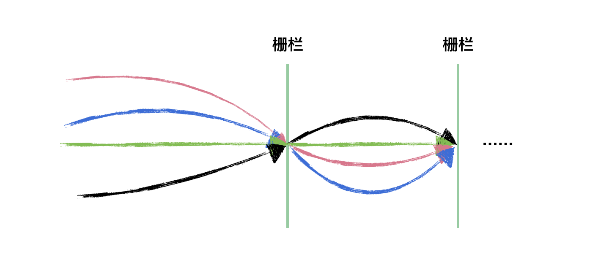
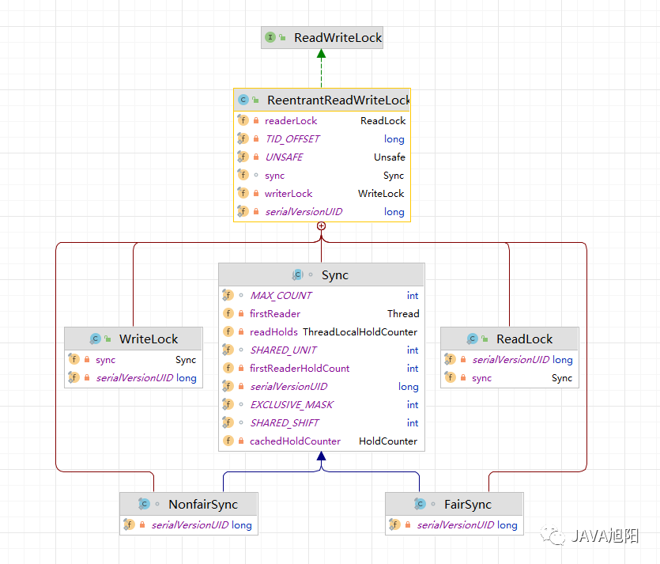
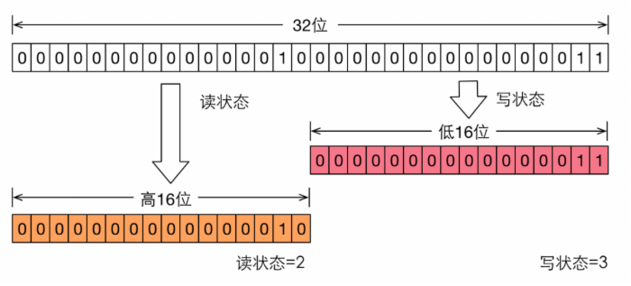

	这是“并发”系列的第八篇文章，主要介绍的是AQS的共享锁实现。
    如CountDownLatch、CyclicBarrier、Semaphore、ReentrantReadWriteLock等。

# 一、什么是AQS？
AQS 的全称为 <code>AbstractQueuedSynchronizer</code> ，翻译过来的意思就是**抽象队列同步器**。是并发包下的一个基础组件，**用来实现各种锁、各种同步器的基础组件**。
<!-- more -->

在并发编程中，锁是一种常用的保证线程安全的方法。Java 中常用的锁主要有两类，一种是 Synchronized 修饰的锁，被称为 Java 内置锁或监视器锁。另一种就是在 J2SE 1.5版本之后的 java.util.concurrent包（下称j.u.c包）中的各类同步器，包括 ReentrantLock（可重入锁），ReentrantReadWriteLock（可重入读写锁），Semaphore（信号量），CountDownLatch 等。这些同步器都是基于 AbstractQueuedSynchronizer（下称 AQS）这个简单的框架来构建的，而 AQS 类的核心数据结构是一种名为 Craig, Landin, and Hagersten locks（下称 CLH 锁）的变体

# 二、CountDownLatch
<code>CountDownLatch</code>是 Java 并发包<code>（java.util.concurrent）</code>中的一个同步工具类。它允许一个或多个线程等待，直到其他线程完成一系列操作。可以把它想象成一个计数器，这个计数器的初始值是一个正整数，每当一个特定的事件发生或者一个任务完成，计数器的值就会减 1。当计数器的值减到 0 时，那些等待的线程就可以继续执行了。

<code>CountDownLatch</code> 是一次性的，计数器的值只能在构造方法中初始化一次，之后没有任何机制再次对其设置值，当 <code>CountDownLatch</code> 使用完毕后，它不能再次被使用。

## 2.1、CountDownLatch使用示例
```java
import java.util.concurrent.CountDownLatch;
public class CountDownLatchExample1 {
    public static void main(String[] args) throws InterruptedException {
        // 创建CountDownLatch，初始值为3，表示有3个子线程任务需要完成
        CountDownLatch latch = new CountDownLatch(3);
        // 创建并启动3个子线程
        Thread thread1 = new Thread(() -> {
            try {
                Thread.sleep(1000);
                System.out.println("线程1任务完成");
            } catch (InterruptedException e) {
                e.printStackTrace();
            } finally {
                // 任务完成后调用countDown方法，将计数器减1
                latch.countDown();
            }
        });
        Thread thread2 = new Thread(() -> {
            try {
                Thread.sleep(1500);
                System.out.println("线程2任务完成");
            } catch (InterruptedException e) {
                e.printStackTrace();
            } finally {
                latch.countDown();
            }
        });
        Thread thread3 = new Thread(() -> {
            try {
                Thread.sleep(800);
                System.out.println("线程3任务完成");
            } catch (InterruptedException e) {
                e.printStackTrace();
            } finally {
                latch.countDown();
            }
        });
        thread1.start();
        thread2.start();
        thread3.start();
        // 主线程调用await方法，阻塞等待，直到计数器变为0，即所有子线程任务都完成
        latch.await();
        System.out.println("所有子线程任务都已完成，主线程继续执行");
    }
}
```

## 2.2、CountDownLatch源码分析
<code>CountDownLatch</code> 是共享锁的一种实现，它默认构造 AQS 的 state 值为 count。这个我们通过 CountDownLatch 的构造方法即可看出。
```java
public class CountDownLatch {
    //只有1个带参构造函数
  public CountDownLatch(int count) {
    if (count < 0) throw new IllegalArgumentException("count < 0");
    this.sync = new Sync(count);
  }

  private static final class Sync extends AbstractQueuedSynchronizer {
      Sync(int count) {
          setState(count);
      }
      int getCount() {
          return getState();
      }
      protected int tryAcquireShared(int acquires) {
          return (getState() == 0) ? 1 : -1;
      }
      protected boolean tryReleaseShared(int releases) {
          // Decrement count; signal when transition to zero
          for (; ; ) {
              int c = getState();
              if (c == 0)
                  return false;
              int nextc = c - 1;
              if (compareAndSetState(c, nextc))
                  return nextc == 0;
          }
      }
  }
}
```
CountDownLatch主要有两个方法：countDown()和await()。

countDown()方法用于使计数器减一，其一般是执行任务的线程调用，await()方法则使调用该方法的线程处于等待状态，其一般是主线程调用。


### 2.2.1、await()方法分析
```java
//当调用 await() 的时候，如果 state 不为 0，那就证明任务还没有执行完毕，await() 就会一直阻塞，
// 这个方法会使当前线程等待，直到计数器的值变为 0。如果在等待过程中线程被中断，会抛出InterruptedException异常。
public void await() throws InterruptedException {
    sync.acquireSharedInterruptibly(1);
}
//这个方法和await()类似，但是它允许设置一个等待的超时时间。如果在超时时间内计数器变为 0，
// 就返回true；如果超时时间到了计数器还没有变为 0，就返回false。
public boolean await(long timeout, TimeUnit unit) throws InterruptedException {
  return sync.tryAcquireSharedNanos(1, unit.toNanos(timeout));
}
```

#### 第一步：分析AQS的<code>acquireSharedInterruptibly()</code>方法
```java
public final void acquireSharedInterruptibly(int arg) throws InterruptedException {
    if (Thread.interrupted())
        throw new InterruptedException();
    if (tryAcquireShared(arg) < 0)
        doAcquireSharedInterruptibly(arg);
}
```
共享模式去获取锁，tryAcquireShared(arg)方法由CountDownLatch内部类Sync实现，接下来分析tryAcquireShared(arg)方法

#### 第二步：分析<code>tryAcquireShared(arg)</code>方法
```java
protected int tryAcquireShared(int acquires) {
    return (getState() == 0) ? 1 : -1;
}
```
第一步和第二步的主要逻辑是：
- 如果state == 0，则代表所有任务已经执行完成，执行await()方法的线程不阻塞。
- 如果state !=0，则代表有任务为执行完成，需要调用<code>doAcquireSharedInterruptibly</code>阻塞线程。

#### 第三步：分析<code>doAcquireSharedInterruptibly()</code>方法
该方法为AQS的实现方法，主要逻辑
```java
private void doAcquireSharedInterruptibly(int arg) throws InterruptedException {
    //以共享模式，将线程添加到同步队列尾部
    final Node node = addWaiter(Node.SHARED);
    boolean failed = true;
    try {
        for (;;) {
          // 获取当前节点的前一个节点
            final Node p = node.predecessor();
          // 判断前一个节点是否为头结点
            if (p == head) {
                //尝试去获取锁
                int r = tryAcquireShared(arg);
                //如果state == 0，则代表线程不需要阻塞
                if (r >= 0) {
                    setHeadAndPropagate(node, r);
                    p.next = null; // help GC
                    failed = false;
                    return;
                }
            }
            //p != head || p == head && state !=0 
          //此时去判断当前线程是否需要阻塞
            if (shouldParkAfterFailedAcquire(p, node) && parkAndCheckInterrupt())
                throw new InterruptedException();
        }
    } finally {
        if (failed)
            cancelAcquire(node);
    }
}
```


### 2.2.2、countDown()方法分析
countDown()方法用于释放锁，使state减一，其一般是执行任务的线程调用。
```java
public void countDown() {
    // Sync 是 CountDownLatch 的内部类 , 继承了 AbstractQueuedSynchronizer
    sync.releaseShared(1);
}

public final boolean releaseShared(int arg) {
  if (tryReleaseShared(arg)) {
    doReleaseShared();
    return true;
  }
  return false;
}
```

#### 第一步：分析<code>tryReleaseShared()</code>方法
CountDownLatch内部类Sync的重写方法：
```java
public class CountDownLatch {
  private static final class Sync extends AbstractQueuedSynchronizer {
    protected boolean tryReleaseShared(int releases) {
        // Decrement count; signal when transition to zero
        for (; ; ) {
            int c = getState();
            if (c == 0)
                return false;
            int nextc = c - 1;
            if (compareAndSetState(c, nextc))
                //当state减到0时，才会去唤醒阻塞线程
                return nextc == 0;
        }
    }
  }
}
```
当线程调用 countDown() 时，其实使用了tryReleaseShared方法以 CAS 的操作来减少 state，直至 state 为 0 。
- 如果最后一个线程执行tryReleaseShared方法，nextc = 1-1=0，此时表示所有的线程都调用了 countDown 方法，此时返回true
- state减为0时，doReleaseShared()，去释放锁和唤醒主线程


#### 第二步：分析<code>doReleaseShared()</code>方法
```java
private void doReleaseShared() {
        for (;;) {
          // 记录等待队列中的头结点的线程
            Node h = head;
          // 头结点不为空，且头结点不等于尾节点
            if (h != null && h != tail) {
                int ws = h.waitStatus;
              // SIGNAL状态表示当前节点正在等待被唤醒
                if (ws == Node.SIGNAL) {
                  // 清除当前节点的等待状态
                    if (!compareAndSetWaitStatus(h, Node.SIGNAL, 0))
                        continue;            // loop to recheck cases
                  // 唤醒当前节点的下一个节点
                    unparkSuccessor(h);
                }
                else if (ws == 0 &&
                         !compareAndSetWaitStatus(h, 0, Node.PROPAGATE))
                    continue;                // loop on failed CAS
            }
          // 如果h还是指向头结点，说明前面这段代码执行过程中没有其他线程对头结点进行过处理
            if (h == head)                   // loop if head changed
                break;
        }
    }
```
从同步队列的head节点开始，往后唤醒线程


## 2.3、CountDownLatch存在的问题
### 主线程一直等待问题
场景：当使用线程池执行任务的时候countdown()，如果线程池出现任务丢弃、线程死亡情况，state永远无法=0，导致主线程一直等待

解决方案：当state设置过大，没有线程将其减为0，此时需要考虑将主线程唤醒，可使用await(time)方法

## 2.4、总结
CountDownLatch 的实现是基于 AQS 的。

# 三、CyclicBarrier
字面意思是可循环使用（Cyclic）的屏障（Barrier）。它要做的事情是：让一组线程到达一个屏障（也可以叫同步点）时被阻塞，直到最后一个线程到达屏障时，屏障才会开门，所有被屏障拦截的线程才会继续干活。

CycliBarrier 是基于 ReentrantLock(ReentrantLock 也属于 AQS 同步器)和 Condition 的。

## 3.1、使用示例
```java
public static void main(String[] args) {
    int parties = 3;
    CyclicBarrier barrier = new CyclicBarrier(parties, () -> {
        System.out.println("All threads have reached the barrier in this generation!");
    });
    for (int i = 0; i < 2; i++) { // 模拟两轮循环
        for (int j = 0; j < parties; j++) {
            int threadNumber = j + 1;
            Thread thread = new Thread(() -> {
                try {
                    System.out.println("Thread " + threadNumber + " starts in generation " );
                    Thread.sleep(1000);
                    barrier.await();
                    System.out.println("Thread " + threadNumber + " continues after barrier in generation " );
                } catch (InterruptedException | BrokenBarrierException e) {
                    e.printStackTrace();
                }
            });
            thread.start();
        }
        // 等待所有线程完成这一轮
        try {
            Thread.sleep(5000);
        } catch (InterruptedException e) {
            e.printStackTrace();
        }
        System.out.println("Starting next generation...");
    }
}
```
上面示例中，创建一个<code>CyclicBarrier</code>，parties是一个非常重要的属性。它代表了需要在这个CyclicBarrier处等待的线程数量。当创建一个CyclicBarrier实例时，需要通过构造函数传入这个parties值。
然后任务线程执行<code>await()</code>方法

## 3.2、源码分析
CyclicBarrier的内部属性如下：
```java
public class CyclicBarrier {
    private static class Generation {
        boolean broken = false;
    }
    private final ReentrantLock lock = new ReentrantLock();
    private final Condition trip = lock.newCondition();
    private final int parties;
    private final Runnable barrierCommand;
    private Generation generation = new Generation();
    private int count;

    public CyclicBarrier(int parties, Runnable barrierAction) {
      if (parties <= 0) throw new IllegalArgumentException();
      this.parties = parties;
      this.count = parties;
      this.barrierCommand = barrierAction;
    }
}
```
- **lock：** 可重入锁
- **trip：** 等待队列
- **parties：** 用于指定需要在CyclicBarrier屏障处等待的线程数量。
- **barrierCommand：** 是一个Runnable类型的私有属性。它是一个可选的任务，当所有的parties个线程都到达屏障点（count变为 0）时，这个Runnable任务会被执行
- **generation：** 用于标记CyclicBarrier的 “代”
- **count：** 是CyclicBarrier的一个私有属性，用于记录还需要多少个线程到达屏障点

### 3.2.1、await()方法源码分析
```java
public int await() throws InterruptedException, BrokenBarrierException {
    try {
        return dowait(false, 0L);
    } catch (TimeoutException toe) {
        throw new Error(toe); // cannot happen
    }
}
```

#### 第一步：分析dowait(false, 0L)
```java
private int dowait(boolean timed, long nanos) throws InterruptedException, BrokenBarrierException, TimeoutException {
    //使用可重入锁，实现同步
    final ReentrantLock lock = this.lock;
    //加锁
    lock.lock();
    try {
        //代
        final Generation g = generation;
        if (g.broken)
            throw new BrokenBarrierException();
        if (Thread.interrupted()) {
            breakBarrier();
            throw new InterruptedException();
        }
        //还需要多少个线程到达屏障点 - 1
        int index = --count;
        //如果所有线程都到达屏障点
        if (index == 0) {  // tripped
            boolean ranAction = false;
            try {
                //执行线程
                final Runnable command = barrierCommand;
                if (command != null)
                    command.run();
                ranAction = true;
                //到一个“年龄代”
                nextGeneration();
                return 0;
            } finally {
                if (!ranAction)
                    breakBarrier();
            }
        }
        //代表还有线程未到达屏障点
        for (;;) {
            try {
                if (!timed)
                    //Condition的await()方法，将线程封装成Node节点，然后添加到等待队列内
                    trip.await();
                else if (nanos > 0L)
                    nanos = trip.awaitNanos(nanos);
            } catch (InterruptedException ie) {
                if (g == generation && ! g.broken) {
                    breakBarrier();
                    throw ie;
                } else {
                    Thread.currentThread().interrupt();
                }
            }
            if (g.broken)
                throw new BrokenBarrierException();
            if (g != generation)
                return index;
            if (timed && nanos <= 0L) {
                breakBarrier();
                throw new TimeoutException();
            }
        }
    } finally {
        lock.unlock();
    }
}
```
可以看到在dowait方法中每次都将count减1，减完后立马进行判断看看是否等于0，如果等于0的话就会先去执行之前指定好的任务，执行完之后再调用nextGeneration方法将栅栏转到下一代，在该方法中会将所有线程唤醒，将计数器的值重新设为parties，最后会重新设置栅栏代次，在执行完nextGeneration方法之后就意味着游戏进入下一局。如果计数器此时还不等于0的话就进入for循环，根据参数来决定是调用trip.awaitNanos(nanos)还是trip.await()方法，这两方法对应着定时和非定时等待。

#### 第二步：nextGeneration()方法
```java
private void nextGeneration() {
    // signal completion of last generation
    trip.signalAll();
    // set up next generation
    count = parties;
    generation = new Generation();
}
```

## 3.3、CyclicBarrier 与 CountDownLatch 区别
CountDownLatch 是一次性的，CyclicBarrier 是可循环利用的
CountDownLatch 参与的线程的职责是不一样的，有的在倒计时，有的在等待倒计时结束。CyclicBarrier 参与的线程职责是一样的。


# 四、Semaphore
<code>Semaphore</code>是计数信号量。<code>Semaphore</code>管理一系列许可证。每个acquire方法阻塞，直到有一个许可证可以获得然后拿走一个许可证；每个release方法增加一个许可证，这可能会释放一个阻塞的acquire方法。然而，其实并没有实际的许可证这个对象，Semaphore只是维持了一个可获得许可证的数量。

## 4.1、使用示例
Semaphore 的使用简单，我们这里假设有 N(N>5) 个线程来获取 Semaphore 中的共享资源，下面的代码表示同一时刻 N 个线程中只有 5 个线程能获取到共享资源，其他线程都会阻塞，只有获取到共享资源的线程才能执行。等到有线程释放了共享资源，其他阻塞的线程才能获取到。
```java
// 初始共享资源数量
final Semaphore semaphore = new Semaphore(5);
// 获取1个许可
semaphore.acquire();
// 释放1个许可
semaphore.release();
```
当初始的资源个数为 1 的时候，Semaphore 退化为排他锁。
Semaphore 有两种模式：。
- 公平模式： 调用 acquire() 方法的顺序就是获取许可证的顺序，遵循 FIFO；
- 非公平模式： 抢占式的。

Semaphore 对应的两个构造方法如下：
```java
public Semaphore(int permits) {
    sync = new NonfairSync(permits);
}
public Semaphore(int permits, boolean fair) {
    sync = fair ? new FairSync(permits) : new NonfairSync(permits);
}
```
这两个构造方法，都必须提供许可的数量，第二个构造方法可以指定是公平模式还是非公平模式，默认非公平模式。

Semaphore 通常用于那些资源有明确访问数量限制的场景比如限流（仅限于单机模式，实际项目中推荐使用 Redis +Lua 来做限流）。

## 4.2、源码分析
和ReentrantLock实现方式类似，都是内部类继承AQS。
```java
public class Semaphore implements java.io.Serializable {
    private final Sync sync;
    //内部静态抽象类---Sync同步器
    abstract static class Sync extends AbstractQueuedSynchronizer {

    }
}
```

### 4.2.1、acquire()方法
```java
// 获取1个许可证
public void acquire() throws InterruptedException {
    sync.acquireSharedInterruptibly(1);
}

// 获取一个或者多个许可证
public void acquire(int permits) throws InterruptedException {
    if (permits < 0) throw new IllegalArgumentException();
    sync.acquireSharedInterruptibly(permits);
}
```
以无参 <code>acquire</code> 方法为例，调用<code>semaphore.acquire()</code> ，线程尝试获取许可证
- 如果 state > 0 的话，则表示可以获取成功，
- 如果 state <= 0 的话，则表示许可证数量不足，获取失败。

如果可以获取成功的话(state > 0 )，会尝试使用 CAS 操作去修改 state 的值 state=state-1。如果获取失败则会创建一个 Node 节点加入等待队列，挂起当前线程。

#### 第一步：分析acquireSharedInterruptibly方法
acquireSharedInterruptibly方法是 AbstractQueuedSynchronizer 中的默认实现。
```java
// 共享模式下获取许可证，获取成功则返回，失败则加入等待队列，挂起线程
public final void acquireSharedInterruptibly(int arg)
    throws InterruptedException {
    if (Thread.interrupted())
      throw new InterruptedException();
        // 尝试获取许可证，arg为获取许可证个数，当获取失败时,则创建一个节点加入等待队列，挂起当前线程。
    if (tryAcquireShared(arg) < 0)
      doAcquireSharedInterruptibly(arg);
}
```

#### 第二步：分析<code>tryAcquireShared</code>
这里再以非公平模式（NonfairSync）的为例，看看 tryAcquireShared 方法的实现。
```java
// 共享模式下尝试获取资源(在Semaphore中的资源即许可证):
protected int tryAcquireShared(int acquires) {
    return nonfairTryAcquireShared(acquires);
}

// 非公平的共享模式获取许可证
final int nonfairTryAcquireShared(int acquires) {
    for (;;) {
        // 当前可用许可证数量
        int available = getState();
        /*
         * 尝试获取许可证，当前可用许可证数量小于等于0时，返回负值，表示获取失败，
         * 当前可用许可证大于0时才可能获取成功，CAS失败了会循环重新获取最新的值尝试获取
         */
        int remaining = available - acquires;
        if (remaining < 0 ||
            compareAndSetState(available, remaining))
            return remaining;
    }
}
```
尝试获取许可证，当前可用许可证数量小于等于0时，返回负值，表示获取失败，

#### 第三步：获取失败，执行doAcquireSharedInterruptibly()方法
是 AbstractQueuedSynchronizer（AQS）的一个内部方法。它用于以共享模式、可响应中断的方式来获取同步状态。
```java
private void doAcquireSharedInterruptibly(int arg) throws InterruptedException {
    final Node node = addWaiter(Node.SHARED);
    boolean failed = true;
    try {
        for (;;) {
            final Node p = node.predecessor();
            if (p == head) {
                int r = tryAcquireShared(arg);
                if (r >= 0) {
                    setHeadAndPropagate(node, r);
                    p.next = null; // help GC
                    failed = false;
                    return;
                }
            }
            if (shouldParkAfterFailedAcquire(p, node) &&
                parkAndCheckInterrupt())
                throw new InterruptedException();
        }
    } finally {
        if (failed)
            cancelAcquire(node);
    }
}
```
方法逻辑解析：
- **创建节点并入队：** addWaiter(Node.SHARED);
- **循环尝试获取同步状态：** 进入一个 for (;;) 无限循环，不断尝试获取同步状态，直到成功获取或者出现异常等情况才会跳出循环。
- **获取前驱节点并检查状态：** 在每次循环中，先获取当前节点的前驱节点（在同步队列中位于当前节点前面的那个节点），然后检查前驱节点的状态。这是因为在 AQS 机制里，节点能否获取同步状态往往和其前驱节点的状态有关。
- **尝试获取同步状态：** 处理获取失败等待情况：当获取共享同步状态失败时，会调用 shouldParkAfterFailedAcquire 方法来判断当前节点是否应该 “停车”（也就是让线程进入等待状态），并根据返回结果决定是否调用 parkAndCheckInterrupt 方法真正让线程进入等待状态，同时检查线程是否被中断。


### 4.2.2、release()方法
以无参 release 方法为例，调用semaphore.release(); ，线程尝试释放许可证，并使用 CAS 操作去修改 state 的值 state=state+1。释放许可证成功之后，同时会唤醒等待队列中的一个线程。被唤醒的线程会重新尝试去修改 state 的值 state=state-1 ，如果 state > 0 则获取令牌成功，否则重新进入等待队列，挂起线程。
```java
// 释放一个许可证
public void release() {
    sync.releaseShared(1);
}

// 释放一个或者多个许可证
public void release(int permits) {
    if (permits < 0) throw new IllegalArgumentException();
    sync.releaseShared(permits);
}
```
releaseShared方法是 AbstractQueuedSynchronizer 中的默认实现。
```java
// 释放共享锁
// 如果 tryReleaseShared 返回 true，就唤醒等待队列中的一个或多个线程。
public final boolean releaseShared(int arg) {
    //释放共享锁
    if (tryReleaseShared(arg)) {
      //释放当前节点的后置等待节点
      doReleaseShared();
      return true;
    }
    return false;
}
```

tryReleaseShared 方法是Semaphore 的内部类 Sync 重写的一个方法， AbstractQueuedSynchronizer中的默认实现仅仅抛出 UnsupportedOperationException 异常。
```java
// 内部类 Sync 中重写的一个方法
// 尝试释放资源
protected final boolean tryReleaseShared(int releases) {
    for (;;) {
        int current = getState();
        // 可用许可证+1
        int next = current + releases;
        if (next < current) // overflow
            throw new Error("Maximum permit count exceeded");
         // CAS修改state的值
        if (compareAndSetState(current, next))
            return true;
    }
}
```
可以看到，上面提到的几个方法底层基本都是通过同步器 sync 实现的。Sync 是 CountDownLatch 的内部类 , 继承了 AbstractQueuedSynchronizer ，重写了其中的某些方法。并且，Sync 对应的还有两个子类 NonfairSync（对应非公平模式） 和 FairSync（对应公平模式）。

> <code>Semaphore</code> 基于 AQS 实现，用于控制并发访问的线程数量，但它与共享锁的概念有所不同。Semaphore 的构造函数使用 permits 参数初始化 AQS 的 state 变量，该变量表示可用的许可数量。
> 
> 当线程调用 acquire() 方法尝试获取许可时，state 会原子性地减 1。如果 state 减 1 后大于等于 0，则 acquire() 成功返回，线程可以继续执行。
> 如果 state 减 1 后小于 0，表示当前并发访问的线程数量已达到 permits 的限制，该线程会被放入 AQS 的同步队列并阻塞，而不是自旋等待。
> 当其他线程完成任务并调用 release() 方法时，state 会原子性地加 1。release() 操作会唤醒 AQS 等待队列中的一个或多个阻塞线程。这些被唤醒的线程将再次尝试 acquire() 操作，竞争获取可用的许可。因此，Semaphore 通过控制许可数量来限制并发访问的线程数量，而不是通过自旋和共享锁机制。
> 

# 五、ReentrantReadWriteLock
ReentrantReadWriteLock是 Java 中的一个并发工具，它实现了读写锁的功能。读写锁维护了一对相关的锁，一个用于读操作，一个用于写操作。与普通的互斥锁（如ReentrantLock）不同，读写锁允许在同一时刻有多个读线程访问共享资源，但在写操作时是互斥的，即当一个线程进行写操作时，其他线程（无论是读线程还是写线程）都不能访问共享资源。

## 5.1、数据结构如下
```java
public class ReentrantReadWriteLock implements ReadWriteLock, java.io.Serializable {
    //读锁
    private final ReentrantReadWriteLock.ReadLock readerLock;
    //写锁
    private final ReentrantReadWriteLock.WriteLock writerLock;
    /** Performs all synchronization mechanics */
    final Sync sync;
    //构造函数
    public ReentrantReadWriteLock(boolean fair) {
        sync = fair ? new FairSync() : new NonfairSync();
        readerLock = new ReadLock(this);
        writerLock = new WriteLock(this);
    }
    abstract static class Sync extends AbstractQueuedSynchronizer {
        // 用来移位
        static final int SHARED_SHIFT   = 16;
        // 高16位的1
        static final int SHARED_UNIT    = (1 << SHARED_SHIFT);
        // 65535，16个1，代表写锁的最大重入次数
        static final int MAX_COUNT      = (1 << SHARED_SHIFT) - 1;
        // 低16位掩码：0b 1111 1111 1111 1111，用来获取写锁重入的次数
        static final int EXCLUSIVE_MASK = (1 << SHARED_SHIFT) - 1;
        // 获取读写锁的读锁分配的总次数
        static int sharedCount(int c)    { return c >>> SHARED_SHIFT; }
        // 写锁（独占）锁的重入次数
        static int exclusiveCount(int c) { return c & EXCLUSIVE_MASK; }
    }
}
```


### 5.1.1、sync属性解析

Sync继承AQS，内部属性如下：
- **SHARED_SHIFT：** 值=16，代表移动位，它主要用于位运算，通过位移操作来定位和操作state中用于表示读锁和写锁计数的部分。
  - state是一个 32 位的整数，通过将其分为高 16 位和低 16 位分别记录读锁和写锁的信息
- **SHARED_UNIT：** 用于在读锁计数操作时，确定每次读锁获取或释放操作在state变量中对应的增量或减量。
- **MAX_COUNT：** 读锁最大数量：16位二进制，最大65535个
- **EXCLUSIVE_MASK：** 

state:同步状态的实现是在一个整形变量上通过“按位切割使用”：将变量切割成两部分，高16位表示读，低16位表示写。

假设当前同步状态值为S，get和set的操作如下：
（1）获取写状态：
    S&0x0000FFFF:将高16位全部抹去
（2）获取读状态：
    S>>>16:无符号补0，右移16位
（3）写状态加1：
     S+1
（4）读状态加1：
S+（1<<16）即S + 0x00010000

在代码层的判断中，如果S不等于0，当写状态（S&0x0000FFFF），而读状态（S>>>16）大于0，则表示该读写锁的读锁已被获取。

## 5.2、使用示例
如下示例，是一个自定义缓存类，它使用ReentrantReadWriteLock来管理缓存的并发访问。在多线程环境下，缓存可能会被多个线程同时读取或写入，使用读写锁可以有效地提高缓存的并发性能，同时确保数据的一致性。
```java
public class CacheWithReadWriteLock {
    private final Map<String, Object> cache = new HashMap<>();
    private final ReentrantReadWriteLock lock = new ReentrantReadWriteLock();
    // 读数据的方法
    public Object get(String key) {
        lock.readLock().lock();
        try {
            // 多个线程可以同时读取缓存
            System.out.println("Thread " + Thread.currentThread().getName() + " is reading from cache.");
            return cache.get(key);
        } finally {
            lock.readLock().unlock();
        }
    }
    // 写数据的方法
    public void put(String key, Object value) {
        lock.writeLock().lock();
        try {
            // 只有一个线程能写入缓存，保证数据一致性
            System.out.println("Thread " + Thread.currentThread().getName() + " is writing to cache.");
            cache.put(key, value);
        } finally {
            lock.writeLock().unlock();
        }
    }
    public static void main(String[] args) {
        CacheWithReadWriteLock cache = new CacheWithReadWriteLock();
        // 多个读线程
        for (int i = 0; i < 5; i++) {
            int finalI = i;
            new Thread(() -> {
                cache.get("key" + finalI);
            }).start();
        }

        // 写线程
        new Thread(() -> {
            cache.put("newKey", "newValue");
        }).start();
    }
}
```


## 5.3、写锁
WriteLock类的lock()方法是加写锁的入口方法。
```java
static final class NonfairSync extends Sync {
    // ... 省略无关代码
 
    // 外部类 WriteLock 方法, 方便阅读, 放在此处
    public void lock() {
        sync.acquire(1);
    }
 
    // AQS 继承过来的方法, 方便阅读, 放在此处
    public final void acquire(int arg) {
        if (
            // 尝试获得写锁失败
                !tryAcquire(arg) &&
                        // 将当前线程关联到一个 Node 对象上, 模式为独占模式
                        // 进入 AQS 队列阻塞
                        acquireQueued(addWaiter(Node.EXCLUSIVE), arg)
        ) {
            selfInterrupt();
        }
    }
    protected final boolean tryAcquire(int acquires) {
        // 获取当前线程
        Thread current = Thread.currentThread();
        //获得锁的状态
        int c = getState();
        // 获得低 16 位, 代表写锁的 state 计数
        int w = exclusiveCount(c);
         // c不等于0表示加了读锁或者写锁
        if (c != 0) {
            if (
                // c != 0 and w == 0 表示有读锁返回错误，读锁不支持锁升级, 或者
                    w == 0 ||
                            // w != 0 说明有写锁，写锁的拥有者不是自己，获取失败
                            current != getExclusiveOwnerThread()
            ) {
                // 获得锁失败
                return false;
            }
            // 写锁计数超过低 16 位最大数量, 报异常
            if (w + exclusiveCount(acquires) > MAX_COUNT)
                throw new Error("Maximum lock count exceeded");
            // 写锁重入, 获得锁成功，没有并发，所以不使用 CAS
            setState(c + acquires);
            return true;
        }
        if (
             // c == 0，说明没有任何锁，判断写锁是否该阻塞，是 false 就尝试获取锁，失败返回 false
                writerShouldBlock() ||
                        // 尝试更改计数失败
                        !compareAndSetState(c, c + acquires)
        ) {
            // 获得锁失败
            return false;
        }
        // 获得锁成功，设置锁的持有线程为当前线程
        setExclusiveOwnerThread(current);
        return true;
    }
 
    // 非公平锁 writerShouldBlock 总是返回 false, 无需阻塞
    final boolean writerShouldBlock() {
        return false; 
    }
    // 公平锁会检查 AQS 队列中是否有前驱节点, 没有(false)才去竞争
    final boolean writerShouldBlock() {
        return hasQueuedPredecessors();
    }
}
```
- tryAcquire()方法是模板方法，由子类自定义实现获取锁的逻辑。
- 线程如果获取写锁失败的话，通过acquireQueued()方法封装成独占Node加入到AQS队列中。

获取写锁的步骤如下：
（1）首先获取c、w。c表示当前锁状态；w表示写线程数量。然后判断同步状态state是否为0。如果state!=0，说明已经有其他线程获取了读锁或写锁，执行(2)；否则执行(5)。

（2）如果锁状态不为零（c != 0），而写锁的状态为0（w = 0），说明读锁此时被其他线程占用，所以当前线程不能获取写锁，自然返回false。或者锁状态不为零，而写锁的状态也不为0，但是获取写锁的线程不是当前线程，则当前线程也不能获取写锁。

（3）判断当前线程获取写锁是否超过最大次数，若超过，抛异常，反之更新同步状态（此时当前线程已获取写锁，更新是线程安全的），返回true。

（4）如果state为0，此时读锁或写锁都没有被获取，判断是否需要阻塞（公平和非公平方式实现不同），在非公平策略下总是不会被阻塞，在公平策略下会进行判断（判断同步队列中是否有等待时间更长的线程，若存在，则需要被阻塞，否则，无需阻塞），如果不需要阻塞，则CAS更新同步状态，若CAS成功则返回true，失败则说明锁被别的线程抢去了，返回false。如果需要阻塞则也返回false。

（5）成功获取写锁后，将当前线程设置为占有写锁的线程，返回true。

## 5.4、读锁
ReadLock类的lock()方法是加读锁的入口方法，调用tryAcquireShared()方法尝试获取读锁，返回负数，失败，加入到队列中。
```java
// 加读锁的方法入口
public void lock() {
    sync.acquireShared(1);
}
public final void acquireShared(int arg) {
    // tryAcquireShared 返回负数, 表示获取读锁失败，加入到队列中
    if (tryAcquireShared(arg) < 0)
        doAcquireShared(arg);
}
```
tryAcquireShared()方法是一个模板方法，AQS类中定义语义，子类实现，如果返回1，表示获取锁成功，还有剩余资源，返回0表示获取成功，没有剩余资源，返回-1表示失败。
```java
// 尝试以共享模式获取，返回1表示获取锁成功，还有剩余资源,返回0表示获取成功，没有剩余资源，返回-1，表示失败
protected final int tryAcquireShared(int unused) {
    Thread current = Thread.currentThread();
    int c = getState();
    // exclusiveCount(c) 代表低 16 位, 写锁的 state，成立说明有线程持有写锁
    // 写锁的持有者不是当前线程，则获取读锁失败，【写锁允许降级】
    if (exclusiveCount(c) != 0 && getExclusiveOwnerThread() != current)
        return -1;
    
    // 高 16 位，代表读锁的 state，共享锁分配出去的总次数
    int r = sharedCount(c);
    // 读锁是否应该阻塞
    if (!readerShouldBlock() &&    r < MAX_COUNT &&
        compareAndSetState(c, c + SHARED_UNIT)) {        // 尝试增加读锁计数
        // 加锁成功
        // 加锁之前读锁为 0，说明当前线程是第一个读锁线程
        if (r == 0) {
            firstReader = current;
            firstReaderHoldCount = 1;
        // 第一个读锁线程是自己就发生了读锁重入
        } else if (firstReader == current) {
            firstReaderHoldCount++;
        } else {
            // cachedHoldCounter 设置为当前线程的 holdCounter 对象，即最后一个获取读锁的线程
            HoldCounter rh = cachedHoldCounter;
            // 说明还没设置 rh
            if (rh == null || rh.tid != getThreadId(current))
                // 获取当前线程的锁重入的对象，赋值给 cachedHoldCounter
                cachedHoldCounter = rh = readHolds.get();
            // 还没重入
            else if (rh.count == 0)
                readHolds.set(rh);
            // 重入 + 1
            rh.count++;
        }
        // 读锁加锁成功
        return 1;
    }
    // 逻辑到这 应该阻塞，或者 cas 加锁失败
    // 会不断尝试 for (;;) 获取读锁, 执行过程中无阻塞
    return fullTryAcquireShared(current);
}

// 非公平锁 readerShouldBlock 偏向写锁一些，看 AQS 阻塞队列中第一个节点是否是写锁，是则阻塞，反之不阻塞
// 防止一直有读锁线程，导致写锁线程饥饿
// true 则该阻塞, false 则不阻塞
final boolean readerShouldBlock() {
    return apparentlyFirstQueuedIsExclusive();
}

// 下面是公平锁的readerShouldBlock
// 公平锁会检查 AQS 队列中是否有前驱节点, 没有(false)才去竞争
final boolean readerShouldBlock() {
    return hasQueuedPredecessors();
}
```
fullTryAcquireShared()方法是通过自旋的方式不断获取读锁，因为由于前面的readerShouldBlock返回false或者cas失败，导致没有获取到锁，需要不断重试。
```java
final int fullTryAcquireShared(Thread current) {
    // 当前读锁线程持有的读锁次数对象
    HoldCounter rh = null;
    for (;;) {
        int c = getState();
        // 说明有线程持有写锁
        if (exclusiveCount(c) != 0) {
            // 写锁不是自己则获取锁失败
            if (getExclusiveOwnerThread() != current)
                return -1;
        } else if (readerShouldBlock()) {
            // 条件成立说明当前线程是 firstReader，当前锁是读忙碌状态，而且当前线程也是读锁重入
            if (firstReader == current) {
                // assert firstReaderHoldCount > 0;
            } else {
                if (rh == null) {
                    // 最后一个读锁的 HoldCounter
                    rh = cachedHoldCounter;
                    // 说明当前线程也不是最后一个读锁
                    if (rh == null || rh.tid != getThreadId(current)) {
                        // 获取当前线程的 HoldCounter
                        rh = readHolds.get();
                        // 条件成立说明 HoldCounter 对象是上一步代码新建的
                        // 当前线程不是锁重入，在 readerShouldBlock() 返回 true 时需要去排队
                        if (rh.count == 0)
                            // 防止内存泄漏
                            readHolds.remove();
                    }
                }
                if (rh.count == 0)
                    return -1;
            }
        }
        // 越界判断
        if (sharedCount(c) == MAX_COUNT)
            throw new Error("Maximum lock count exceeded");
        // 读锁加锁，条件内的逻辑与 tryAcquireShared 相同
        if (compareAndSetState(c, c + SHARED_UNIT)) {
            if (sharedCount(c) == 0) {
                firstReader = current;
                firstReaderHoldCount = 1;
            } else if (firstReader == current) {
                firstReaderHoldCount++;
            } else {
                if (rh == null)
                    rh = cachedHoldCounter;
                if (rh == null || rh.tid != getThreadId(current))
                    rh = readHolds.get();
                else if (rh.count == 0)
                    readHolds.set(rh);
                rh.count++;
                cachedHoldCounter = rh; // cache for release
            }
            return 1;
        }
    }
}
```
doAcquireShared()是在获取读锁失败的时候加入AQS队列的逻辑。

## 5.5、总结
- 在线程持有读锁的情况下，该线程不能取得写锁(因为获取写锁的时候，如果发现当前的读锁被占用，就马上获取失败，不管读锁是不是被当前线程持有)。
- 在线程持有写锁的情况下，该线程可以继续获取读锁（获取读锁时如果发现写锁被占用，只有写锁没有被当前线程占用的情况才会获取失败）。

仔细想想，这个设计是合理的：因为当线程获取读锁的时候，可能有其他线程同时也在持有读锁，因此不能把获取读锁的线程“升级”为写锁；而对于获得写锁的线程，它一定独占了读写锁，因此可以继续让它获取读锁，当它同时获取了写锁和读锁后，还可以先释放写锁继续持有读锁，这样一个写锁就“降级”为了读锁。

综上：
一个线程要想同时持有写锁和读锁，必须先获取写锁再获取读锁；写锁可以“降级”为读锁；读锁不能“升级”为写锁。

## 5.6、常见问题
	
### 5.6.1、死锁
产生背景：线程获取到读锁后，立马获取写锁

**代码解读：** 首先这一切发生都是在a、b、c线程获取到读锁之后，a再次获取写锁导致死锁发生。所以我们假定目前ReentrantReadWriteLock中只有共享锁，而接着a尝试在有读锁的时候获取写锁，来看写锁的获取过程。
```java
public void lock() {
  sync.acquire(1);
}
public final void acquire(int arg) {
    if (!tryAcquire(arg) &&
    acquireQueued(addWaiter(Node.EXCLUSIVE), arg))
    selfInterrupt();
}

protected final boolean tryAcquire(int acquires) {
    // 获取当前线程
    Thread current = Thread.currentThread();
    //获得锁的状态
    int c = getState();
    // 获得低 16 位, 代表写锁的 state 计数
    int w = exclusiveCount(c);
    // c不等于0表示加了读锁或者写锁
    if (c != 0) {
        if (
            // c != 0 and w == 0 表示有读锁返回错误，读锁不支持锁升级, 或者
                w == 0 ||
                        // w != 0 说明有写锁，写锁的拥有者不是自己，获取失败
                        current != getExclusiveOwnerThread()
        ) {
            // 获得锁失败
            return false;
        }
        // 写锁计数超过低 16 位最大数量, 报异常
        if (w + exclusiveCount(acquires) > MAX_COUNT)
            throw new Error("Maximum lock count exceeded");
        // 写锁重入, 获得锁成功，没有并发，所以不使用 CAS
        setState(c + acquires);
        return true;
    }
    if (
        // c == 0，说明没有任何锁，判断写锁是否该阻塞，是 false 就尝试获取锁，失败返回 false
            writerShouldBlock() ||
                    // 尝试更改计数失败
                    !compareAndSetState(c, c + acquires)
    ) {
        // 获得锁失败
        return false;
    }
    // 获得锁成功，设置锁的持有线程为当前线程
    setExclusiveOwnerThread(current);
    return true;
}
```


解决：先获取写锁，再去获取读锁


参考文章：
[图解ReentrantReadWriteLock读写锁的实现原理](https://www.51cto.com/article/744000.html)
[ReentrantReadWriteLock读写锁详解](https://www.cnblogs.com/xiaoxi/p/9140541.html)