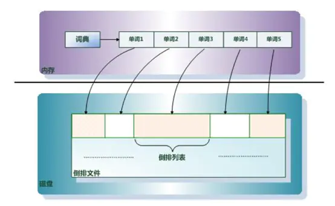
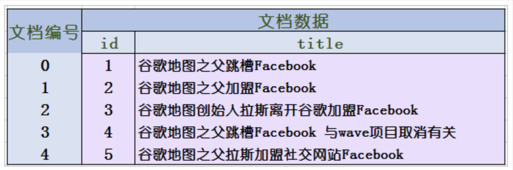

# 一、时间问题
将一个时间字符按不同时区来解释，得到的data数据是不同的
```
String timeStr = "2017-8-24 11:17:10"; // 字面时间
SimpleDateFormat bjSdf = new SimpleDateFormat("yyyy-MM-dd HH:mm:ss");
bjSdf.setTimeZone(TimeZone.getTimeZone("Asia/Shanghai"));
Date bjDate = bjSdf.parse(timeStr);  // 解析
System.out.println("字面时间: " + timeStr +",按北京时间来解释:" + bjSdf.format(bjDate) + ", " + bjDate.getTime());
 
SimpleDateFormat tokyoSdf = new SimpleDateFormat("yyyy-MM-dd HH:mm:ss");  // 东京
tokyoSdf.setTimeZone(TimeZone.getTimeZone("Asia/Tokyo"));  // 设置东京时区
Date tokyoDate = tokyoSdf.parse(timeStr); // 解析
System.out.println("字面时间: " + timeStr +",按东京时间来解释:"  + tokyoSdf.format(tokyoDate) + ", " + tokyoDate.getTime());
```
输出为：   
* 字面时间: 2017-8-24 11:17:10,按北京时间来解释:2017-08-24 11:17:10, 1503544630000
* 字面时间: 2017-8-24 11:17:10,按东京时间来解释:2017-08-24 11:17:10, 1503541030000

一个字符串时间，按不同时区解析，得到的毫秒数是不一样的。  
ES中默认时区是UTC，如果北京时间2017-8-23 11:17:10存入es中，那么会按UTC时区解析，那么实际存储到ES中的时间是会小8小时的，然后再把毫秒数按北京时区解析，自然就少了8小时。这就是ES的时区问题。

<!--more-->  

# 二、架构
集群架构：多个节点，主从架构。

数据逻辑结构：

存储目录结构图：

1. index包含多个shard。
2. primary shard的数量在创建索引的时候就固定了，因为索引时，需要按照primary shard的数量为文档做路由（默认使用文档的_id属性取哈希值做路由，也可以通过routing指定使用其他文档字段取哈希值做路由）。replica shard的数量可以随时修改。
3. primary shard不能和自己的replica shard放在同一个节点上（否则节点宕机，primary shard和副本都丢失，起不到容错的作用），但是可以和其他primary shard的replica shard放在同一个节点上。


## 分片：shard
1. 什么是分片？
    * 索引数据过大时，单机无法存储，对索引数据进行切割，索引可以确定切割几片，切成的每一块就叫切片。
    * 然后为了切片的高可用，然后采用了副本的方式，每个切片可以确定副本的数量，副本不能和主分片存储在同一台机器。


# 三、选举
## 1、ES是如何实现Master选举的
1. 对所有可以成为master的节点(node.master:true)根据nodeId字典排序，每次选举每个节点都把自己所知
道节点排一次序，然后选出第一个（第0位）节点，暂且认为它是master节点。
 如果对某个节点的投票数达到一定的值（可以成为master节点数n/2+1）并且该节点自己也选举自己，
那这个节点就是master，否则重新选举一直到满足上述条件。
    * 补充：master节点的职责主要包括集群、节点和索引的管理，不负责文档级别的管理；data节点可以关
闭http功能。
## 2、脑裂如何避免
 当集群master候选数量不少于3个时，可以通过设置最少投票数量
（discovery.zen.minimum_master_nodes）超过所有候选节点一半以上来解决脑裂问题。
 当候选数量为两个时，只能修改为唯一的一个master候选，其他作为data节点，避免脑裂问题。


# 四、倒排索引
## 1. 什么是倒排索引？

记录的是单词存在的文档ID列表。

### 倒排索引组成
倒排文件 + 单词词典

1. 单词词典（Term Dictionary）：搜索引擎的通常索引单位是单词，单词词典是由文档集合中出现过的所有单词构成的字符串集合，单词词典内每条索引项记载单词本身的一些信息以及指向“倒排列表”的指针。
    * 如何快速定位单词呢？使用什么数据类型？
    * 方式1：数组+ 链表
    * 方式2：B或B+树
2. 倒排列表(PostingList)：倒排列表记载了出现过某个单词的所有文档的文档列表及单词在该文档中出现的位置信息及频率（作关联性算分），每条记录称为一个倒排项(Posting)。根据倒排列表，即可获知哪些文档包含某个单词。
3. 倒排文件(Inverted File)：所有单词的倒排列表往往顺序地存储在磁盘的某个文件里，这个文件即被称之为倒排文件，倒排文件是存储倒排索引的物理文件。

## 2. 正排索引

用ID建立索引，保存ID所对应的文档内容等数据。


# 五、Elasticsearch写人数据的过程 
## 1、Elasticsearch写人数据的过程
1. 客户端选择一个node发送请求过去，这个node就是coordinating node（协调节点）
2. coordinating node，对document进行路由，将请求转发给对应的node（有primary shard）
3. 实际的node上的primary shard处理请求，然后将数据同步到replica node
4. coordinating node，如果发现primary node和所有replica node都搞定之后，就返回响应结果给客户端

## 2、Elasticsearch写数据的底层原理
 1. 数据先写入到buffer里面，在buffer里面的数据时搜索不到的，同时将数据写入到translog日志文件之中
 2. 如果buffer快满了，或是一段时间之后，就会将buffer数据refresh到一个新的OS cache之中，然后每隔1秒，就会将OS cache的数据写入到segment file之中，但是如果每一秒钟没有新的数据到buffer之中，就会创建一个新的空的segment file，只要buffer中的数据被refresh到OS cache之中，就代表这个数据可以被搜索到了。当然可以通过restful api 和Java api，手动的执行一次refresh操作，就是手动的将buffer中的数据刷入到OS cache之中，让数据立马搜索到，只要数据被输入到OS cache之中，buffer的内容就会被清空了。同时进行的是，数据到shard之后，就会将数据写入到translog之中，每隔5秒将translog之中的数据持久化到磁盘之中
 3. 重复以上的操作，每次一条数据写入buffer，同时会写入一条日志到translog日志文件之中去，这个translog文件会不断的变大，当达到一定的程度之后，就会触发commit操作。
 4. 将一个commit point写入到磁盘文件，里面标识着这个commit point 对应的所有segment file
 5. 强行将OS cache 之中的数据都fsync到磁盘文件中去。
    * 解释：translog的作用：在执行commit之前，所有的而数据都是停留在buffer或OS cache之中，无论buffer或OS cache都是内存，一旦这台机器死了，内存的数据就会丢失，所以需要将数据对应的操作写入一个专门的日志问价之中，一旦机器出现宕机，再次重启的时候，es会主动的读取translog之中的日志文件的数据，恢复到内存buffer和OS cache之中。
 6. 将现有的translog文件进行清空，然后在重新启动一个translog，此时commit就算是成功了，默认的是每隔30分钟进行一次commit，但是如果translog的文件过大，也会触发commit，整个commit过程就叫做一个flush操作，我们也可以通过ES API,手动执行flush操作，手动将OS cache 的数据fsync到磁盘上面去，记录一个commit point，清空translog文件
    * 补充：其实translog的数据也是先写入到OS cache之中的，默认每隔5秒之中将数据刷新到硬盘中去，也就是说，可能有5秒的数据仅仅停留在buffer或者translog文件的OS cache中，如果此时机器挂了，会丢失5秒的数据，但是这样的性能比较好，我们也可以将每次的操作都必须是直接fsync到磁盘，但是性能会比较差。
 7. 如果时删除操作，commit的时候会产生一个.del文件，里面讲某个doc标记为delete状态，那么搜索的时候，会根据.del文件的状态，就知道那个文件被删除了。
 8. 如果时更新操作，就是讲原来的doc标识为delete状态，然后重新写入一条数据即可。
 9. buffer每次更新一次，就会产生一个segment file 文件，所以在默认情况之下，就会产生很多的segment file 文件，将会定期执行merge操作
 10. 每次merge的时候，就会将多个segment file 文件进行合并为一个，同时将标记为delete的文件进行删除，然后将新的segment file 文件写入到磁盘，这里会写一个commit point，标识所有的新的segment file，然后打开新的segment file供搜索使用。

总之，segment的四个核心概念，refresh，flush，translog、merge

### 总结：
1. 和MySQL类似，日志先行，先将数据写入到日志文件。
2. 而后是写入磁盘，将缓冲数据写入刷入磁盘。（有个顺序，先刷入os cache，再有os决定什么时候刷入磁盘；或者强制刷入flush）
3. 然后是日志文件的刷入磁盘，和缓冲数据是一样的。
4. 每插入一条数据，都会生成一个segment文件，需要对segment文件进行merge操作。

# 六、Elasticsearch读取数据的过程 
## 1、Elasticsearch读取数据的过程
1. 客户端发送请求到任意⼀个node，成为coordinate node
2. coordinate node对document进⾏路由，将请求转发到对应的node，此时会使⽤round-robin随机
轮询算法，在primary shard以及其所有replica中随机选择⼀个，让读请求负载均衡
3. 接收请求的node返回document给coordinate node
4. coordinate node返回document给客户端
    1. 写⼊document时，每个document会⾃动分配⼀个全局唯⼀的id即doc id，同时也是根据doc id进 ⾏hash路由到对应的primary shard上。也可以⼿动指定doc id，⽐如⽤订单id，⽤户id。
    2. 读取document时，你可以通过doc id来查询，然后会根据doc id进⾏hash，判断出来当时把doc
id分配到了哪个shard上⾯去，从那个shard去查询

* 这里的读，是指读某个具体的数据。
### 总结
1. 根据具体的数据，可以具体的路由到具体的node
2. 然后读取node的分片，从分片中获取数据

## 2、Elasticsearch搜索数据过程
1. 客户端发送一个请求给coordinate node
2. 协调节点将搜索的请求转发给所有的shard对应的primary shard 或replica shard
3. query phase：每一个shard 将自己搜索的结果（其实也就是一些唯一标识），返回给协调节点，有协调节点进行数据的合并，排序，分页等操作，产出最后的结果
4. fetch phase ，接着由协调节点，根据唯一标识去各个节点进行拉去数据，最总返回给客户端

* 搜索，指的是用某些分词去获取所有的数据
### 总结
1. 根据请求，找到任意一个集群节点node（作为协调节点）
2. 然后将请求分发给所有的分片。
2. 聚合后返回结果。

[ES参考](https://segmentfault.com/a/1190000015256970)


