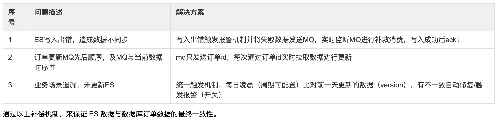

# 一、背景
1. 随着订单越来越多，基于MySQL关系型数据库的查询容易遇到瓶颈。
2. 订单管理平台的复杂查询。

以上多种原因，有了订单数据存入ES的诉求。

# 二、数据同步方案：


考虑订单数据迁入ES，需要考虑的因素。

* 最终选择了方案2

<!--more-->  

# 三、常见问题及解决方案



# 四、需要考虑的问题

1. 评估全量索引重建的时间范围
    * 初次同步索引批量重建，以月为单位分段进行数据同步；另外支持按自定义时间段进行数据检查的补偿机制，用于修复一些业务遗漏造成的数据不一致，具体时间跨度可根据触发实际场景调节；
2. 订单数据是否有删除或者淘汰机制，如果没有，分片逐渐增加，rebalance过程会逐渐增加。
    * 随着数据越来越多，
3. 订单整体数据量有多大，准备设置多少个分片，分片越大，添加或删除节点过程中数据rebalance的过程越长，这个过程中性能较差。

# 五、创建索引
1. 基于订单号查询
2. 基于商品查询
3. 基于订单时间查询
4. 基于城市查询
5. 基于用户查询
6. 以及其他场景，建立以下索引结构（部分）

```
{
  "tk_jz_mid_order-20200628": {
    "mappings": {
      "ty_mid_order": {
        "properties": {
          "create_time": {
            "format": "yyyy-MM-dd HH:mm:ss",
            "store": true,
            "type": "date"
          },
          "parent_id": {
            "store": true,
            "type": "long"
          },
          "id": {
            "store": true,
            "type": "long"
          },
          "city_id": {
            "store": true,
            "type": "integer"
          },
          "order_date": {
            "format": "yyyy-MM-dd HH:mm:ss",
            "store": true,
            "type": "date"
          },
          "uid": {
            "store": true,
            "type": "long"
          }
          "order_properties": {
            "type": "nested",
            "properties": {
              "create_time": {
                "format": "yyyy-MM-dd HH:mm:ss",
                "store": true,
                "type": "date"
              },
              "property_key": {
                "analyzer": "ik_smart",
                "store": true,
                "type": "text"
              },
              "property_value": {
                "analyzer": "ik_smart",
                "store": true,
                "type": "text"
              },
              "property_name": {
                "analyzer": "ik_smart",
                "store": true,
                "type": "text"
              }
            }
          },
          "order_purchases": {
            "type": "nested",
            "properties": {
              "sku_bar_code": {
                "store": true,
                "type": "long"
              },
              "create_time": {
                "format": "yyyy-MM-dd HH:mm:ss",
                "store": true,
                "type": "date"
              },
              "spu_name": {
                "analyzer": "ik_smart",
                "store": true,
                "type": "text"
              }
            }
          }
        }
      }
    }
  }
}
```
* es版本6.X
* 对商品名称分词，对词项生成倒排索引。
* 对订单属性分词，对词项生成倒排索引。
