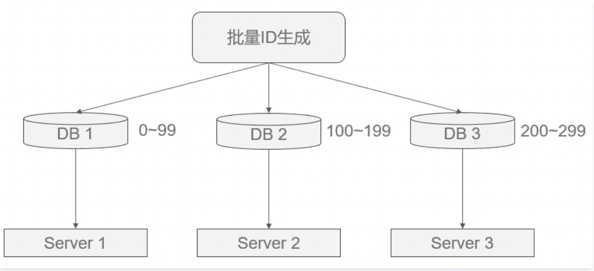
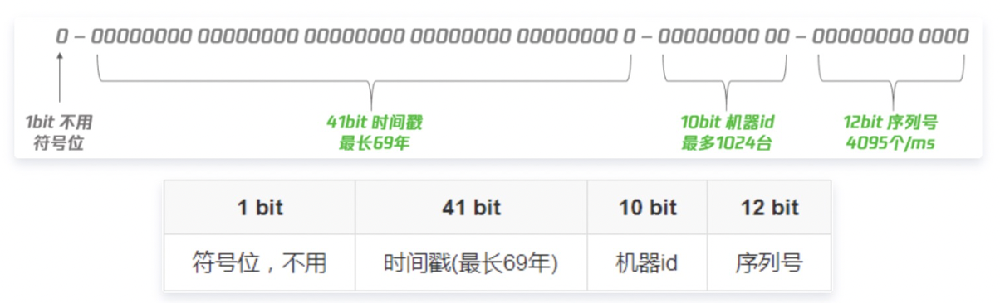

# 一、UUID
1. 生成规则：
    * 基于时间戳&时钟序列生成
    * 基于名字空间/名字的散列值 (MD5/SHA1) 生成
    * 基于随机数生成
2. 优点
    * 无需网络，单机自行生成
    * 速度快，QPS高（支持100ns级并发）
    * 使用简单
    * 不会泄漏商业机密
3. 缺点
    * 可读性差
    * 占用空间太多(16个字节)
    * 影响数据库的性能,

<!--more-->  

# 二、数据库自增
数据库自增ID可能是大家最熟悉的一种唯一ID生成方式，其具有使用简单，满足基本需求，天然有序的优点，但也有缺陷：
并发性不好
数据库写压力大
数据库故障后不可使用
存在数量泄露风险
因此这里给出两种优化方案。
1. 数据库水平拆分，设置不同的初始值和相同的步长

如图所示，可保证每台数据库生成的ID是不冲突的，但这种固定步长的方式也会带来扩容的问题，很容易想到当扩容时会出现无ID初始值可分的窘境，解决方案有：
根据扩容考虑决定步长
增加其他位标记区分扩容
这其实都是在需求与方案间的权衡，根据需求来选择最适合的方式。
2. 批量生成一批ID
如果要使用单台机器做ID生成，避免固定步长带来的扩容问题，可以每次批量生成一批ID给不同的机器去慢慢消费，这样数据库的压力也会减小到N分之一，且故障后可坚持一段时间。

如图所示，但这种做法的缺点是服务器重启、单点故障会造成ID不连续。还是那句话，没有最好的方案，只有最适合的方案。


# 三、雪花算法
定义一个64bit的数，对指定机器 & 同一时刻 & 某一并发序列，是唯一的，其极限QPS约为400w/s。其格式为：

这个就是原生的雪花算法分配
* 41bit时间戳：这里采用的就是当前系统的具体时间，单位为毫秒
* 10bit工作机器ID（workerId）：每台机器分配一个id，这样可以标示不同的机器，但是上限为1024，标示一个集群某个业务最多部署的机器个数上限
* 12bit序列号（自增域）：表示在某一毫秒下，这个自增域最大可以分配的bit个数，在当前这种配置下，每一毫秒可以分配2^12个数据，也就是说QPS可以到 409.6 w/s。

## 3.1、存在的问题
时间回拨问题：由于机器的时间是动态的调整的，有可能会出现时间跑到之前几毫秒，如果这个时候获取到了这种时间，则会出现数据重复
机器id分配及回收问题：目前机器id需要每台机器不一样，这样的方式分配需要有方案进行处理，同时也要考虑，如果改机器宕机了，对应的workerId分配后的回收问题
机器id上限：机器id是固定的bit，那么也就是对应的机器个数是有上限的，在有些业务场景下，需要所有机器共享同一个业务空间，那么10bit表示的1024台机器是不够的。
业内方案
业内的方案中对以上三个问题有这么几种处理，但是都没有彻底解决，我们这里表述下
### 1.时间回拨问题：
采用直接抛异常方式：这种很不友好，太粗暴
采用等待跟上次时间的一段范围：这种算是简单解决，可以接受，但是如果等待一段时间后再出现回拨，则抛异常，可接受，但是不算彻底解决
### 2.机器id分配及回收：
采用zookeeper的顺序节点分配：解决了分配，回收可采用zookeeper临时节点回收，但是临时节点不可靠，存在无故消失问题，因此也不可靠
采用DB中插入数据作为节点值：解决了分配，没有解决回收
### 3.机器id上限
该问题在业内都没有处理，也就是说如果采用雪花算法，则必定会存在该问题，但是该问题也只有需要大量的业务机器共享的场景才会出现，这种情况，采用客户端双Buffer+DB这种非雪花算法的方案也未尝不可。
https://cloud.tencent.com/developer/news/678423

# 四、Redis
Redis也同样可以实现，原理就是利用redis的 incr命令实现ID的原子性自增。
```
127.0.0.1:6379> set seq_id 1     // 初始化自增ID为1
OK
127.0.0.1:6379> incr seq_id      // 增加1，并返回递增后的数值
(integer) 2
```
用redis实现需要注意一点，要考虑到redis持久化的问题。redis有两种持久化方式RDB和AOF
RDB会定时打一个快照进行持久化，假如连续自增但redis没及时持久化，而这会Redis挂掉了，重启Redis后会出现ID重复的情况。
AOF会对每条写命令进行持久化，即使Redis挂掉了也不会出现ID重复的情况，但由于incr命令的特殊性，会导致Redis重启恢复的数据时间过长。


