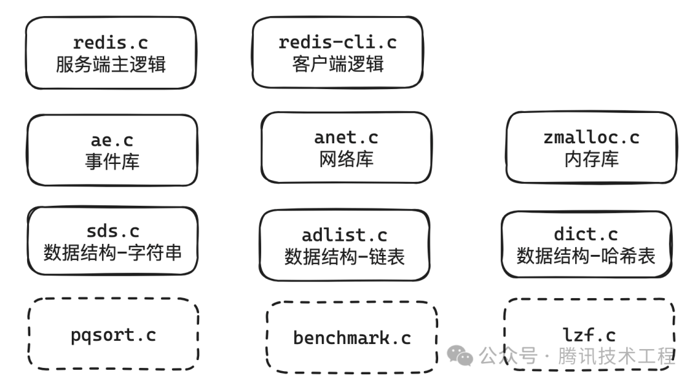
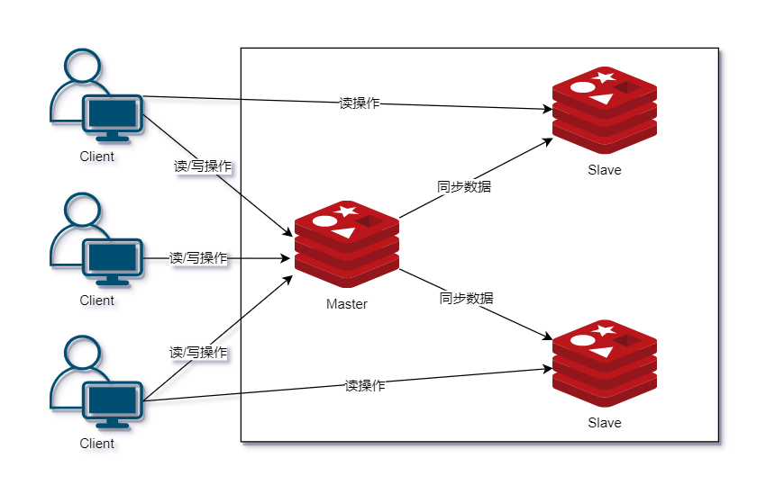
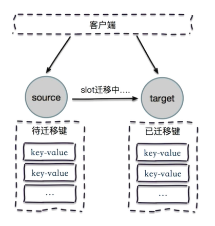

    这是“Redis”系列的第一篇文章，主要介绍的是Redis的架构，作为高可用的一部分。

# 一、redis
<code>Redis（Remote Dictionary Server）</code>是一个开源的内存数据库，遵守 BSD 协议，它提供了一个高性能的键值（key-value）存储系统，常用于缓存、消息队列、会话存储等应用场景。

<!-- more -->

# 二、Redis源码结构
基于redis1.0源码，列出了主流程相关的如下源码文件。

# 三、架构模式
Redis 支持单机、主从、哨兵、集群多种架构模式，本文带大家详细讲解这几种架构模式的区别。

## 3.1、单机
单机模式顾名思义就是安装一个 Redis，启动起来，业务调用即可。例如一些简单的应用，并非必须保证高可用的情况下可以使用该模式。

**优点**
- 部署简单；
- 成本低，无备用节点；
- 高性能，单机不需要同步数据，数据天然一致性。

**缺点**
- 可靠性保证不是很好，单节点有宕机的风险。
- 单机高性能受限于 CPU 的处理能力，Redis 是单线程的。

单机 Redis 能够承载的 QPS（每秒查询速率）大概在8~10万左右。取决于业务操作的复杂性，Lua 脚本复杂性就极高。假如是简单的 key value 查询那性能就会很高。

假设上千万、上亿用户同时访问 Redis，QPS 达到 10 万+。这些请求过来，单机 Redis 直接就挂了。系统的瓶颈就出现在 Redis 单机问题上，此时我们可以通过主从复制解决该问题，实现系统的高并发。

## 3.2、主从

Redis 的复制（Replication）功能允许用户根据一个 Redis 服务器来创建任意多个该服务器的复制品，其中被复制的服务器为主服务器（Master），而通过复制创建出来的复制品则为从服务器（Slave）。 只要主从服务器之间的网络连接正常，主服务器就会将写入自己的数据同步更新给从服务器，从而保证主从服务器的数据相同。

数据的复制是单向的，只能由主节点到从节点，简单理解就是从节点只支持读操作，不允许写操作。主要是读高并发的场景下用主从架构。**主从模式需要考虑的问题是：当 Master 节点宕机，需要选举产生一个新的 Master 节点，从而保证服务的高可用性。**

**优点：**
- Master/Slave 角色方便水平扩展，QPS 增加，增加 Slave 即可；
- 降低 Master 读压力，转交给 Slave 节点；
- 主节点宕机，从节点作为主节点的备份可以随时顶上继续提供服务；
　　
**缺点：**
- 可靠性保证不是很好，主节点故障便无法提供写入服务；
- 没有解决主节点写的压力；
- 数据冗余（为了高并发、高可用和高性能，一般是允许有冗余存在的）；
- 一旦主节点宕机，从节点晋升成主节点，需要修改应用方的主节点地址，还需要命令所有从节点去复制新的主节点，整个过程需要人工干预；
- 主节点的写能力受到单机的限制；
- 主节点的存储能力受到单机的限制。

## 3.3、哨兵
Redis Sentinel是一个**高可用性解决方案**，提供监控、通知和故障转移功能。解决主从复制架构的高可用问题。

在哨兵模式下，客户端并不直接连接到Redis的主节点，而是连接到Redis Sentinel。Sentinel会返回当前活动的主节点的地址，客户端可以使用这个地址进行读写操作。客户端一般会保持两个连接，分别是与哨兵的连接和与master的连接，客户端通过哨兵获取到当前redis集群的master的ip与port，之后完成于master的连接。

**连接流程**
- **客户端连接Sentinel：** 客户端首先与一个Sentinel实例建立连接。
- **获取主节点信息：** 通过Sentinel的SENTINEL get-master-address-by-name <master_name>命令获取主节点的地址。
- **直接连接主节点：** 使用获得的主节点地址直接连接Redis实例进行操作。

### 3.3.1、Redis sentinel特性
Redis Sentinel 是分布式系统中监控 Redis 主从服务器，并提供主服务器下线时自动故障转移功能的模式。其中三个特性为：
- **监控(Monitoring)：** Sentinel 会不断地检查你的主服务器和从服务器是否运作正常；
- **提醒(Notification)：** 当被监控的某个 Redis 服务器出现问题时， Sentinel 可以通过 API 向管理员或者其他应用程序发送通知；
- **自动故障迁移(Automatic failover)：** 当一个主服务器不能正常工作时， Sentinel 会开始一次自动故障迁移操作。

### 3.3.2、相关名词

#### 3.3.2.1、定时任务
Sentinel 内部有 3 个定时任务，分别是：
- 每 1 秒每个 Sentinel 对其他 Sentinel 和 Redis 节点执行 PING 操作（监控），这是一个心跳检测，是失败判定的依据。
- 每 2 秒每个 Sentinel 通过 Master 节点的 channel 交换信息（Publish/Subscribe）；
- 每 10 秒每个 Sentinel 会对 Master 和 Slave 执行 INFO 命令，这个任务主要达到两个目的：
  - 发现 Slave 节点；
  - 确认主从关系。

#### 3.3.2.2、主观下线
所谓主观下线（Subjectively Down， 简称 SDOWN）指的是**单个 Sentinel 实例对服务器做出的下线判断**，即单个 Sentinel 认为某个服务下线（有可能是接收不到订阅，之间的网络不通等等原因）。

主观下线就是说如果服务器在给定的毫秒数之内， 没有返回 Sentinel 发送的 PING 命令的回复， 或者返回一个错误， 那么 Sentinel 会将这个服务器标记为主观下线（SDOWN）。

#### 3.3.2.3、客观下线
客观下线（Objectively Down， 简称 ODOWN）指的是**多个 Sentinel 实例在对同一个服务器做出 SDOWN 判断**，并且通过命令互相交流之后，得出的服务器下线判断，然后开启 failover。

只有在足够数量的 Sentinel 都将一个服务器标记为主观下线之后， 服务器才会被标记为客观下线（ODOWN）。只有当 Master 被认定为客观下线时，才会发生故障迁移。

#### 3.3.2.4、仲裁
仲裁指的是配置文件中的 quorum 选项。某个 Sentinel 先将 Master 节点标记为主观下线，然后会将这个判定通过 sentinel is-master-down-by-addr 命令询问其他 Sentinel 节点是否也同样认为该 addr 的 Master 节点要做主观下线。最后当达成这一共识的 Sentinel 个数达到前面说的 quorum 设置的值时，该 Master 节点会被认定为客观下线并进行故障转移。

quorum 的值一般设置为 Sentinel 个数的二分之一加 1，例如 3 个 Sentinel 就设置为 2。

### 3.3.3、哨兵工作原理

1. 每个 Sentinel 以每秒一次的频率向它所知的 Master，Slave 以及其他 Sentinel 节点发送一个 <code>PING</code> 命令；
2. 如果一个实例（instance）距离最后一次有效回复 <code>PING</code> 命令的时间超过配置文件 <code>own-after-milliseconds</code> 选项所指定的值，则这个实例会被 Sentinel 标记为**主观下线**；
3. 如果一个 Master 被标记为主观下线，那么正在监视这个 Master 的所有 Sentinel 要以每秒一次的频率确认 Master 是否真的进入主观下线状态；
4. 当有足够数量的 <code>Sentinel</code>（大于等于配置文件指定的值）在指定的时间范围内确认 <code>Master</code> 的确进入了主观下线状态，则 <code>Master</code> 会被标记为客观下线；
5. 如果 <code>Master</code> 处于 <code>ODOWN</code> 状态，则投票自动选出新的主节点**master重新选举**。将剩余的从节点指向新的主节点继续进行数据复制；
6. 在正常情况下，每个 Sentinel 会以每 10 秒一次的频率向它已知的所有 Master，Slave 发送 INFO 命令；当 Master 被 Sentinel 标记为客观下线时，Sentinel 向已下线的 Master 的所有 Slave 发送 INFO 命令的频率会从 10 秒一次改为每秒一次；
7. 若没有足够数量的 Sentinel 同意 Master 已经下线，Master 的客观下线状态就会被移除。若 Master 重新向 Sentinel 的 PING 命令返回有效回复，Master 的主观下线状态就会被移除。

#### 3.3.3.1、master重新选举

##### 1. leader选举
master的切换，只能由一个sentinel进行操作，所以需要进行sentinel的leader选举，成为leader条件
- 获得其他哨兵基友过半的赞成票
- 赞成票的数量还要大于等于配置文件的 quorum 的值

使用的Raft算法进行leader选举。

##### 2. master筛选条件
- slave 优先级，通过 slave-priority 配置项，给不同的从库设置不同优先级，优先级高的直接晋级为新 master 掌门。
- slave_repl_offset与 master_repl_offset进度差距，如果都一样，那就继续下一个规则。其实就是比较 slave 与旧 master 复制进度的差距；
- slave runID，在优先级和复制进度都相同的情况下，ID 号最小的从库得分最高，会被选为新主库。 （论资排辈，根据 runID 的创建时间来判断，时间早的上位）；

##### 3. 通知
- sentinel将新master信息通知slave，然后slave执行replacaof命令，与新master建立连接并且复制新master的数据
- sentinel通知客户端最新的master信息，后续的请求与新master建立连接

**哨兵优点**
- 哨兵模式是基于主从模式的，所有主从的优点，哨兵模式都有；
- 主从可以自动切换，系统更健壮，可用性更高；
- Sentinel 会不断地检查你的主服务器和从服务器是否运作正常。当被监控的某个 Redis 服务器出现问题时， Sentinel 可以通过 API 向管理员或者其他应用程序发送通知。

**哨兵缺点**
- 主从切换需要时间，会丢失数据；
- 还是没有解决主节点写的压力；
- 主节点的写能力，存储能力受到单机的限制；
- 动态扩容困难复杂，对于集群，容量达到上限时在线扩容会变得很复杂。

## 3.4、集群
之前说的架构模式，都有单点问题，无法处理高于10W+请求，动态扩容困难复杂，于是，Redis 3.0 版本正式推出 Redis Cluster 集群模式，有效地解决了 Redis 分布式方面的需求。Redis Cluster 集群模式具有**高可用、可扩展性、分布式、容错等特性**。

特点：
- Redis Cluster 采用无中心结构，每个节点都可以保存数据和整个集群状态，每个节点都和其他所有节点连接。
  - Redis需要开放两个端口，比如一个是 6379，另外一个就是 加1w 的端口号，比如 16379。
    - 16379 端口号是用来进行节点间通信的，也就是 cluster bus 的东西，cluster bus 的通信，用来进行故障检测、配置更新、故障转移授权。cluster bus 用了另外一种二进制的协议，gossip 协议，用于节点间进行高效的数据交换，占用更少的网络带宽和处理时间。
  - 客户端与 Redis 节点直连，不需要中间代理层。客户端不需要连接集群所有节点，连接集群中任何一个可用节点即可
- Cluster 一般由多个节点组成，节点数量至少为 6 个才能保证组成完整高可用的集群，其中三个为主节点，三个为从节点。三个主节点会分配槽，处理客户端的命令请求，而从节点可用在主节点故障后，顶替主节点。 
  - 如上图所示，该集群中包含 6 个 Redis 节点，3 主 3 从，分别为 M1，M2，M3，S1，S2，S3。除了主从 Redis 节点之间进行数据复制外，所有 Redis 节点之间采用 Gossip 协议进行通信，交换维护节点元数据信息。
- 每一个master节点负责维护一部分槽，以及槽所映射的键值数据
  - Redis Cluster的节点之间会共享消息，每个节点都会知道是哪个节点负责哪个范围内的数据槽。所以客服端请求任意一个节点，都能获取到slot对应的node信息

### 3.4.1、工作原理

#### 3.4.1.1、分片
<code>Redis Cluster</code> 采用虚拟哈希槽分区，所有的键根据哈希函数映射到 <code>0 ~ 16383</code> 整数槽内，计算公式：<code>HASH_SLOT = CRC16(key) % 16384</code>。每一个节点负责维护一部分槽以及槽所映射的键值数据。

##### 1. 动态调整

假如，这里有 3 个节点的集群环境如下：
- 节点 A 哈希槽范围为 0 ~ 5500；
- 节点 B 哈希槽范围为 5501 ~ 11000；
- 节点 C 哈希槽范围为 11001 ~ 16383。

此时，我们如果要存储数据，按照 Redis Cluster 哈希槽的算法，假设结果是： CRC16(key) % 16384 = 6782。 那么就会把这个 key 的存储分配到 B 节点。此时连接 A、B、C 任何一个节点获取 key，都会这样计算，最终通过 B 节点获取数据。

假如这时我们新增一个节点 D，Redis Cluster 会从各个节点中拿取一部分 Slot 到 D 上，比如会变成这样：
- 节点 A 哈希槽范围为 1266 ~ 5500；
- 节点 B 哈希槽范围为 6827 ~ 11000；
- 节点 C 哈希槽范围为 12288 ~ 16383；
- 节点 D 哈希槽范围为 0 ~ 1265，5501 ~ 6826，11001 ~ 12287

这种特性允许在集群中轻松地添加和删除节点。同样的如果我想删除节点 D，只需要将节点 D 的哈希槽移动到其他节点，当节点是空时，便可完全将它从集群中移除。

#### 3.4.1.2、与客户端交互
##### 计算键的槽
当客户端向 Redis 集群发送一个命令时，Redis 首先会根据键的哈希值计算出它对应的哈希槽
计算公式：<code>CRC16(key) & 16383</code>，对每个key计算CRC16值，然后对16383取模

##### 路由到正确的节点
客户端根据槽的编号确定应该将命令发送到哪个节点。客户端通常会维护一个槽与节点的映射关系，或者通过向集群中的任意一个节点发送请求获取槽与节点的路由信息。

一旦确定了目标节点，客户端就会将命令直接发送到该节点进行处理。如果目标节点不可用，客户端会尝试重新路由到其他节点。

##### 客户端请求路由

###### moved重定向

触发条件：
- 当客户端向一个 Redis 节点发送一个针对特定键的请求，而该节点确定此键所在的槽并不由自己负责时，就会触发MOVED重定向
- 这通常发生在集群的槽分配发生变化（例如节点添加或移除、槽重新分配等）或者客户端的槽映射信息过时的情况下。

执行流程：
- 每个节点通过通信都会共享Redis Cluster中槽和集群中对应节点的关系
- 客户端向Redis Cluster的任意节点发送命令，接收命令的节点会根据CRC16规则进行hash运算与16383取余，计算自己的槽和对应节点
- 如果保存数据的槽被分配给当前节点，则去槽中执行命令，并把命令执行结果返回给客户端
- 如果保存数据的槽不在当前节点的管理范围内，则向客户端返回moved重定向异常
  - 客户端收到异常，需要进行重定向
- 客户端接收到节点返回的结果，如果是moved异常，则从moved异常中获取目标节点的信息。
  - 客户端进行重定向
- 客户端向目标节点发送命令，获取命令执行结果
	
###### ask重定向

触发条件：
- 当正在进行槽迁移时会触发ASK重定向，进行扩容和缩容时，需要对槽及槽中数据进行迁移。当槽及槽中数据正在迁移时，客服端请求目标节点时，目标节点中的槽已经迁移支别的节点上了，此时目标节点会返回ask转向给客户端。ask重定向主要是解决这种问题
		
执行过程：
- 当客户端向集群中某个节点发送命令，节点向客户端返回moved异常，告诉客户端数据对应目标槽的节点信息
- 客户端再向目标节点发送命令，目标节点中的槽已经迁移出别的节点上了，此时目标节点会返回ask重定向给客户端
- 客户端向新的target节点发送Asking命令，然后再次向新节点发送请求请求命令
- 新节点target执行命令，把命令执行结果返回给客户端
	

###### moved和ask的区别
- 两个都是客户端重定向
- moved异常：槽已确定迁移，并且不在当前请求节点上
- ask异常：槽在迁移中

###### smart智能客户端
每次重定向都产生一次无用的请求，严重影响了redis的性能，为了提高redis的性能，避免大部分请求发生重定向，可以使用智能客户端
		
智能客户端知道由哪个节点负责管理哪个槽，而且某个当节点与槽的映射关系发生改变时，客户端也会进行响应的更新，这是一种非常高效的请求方式

### 3.4.2、节点通信
集群中的节点通过 <code>gossip</code> 协议进行通信和发现。

#### gossip协议
gossip 协议包含多种消息，包含 ping,pong,meet,fail 等等
- meet：某个节点发送 meet 给新加入的节点，让新节点加入集群中，然后新节点就会开始与其它节点进行通信。
- ping：ping 时要携带一些元数据，如果很频繁，可能会加重网络负担

### 3.4.3、故障检测与自动恢复
- 节点之间通过互相发送 PING 和 PONG 消息来检测其他节点的状态。
- 如果一个节点在一定时间内没有收到另一个节点的 PONG 消息，就会将其标记为疑似下线（PFail）。
- 当足够多的其他节点也认为某个节点疑似下线时，该节点就会被标记为下线（Fail）。
- 对于下线的主节点，集群会自动进行故障转移。从其对应的从节点中选择一个提升为主节点，并将原来主节点负责的哈希槽重新分配给新的主节点和其他从节点。
		
**选主过程**
- slave发现自己的master不可用
- slave将记录集群的currentEpoch（选举周期）加1，并广播FAILOVER_AUTH_REQUEST 信息进行选举；
- 其他节点收到FAILOVER_AUTH_REQUEST信息后，只有其他的master可以进行响应，master收到消息后返回FAILOVER_AUTH_ACK信息，对于同一个Epoch，只能响应一次ack；
- slave收集maste返回的ack消息
- slave判断收到的ack消息个数是否大于半数的master个数，若是，则变成新的master；
- 广播Pong消息通知其他集群节点，自己已经成为新的master。

### 3.4.4、伸缩原理

#### 扩容

1. 首先启动一个<code>redis</code>节点，记为<code>M4</code>
2. 使用<code>cluster meet</code>命令，让<code>M4</code> 加入到集群。
默认为主节点，此时<code>M4</code> 没有负责的槽，所以无法接收请求
3. 对<code>M4</code>发送<code>importing</code>命令，让目标节点<code>M4</code> 准备导入槽的数据。对源节点，即M1，M2，M3发送<code>migrating</code>命令，让源节点准备需要迁出的槽数据
目标节点为importing状态
源节点为migrating状态
4. 在源节点上执行： <code>CLUSTER GETKEYSINSLOT 3432 10</code>，含义：获取槽【3442】的10个还在源节点上的key
5. 对于第4步获取到的10个key，在源节点执行<code>megrate</code>指令，此时会将10个key移动到目标节点
   <code>migrate</code>命令在执行过程中，节点无法响应请求
6. 重复4、5操作，直至所有的槽迁移完毕
7. 向目标节点和原节点清除<code>importing</code>和<code>migrating</code>标记

### 3.4.5、集群相关问题

#### 1. Redis cluster为什么没有使用一致性hash算法，而是使用了哈希槽预分片？
- 缓存热点问题
		一致性哈希算法在节点较少时，容易因数据分配不均匀而造成缓存热点问题
			一致性哈希算法可能出现数据集中在某个hash区间内，会导致大量的数据涌入同一个节点，从而造成数据热点问题
- 可以用户手动自定义分配的，类似于 windows 盘分区的概念，可以手动控制大小
- 每个服务器之间有各自虚拟槽的信息，利于重定向

#### 2. Redis cluster的哈希槽为什么是16384个，而不是65536个？
- 如果槽位为65536个，发送心跳信息的消息头达8K，发送的心跳包过大
- Redis的主节点基本不可能超过1000个，节点越多，心跳的消息体越大，容易造成网络堵塞
- 槽位越少，节点少的情况下，压缩率高

# 四、高可用
Redis的架构从单机到集群，都是对高可用要求的一步步实现，一步步提升，接下来的文章还会继续介绍redis相关的高可用建设。

参考文章：
[最通俗易懂的 Redis 架构模式详解](https://www.cnblogs.com/mrhelloworld/p/redis-architecture.html)