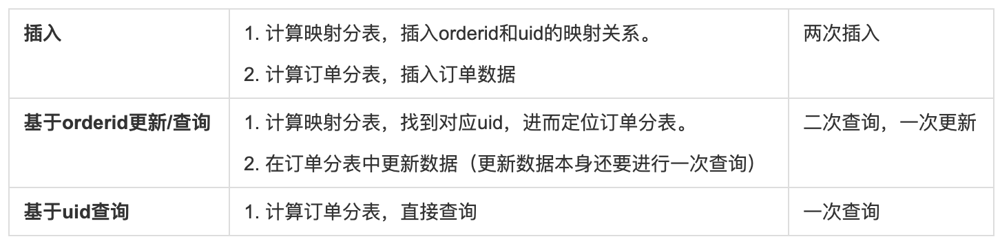
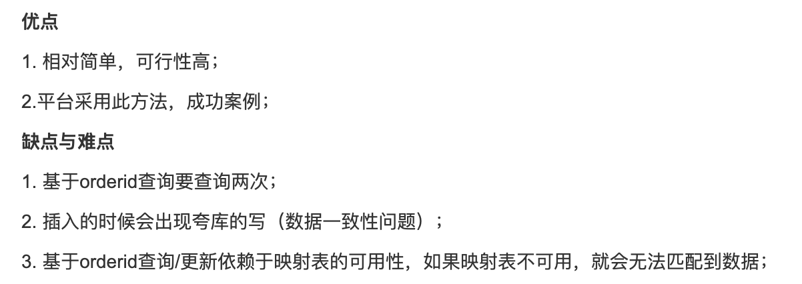
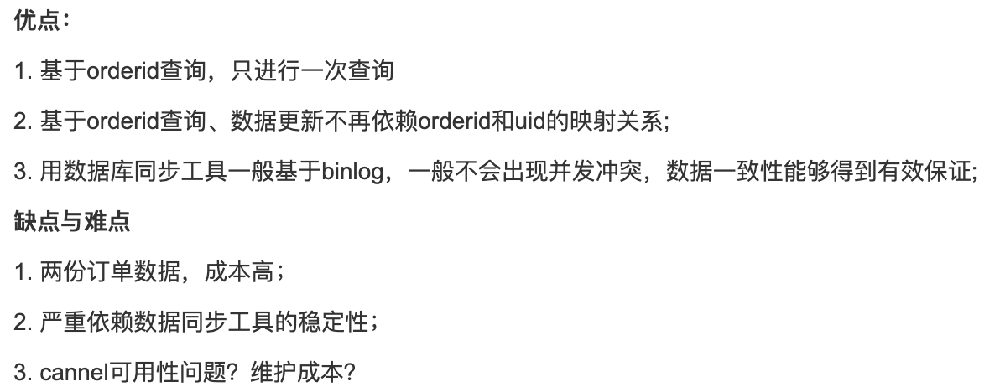

# 一、方案对比

## 方案一：基于uid做分库，建立映射

* 订单表：基于UID进行分库。
* 映射表：建立orderId和uid的映射表，并对映射表进行分库（基于orderId）。

<!--more-->  

**对比**

**优缺点**

# 方案二：orderId分库+同步机制/服务双写

* 两套数据，第一套基于orderId进行分库
* 第二套基于uid进行反库
* 老套数据通过binlog同步
 
 **对比**
 
 **优缺点**
 

# 方案三：orderId用户基因分库
* uid：通过雪花算法生成
* orderId：往订单ID中添加用户的因子，保证可以基于uid和orderId查

参考雪花算法生成策略，对订单ID进行相应生成策略处理

| 1    | 41   |5     | 14   | 3   |
| --------   | -----:  | :----:  | ---- | ----|
|标志位 |时间戳 |机器码 |用户基因  |随机码|
|1位 |41位 |5位 |12位  |5位|

## 如何通过orderId和uid进行查询呢？如何获得同样的分片索引？
1. 相同点：orderId中有用户的基因
2. 结论：基于用户基因做分片索引确认

### 1、基于订单ID获取分片索引
* orderId >> 3 ：订单右移3位，舍弃掉了随机码
* orderId >> 3 & 0b111111111111：对用户基因进行处理
* (orderId >> 3 & 0b111111111111)%dbCount：对数据库数量进行取余，得到下标

### 2、基于用户ID获取分片索引
* uid >> 22：去除掉雪花算法后22位
* uid >> 22 & & 0b111111111111：对用户进行处理
* (uid >> 22 & 0b111111111111)%dbCount：对数据库数量进行取余，得到下标

# 二、方案实现
通过Sharding-JDBC + druid
