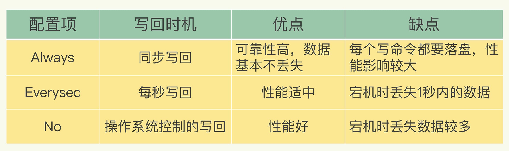
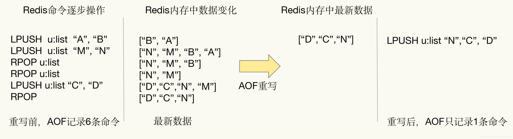
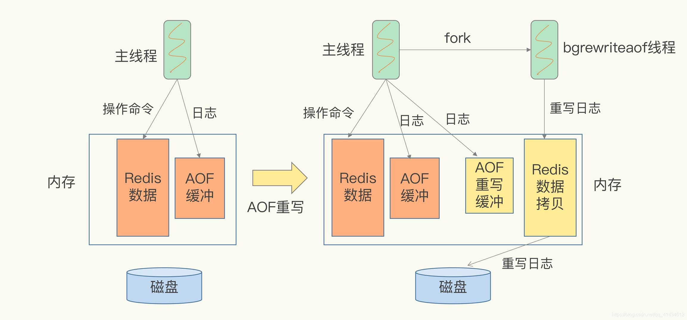
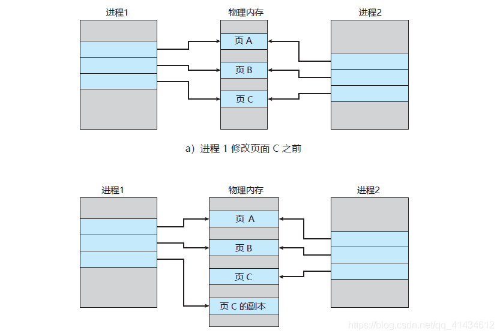

    这是“Redis”系列的第二篇文章，主要介绍的是Redis的高可用建设之数据持久化。

# 一、Redis
<code>Redis（Remote Dictionary Server）</code>是一个开源的内存数据库，遵守 BSD 协议，它提供了一个高性能的键值（key-value）存储系统，常用于缓存、消息队列、会话存储等应用场景。

<!-- more -->

# 二、高可用之《数据持久化》
Redis 持久化是指将 Redis 内存中的数据保存到硬盘等持久化存储介质中，以便在 Redis 服务器重启或故障恢复后能够快速恢复数据，保证数据的可靠性和一致性。Redis 主要有两种持久化方式：RDB（Redis Database）和 AOF（Append Only File），此外还有混合持久化方式。以下是具体介绍：

## 2.1、RDB
> RDB 就是 Redis DataBase 的缩写，中文名为快照/内存快照，RDB持久化是把当前进程数据生成快照保存到磁盘上的过程，由于是某一时刻的快照，那么快照中的值要早于或者等于内存中的值。

### 2.1.1、触发方式
触发rdb持久化的方式有2种，分别是**手动触发**和**自动触发**。

#### 2.1.1.1、手动触发
> 手动触发分别对应<code>save</code>和<code>bgsave</code>命令

##### 1、save命令
**save命令：** 阻塞当前Redis服务器，直到RDB过程完成为止，对于内存 比较大的实例会造成长时间阻塞，线上环境不建议使用

##### 2、bgsave命令
**bgsave命令：** Redis进程执行fork操作创建子进程，RDB持久化过程由子 进程负责，完成后自动结束。阻塞只发生在fork阶段，一般时间很短

bgsave流程图如下所示：

具体流程如下：
- redis客户端执行bgsave命令或者自动触发bgsave命令；
- 主进程判断当前是否已经存在正在执行的子进程，如果存在，那么主进程直接返回；
- 如果不存在正在执行的子进程，那么就fork一个新的子进程进行持久化数据，fork过程是阻塞的，fork操作完成后主进程即可执行其他操作；
- 子进程先将数据写入到临时的rdb文件中，待快照数据写入完成后再原子替换旧的rdb文件；
- 同时发送信号给主进程，通知主进程rdb持久化完成，主进程更新相关的统计信息（info Persitence下的rdb_*相关选项）。

#### 2.1.1.2、自动触发
在以下4种情况时会自动触发
- redis.conf中配置配置周期函数serviceCron，<code>save m n</code>，即在m秒内有n次修改时，自动触发bgsave生成rdb文件；
  - save 900 1：900s内有1个key变化，触发RDB
  - save 300 10：300s内有10个key变化，触发RDB
  - save 60 1000：60s内有1000个key变化，触发RDB
- 主从复制时，从节点要从主节点进行全量复制时也会触发bgsave操作，生成当时的快照发送到从节点；
- 执行debug reload命令重新加载redis时也会触发bgsave操作；
- 默认情况下执行shutdown命令时，如果没有开启aof持久化，那么也会触发bgsave操作；

### 2.2、RDB的优缺点

#### 优点
- RDB文件是某个时间节点的快照，默认使用LZF算法进行压缩，压缩后的文件体积远远小于内存大小，适用于备份、全量复制等场景；
- Redis加载RDB文件恢复数据要远远快于AOF方式；

#### 缺点
- RDB方式实时性不够，无法做到秒级的持久化；
- 每次调用bgsave都需要fork子进程，fork子进程属于重量级操作，频繁执行成本较高；
- RDB文件是二进制的，没有可读性，AOF文件在了解其结构的情况下可以手动修改或者补全；
- 版本兼容RDB文件问题；

针对RDB不适合实时持久化的问题，Redis提供了AOF持久化方式来解决#

## 2.2、AOF（Append only file，追加文件）
> Redis是“写后”日志，Redis先执行命令，把数据写入内存，然后才记录日志。日志里记录的是Redis收到的每一条命令，这些命令是以文本形式保存。PS: 大多数的数据库采用的是写前日志（WAL），例如MySQL，通过写前日志和两阶段提交，实现数据和逻辑的一致性。

而AOF日志采用写后日志，即先写内存，后写日志。

### 2.2.1、为什么采用写后日志？
Redis要求高性能，采用写日志有两方面好处：
- 避免额外的检查开销：Redis 在向 AOF 里面记录日志的时候，并不会先去对这些命令进行语法检查。所以，如果先记日志再执行命令的话，日志中就有可能记录了错误的命令，Redis 在使用日志恢复数据时，就可能会出错。
- 不会阻塞当前的写操作但

这种方式存在潜在风险：
- 如果命令执行完成，写日志之前宕机了，会丢失数据。
- 主线程写磁盘压力大，导致写盘慢，阻塞后续操作。

### 2.2.2、AOF实现原理
AOF日志记录Redis的每个写命令，步骤分为：命令追加（append）、文件写入（write）和文件同步（sync）。
- **命令追加** 当AOF持久化功能打开了，服务器在执行完一个写命令之后，会以协议格式将被执行的写命令追加到服务器的 aof_buf 缓冲区。
- **文件写入和同步** 关于何时将 aof_buf 缓冲区的内容写入AOF文件中，Redis提供了三种写回策略：

- **Always**，同步写回：每个写命令执行完，立马同步地将日志写回磁盘；
- **Everysec**，每秒写回：每个写命令执行完，只是先把日志写到AOF文件的内存缓冲区，每隔一秒把缓冲区中的内容写入磁盘；
- **No**，操作系统控制的写回：每个写命令执行完，只是先把日志写到AOF文件的内存缓冲区，由操作系统决定何时将缓冲区内容写回磁盘。

关于AOF的同步策略是涉及到操作系统的 write 函数和 fsync 函数的，在《Redis设计与实现》中是这样说明的：
> 为了提高文件写入效率，在现代操作系统中，当用户调用write函数，将一些数据写入文件时，操作系统通常会将数据暂存到一个内存缓冲区里，当缓冲区的空间被填满或超过了指定时限后，才真正将缓冲区的数据写入到磁盘里。
>
> 这样的操作虽然提高了效率，但也为数据写入带来了安全问题：如果计算机停机，内存缓冲区中的数据会丢失。为此，系统提供了fsync、fdatasync同步函数，可以强制操作系统立刻将缓冲区中的数据写入到硬盘里，从而确保写入数据的安全性。

以下是Redis中关于AOF的主要配置信息：
- **appendonly：** 默认情况下AOF功能是关闭的，将该选项改为yes以便打开Redis的AOF功能。
- **appendfilename：** 这个参数项很好理解了，就是AOF文件的名字。
- **appendfsync：** 这个参数项是AOF功能最重要的设置项之一，主要用于设置“真正执行”操作命令向AOF文件中同步的策略。

什么叫“真正执行”呢？还记得Linux操作系统对磁盘设备的操作方式吗？ 为了保证操作系统中I/O队列的操作效率，应用程序提交的I/O操作请求一般是被放置在linux Page Cache中的，然后再由Linux操作系统中的策略自行决定正在写到磁盘上的时机。而Redis中有一个fsync()函数，可以将Page Cache中待写的数据真正写入到物理设备上，而缺点是频繁调用这个fsync()函数干预操作系统的既定策略，可能导致I/O卡顿的现象频繁 。

### 2.2.3、AOF重写
AOF会记录每个写命令到AOF文件，随着时间越来越长，AOF文件会变得越来越大。如果不加以控制，会对Redis服务器，甚至对操作系统造成影响，而且AOF文件越大，数据恢复也越慢。为了解决AOF文件体积膨胀的问题，Redis提供AOF文件重写机制来对AOF文件进行“瘦身”。

#### 2.2.3.1、图例解释AOF重写
Redis通过创建一个新的AOF文件来替换现有的AOF，新旧两个AOF文件保存的数据相同，但新AOF文件没有了冗余命令。

#### 2.2.3.2、AOF重写会阻塞吗？
AOF重写过程是由后台进程<code>bgrewriteaof</code>来完成的。主线程fork出后台的<code>bgrewriteaof</code>子进程，fork会把主线程的内存拷贝一份给<code>bgrewriteaof</code>子进程，这里面就包含了数据库的最新数据。然后，<code>bgrewriteaof</code>子进程就可以在不影响主线程的情况下，逐一把拷贝的数据写成操作，记入重写日志。

所以aof在重写时，在fork进程时是会阻塞住主线程的。

#### 2.2.3.3、AOF日志何时会重写？
有两个配置项控制AOF重写的触发：
- auto-aof-rewrite-min-size:表示运行AOF重写时文件的最小大小，默认为64MB。
- auto-aof-rewrite-percentage:这个值的计算方式是，当前aof文件大小和上一次重写后aof文件大小的差值，再除以上一次重写后aof文件大小。也就是当前aof文件比上一次重写后aof文件的增量大小，和上一次重写后aof文件大小的比值。

#### 2.2.3.4、重写日志时，有新数据写入咋整？
重写过程总结为：“一个拷贝，两处日志”。在fork出子进程时的拷贝，以及在重写时，如果有新数据写入，主线程就会将命令记录到**两个aof日志内存缓冲区**中。如果AOF写回策略配置的是always，则直接将命令写回旧的日志文件，并且保存一份命令至AOF重写缓冲区，这些操作对新的日志文件是不存在影响的。（旧的日志文件：主线程使用的日志文件，新的日志文件：bgrewriteaof进程使用的日志文件）

而在bgrewriteaof子进程完成会日志文件的重写操作后，会提示主线程已经完成重写操作，主线程会将AOF重写缓冲中的命令追加到新的日志文件后面。这时候在高并发的情况下，AOF重写缓冲区积累可能会很大，这样就会造成阻塞，Redis后来通过Linux管道技术让aof重写期间就能同时进行回放，这样aof重写结束后只需回放少量剩余的数据即可。

最后通过修改文件名的方式，保证文件切换的原子性。

在AOF重写日志期间发生宕机的话，因为日志文件还没切换，所以恢复数据时，用的还是旧的日志文件。

总结操作：
- 主线程fork出子进程重写aof日志
- 子进程重写日志完成后，主线程追加aof日志缓冲
- 替换日志文件

#### 2.2.3.5、主线程fork出子进程的是如何复制内存数据的？
fork采用操作系统提供的写时复制（copy on write）机制，就是为了避免一次性拷贝大量内存数据给子进程造成阻塞。fork子进程时，子进程时会拷贝父进程的页表，即虚实映射关系（虚拟内存和物理内存的映射索引表），而不会拷贝物理内存。这个拷贝会消耗大量cpu资源，并且拷贝完成前会阻塞主线程，阻塞时间取决于内存中的数据量，数据量越大，则内存页表越大。拷贝完成后，父子进程使用相同的内存地址空间。

但主进程是可以有数据写入的，这时候就会拷贝物理内存中的数据。如下图（进程1看做是主进程，进程2看做是子进程）：

在主进程有数据写入时，而这个数据刚好在页c中，操作系统会创建这个页面的副本（页c的副本），即拷贝当前页的物理数据，将其映射到主进程中，而子进程还是使用原来的的页c。

## 2.3、RDB和AOF混合方式（4.0版本)
Redis 4.0 中提出了一个混合使用 AOF 日志和内存快照的方法。简单来说，内存快照以一定的频率执行，在两次快照之间，使用 AOF 日志记录这期间的所有命令操作。

## 2.4、RDB和AOF的区别
- RDB持久化，会将内存中的所有数据进行写文件，耗时长，适合冷备数据。
- AOF持久化，每次写入数据少，耗时短，适合实时持久化
- Redis的阻塞场景在fork子进程阶段和AOF重写拼接阶段。

## 2.5、从持久化中恢复数据
数据的备份、持久化做完了，我们如何从这些持久化文件中恢复数据呢？如果一台服务器上有既有RDB文件，又有AOF文件，该加载谁呢？

参考文章：
[持久化](https://pdai.tech/md/db/nosql-redis/db-redis-x-rdb-aof.html)