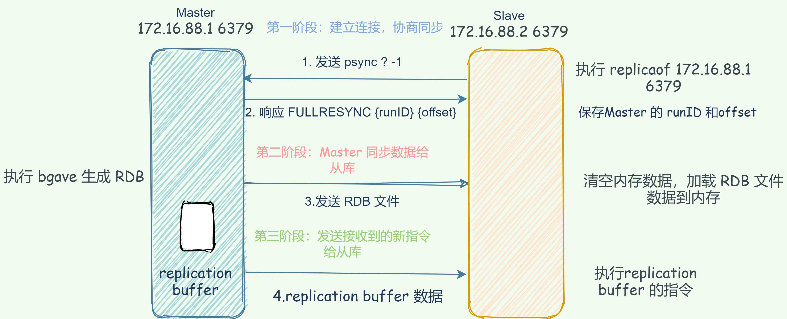

    这是“Redis”系列的第三篇文章，主要介绍的是Redis的高可用建设之“主从同步”。

# 一、Redis
<code>Redis（Remote Dictionary Server）</code>是一个开源的内存数据库，遵守 BSD 协议，它提供了一个高性能的键值（key-value）存储系统，常用于缓存、消息队列、会话存储等应用场景。

<!-- more -->

# 二、高可用之《主从同步》
主从复制，是指将一台Redis服务器的数据，复制到其他的Redis服务器。前者称为主节点(master)，后者称为从节点(slave)；数据的复制是单向的，只能由主节点到从节点。

主从复制的作用主要包括：
- **数据冗余：** 主从复制实现了数据的热备份，是持久化之外的一种数据冗余方式。
- **故障恢复：** 当主节点出现问题时，可以由从节点提供服务，实现快速的故障恢复；实际上是一种服务的冗余。
- **负载均衡：** 在主从复制的基础上，配合读写分离，可以由主节点提供写服务，由从节点提供读服务（即写Redis数据时应用连接主节点，读Redis数据时应用连接从节点），分担服务器负载；尤其是在写少读多的场景下，通过多个从节点分担读负载，可以大大提高Redis服务器的并发量。
- **高可用基石：** 除了上述作用以外，主从复制还是哨兵和集群能够实施的基础，因此说主从复制是Redis高可用的基础。

## 2.1、主从复制原理
> 注意：在2.8版本之前只有全量复制，而2.8版本后有全量和增量复制：

- **全量（同步）复制：** 比如第一次同步时
- **增量（同步）复制：** 只会把主从库网络断连期间主库收到的命令，同步给从库


### 2.1.1、全量同步

#### 2.1.1.1、全量同步的触发时机
- **初次配置主从关系：** 当一个新的从节点加入到主从复制架构中时，由于从节点没有任何主节点的数据，此时会触发全量同步，以便从节点能拥有和主节点一致的数据副本。
- **主节点数据重置：** 如果主节点进行了数据的大量删除或者数据结构的重大调整等操作，使得从节点的数据与主节点差异过大，主节点可能会判定需要进行全量同步来保证数据的一致性。
- **网络故障恢复：** 当主从节点之间的网络连接中断时间较长，从节点无法通过部分同步等方式来追赶主节点的数据，在网络恢复后，通常会触发全量同步，确保从节点数据的完整性。


#### 2.1.1.2、初次配置主从关系
初次配置主从关系，数据如何同步呢？可以分成3个阶段
**全量同步总结如下：**


##### 1、首先确认主从关系
> 当我们启动多个 Redis 实例的时候，它们相互之间就可以通过 replicaof（Redis 5.0 之前使用 slaveof）命令形成主库和从库的关系，之后会按照三个阶段完成数据的第一次同步。

例如，现在有实例 1（ip：172.16.19.3）和实例 2（ip：172.16.19.5），我们在实例 2 上执行以下这个命令后，实例 2 就变成了实例 1 的从库，并从实例 1 上复制数据：
```dtd
replicaof 172.16.19.3 6379
```

##### 2、第一阶段：协商同步
从服务器向主服务器发送 <code>psync</code> 命令，表示要进行数据同步，主库根据这个命令的参数来启动复制。
- <code>psync ? -1</code>
  - 2.8版本之前，会执行<code>sync</code>命令
  - 2.8版本开始，使用<code>psync</code>命令，<code>psync</code>有完整重同步和部分同步的功能

##### 3、第二阶段：主库将所有数据同步给从库
> 收到 <code>psync</code> 命令后，主服务器执行 <code>bgsave</code> 命令，用来生成 <code>rdb</code> 文件，并在一个复制缓冲区<code>(replication buffer)</code>中记录从现在开始执行的写命令。接着将文件发给从库。从库接收到 RDB 文件后，会先清空当前数据库，然后加载 RDB 文件。

<code>psync ? -1</code> 命令包含了主库的 runID 和复制进度 offset 两个参数。
- **runID，** 是每个 Redis 实例启动时都会自动生成的一个随机 ID，用来唯一标记这个实例。当从库和主库第一次复制时，因为不知道主库的 runID，所以将 runID 设为“？”。
- **offset，** 此时设为 -1，表示第一次复制。

主库收到 psync 命令后，会用 <code>FULLRESYNC {runId}{offset} </code>响应命令带上两个参数：主库 runID 和主库目前的复制进度 offset，返回给从库。从库收到响应后，会记录下这两个参数。这里有个地方需要注意，FULLRESYNC 响应表示第一次复制采用的全量复制，也就是说，主库会把当前所有的数据都复制给从库。

##### 4、第三个阶段，主库会把第二阶段执行过程中新收到的写命令，再发送给从库。
当主库完成 RDB 文件发送后，就会把此时 <code>replication buffer</code> 中的修改操作发给从库，从库再重新执行这些操作。这样一来，主从库就实现同步了。


#### 全量同步出现网络故障怎么办？

##### 1. 从节点的处理
- **暂停同步操作：** 从节点在网络故障期间无法接收主节点发送的数据和命令，会暂停正在进行的全量同步操作，并记录当前同步的进度和状态信息，比如记录已经接收和处理的 RDB 文件数据块的位置等。
- **尝试重连：** 从节点会根据配置的重连策略，不断尝试与主节点重新建立连接。通常会在一定的时间间隔后进行重试，这个时间间隔可以在 Redis 的配置文件中通过参数进行设置，如repl-timeout等参数会影响重连的时机和超时时间。

##### 2. 主节点的处理
- **缓存数据和命令：** 主节点在发现与从节点的网络连接出现故障后，并不会立即停止全量同步相关的操作。它会继续缓存需要发送给从节点的数据和命令，这些数据和命令包括在故障期间主节点自身执行的写操作等，以便在网络恢复后能够继续发送给从节点，保证数据的完整性。
- **等待从节点重连：** 主节点会保持对从节点的连接状态跟踪，等待从节点的重连请求。在等待期间，主节点会继续处理自身的业务请求，同时维护好需要同步给从节点的数据队列，确保不会因为从节点的暂时离线而丢失数据同步的信息。

##### 3. 网络恢复后的处理
- **部分同步或全量同步判断：** 当网络恢复后，从节点会向主节点发送包含自身同步进度等信息的请求，主节点根据从节点发送的信息，判断是可以进行部分同步还是需要重新进行全量同步。如果从节点记录的进度信息表明它已经接收了大部分 RDB 文件数据，并且主节点缓存的未发送数据量相对较小，那么主从节点可能会进行部分同步，主节点只需要将剩余未发送的数据和命令发送给从节点即可。
- **继续同步操作：** 如果判断可以进行部分同步，主节点会将缓存中尚未发送给从节点的数据和命令发送给从节点，从节点接收并执行这些数据和命令，继续完成全量同步的剩余部分。如果主节点判断从节点的状态已经过于陈旧，无法进行部分同步，或者从节点在故障期间丢失了过多的进度信息，主节点会要求从节点重新进行全量同步，整个全量同步过程会重新开始，从节点会再次接收主节点发送的 RDB 文件和相关命令。
- **数据校验和一致性检查：** 在部分同步或全量同步完成后，从节点会对接收的数据进行校验，确保数据的完整性和准确性。主从节点之间可能还会进行一些一致性检查的操作，例如从节点可以向主节点发送数据校验的结果，主节点根据自身的数据状态来判断从节点的数据是否已经完全同步一致。如果发现数据不一致，可能会触发进一步的同步操作或者告警机制。


### 2.1.2、命令传播
全量同步完成后，双方之间就会维护一个 TCP 连接，主节点会将后续执行的写命令源源不断地发送给从节点。从节点接收并执行这些命令，保持与主节点的数据一致性。

后续主服务器可以通过这个连接继续将写操作命令传播给从服务器，然后从服务器执行该命令，使得与主服务器的数据库状态相同。

而且这个连接是长连接的，目的是避免频繁的 TCP 连接和断开带来的性能开销。

上面的这个过程被称为基于长连接的命令传播，通过这种方式来保证第一次同步后的主从服务器的数据一致性。


### 2.1.3、增量同步
> 在 Redis 2.8 版本引入了增量复制。

#### 2.1.3.1、为什么会设计增量复制？
如果主从库在**命令传播**时出现了网络闪断，那么，从库就会和主库重新进行一次全量复制，开销非常大。从 Redis 2.8 开始，网络断了之后，主从库会采用增量复制的方式继续同步，只将中断期间主节点执行的写命令发送给从节点，与全量复制相比更加高效。

主服务器应该对从服务器执行完整重同步还是部分重同步呢？
- 若复制积压缓冲区存在从服务器的复制偏移量 + 1 后的数据，则进行部分重同步，否则进行完整重同步


#### 2.1.3.2、增量复制的流程
你可以先看一下下面这张图，有个整体感知，接下来我再具体介绍。

先看两个概念： replication buffer 和 repl_backlog_buffer
- **replication buffer：** Redis和客户端通信也好，和从库通信也好，Redis都需要给分配一个 内存buffer进行数据交互，客户端是一个client，从库也是一个client，我们每个client连上Redis后，Redis都会分配一个client buffer，所有数据交互都是通过这个buffer进行的：Redis先把数据写到这个buffer中，然后再把buffer中的数据发到client socket中再通过网络发送出去，这样就完成了数据交互。所以主从在增量同步时，从库作为一个client，也会分配一个buffer，只不过这个buffer专门用来传播用户的写命令到从库，保证主从数据一致，我们通常把它叫做replication buffer。
- **repl_backlog_buffer：** 它是为了从库断开之后，如何找到主从差异数据而设计的环形缓冲区，从而避免全量复制带来的性能开销。如果从库断开时间太久，repl_backlog_buffer环形缓冲区被主库的写命令覆盖了，那么从库连上主库后只能乖乖地进行一次全量复制，所以repl_backlog_buffer配置尽量大一些，可以降低主从断开后全量复制的概率。而在repl_backlog_buffer中找主从差异的数据后，如何发给从库呢？这就用到了replication buffer。
  - 在主服务器进行命令传播时，不仅会将写命令发送给从服务器，还会将写命令写入到 repl_backlog_buffer 缓冲区里，因此 这个缓冲区里会保存着最近传播的写命令。


## 2.2、主从复制架构中，过期key如何处理？
主节点处理了一个key或者通过淘汰算法淘汰了一个key，这个时间主节点模拟一条del命令发送给从节点，从节点收到该命令后，就进行删除key的操作。

## 2.3、Redis 是同步复制还是异步复制？
Redis 主节点每次收到写命令之后，先写到内部的缓冲区，然后异步发送给从节点。
- replication buffer：复制缓冲区

## 2.4、主从复制中两个 Buffer(replication buffer 、repl backlog buffer)有什么区别？
<code>replication buffer</code> 、<code>repl backlog buffer</code> 区别如下：

出现的阶段不一样：
<code>repl backlog buffer</code> 是在增量复制阶段出现，一个主节点只分配一个 <code>repl backlog buffer</code>；
<code>replication buffer</code> 是在全量复制阶段和增量复制阶段都会出现，主节点会给每个新连接的从节点，分配一个 <code>replication buffer</code>；
这两个 Buffer 都有大小限制的，当缓冲区满了之后，发生的事情不一样：
当 <code>repl backlog buffer</code> 满了，因为是环形结构，会直接覆盖起始位置数据;
当 <code>replication buffer</code> 满了，会导致连接断开，删除缓存，从节点重新连接，重新开始全量复制。

## 2.5、主从如何做到故障自动切换？
主节点挂了 ，从节点是无法自动升级为主节点的，这个过程需要人工处理，在此期间 Redis 无法对外提供写操作。

此时，Redis 哨兵机制就登场了，哨兵在发现主节点出现故障时，由哨兵自动完成故障发现和故障转移，并通知给应用方，从而实现高可用性。

参考文章：
[持久化](https://pdai.tech/md/db/nosql-redis/db-redis-x-rdb-aof.html)