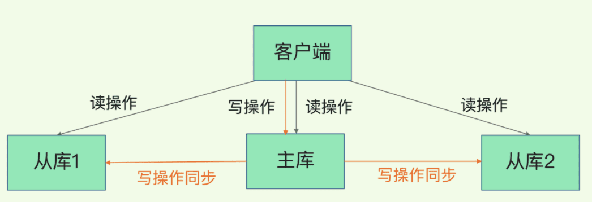

    这是“Redis”系列的第四篇文章，主要介绍的是Redis的高可用建设之“读写分离”。

# 一、Redis
<code>Redis（Remote Dictionary Server）</code>是一个开源的内存数据库，遵守 BSD 协议，它提供了一个高性能的键值（key-value）存储系统，常用于缓存、消息队列、会话存储等应用场景。

<!-- more -->

# 二、高可用之《读写分离》
Redis 读写分离是指在 Redis 主从复制的基础上，将读操作和写操作分别分配到不同的节点上执行。主节点负责处理所有的写操作，从节点则主要用于处理读操作。通过这种方式，可以减轻主节点的读压力，提高系统的整体性能和并发处理能力。

## 2.1、优点
**提高读性能：** 将读操作分散到多个从节点上，能够分担主节点的读压力，提高系统的整体读性能，尤其在读取操作频繁的场景下，可以显著提升系统的并发处理能力和响应速度。
**增强系统扩展性：**可以通过增加从节点的数量来线性扩展读能力，满足不断增长的业务需求，提高系统的可扩展性。
**数据冗余与备份：**从节点作为主节点的副本，提供了数据冗余和备份功能。即使主节点出现故障，也可以从从节点获取数据，提高了数据的可靠性和可用性。

## 2.2、缺点
**数据一致性问题：** 由于主从节点之间的数据同步存在一定的延迟，可能会导致从节点上的数据与主节点不完全一致。在某些对数据一致性要求极高的场景下，可能会出现读取到旧数据的情况。
**运维复杂度增加：** 引入读写分离后，需要管理和维护多个节点，包括主从节点的配置、数据同步监控、故障转移处理等，增加了运维的复杂度和成本。
**应用开发复杂度增加：** 在应用开发中，需要考虑读写分离的逻辑，确保读操作和写操作能够正确地路由到相应的节点。对于一些复杂的业务场景，可能还需要处理数据一致性问题，增加了应用开发的难度。

## 2.3、适用场景
**读多写少的场景：** 如社交媒体的内容展示、电商平台的商品查询等场景，大量的操作是读取数据，只有少量的写操作，非常适合采用 Redis 读写分离来提高系统性能。
**数据缓存场景：** 将 Redis 作为缓存使用时，通常读操作远远多于写操作。通过读写分离，可以充分利用从节点来处理读请求，减轻主节点的压力，提高缓存的命中率和响应速度。
**大规模数据存储与查询场景：** 当数据量较大且需要高并发的读取操作时，读写分离可以通过增加从节点来提升系统的读取能力，满足业务需求。

## 2.4、延迟与不一致问题
由于主从复制的命令传播是异步的，延迟与数据的不一致不可避免

优化措施
- 优化主从节点之间的网络环境（如在同机房部署）
- 监控主从节点延迟（通过offset）判断，如果从节点延迟过大，通知应用不再通过该从节点读取数据
- 使用集群同时扩展写负载和读负载等。

## 2.5、数据过期问题
从节点不会主动删除数据，而是由主节点控制从节点中过期数据的删除。由于主节点的惰性删除和定期删除策略，都不能保证主节点及时对过期数据执行删除操作，因此，当客户端通过Redis从节点读取数据时，很容易读取到已经过期的数据
> Redis 3.2中，从节点在读取数据时，增加了对数据是否过期的判断：如果该数据已过期，则不返回给客户端；将Redis升级到3.2可以解决数据过期问题。