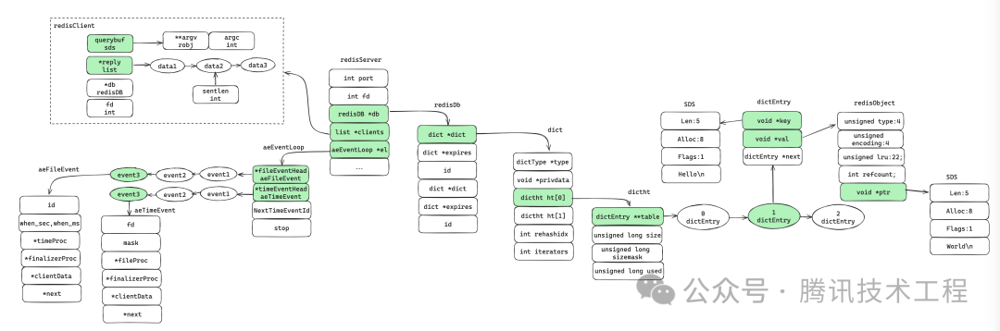
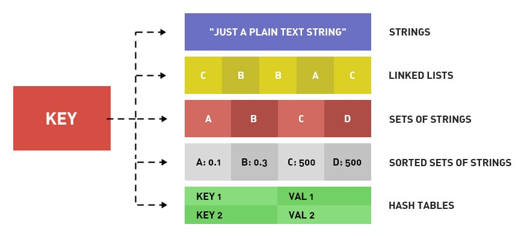
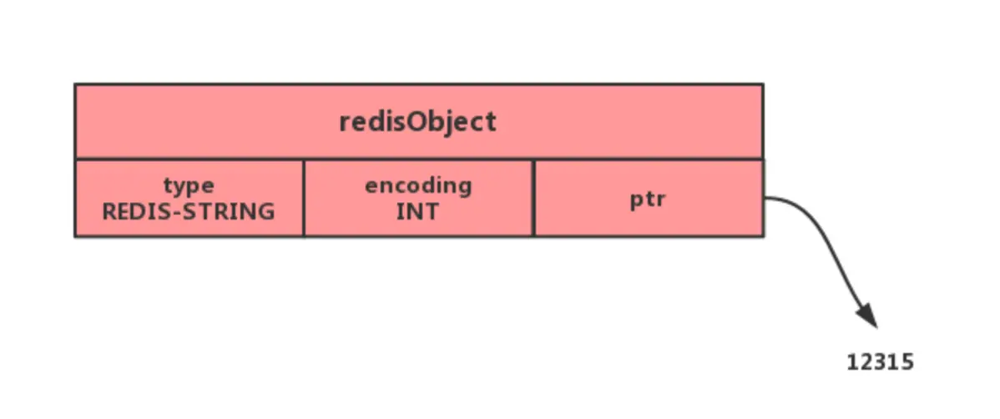
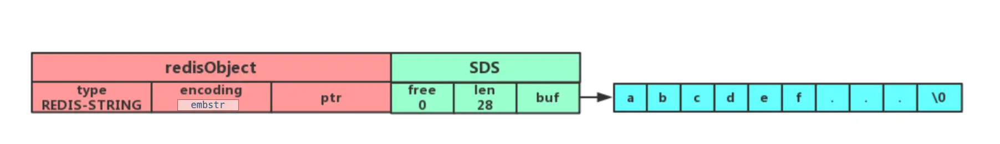
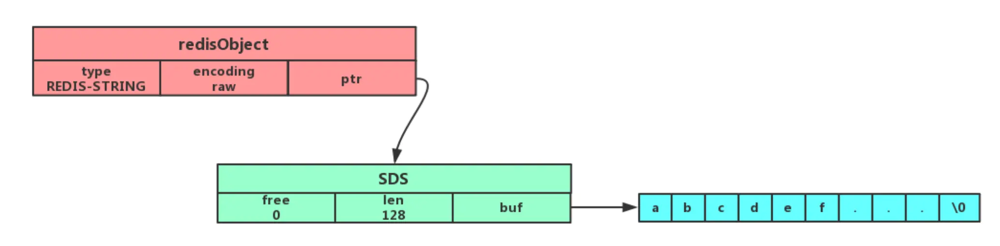
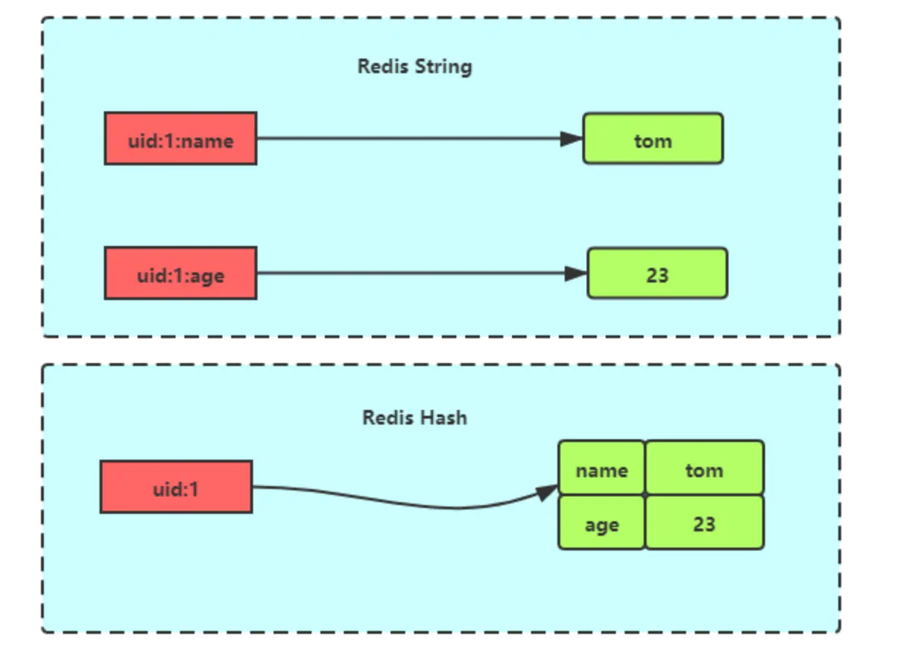
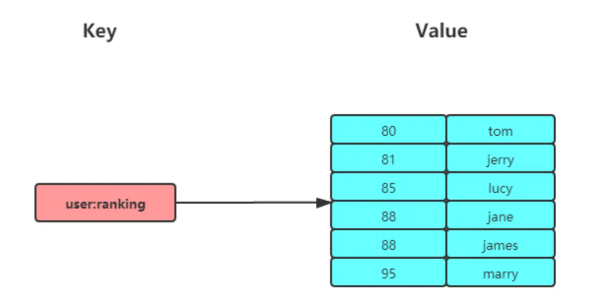
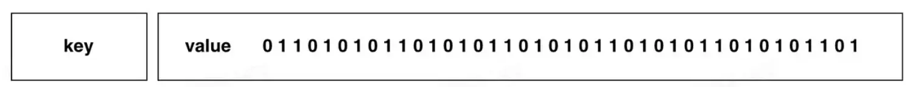
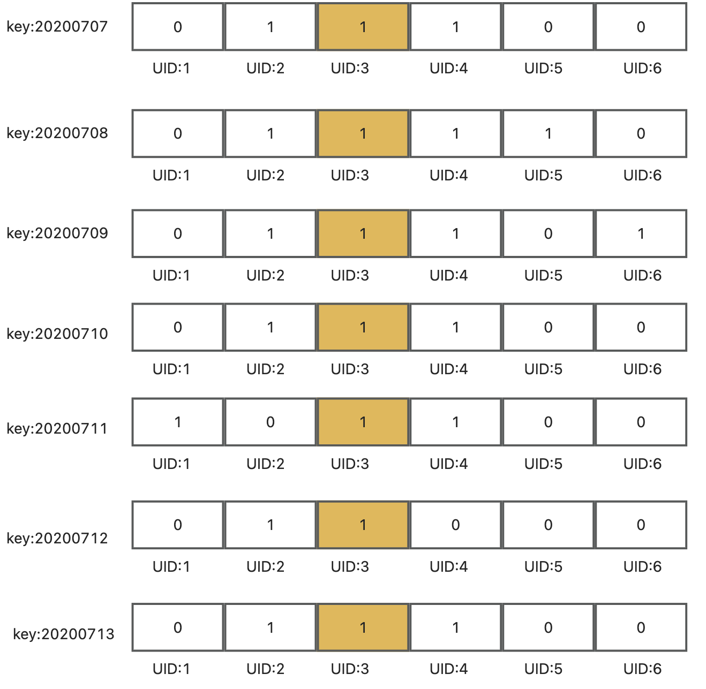
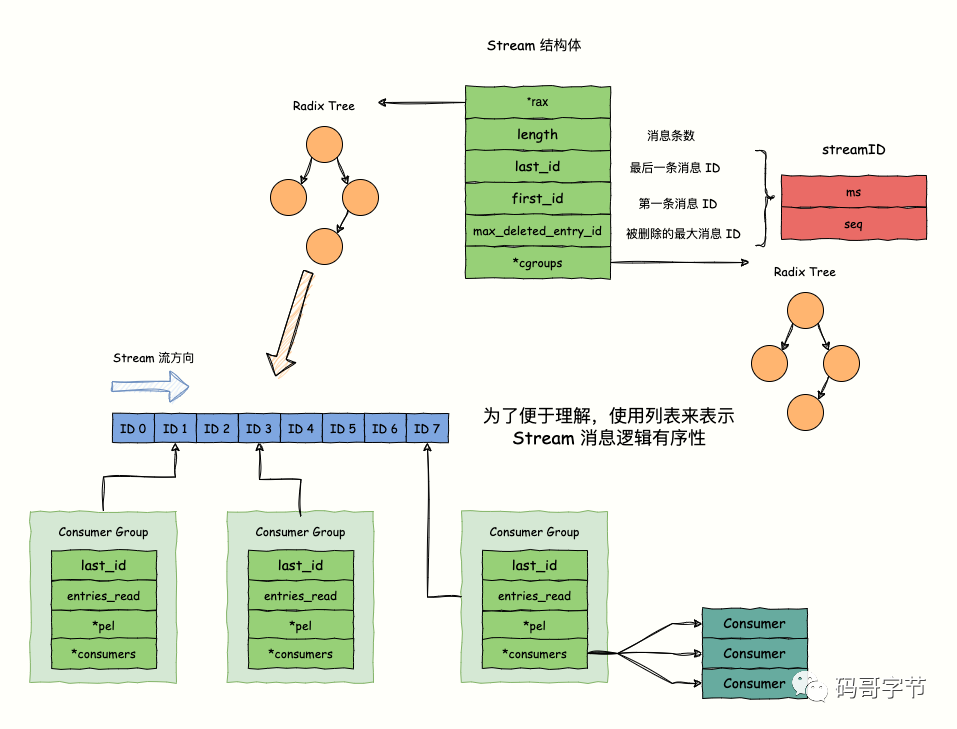

    这是“Redis”系列的第五篇文章，主要介绍的是Redis的“常见数据类型及应用场景”。

# 一、Redis
<code>Redis（Remote Dictionary Server）</code>是一个开源的内存数据库，遵守 BSD 协议，它提供了一个高性能的键值（key-value）存储系统，常用于缓存、消息队列、会话存储等应用场景。

<!-- more -->

# 二、Redis源码结构
基于redis1.0源码，列出了主流程相关的如下源码文件。


## 2.1、redisServer
redisServer是存储redis服务端运行的结构体，在启动的时候就会初始化完成。存储Redis服务器绝大部分的信息。

- redisDb *db; // 数据库列表
- int dbnum;   // 数据库数量
  - 在初始化服务器的时候，会根据dbnum的值决定创建多少个数据库
- clients; // 连接的客户端

## 2.2、redisDb
<code>redisDb</code>是<code>redis</code>的键值对存储的位置，**主要包含两大块，一块存储数据，另一块存储过期信信息**，<code>dict</code>结构实际上是两个哈希表，至于为什么有两个，这里是为了做渐进式<code>rehash</code>使用（后面会详细介绍），<code>rehashidx</code>用于表示<code>rehash</code>进度，iterators迭代器是表示遍历集合操作个数，表里面的元素就是entry，这里面包含key和value以及指向下一个元素的指针。
```cpp
/* Redis database representation. There are multiple databases identified
 * by integers from 0 (the default database) up to the max configured
 * database. The database number is the 'id' field in the structure. */
typedef struct redisDb {
    // 数据库键空间，保存着数据库中的所有键值对
    dict *dict;                 /* The keyspace for this DB */
    // 键的过期时间，字典的键为键，字典的值为过期事件 UNIX 时间戳
    dict *expires;              /* Timeout of keys with a timeout set */
    // 正处于阻塞状态的键
    dict *blocking_keys;        /* Keys with clients waiting for data (BLPOP) */
    // 可以解除阻塞的键
    dict *ready_keys;           /* Blocked keys that received a PUSH */
    // 正在被 WATCH 命令监视的键
    dict *watched_keys;         /* WATCHED keys for MULTI/EXEC CAS */
    struct evictionPoolEntry *eviction_pool;    /* Eviction pool of keys */
    // 数据库号码
    int id;                     /* Database ID */
    // 数据库的键的平均 TTL ，统计信息
    long long avg_ttl;          /* Average TTL, just for stats */
} redisDb;
```

## 2.3、dict【字典】
redis是一个键值对数据库，<code>dict</code>字典保存所有的键值对，称<code>dict</code>字典为“键空间”，存储数据库中的所有key-value
```cpp
typedef struct dict {
    dictType *type; // 类型，主要定义相关的函数
    void *privdata;
    dictht ht[2];  // 两个hash table，用于做渐进式rehash使用
    int rehashidx; /* rehash进度 rehashidx == -1表示不是正在rehash*/
    int iterators; /* number of iterators currently running */
} dict;
```
<code>dict</code>采用哈希函数对key取哈希值得到在哈希表中的位置(桶的位置)，采用拉链法解决hash冲突。
- dictht ht[2]：每个字典都使用两个哈希表，从而实现渐进式 rehash
  - 两张哈希表（ht[2]）：只有在重哈希的过程中，ht[0]和ht[1]才都有效。而在平常情况下，只有ht[0]有效，ht[1]里面没有任何数据

## 2.4、dictht【哈希表】
<code>dictht</code>是哈希表（hash table）的数据结构定义中的一部分，它在 Redis 的字典（dict）实现中扮演着重要角色。以下是关于<code>dictht</code>的详细介绍：
```cpp
/* This is our hash table structure. Every dictionary has two of this as we
 * implement incremental rehashing, for the old to the new table. */
/*
 * 哈希表
 *
 * 每个字典都使用两个哈希表，从而实现渐进式 rehash 。
 */
typedef struct dictht {
    // 哈希表数组
    dictEntry **table;
    // 哈希表大小
    unsigned long size;
    // 哈希表大小掩码，用于计算索引值
    // 总是等于 size - 1
    unsigned long sizemask;
    // 该哈希表已有节点的数量
    unsigned long used;
} dictht;
```
- <code>table</code>：是一个指向dictEntry结构体指针的指针，它实际上是一个数组，数组中的每个元素都是一个指向dictEntry结构体的指针，用于存储哈希表中的键值对。每个dictEntry代表哈希表中的一个节点，包含了键值对的具体信息。
- <code>size</code>：表示哈希表的大小，即table数组的长度。它通常是一个素数，这样可以更好地利用哈希算法，减少哈希冲突。


## 2.5、dictEntry【哈希表节点】
哈希表节点，Redis中的每个<code>Key-Value</code>在内存中都会被划分成<code>dictEntry</code>以及代表Key和Value的对象
```cpp
/*
 * 哈希表节点
 */
typedef struct dictEntry {
    void *key;             // 键，在redis中一般是指向一个SDS类型的数据
    union {
        void *val;         // 值，在redis中一般指向redisObject
        uint64_t u64;      // 特定情况下优化整数存储，比如过期     
        int64_t s64;       // 特定情况下优化整数存储
    } v;
    struct dictEntry *next; // 下一个entry
} dictEntry;
```
<code>dictEntry</code>包含分别指向Key和Value对象的指针以及指向下一个<code>dictEntry</code>的指针。


## 2.6、redisObject【核心对象】
redisObject是redis存储对象基本的表现形式，它可以存储类似SDS list set等数据结构，并且存储了一些信息用于内存管理，比如refcount这是一个整数字段，用于存储对象的引用计数。
```cpp
typedef struct redisObject {
    void *ptr;              // 指向具体数据的指针
    int refcount;           // 引用计数
    unsigned type:4;        // 类型
    unsigned notused:2;     // 未使用，可能是为了扩展/占位
    unsigned encoding:4;    // 编码方式 
    unsigned lru:22;        // 最近最少使用
} robj;
```

	数据类型（type）
		string, list, set, zset, hash
	编码方式（encoding）
		raw, int, ht, zipmap, linkedlist, ziplist, intset
	数据指针（ptr）
		ptr是一个通用指针，它指向实际存储的数据
			对于不同数据类型的指向情况：
				字符串类型（SDS）：如果是字符串对象，ptr指向一个SDS（Simple Dynamic String）结构
				列表类型：当是列表对象时，ptr可能指向一个链表结构或者其他适合存储列表的数据结构
				哈希类型：对于哈希对象，ptr指向一个哈希表结构
	虚拟内存（vm）
	其他信息


## 2.7、核心结构总结



# 三、数据类型

## 3.1、基本数据类型【5种】


### 3.1.1、string
String类型是二进制安全的，意思是 redis 的 string 可以包含任何数据。如数字，字符串，jpg图片或者序列化的对象。

#### 3.1.1.1、内部实现
String 类型的底层的数据结构实现主要是 int 和 SDS（简单动态字符串）。
##### 1. SDS
- SDS：simply dynamic  String，简单动态字符串
```cpp
struct sdshdr{
  int len;//记录buf以及使用的字节的数量
  int free;//记录buf未使用的数量
  char[] buf;//字节数组
}
```
比起c字符串，SDS有以下优点：
- <code>1、</code> 常数复杂度获取字符串长度
和C字符串不同，因为SDS在len属性中记录了SDS本身的长度len，所以获取一个SDS长度的复杂度仅为O(1)
- <code>2、</code> 杜绝缓冲区溢出
C字符串不记录自身长度带来的另一个问题是容易造成缓冲区溢出（buffer overflow），而SDS中不存在这个问题，因为可以读取len判断是否溢出
- <code>3、</code> 二进制安全
c字符串中以'\0'表示结尾，这使得c无法正确存储包含'\0'的数据。因为没有提供额外的信息来区分'\0'是结尾还是数据的一部分。虽然可以使用base64等算法对数据进行编码来解决该问题，但这通常会降低代码的效率
- <code>4、</code> 减少修改字符串长度时所需的内存重分配次数
Redis 的 SDS 实现了空间预分配优化策略。当 SDS 的 API 对一个 SDS 进行修改时，程序不仅会为 SDS 分配必须要的空间，还会为 SDS 分配额外的未使用空间
  - 额外分配未使用空间数量的规则
  当 SDS 的 len 属性值小于 1MB，程序分配和 len 属性同样大小的未使用空间。当 SDS 的 len 属性值大于 1MB，程序将多分配 1M 的未使用空间。通过这种预分配策略，SDS 将连续增长 N 次字符串所需的内存重分配次数从必定 N 次降低为最多 N 次
- <code>5、</code> 尾部 '\0' 使得SDS兼容部分C字符串函数
sds分配存储区时，也会多分配一个空间，用于在字符串末尾添加'\0'，这就使得SDS也能复用c库中的一部分函数

##### 2、内部编码（encoding）
字符串对象有 3 种 ：int、raw和 embstr。

###### 2.1、int编码
如果一个字符串对象保存的是整数值，并且这个整数值可以用long类型来表示，那么字符串对象会将整数值保存在字符串对象结构的ptr属性里面（将void*转换成 long），并将字符串对象的编码设置为int。

而且 Redis 启动时会预先建立 10000 个分别存储 0-9999 的 redisObject 变量作为共享对象，这就意味着如果 set字符串的键值在 0~10000 之间的话，则可以 直接指向共享对象 而不需要再建立新对象，此时键值不占空间！

###### 2.2、embstr编码
如果字符串对象保存的是一个字符串，并且这个字符申的长度小于等于 32 字节（redis 2.+版本），那么字符串对象将使用一个简单动态字符串（SDS）来保存这个字符串，并将对象的编码设置为embstr， embstr编码是专门用于保存短字符串的一种优化编码方式：

embedded string，表示嵌入式的String。从内存结构上来讲 即字符串 sds结构体与其对应的 redisObject 对象分配在 同一块连续的内存空间。（一次分配内存）


###### 2.3、raw编码
如果字符串对象保存的是一个字符串，并且这个字符串的长度大于 32 字节（redis 2.+版本），那么字符串对象将使用一个简单动态字符串（SDS）来保存这个字符串，并将对象的编码设置为raw：

动态字符串 sds 的内存与其依赖的 redisObject 的 内存不再连续 了

> 注意，embstr 编码和 raw 编码的边界在 redis 不同版本中是不一样的：
- redis 2.+ 是 32 字节
- redis 3.0-4.0 是 39 字节
- redis 5.0 是 44 字节

可以看到embstr和raw编码都会使用SDS来保存值，但不同之处在于embstr会通过一次内存分配函数来分配一块连续的内存空间来保存redisObject和SDS，而raw编码会通过调用两次内存分配函数来分别分配两块空间来保存redisObject和SDS。Redis这样做会有很多好处：
- embstr编码将创建字符串对象所需的内存分配次数从 raw 编码的两次降低为一次；
- 释放 embstr编码的字符串对象同样只需要调用一次内存释放函数；
- 因为embstr编码的字符串对象的所有数据都保存在一块连续的内存里面可以更好的利用 CPU 缓存提升性能。

但是 embstr 也有缺点的：
- 如果字符串的长度增加需要重新分配内存时，整个redisObject和sds都需要重新分配空间，所以embstr编码的字符串对象实际上是只读的，redis没有为embstr编码的字符串对象编写任何相应的修改程序。当我们对embstr编码的字符串对象执行任何修改命令（例如append）时，程序会先将对象的编码从embstr转换成raw，然后再执行修改命令。


#### 3.1.1.3、常用指令
普通字符串的基本操作：
```
# 设置 key-value 类型的值
> SET name lin
OK
# 根据 key 获得对应的 value
> GET name
"lin"
# 判断某个 key 是否存在
> EXISTS name
(integer) 1
# 返回 key 所储存的字符串值的长度
> STRLEN name
(integer) 3
# 删除某个 key 对应的值
> DEL name
(integer) 1
```
计数器（字符串的内容为整数的时候可以使用）：
```
# 设置 key-value 类型的值
> SET number 0
OK
# 将 key 中储存的数字值增一
> INCR number
(integer) 1
# 将key中存储的数字值加 10
> INCRBY number 10
(integer) 11
# 将 key 中储存的数字值减一
> DECR number
(integer) 10
# 将key中存储的数字值键 10
> DECRBY number 10
(integer) 0
```

#### 3.1.1.4、应用场景

##### 1. 缓存对象
使用 String 来缓存对象有两种方式：
- 直接缓存整个对象的 JSON，命令例子： <code>SET user:1 '{"name":"xiaolin", "age":18}'。</code>
- 采用将 key 进行分离为 user:ID:属性，采用 <code>MSET</code> 批量存储，用 <code>MGET</code> 获取各属性值，命令例子： <code>MSET user:1:name xiaolin user:1:age 18 user:2:name xiaomei user:2:age 20</code>。

##### 2. 常规计数
因为 Redis 处理命令是单线程，所以执行命令的过程是原子的。因此 String 数据类型适合计数场景，比如计算访问次数、点赞、转发、库存数量等等。
比如计算文章的阅读量：
```
# 初始化文章的阅读量
> SET aritcle:readcount:1001 0
OK
#阅读量+1
> INCR aritcle:readcount:1001
(integer) 1
#阅读量+1
> INCR aritcle:readcount:1001
(integer) 2
#阅读量+1
> INCR aritcle:readcount:1001
(integer) 3
# 获取对应文章的阅读量
> GET aritcle:readcount:1001
"3"
#
```

##### 3. 分布式锁
SET 命令有个 NX 参数可以实现「key不存在才插入」，可以用它来实现分布式锁：
- 如果 key 不存在，则显示插入成功，可以用来表示加锁成功；
- 如果 key 存在，则会显示插入失败，可以用来表示加锁失败。

一般而言，还会对分布式锁加上过期时间，分布式锁的命令如下：
```
SET lock_key unique_value NX PX 10000</code>
```
- <code>**lock_key**</code> 就是 key 键；
- <code>**unique_value**</code> 是客户端生成的唯一的标识；
- <code>**NX**</code> 代表只在 lock_key 不存在时，才对 lock_key 进行设置操作；
- <code>**PX 10000**</code> 表示设置 lock_key 的过期时间为 10s，这是为了避免客户端发生异常而无法释放锁。

而解锁的过程就是将 lock_key 键删除，但不能乱删，要保证执行操作的客户端就是加锁的客户端。所以，解锁的时候，我们要先判断锁的 unique_value 是否为加锁客户端，是的话，才将 lock_key 键删除。

可以看到，解锁是有两个操作，这时就需要 Lua 脚本来保证解锁的原子性，因为 Redis 在执行 Lua 脚本时，可以以原子性的方式执行，保证了锁释放操作的原子性。
```
// 释放锁时，先比较 unique_value 是否相等，避免锁的误释放
if redis.call("get",KEYS[1]) == ARGV[1] then
    return redis.call("del",KEYS[1])
else
    return 0
end
```
这样一来，就通过使用 SET 命令和 Lua 脚本在 Redis 单节点上完成了分布式锁的加锁和解锁。

##### 4. 分布式系统全局序列号
使用 <code>INCR</code> 命令：Redis 的INCR命令可以对一个string类型的键值进行原子性的自增操作。在分布式系统中，多个节点可以同时对同一个 Redis 键执行INCR命令来获取全局唯一的序列号。


### 3.1.2、List
List 列表是简单的字符串列表，按照插入顺序排序，可以从头部或尾部向 List 列表添加元素。

列表的最大长度为 2^32 - 1，也即每个列表支持超过 40 亿个元素。

#### 3.1.2.1、内部实现
List 类型的底层数据结构是由**双向链表**或**压缩列表**实现的：
- 如果列表的元素个数小于 512 个（默认值，可由 <code>list-max-ziplist-entries</code> 配置），列表每个元素的值都小于 64 字节（默认值，可由 <code>list-max-ziplist-value</code> 配置），Redis 会使用压缩列表作为 List 类型的底层数据结构；
- 如果列表的元素不满足上面的条件，Redis 会使用双向链表作为 List 类型的底层数据结构；

但是在 Redis 3.2 版本之后，List 数据类型底层数据结构就只由 <code>quicklist</code> 实现了，替代了双向链表和压缩列表。


#### 3.1.2.2、常用指令

```
# 将一个或多个值value插入到key列表的表头(最左边)，最后的值在最前面
LPUSH key value [value ...] 
# 将一个或多个值value插入到key列表的表尾(最右边)
RPUSH key value [value ...]
# 移除并返回key列表的头元素
LPOP key     
# 移除并返回key列表的尾元素
RPOP key 

leftPOP??? rightPop???

# 返回列表key中指定区间内的元素，区间以偏移量start和stop指定，从0开始
LRANGE key start stop

# 从key列表表头弹出一个元素，没有就阻塞timeout秒，如果timeout=0则一直阻塞
BLPOP key [key ...] timeout
# 从key列表表尾弹出一个元素，没有就阻塞timeout秒，如果timeout=0则一直阻塞
BRPOP key [key ...] timeout
```

#### 3.1.2.3、应用场景

##### 1、消息队列
消息队列在存取消息时，必须要满足三个需求，分别是**消息保序、处理重复的消息和保证消息可靠性**。

Redis 的 List 和 Stream 两种数据类型，就可以满足消息队列的这三个需求。我们先来了解下基于 List 的消息队列实现方法，后面在介绍 Stream 数据类型时候，在详细说说 Stream。

**1、如何满足消息保序需求？**

List 本身就是按先进先出的顺序对数据进行存取的，所以，如果使用 List 作为消息队列保存消息的话，就已经能满足消息保序的需求了。
List 可以使用 LPUSH + RPOP （或者反过来，RPUSH+LPOP）命令实现消息队列。

- 生产者使用 <code>LPUSH key value[value...]</code> 将消息插入到队列的头部，如果 key 不存在则会创建一个空的队列再插入消息。
- 消费者使用 <code>RPOP key</code> 依次读取队列的消息，先进先出。


**2、如何处理重复的消息？**

消费者要实现重复消息的判断，需要 2 个方面的要求：
- 每个消息都有一个全局的 ID。
- 消费者要记录已经处理过的消息的 ID。当收到一条消息后，消费者程序就可以对比收到的消息 ID 和记录的已处理过的消息 ID，来判断当前收到的消息有没有经过处理。如果已经处理过，那么，消费者程序就不再进行处理了。

但是 **List 并不会为每个消息生成 ID 号，所以我们需要自行为每个消息生成一个全局唯一ID**，生成之后，我们在用 LPUSH 命令把消息插入 List 时，需要在消息中包含这个全局唯一 ID。
例如，我们执行以下命令，就把一条全局 ID 为 111000102、库存量为 99 的消息插入了消息队列：
```
> LPUSH mq "111000102:stock:99"
(integer) 1
```

**3、如何保证消息可靠性？**

为了留存消息，List 类型提供了 BRPOPLPUSH 命令，这个命令的作用**是让消费者程序从一个 List 中读取消息，同时，Redis 会把这个消息再插入到另一个 List（可以叫作备份 List）留存。**


##### 2、微博、朋友圈、公众号等，关注的文章列表展示
假如 <code>小明</code> 关注了 <code>中国青年报、三太子敖丙</code> 等大V的订阅号，当这些大V发布订阅号时，通过推或拉的方式把消息<code>LPUSH</code>放入redis中属于小明的list中。其中key为<code>msg:{小明_ID}</code>。当小明要获取大V们发的消息时，使用<code>LRANGE</code> 命令从队列中获取指定个数的订阅号信息！！


### 3.1.3、hash
Hash 是一个键值对（key - value）集合，其中 value 的形式如： <code>value=[{field1，value1}，...{fieldN，valueN}]</code>。Hash 特别适合用于存储对象。

#### 3.1.3.1、实现方式
Hash 类型的底层数据结构是由压缩列表或哈希表实现的：
- 如果哈希类型元素个数小于 512 个（默认值，可由 <code>hash-max-ziplist-entries</code> 配置），所有值小于 64 字节（默认值，可由 hash-max-ziplist-value 配置）的话，Redis 会使用压缩列表作为 Hash 类型的底层数据结构；
- 如果哈希类型元素不满足上面条件，Redis 会使用哈希表作为 Hash 类型的 底层数据结构。

在 Redis 7.0 中，压缩列表数据结构已经废弃了，交由 <code>listpack</code> 数据结构来实现了。

Hash 与 String 对象的区别如上图所示


#### 3.1.3.2、常见命令
```
# 存储一个哈希表key的键值
HSET key field value   
# 获取哈希表key对应的field键值
HGET key field

# 在一个哈希表key中存储多个键值对
HMSET key field value [field value...] 
# 批量获取哈希表key中多个field键值
HMGET key field [field ...]       
# 删除哈希表key中的field键值
HDEL key field [field ...]    

# 返回哈希表key中field的数量
HLEN key       
# 返回哈希表key中所有的键值
HGETALL key 

# 为哈希表key中field键的值加上增量n
HINCRBY key field n  
```

#### 3.1.3.3、应用场景

##### 1、缓存对象
Hash 类型的 （key，field， value） 的结构与对象的（对象id， 属性， 值）的结构相似，也可以用来存储对象。

我们可以使用如下命令，将用户对象的信息存储到 Hash 类型：
```
# 存储一个哈希表uid:1的键值
> HMSET uid:1 name Tom age 15
2
# 存储一个哈希表uid:2的键值
> HMSET uid:2 name Jerry age 13
2
# 获取哈希表用户id为1中所有的键值
> HGETALL uid:1
1) "name"
2) "Tom"
3) "age"
4) "15"
```

在介绍 String 类型的应用场景时有所介绍，String + Json也是存储对象的一种方式，那么存储对象时，到底用 String + json 还是用 Hash 呢？

一般对象用 String + Json 存储，对象中某些频繁变化的属性可以考虑抽出来用 Hash 类型存储。

##### 2、购物车
以用户 id 为 key，商品 id 为 field，商品数量为 value，恰好构成了购物车的3个要素，如下图所示。

涉及的命令如下：
- 添加商品：HSET cart:{用户id} {商品id} 1
- 添加数量：HINCRBY cart:{用户id} {商品id} 1
- 商品总数：HLEN cart:{用户id}
- 删除商品：HDEL cart:{用户id} {商品id}
- 获取购物车所有商品：HGETALL cart:{用户id}

### 3.1.4、set
Set 类型是一个无序并唯一的键值集合，它的存储顺序不会按照插入的先后顺序进行存储。

一个集合最多可以存储 2^32-1 个元素。概念和数学中个的集合基本类似，可以交集，并集，差集等等，所以 Set 类型除了支持集合内的增删改查，同时还支持多个集合取交集、并集、差集。

#### 3.1.4.1、实现方式
Set 类型的底层数据结构是由**哈希表**或**整数集合**实现的：
- 如果集合中的元素都是整数且元素个数小于 512 （默认值，set-maxintset-entries配置）个，Redis 会使用整数集合作为 Set 类型的底层数据结构；
- 如果集合中的元素不满足上面条件，则 Redis 使用哈希表作为 Set 类型的底层数据结构。


#### 3.1.4.2、常用指令
set常用操作
```
# 往集合key中存入元素，元素存在则忽略，若key不存在则新建
SADD key member [member ...]
# 从集合key中删除元素
SREM key member [member ...] 
# 获取集合key中所有元素
SMEMBERS key
# 获取集合key中的元素个数
SCARD key

# 判断member元素是否存在于集合key中
SISMEMBER key member

# 从集合key中随机选出count个元素，元素不从key中删除
SRANDMEMBER key [count]
# 从集合key中随机选出count个元素，元素从key中删除
SPOP key [count]
```

set运算操作
```
# 交集运算
SINTER key [key ...]
# 将交集结果存入新集合destination中
SINTERSTORE destination key [key ...]

# 并集运算
SUNION key [key ...]
# 将并集结果存入新集合destination中
SUNIONSTORE destination key [key ...]

# 差集运算
SDIFF key [key ...]
# 将差集结果存入新集合destination中
SDIFFSTORE destination key [key ...]
```

#### 3.1.4.3、应用场景

##### 1、点赞
Set 类型可以保证一个用户只能点一个赞，这里举例子一个场景，key 是文章id，value 是用户id。

uid:1 、uid:2、uid:3 三个用户分别对 article:1 文章点赞了。
```
# uid:1 用户对文章 article:1 点赞
> SADD article:1 uid:1
(integer) 1
# uid:2 用户对文章 article:1 点赞
> SADD article:1 uid:2
(integer) 1
# uid:3 用户对文章 article:1 点赞
> SADD article:1 uid:3
(integer) 1
```
uid:1 取消了对 article:1 文章点赞。
```
> SREM article:1 uid:1
(integer) 1
```

获取 article:1 文章所有点赞用户 :
```
> SMEMBERS article:1
1) "uid:3"
2) "uid:2"
```

获取 article:1 文章的点赞用户数量：
```
> SCARD article:1
(integer) 2
```

判断用户 uid:1 是否对文章 article:1 点赞了：
```
> SISMEMBER article:1 uid:1
(integer) 0  # 返回0说明没点赞，返回1则说明点赞了
```

##### 2、共同关注
Set 类型支持交集运算，所以可以用来计算共同关注的好友、公众号等。

key 可以是用户id，value 则是已关注的公众号的id。
- <code>uid:1</code> 用户关注公众号 id 为 <code>5、6、7、8、9</code>
- <code>uid:2</code> 用户关注公众号 id 为 <code>7、8、9、10、11</code>。

```
# uid:1 用户关注公众号 id 为 5、6、7、8、9
> SADD uid:1 5 6 7 8 9
(integer) 5
# uid:2  用户关注公众号 id 为 7、8、9、10、11
> SADD uid:2 7 8 9 10 11
(integer) 5
```

uid:1 和 uid:2 共同关注的公众号：
```
# 获取共同关注
> SINTER uid:1 uid:2
1) "7"
2) "8"
3) "9"
```

给 uid:2 推荐 uid:1 关注的公众号：
```
> SDIFF uid:1 uid:2
1) "5"
2) "6"
```

验证某个公众号是否同时被 uid:1 或 uid:2 关注:
```
> SISMEMBER uid:1 5
(integer) 1 # 返回0，说明关注了
> SISMEMBER uid:2 5
(integer) 0 # 返回0，说明没关注
```

##### 3、抽奖活动
存储某活动中中奖的用户名 ，Set 类型因为有去重功能，可以保证同一个用户不会中奖两次。

key为抽奖活动名，value为员工名称，把所有员工名称放入抽奖箱 ：
```
>SADD lucky Tom Jerry John Sean Marry Lindy Sary Mark
(integer) 5
```

如果允许重复中奖，可以使用 SRANDMEMBER 命令。
```
# 抽取 1 个一等奖：
> SRANDMEMBER lucky 1
1) "Tom"
# 抽取 2 个二等奖：
> SRANDMEMBER lucky 2
1) "Mark"
2) "Jerry"
# 抽取 3 个三等奖：
> SRANDMEMBER lucky 3
1) "Sary"
2) "Tom"
3) "Jerry"
```

如果不允许重复中奖，可以使用 SPOP 命令。
```
# 抽取一等奖1个
> SPOP lucky 1
1) "Sary"
# 抽取二等奖2个
> SPOP lucky 2
1) "Jerry"
2) "Mark"
# 抽取三等奖3个
> SPOP lucky 3
1) "John"
2) "Sean"
3) "Lindy"
```

### 3.1.5、zset
Zset 类型（有序集合类型）相比于 Set 类型多了一个排序属性 score（分值），对于有序集合 ZSet 来说，每个存储元素相当于有两个值组成的，一个是有序集合的元素值，一个是排序值。

有序集合保留了集合不能有重复成员的特性（分值可以重复），但不同的是，有序集合中的元素可以排序。


#### 3.1.5.1、实现方式
Zset 类型的底层数据结构是由**压缩列表**或**跳表**实现的：
- 如果有序集合的元素个数小于 128 个，并且每个元素的值小于 64 字节时，Redis 会使用压缩列表作为 Zset 类型的底层数据结构；
- 如果有序集合的元素不满足上面的条件，Redis 会使用跳表作为 Zset 类型的底层数据结构；

在 Redis 7.0 中，压缩列表数据结构已经废弃了，交由 listpack 数据结构来实现了。



#### 3.1.5.2、常用指令
Zset 常用操作：
```
# 往有序集合key中加入带分值元素
ZADD key score member [[score member]...]
# 往有序集合key中删除元素
ZREM key member [member...]
# 返回有序集合key中元素member的分值
ZSCORE key member
# 返回有序集合key中元素个数
ZCARD key

# 为有序集合key中元素member的分值加上increment
ZINCRBY key increment member

# 正序获取有序集合key从start下标到stop下标的元素
ZRANGE key start stop [WITHSCORES]
# 倒序获取有序集合key从start下标到stop下标的元素
ZREVRANGE key start stop [WITHSCORES]

# 返回有序集合中指定分数区间内的成员，分数由低到高排序。
ZRANGEBYSCORE key min max [WITHSCORES] [LIMIT offset count]

# 返回指定成员区间内的成员，按字典正序排列, 分数必须相同。
ZRANGEBYLEX key min max [LIMIT offset count]
# 返回指定成员区间内的成员，按字典倒序排列, 分数必须相同
ZREVRANGEBYLEX key max min [LIMIT offset count]
```

Zset 运算操作（相比于 Set 类型，ZSet 类型没有支持差集运算）：
```
# 并集计算(相同元素分值相加)，numberkeys一共多少个key，WEIGHTS每个key对应的分值乘积
ZUNIONSTORE destkey numberkeys key [key...]
# 交集计算(相同元素分值相加)，numberkeys一共多少个key，WEIGHTS每个key对应的分值乘积
ZINTERSTORE destkey numberkeys key [key...]
```

#### 3.1.5.3、应用场景
Zset 类型（Sorted Set，有序集合） 可以根据元素的权重来排序，我们可以自己来决定每个元素的权重值。比如说，我们可以根据元素插入 Sorted Set 的时间确定权重值，先插入的元素权重小，后插入的元素权重大。

在面对需要展示最新列表、排行榜等场景时，如果数据更新频繁或者需要分页显示，可以优先考虑使用 Sorted Set。

##### 1、排行榜
我们以博文点赞排名为例，小林发表了五篇博文，分别获得赞为 200、40、100、50、150。
```
# arcticle:1 文章获得了200个赞
> ZADD user:xiaolin:ranking 200 arcticle:1
(integer) 1
# arcticle:2 文章获得了40个赞
> ZADD user:xiaolin:ranking 40 arcticle:2
(integer) 1
# arcticle:3 文章获得了100个赞
> ZADD user:xiaolin:ranking 100 arcticle:3
(integer) 1
# arcticle:4 文章获得了50个赞
> ZADD user:xiaolin:ranking 50 arcticle:4
(integer) 1
# arcticle:5 文章获得了150个赞
> ZADD user:xiaolin:ranking 150 arcticle:5
(integer) 1
```

文章 arcticle:4 新增一个赞，可以使用 ZINCRBY 命令（为有序集合key中元素member的分值加上increment）：
```
> ZINCRBY user:xiaolin:ranking 1 arcticle:4
"51"
```

查看某篇文章的赞数，可以使用 ZSCORE 命令（返回有序集合key中元素个数）：
```
> ZSCORE user:xiaolin:ranking arcticle:4
"50"
```

获取小林文章赞数最多的 3 篇文章，可以使用 ZREVRANGE 命令（倒序获取有序集合 key 从start下标到stop下标的元素）：
```
# WITHSCORES 表示把 score 也显示出来
> ZREVRANGE user:xiaolin:ranking 0 2 WITHSCORES
1) "arcticle:1"
2) "200"
3) "arcticle:5"
4) "150"
5) "arcticle:3"
6) "100"
```

获取小林 100 赞到 200 赞的文章，可以使用 ZRANGEBYSCORE 命令（返回有序集合中指定分数区间内的成员，分数由低到高排序）：
```
> ZRANGEBYSCORE user:xiaolin:ranking 100 200 WITHSCORES
1) "arcticle:3"
2) "100"
3) "arcticle:5"
4) "150"
5) "arcticle:1"
6) "200"
```


## 3.2、高级数据类型【4种】

### 3.2.1、bitmap
Bitmap，即位图，是一串连续的二进制数组（0和1），可以通过偏移量（offset）定位元素。BitMap通过最小的单位bit来进行0|1的设置，表示某个元素的值或者状态，时间复杂度为O(1)。

由于 bit 是计算机中最小的单位，使用它进行储存将非常节省空间，特别适合一些数据量大且使用二值统计的场景。


#### 3.2.1.1、实现方式
Bitmap 本身是用 String 类型作为底层数据结构实现的一种统计二值状态的数据类型。

String 类型是会保存为二进制的字节数组，所以，Redis 就把字节数组的每个 bit 位利用起来，用来表示一个元素的二值状态，你可以把 Bitmap 看作是一个 bit 数组。

#### 3.2.1.2、常用指令
bitmap 基本操作：
```
# 设置值，其中value只能是 0 和 1
SETBIT key offset value

# 获取值
GETBIT key offset

# 获取指定范围内值为 1 的个数
# start 和 end 以字节为单位
BITCOUNT key start end
```

bitmap 运算操作：
```
# BitMap间的运算
# operations 位移操作符，枚举值
AND 与运算 &
OR 或运算 |
XOR 异或 ^
NOT 取反 ~
# result 计算的结果，会存储在该key中
# key1 … keyn 参与运算的key，可以有多个，空格分割，not运算只能一个key
# 当 BITOP 处理不同长度的字符串时，较短的那个字符串所缺少的部分会被看作 0。返回值是保存到 destkey 的字符串的长度（以字节byte为单位），和输入 key 中最长的字符串长度相等。
BITOP [operations] [result] [key1] [keyn…]

# 返回指定key中第一次出现指定value(0/1)的位置
BITPOS [key] [value]
```

#### 3.2.1.3、应用场景
Bitmap 类型非常适合二值状态统计的场景，这里的二值状态就是指集合元素的取值就只有 0 和 1 两种，在记录海量数据时，Bitmap 能够有效地节省内存空间。

##### 1、签到统计
在签到打卡的场景中，我们只用记录签到（1）或未签到（0），所以它就是非常典型的二值状态。

签到统计时，每个用户一天的签到用 1 个 bit 位就能表示，一个月（假设是 31 天）的签到情况用 31 个 bit 位就可以，而一年的签到也只需要用 365 个 bit 位，根本不用太复杂的集合类型。

假设我们要统计 ID 100 的用户在 2022 年 6 月份的签到情况，就可以按照下面的步骤进行操作。

第一步，执行下面的命令，记录该用户 6 月 3 号已签到。
```
SETBIT uid:sign:100:202206 2 1
```
第二步，检查该用户 6 月 3 日是否签到。
```
GETBIT uid:sign:100:202206 2
```
第三步，统计该用户在 6 月份的签到次数。
```
BITCOUNT uid:sign:100:202206
```
这样，我们就知道该用户在 6 月份的签到情况了。


##### 2、用户登录态
Bitmap 提供了 GETBIT、SETBIT 操作，通过一个偏移值 offset 对 bit 数组的 offset 位置的 bit 位进行读写操作，需要注意的是 offset 从 0 开始。

只需要一个 key = login_status 表示存储用户登陆状态集合数据， 将用户 ID 作为 offset，在线就设置为 1，下线设置 0。通过 GETBIT判断对应的用户是否在线。 5000 万用户只需要 6 MB 的空间。

假如我们要判断 ID = 10086 的用户的登陆情况：

第一步，执行以下指令，表示用户已登录。
```
SETBIT login_status 10086 1
```
第二步，检查该用户是否登陆，返回值 1 表示已登录。
```
GETBIT login_status 10086
```
第三步，登出，将 offset 对应的 value 设置成 0。
```
SETBIT login_status 10086 0
```

##### 3、连续签到用户总数
如何统计出这连续 7 天连续打卡用户总数呢？

我们把**每天的日期**作为 Bitmap 的 key，userId 作为 offset，若是打卡则将 offset 位置的 bit 设置成 1。
key 对应的集合的每个 bit 位的数据则是一个用户在该日期的打卡记录。


一共有 7 个这样的 Bitmap，如果我们能对这 7 个 Bitmap 的对应的 bit 位做 『与』运算。同样的 UserID offset 都是一样的，当一个 userID 在 7 个 Bitmap 对应对应的 offset 位置的 bit = 1 就说明该用户 7 天连续打卡。

结果保存到一个新 Bitmap 中，我们再通过 BITCOUNT 统计 bit = 1 的个数便得到了连续打卡 7 天的用户总数了。

Redis 提供了 <code>BITOP operation destkey key [key ...]</code>这个指令用于对一个或者多个 key 的 Bitmap 进行位元操作。
- operation 可以是 and、OR、NOT、XOR。当 BITOP 处理不同长度的字符串时，较短的那个字符串所缺少的部分会被看作 0 。空的 key 也被看作是包含 0 的字符串序列。

假设要统计 3 天连续打卡的用户数，则是将三个 bitmap 进行 AND 操作，并将结果保存到 destmap 中，接着对 destmap 执行 BITCOUNT 统计，如下命令：
```
# 与操作
BITOP AND destmap bitmap:01 bitmap:02 bitmap:03
# 统计 bit 位 =  1 的个数
BITCOUNT destmap
```
即使一天产生一个亿的数据，Bitmap 占用的内存也不大，大约占 12 MB 的内存（10^8/8/1024/1024），7 天的 Bitmap 的内存开销约为 84 MB。同时我们最好给 Bitmap 设置过期时间，让 Redis 删除过期的打卡数据，节省内存。


### 3.2.2、HyperLogLog
Redis <code>HyperLogLog</code> 是 Redis 2.8.9 版本新增的数据类型，是一种用于「统计基数」的数据集合类型，基数统计就是指统计一个集合中不重复的元素个数。但要注意，<code>HyperLogLog</code> 是统计规则是基于概率完成的，不是非常准确，标准误算率是 0.81%。

所以，简单来说 <code>HyperLogLog</code> 提供不精确的去重计数。

在 Redis 里面，每个 <code>HyperLogLog</code> 键只需要花费 12 KB 内存，就可以计算接近 2^64 个不同元素的基数，和元素越多就越耗费内存的 Set 和 Hash 类型相比，<code>HyperLogLog</code> 就非常节省空间。

这什么概念？举个例子给大家对比一下。

用 Java 语言来说，一般 long 类型占用 8 字节，而 1 字节有 8 位，即：1 byte = 8 bit，即 long 数据类型最大可以表示的数是：2^63-1。对应上面的2^64个数，假设此时有2^63-1这么多个数，从 <code>0 ~ 2^63-1</code>，按照long以及1k = 1024 字节的规则来计算内存总数，就是：<code>((2^63-1) * 8/1024)K</code>，这是很庞大的一个数，存储空间远远超过12K，而 <code>HyperLogLog</code> 却可以用 12K 就能统计完。


#### 3.2.2.1、实现方式

##### 1、redis的分桶
要使用极大似然估计，需要可观察的结果足够多，但这个“足够多”其实并没有严谨的规定，和100比1万也挺多了，但和100万比较又显得少了，况且观察结果再多，误差总是有的，一些极端情况也是有可能发生的（就像有的人可能买一次彩票就中奖了，有的人可能买一辈子也没有中过）。为了减小这种误差，**redis将统计结果分散到了总计16384个桶中**，在最终计算总的结果的时候，再将这每一个桶的统计结果再做一次调和平均，使得各种极端情况的影响降到最低。

##### 2、数据存储结构
redis采用的hash算法能得到一个64bit的结果，前面讲到redis进行了分桶，于是为了确定这个hash的结果需要放到哪个桶中，就需要拿出14个bit来计算桶的序号，2的14次方正好是16384。

确定好放入哪个桶后，剩下的50个bit就作为扔硬币的实验结果，而最坏的实验结果是最左边的bit为1，其他bit都为0：<code>10000....0000</code>，此时我们需要记录的可能的最大数字就是50（即第一个为1的bit出现在第50位），而50的二进制是110010，需要6个bit存放。因此对于任意的hash结果，一个桶最多最多只需要6个bit就能存放下所有可能结果了
redis总共分了16384个桶，每个桶需要6bit，于是总计：
```
16384 × 6 ÷ 8 ÷ 1024 = 12kb
```
如下图：


更多内容：
[Redis Hyperloglog的原理及数学理论的通俗理解](https://www.cnblogs.com/tera/p/15840118.html)

#### 3.2.2.2、常用指令
HyperLogLog 命令很少，就三个。
```
# 添加指定元素到 HyperLogLog 中
PFADD key element [element ...]

# 返回给定 HyperLogLog 的基数估算值。
PFCOUNT key [key ...]

# 将多个 HyperLogLog 合并为一个 HyperLogLog
PFMERGE destkey sourcekey [sourcekey ...]
```

#### 3.2.2.3、应用场景

##### 1、百万级网页 UV 计数
Redis <code>HyperLogLog</code> 优势在于只需要花费 12 KB 内存，就可以计算接近 2^64 个元素的基数，和元素越多就越耗费内存的 Set 和 Hash 类型相比，<code>HyperLogLog</code> 就非常节省空间。

所以，非常适合统计百万级以上的网页 UV 的场景。

在统计 UV 时，你可以用 PFADD 命令（用于向 HyperLogLog 中添加新元素）把访问页面的每个用户都添加到 <code>HyperLogLog</code> 中。
```
PFADD page1:uv user1 user2 user3 user4 user5
```
接下来，就可以用 PFCOUNT 命令直接获得 page1 的 UV 值了，这个命令的作用就是返回 HyperLogLog 的统计结果。
```
PFCOUNT page1:uv
```
不过，有一点需要你注意一下，<code>HyperLogLog</code> 的统计规则是基于概率完成的，所以它给出的统计结果是有一定误差的，标准误算率是 0.81%。

这也就意味着，你使用 <code>HyperLogLog</code> 统计的 UV 是 100 万，但实际的 UV 可能是 101 万。虽然误差率不算大，但是，如果你需要精确统计结果的话，最好还是继续用 Set 或 Hash 类型。


### 3.2.3、GEO
Redis <code>GEO</code> 是 Redis 3.2 版本新增的数据类型，主要用于存储地理位置信息，并对存储的信息进行操作。

在日常生活中，我们越来越依赖搜索“附近的餐馆”、在打车软件上叫车，这些都离不开基于位置信息服务<code>（Location-Based Service，LBS）</code>的应用。LBS 应用访问的数据是和人或物关联的一组经纬度信息，而且要能查询相邻的经纬度范围，<code>GEO</code> 就非常适合应用在 LBS 服务的场景中。

#### 3.2.3.1、实现方式
<code>GEO</code> 本身并没有设计新的底层数据结构，而是直接使用了 <code>Sorted Set</code> 集合类型。

<code>GEO</code> 类型使用 GeoHash 编码方法实现了经纬度到 <code>Sorted Set</code> 中元素权重分数的转换，这其中的两个关键机制就是「对二维地图做区间划分」和「对区间进行编码」。一组经纬度落在某个区间后，就用区间的编码值来表示，并把编码值作为 <code>Sorted Set</code> 元素的权重分数。

这样一来，我们就可以把经纬度保存到 <code>Sorted Set</code> 中，利用 <code>Sorted Set</code> 提供的“按权重进行有序范围查找”的特性，实现 LBS 服务中频繁使用的“搜索附近”的需求。


##### 1、geohash原理分析
参考文章：[GeoHash核心原理解析](https://www.cnblogs.com/LBSer/p/3310455.html)

#### 3.2.3.2、常用指令
```
# 存储指定的地理空间位置，可以将一个或多个经度(longitude)、纬度(latitude)、位置名称(member)添加到指定的 key 中。
GEOADD key longitude latitude member [longitude latitude member ...]

# 从给定的 key 里返回所有指定名称(member)的位置（经度和纬度），不存在的返回 nil。
GEOPOS key member [member ...]

# 返回两个给定位置之间的距离。
GEODIST key member1 member2 [m|km|ft|mi]

# 根据用户给定的经纬度坐标来获取指定范围内的地理位置集合。
GEORADIUS key longitude latitude radius m|km|ft|mi [WITHCOORD] [WITHDIST] [WITHHASH] [COUNT count] [ASC|DESC] [STORE key] [STOREDIST key]
```

#### 3.2.3.3、应用场景

##### 1、滴滴叫车
这里以滴滴叫车的场景为例，介绍下具体如何使用 GEO 命令：<code>GEOADD</code> 和 <code>GEORADIUS</code> 这两个命令。

我们可以用一个 GEO 集合保存所有车辆的经纬度，集合 key 是 <code>cars:locations</code>。

eg: 执行下面的这个命令，向cars:locations中增加车辆编号为1以及车辆编号为2的位置信息。
```
127.0.0.1:6379> geoadd cars:locations 120.346111 31.556381 1 120.375821 31.560368 2 
```

eg: 获取车辆编号为1的车辆位置信息
```
127.0.0.1:6379> geopos cars:locations 1
1) 1) "120.34611314535140991"
2) "31.55637987511895659"
```

当用户想要寻找自己附近的网约车时，LBS 应用就可以使用 GEORADIUS 命令。

eg: LBS 应用执行下面的命令时，Redis 会根据输入的用户的经纬度信息（以经度120.375821纬度31.556381）为中心查找5公里范围内的车辆，并返回给 LBS 应用。
```
127.0.0.1:6379> GEORADIUS cars:locations 120.375821 31.556381 5 km WITHCOORD WITHDIST WITHHASH  ASC COUNT 100
1) 1) "2"
   2) "0.4433"
   3) (integer) 4054421167795118
   4) 1) "120.37582129240036011"
      2) "31.5603669915025975"
2) 1) "1"
   2) "2.8157"
   3) (integer) 4054421060663027
   4) 1) "120.34611314535140991"
      2) "31.55637987511895659"
```


eg: 再尝试用zset的查询指令，查询上文中添加的GEO信息
```
127.0.0.1:6379> ZRANGE cars:locations  0 -1 WITHSCORES
1) "1"
2) "4054421060663027"
3) "2"
4) "4054421167795118"
```
发现车辆编号为1的位置信息为4054421060663027；车辆编号为2的位置信息为4054421167795118。 再回顾一下zset增加成员的指令
```
ZADD key score member [[score member] [score member] ...]
```
至此可以推断出Redis GEO 添加经、纬度位置信息的指令的过程是
```
ZADD cars:locations 4054421060663027 1
```
4054421060663027为对经纬度进行编码后的值。使用4054421060663027作为score 可以快速实现对经纬度的索引。


### 3.2.4、Stream
Redis <code>Stream</code> 是 Redis 5.0 版本新增加的数据类型，Redis 专门为**消息队列**设计的数据类型。

在 Redis 5.0 <code>Stream</code> 没出来之前，消息队列的实现方式都有着各自的缺陷，例如：
- 发布订阅模式，不能持久化也就无法可靠的保存消息，并且对于离线重连的客户端不能读取历史消息的缺陷；
- List 实现消息队列的方式不能重复消费，一个消息消费完就会被删除，而且生产者需要自行实现全局唯一 ID。

基于以上问题，Redis 5.0 便推出了 <code>Stream</code> 类型也是此版本最重要的功能，用于完美地实现消息队列，它支持消息的持久化、支持自动生成全局唯一 ID、支持 ack 确认消息的模式、支持消费组模式等，让消息队列更加的稳定和可靠。

#### 3.2.4.1、实现方式
Stream 结构的源码定义在 stream.h 源码中的 stream 结构体中。
```cpp
typedef struct stream {
    rax *rax;
    uint64_t length;
    streamID last_id;
    streamID first_id;
    streamID max_deleted_entry_id;
    uint64_t entries_added;
    rax *cgroups;
} stream;

typedef struct streamID {
    uint64_t ms;
    uint64_t seq;
} streamID;
```

每个 <code>Stream</code> 都有一个唯一的名称，作为 <code>Stream</code> 在 Redis 的 key，在首次使用 <code>xadd</code> 指令添加消息的时候会自动创建。

可以看到 <code>Stream</code> 在一个 <code>Redix Tree</code> 树上，<font color=red>树上存储的是消息 ID</font>，每个消息 ID 对应的消息通过一个指针指向 <code>listpack</code>。

<code>Stream</code> 流就像是一个仅追加内容的消息链表，把消息一个个串起来，每个消息都有一个唯一的 ID 和消息内容，消息内容则由多个 <code>field/value</code> 键值对组成。底层使用 <code>Radix Tree</code> 和 <code>listpack</code> 数据结构存储数据。

为了便于理解，我画了一张图，并对 Radix Tree 的存储数据做了下变形，使用列表来体现 <code>Stream</code> 中消息的逻辑有序性。



#### 3.2.4.2、常用指令
Stream 消息队列操作命令：
- XADD：插入消息，保证有序，可以自动生成全局唯一 ID；
- XLEN ：查询消息长度；
- XREAD：用于读取消息，可以按 ID 读取数据；
- XDEL ： 根据消息 ID 删除消息；
- DEL ：删除整个 Stream；
- XRANGE ：读取区间消息
- XREADGROUP：按消费组形式读取消息；
- XPENDING 和 XACK：
- XPENDING 命令可以用来查询每个消费组内所有消费者「已读取、但尚未确认」的消息；
- XACK 命令用于向消息队列确认消息处理已完成；


#### 3.2.4.3、应用场景

##### 1、消息队列
生产者通过 XADD 命令插入一条消息：
```
# * 表示让 Redis 为插入的数据自动生成一个全局唯一的 ID
# 往名称为 mymq 的消息队列中插入一条消息，消息的键是 name，值是 xiaolin
> XADD mymq * name xiaolin
"1654254953808-0"
```
插入成功后会返回全局唯一的 ID："1654254953808-0"。消息的全局唯一 ID 由两部分组成：
- 第一部分“1654254953808”是数据插入时，以毫秒为单位计算的当前服务器时间；
- 第二部分表示插入消息在当前毫秒内的消息序号，这是从 0 开始编号的。例如，“1654254953808-0”就表示在“1654254953808”毫秒内的第 1 条消息。

消费者通过 XREAD 命令从消息队列中读取消息时，可以指定一个消息 ID，并从这个消息 ID 的下一条消息开始进行读取（注意是输入消息 ID 的下一条信息开始读取，不是查询输入ID的消息）。
```
# 从 ID 号为 1654254953807-0 的消息开始，读取后续的所有消息（示例中一共 1 条）。
> XREAD STREAMS mymq 1654254953807-0
1) 1) "mymq"
2) 1) 1) "1654254953808-0"
2) 1) "name"
2) "xiaolin"
```
如果想要实现阻塞读（当没有数据时，阻塞住），可以调用 XRAED 时设定 BLOCK 配置项，实现类似于 BRPOP 的阻塞读取操作。

比如，下面这命令，设置了 BLOCK 10000 的配置项，10000 的单位是毫秒，表明 XREAD 在读取最新消息时，如果没有消息到来，XREAD 将阻塞 10000 毫秒（即 10 秒），然后再返回。
```
# 命令最后的“$”符号表示读取最新的消息
> XREAD BLOCK 10000 STREAMS mymq $
(nil)
(10.00s)
```
Stream 的基础方法，使用 xadd 存入消息和 xread 循环阻塞读取消息的方式可以实现简易版的消息队列，交互流程如下图所示：


#### 3.2.4.4、Redis Stream 消息会丢失吗？

使用一个消息队列，其实就分为三大块：生产者、队列中间件、消费者，所以要保证消息就是保证三个环节都不能丢失数据。

- Redis 生产者会不会丢消息？生产者会不会丢消息，取决于生产者对于异常情况的处理是否合理。 从消息被生产出来，然后提交给 MQ 的过程中，只要能正常收到 （ MQ 中间件） 的 ack 确认响应，就表示发送成功，所以只要处理好返回值和异常，如果返回异常则进行消息重发，那么这个阶段是不会出现消息丢失的。
- Redis 消费者会不会丢消息？不会，因为 Stream （ MQ 中间件）会自动使用内部队列（也称为 PENDING List）留存消费组里每个消费者读取的消息，但是未被确认的消息。消费者可以在重启后，用 XPENDING 命令查看已读取、但尚未确认处理完成的消息。等到消费者执行完业务逻辑后，再发送消费确认 XACK 命令，也能保证消息的不丢失。
- Redis 消息中间件会不会丢消息？会，Redis 在以下 2 个场景下，都会导致数据丢失：
  - AOF 持久化配置为每秒写盘，但这个写盘过程是异步的，Redis 宕机时会存在数据丢失的可能 
  - 主从复制也是异步的，主从切换时，也存在丢失数据的可能


#### 3.2.4.5、Redis Stream 消息可堆积吗？

Redis 的数据都存储在内存中，这就意味着一旦发生消息积压，则会导致 Redis 的内存持续增长，如果超过机器内存上限，就会面临被 OOM 的风险。

所以 Redis 的 Stream 提供了可以指定队列最大长度的功能，就是为了避免这种情况发生。

当指定队列最大长度时，队列长度超过上限后，旧消息会被删除，只保留固定长度的新消息。这么来看，Stream 在消息积压时，如果指定了最大长度，还是有可能丢失消息的。

但 Kafka、RabbitMQ 专业的消息队列它们的数据都是存储在磁盘上，当消息积压时，无非就是多占用一些磁盘空间。

因此，把 Redis 当作队列来使用时，会面临的 2 个问题：
- Redis 本身可能会丢数据；
- 面对消息挤压，内存资源会紧张；

所以，能不能将 Redis 作为消息队列来使用，关键看你的业务场景：
- 如果你的业务场景足够简单，对于数据丢失不敏感，而且消息积压概率比较小的情况下，把 Redis 当作队列是完全可以的。
- 如果你的业务有海量消息，消息积压的概率比较大，并且不能接受数据丢失，那么还是用专业的消息队列中间件吧。

# 四、总结
Redis 常见的五种数据类型：String（字符串），Hash（哈希），List（列表），Set（集合）及 Zset(sorted set：有序集合)。

这五种数据类型都由多种数据结构实现的，主要是出于时间和空间的考虑，当数据量小的时候使用更简单的数据结构，有利于节省内存，提高性能。

这五种数据类型与底层数据结构对应关系图如下，左边是 Redis 3.0版本的，也就是《Redis 设计与实现》这本书讲解的版本，现在看还是有点过时了，右边是现在 Github 最新的 Redis 代码的。


参考文章：
[Redis 常见数据类型和应用场景](https://xiaolincoding.com/redis/data_struct/command.html#string)      
[Redis Stream 数据结构实现原理真的很强](https://www.51cto.com/article/766539.html)      
[Redis源码解析：一条Redis命令是如何执行的？](https://cloud.tencent.com/developer/article/2427055)