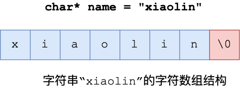
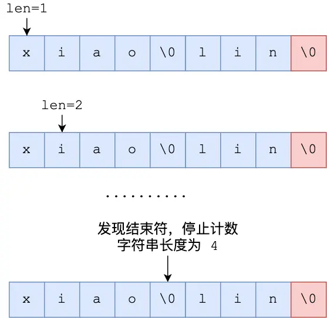
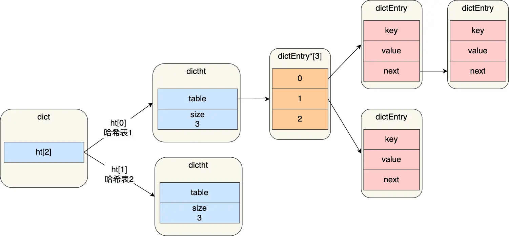
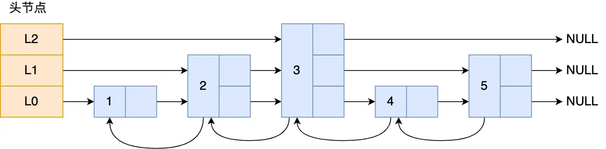
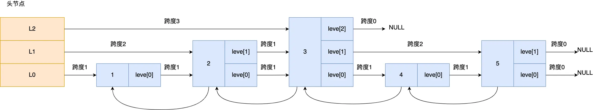
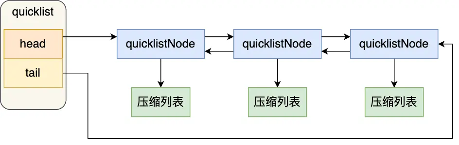
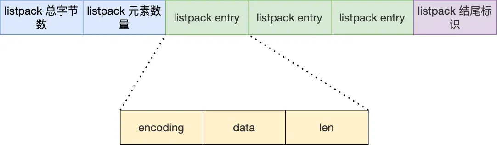

    这是“Redis”系列的第六篇文章，主要介绍的是Redis的“数据结构”。

# 一、Redis
<code>Redis（Remote Dictionary Server）</code>是一个开源的内存数据库，遵守 BSD 协议，它提供了一个高性能的键值（key-value）存储系统，常用于缓存、消息队列、会话存储等应用场景。

<!-- more -->

# 二、数据结构
> 注意：Redis 数据结构并不是指 String（字符串）对象、List（列表）对象、Hash（哈希）对象、Set（集合）对象和 Zset（有序集合）对象，因为这些是 Redis 键值对中值的数据类型，也就是数据的保存形式，这些对象的底层实现的方式就用到了数据结构。

Redis 数据类型（也叫 Redis 对象）和底层数据结构的对应关图，左边是 Redis 3.0版本的，也就是《Redis 设计与实现》这本书讲解的版本，现在看还是有点过时了，右边是现在 Github 最新的 Redis 代码的（还未发布正式版本）。

把新旧版本的数据结构说图解一遍，共有 9 种数据结构：<font color=red>**SDS、双向链表、压缩列表、哈希表、跳表、整数集合、quicklist、listpack**</font>。

## 2.1、键值对的实现
Redis 保存键值对所涉及到的数据结构如下图：

- <code>dictEntry</code> 结构，表示哈希表节点的结构，结构里存放了 <code>void * key</code> 和 <code>void * value</code> 指针， key 指向的是 String 对象，而 value 则可以指向 String 对象，也可以指向集合类型的对象，比如 List 对象、Hash 对象、Set 对象和 Zset 对象。
  - <code>void * key</code> 和 <code>void * value</code> 指针指向的是 Redis 对象，Redis 中的每个对象都由 redisObject 结构表示


## 2.2、SDS
字符串在 Redis 中是很常用的，键值对中的键是字符串类型，值有时也是字符串类型。

Redis 是用 C 语言实现的，但是它没有直接使用 C 语言的 char* 字符数组来实现字符串，而是自己封装了一个名为**简单动态字符串（simple dynamic string，SDS）** 的数据结构来表示字符串，也就是 Redis 的 String 数据类型的底层数据结构是 SDS。

### 2.2.1、C 语言字符串的缺陷
C 语言的字符串其实就是一个字符数组，即数组中每个元素是字符串中的一个字符。

比如，下图就是字符串“xiaolin”的 char* 字符数组的结构：

在 C 语言里，对字符串操作时，char * 指针只是指向字符数组的起始位置，而字符数组的**结尾位置就用“\0”表示**，意思是指字符串的结束。

因此，C 语言标准库中的字符串操作函数就通过判断字符是不是 “\0” 来决定要不要停止操作，如果当前字符不是 “\0” ，说明字符串还没结束，可以继续操作，如果当前字符是 “\0” 是则说明字符串结束了，就要停止操作。

举个例子，C 语言获取字符串长度的函数 strlen，就是通过字符数组中的每一个字符，并进行计数，等遇到字符为 “\0” 后，就会停止遍历，然后返回已经统计到的字符个数，即为字符串长度。下图显示了 strlen 函数的执行流程：

C 语言获取字符串长度的时间复杂度是 O（N）（<font color=red>**这是一个可以改进的地方**</font>）。

C 语言字符串用 “\0” 字符作为结尾标记有个缺陷。假设有个字符串中有个 “\0” 字符，这时在操作这个字符串时就会提早结束，比如 “xiao\0lin” 字符串，计算字符串长度的时候则会是 4

因此，除了字符串的末尾之外，字符串里面不能含有 “\0” 字符，否则最先被程序读入的 “\0” 字符将被误认为是字符串结尾，这个限制使得 C 语言的字符串只能保存文本数据，不能保存像图片、音频、视频文化这样的二进制数据（<font color=red>**这是一个可以改进的地方**</font>）。

另外， C 语言标准库中字符串的操作函数是很不安全的，对程序员很不友好，稍微一不注意，就会导致缓冲区溢出。

举个例子，strcat 函数是可以将两个字符串拼接在一起。

//将 src 字符串拼接到 dest 字符串后面
```cpp
char *strcat(char *dest, const char* src);
```
C 语言的字符串是不会记录自身的缓冲区大小的，所以 strcat 函数假定程序员在执行这个函数时，已经为 dest 分配了足够多的内存，可以容纳 src 字符串中的所有内容，而一旦这个假定不成立，就会发生缓冲区溢出将可能会造成程序运行终止，（<font color=red>**这是一个可以改进的地方**</font>）。

通过以上的分析，我们可以得知 C 语言的字符串不足之处以及可以改进的地方：
- 获取字符串长度的时间复杂度为 O（N）；
- 字符串的结尾是以 “\0” 字符标识，字符串里面不能包含有 “\0” 字符，因此不能保存二进制数据；
- 字符串操作函数不高效且不安全，比如有缓冲区溢出的风险，有可能会造成程序运行终止；

Redis 实现的 SDS 的结构就把上面这些问题解决了，接下来我们一起看看 Redis 是如何解决的。

### 2.2.2、SDS 结构设计

结构中的每个成员变量分别介绍下：
- **len**，记录了字符串长度。这样获取字符串长度的时候，只需要返回这个成员变量值就行，时间复杂度只需要 O（1）。
- **alloc**，分配给字符数组的空间长度。这样在修改字符串的时候，可以通过 alloc - len 计算出剩余的空间大小，可以用来判断空间是否满足修改需求，如果不满足的话，就会自动将 SDS 的空间扩展至执行修改所需的大小，然后才执行实际的修改操作，所以使用 SDS 既不需要手动修改 SDS 的空间大小，也不会出现前面所说的缓冲区溢出的问题。
- **flags**，用来表示不同类型的 SDS。一共设计了 5 种类型，分别是 sdshdr5、sdshdr8、sdshdr16、sdshdr32 和 sdshdr64，后面在说明区别之处。
- **buf[]**，字符数组，用来保存实际数据。不仅可以保存字符串，也可以保存二进制数据。

总的来说，Redis 的 SDS 结构在原本字符数组之上，增加了三个元数据：len、alloc、flags，用来解决 C 语言字符串的缺陷。

#### 2.2.2.1、O（1）复杂度获取字符串长度
Redis 的 SDS 结构因为加入了 len 成员变量，那么获取字符串长度的时候，直接返回这个成员变量的值就行，所以复杂度只有 O（1）。


#### 2.2.2.2、二进制安全
因为 SDS 不需要用 “\0” 字符来标识字符串结尾了，而是有个专门的 len 成员变量来记录长度，所以可存储包含 “\0” 的数据。但是 SDS 为了兼容部分 C 语言标准库的函数， SDS 字符串结尾还是会加上 “\0” 字符。

因此， SDS 的 API 都是以处理二进制的方式来处理 SDS 存放在 buf[] 里的数据，程序不会对其中的数据做任何限制，数据写入的时候时什么样的，它被读取时就是什么样的。

通过使用二进制安全的 SDS，而不是 C 字符串，使得 Redis 不仅可以保存文本数据，也可以保存任意格式的二进制数据。

#### 2.2.2.3、不会发生缓冲区溢出
edis 的 SDS 结构里引入了 alloc 和 len 成员变量，这样 SDS API 通过 alloc - len 计算，可以算出剩余可用的空间大小，这样在对字符串做修改操作的时候，就可以由程序内部判断缓冲区大小是否足够用。

而且，当判断出缓冲区大小不够用时，Redis 会自动将扩大 SDS 的空间大小，以满足修改所需的大小。

SDS 扩容的规则代码如下：
```cpp
hisds hi_sdsMakeRoomFor(hisds s, size_t addlen)
{
... ...
// s目前的剩余空间已足够，无需扩展，直接返回
if (avail >= addlen)
return s;
//获取目前s的长度
len = hi_sdslen(s);
sh = (char *)s - hi_sdsHdrSize(oldtype);
//扩展之后 s 至少需要的长度
newlen = (len + addlen);
//根据新长度，为s分配新空间所需要的大小
if (newlen < HI_SDS_MAX_PREALLOC)
//新长度<HI_SDS_MAX_PREALLOC 则分配所需空间*2的空间
newlen *= 2;
else
//否则，分配长度为目前长度+1MB
newlen += HI_SDS_MAX_PREALLOC;
...
}
```
- 如果所需的 sds 长度**小于 1 MB**，那么最后的扩容是按照翻倍扩容来执行的，即 2 倍的newlen
- 如果所需的 sds 长度**超过 1 MB**，那么最后的扩容长度应该是 newlen + 1MB。

<font color=red>**SDS（Simple Dynamic String）的最大长度取决于 Redis 的配置和实际的内存限制，但理论上 SDS 的最大长度可以达到 512MB。**</font>


## 2.3、链表
Redis 的链表实现主要涉及三个关键的数据结构：listNode、listIter 和 list。这些结构定义在 adlist.h 文件中。

### 2.3.1、源代码
listNode（链表节点）
```cpp
typedef struct listNode {
    struct listNode *prev;
    struct listNode *next;
    void *value;
} listNode;
```
- prev：指向前一个节点的指针，用于实现双向链表的特性，使得可以方便地从后向前遍历链表。
- next：指向后一个节点的指针，用于实现从前往后遍历链表。
- value：一个指向 void 类型的指针，它可以指向任意类型的数据，这使得链表可以存储不同类型的值。

list（链表）
```cpp
typedef struct list {
    listNode *head;
    listNode *tail;
    unsigned long len;
    void *(*dup)(void *ptr);
    void (*free)(void *ptr);
    int (*match)(void *ptr, void *key);
} list;
```
- head：指向链表的头节点。
- tail：指向链表的尾节点。
- len：记录链表中节点的数量，通过这个字段可以在  时间复杂度内获取链表的长度。
- dup：一个函数指针，用于复制链表节点的值，当需要复制链表时会调用这个函数。
- free：一个函数指针，用于释放链表节点的值，当删除节点时会调用这个函数来释放节点所占用的内存。
- match：一个函数指针，用于比较链表节点的值和给定的键是否匹配，在查找操作中会用到。

### 2.3.2、特性
- **双向链表：** 链表中的每个节点都有指向前一个节点和后一个节点的指针，这使得可以在  时间复杂度内进行前向和后向遍历。
- **无环：** 链表的头节点的 prev 指针和尾节点的 next 指针都指向 NULL，保证链表不会形成环。
- **带长度计数器：** 链表结构中维护了一个 len 字段，记录链表的长度，因此获取链表长度的操作时间复杂度为 。
- **多态：** 链表节点的值是一个 void * 类型的指针，可以存储任意类型的数据，并且可以通过 dup、free 和 match 函数指针来处理不同类型的值，具有很强的通用性。

## 2.4、压缩链表
压缩列表的最大特点，就是它被设计成一种内存紧凑型的数据结构，占用一块连续的内存空间，不仅可以利用 CPU 缓存，而且会针对不同长度的数据，进行相应编码，这种方法可以有效地节省内存开销。

但是，压缩列表的缺陷也是有的：
- 不能保存过多的元素，否则查询效率就会降低；
- 新增或修改某个元素时，压缩列表占用的内存空间需要重新分配，甚至可能引发连锁更新的问题。

因此，Redis 对象（List 对象、Hash 对象、Zset 对象）包含的元素数量较少，或者元素值不大的情况才会使用压缩列表作为底层数据结构。

### 2.4.1、结构设计
压缩列表是 Redis 为了节约内存而开发的，它是由连续内存块组成的顺序型数据结构，有点类似于数组。

压缩列表在表头有三个字段：
- **zlbytes**，记录整个压缩列表占用对内存字节数；
- **zltail**，记录压缩列表「尾部」节点距离起始地址由多少字节，也就是列表尾的偏移量；
- **zllen**，记录压缩列表包含的节点数量；
- **zlend**，标记压缩列表的结束点，固定值 0xFF（十进制255）。

在压缩列表中，如果我们要查找定位第一个元素和最后一个元素，可以通过表头三个字段（zllen）的长度直接定位，复杂度是 O(1)。而查找其他元素时，就没有这么高效了，只能逐个查找，此时的复杂度就是 O(N) 了，因此压缩列表不适合保存过多的元素。

另外，压缩列表节点（entry）的构成如下：

压缩列表节点包含三部分内容：
- **prevlen**，记录了「前一个节点」的长度，目的是为了实现从后向前遍历；
- **encoding**，记录了当前节点实际数据的「类型和长度」，类型主要有两种：字符串和整数。
- **data**，记录了当前节点的实际数据，类型和长度都由 encoding 决定；

### 2.4.2、存在的问题
压缩列表除了查找复杂度高的问题，还有一个问题【连锁更新】。

## 2.5、哈希表
哈希表是一种保存键值对（key-value）的数据结构。

### 2.5.1、结构设计
在 Redis 源码里，<code>t_hash.c</code> 文件主要用于实现 Redis 哈希（Hash）数据类型相关的命令和操作逻辑。下面为你详细介绍该文件涉及的关键内容：
```cpp
#include "server.h"
#include "dict.h"
```
Redis 里的<font color=red>**哈希数据类型借助字典（dict）数据结构**</font>来实现，<code>t_hash.c</code> 文件依赖于 <code>dict.h</code> 头文件所定义的字典结构。

#### 2.5.1.1、哈希命令实现
HSET 命令用于设置哈希表中指定字段的值。若字段不存在则创建，若存在则更新其值。
```cpp
void hsetCommand(client *c) {
    robj *o;
    if ((o = hashTypeLookupWriteOrCreate(c,c->argv[1])) == NULL) return;
    if (hashTypeSet(o,c->argv[2],c->argv[3])) {
        addReplyLongLong(c, 1);
        signalModifiedKey(c,c->db,c->argv[1]);
        notifyKeyspaceEvent(NOTIFY_HASH,"hset",c->argv[1],c->db->id);
    } else {
        addReplyLongLong(c, 0);
    }
    server.dirty++;
}
```
**hashTypeSet 函数**
此函数用于设置哈希对象中指定字段的值。
```cpp
int hashTypeSet(robj *o, robj *field, robj *value) {
    int update = 0;

    if (o->encoding == OBJ_ENCODING_ZIPLIST) {
        
        zl = o->ptr;
        fptr = ziplistIndex(zl, ZIPLIST_HEAD);
        .....
    } else if (o->encoding == OBJ_ENCODING_HT) {
        dictEntry *de = dictFind(o->ptr, field->ptr);
        if (de) {
            dictGetVal(de) = incrRefCount(value);
            update = 1;
        } else {
            dictAdd(o->ptr, field, value);
        }
    } else {
        redisPanic("Unknown hash encoding");
    }
    return!update;
}
```
通过源码分析，若使用哈希表（ht）编码，set时会通过<code>dictFind</code>方法去<code>dict</code>字典中查找到<code>dictEntry</code>。

### 2.5.2、哈希表
哈希表是一个数组（dictEntry **table），数组的每个元素是一个指向「哈希表节点（dictEntry）」的指针。


### 2.5.3、哈希冲突
哈希表实际上是一个数组，数组里多每一个元素就是一个哈希桶。
当一个键值对的键经过 Hash 函数计算后得到哈希值，再将(哈希值 % 哈希表大小)取模计算，得到的结果值就是该 key-value 对应的数组元素位置，也就是第几个哈希桶。

#### 2.5.3.1、冲突解决方案
Redis 采用了「<font color=red>**链地址法（拉链法）来处理哈希冲突**</font>」的方法来解决哈希冲突。

实现的方式就是每个哈希表节点都有一个 next 指针，用于指向下一个哈希表节点，因此多个哈希表节点可以用 next 指针构成一个单项链表，被分配到同一个哈希桶上的多个节点可以用这个单项链表连接起来，这样就解决了哈希冲突。

链式哈希局限性也很明显，随着链表长度的增加，在查询这一位置上的数据的耗时就会增加，毕竟链表的查询的时间复杂度是 O(n)。

要想解决这一问题，就需要进行 rehash，也就是对哈希表的大小进行扩展。

接下来，看看 Redis 是如何实现的 rehash 的。


### 2.5.4、rehash【重哈希】

Redis 定义一个 dict 结构体，这个结构体里定义了两个哈希表（ht[2]）。
```cpp
typedef struct dict {
    …
    //两个Hash表，交替使用，用于rehash操作
    dictht ht[2]; 
    …
} dict;
```
之所以定义了 2 个哈希表，是因为进行 rehash 的时候，需要用上 2 个哈希表了。

在正常服务请求阶段，插入的数据，都会写入到「哈希表 1」，此时的「哈希表 2 」 并没有被分配空间。

随着数据逐步增多，触发了 rehash 操作，这个过程分为三步：
- 给「哈希表 2」 分配空间，一般会比「哈希表 1」 大一倍（两倍的意思）；
- 将「哈希表 1 」的数据迁移到「哈希表 2」 中；
- 迁移完成后，「哈希表 1 」的空间会被释放，并把「哈希表 2」 设置为「哈希表 1」，然后在「哈希表 2」 新创建一个空白的哈希表，为下次 rehash 做准备。


其实第二步很有问题，如果「哈希表 1 」的数据量非常大，那么在迁移至「哈希表 2 」的时候，因为会涉及大量的数据拷贝，此时可能会对 Redis 造成阻塞，无法服务其他请求。


### 2.5.5、渐进式 rehash
为了避免 rehash 在数据迁移过程中，因拷贝数据的耗时，影响 Redis 性能的情况，所以 Redis 采用了渐进式 rehash，也就是将数据的迁移的工作不再是一次性迁移完成，而是分多次迁移。

渐进式 rehash 步骤如下：
- 给「哈希表 2」 分配空间；
- 在 rehash 进行期间，每次哈希表元素进行新增、删除、查找或者更新操作时，Redis 除了会执行对应的操作之外，还会顺序将「哈希表 1 」中索引位置上的所有 key-value 迁移到「哈希表 2」 上；
- 随着处理客户端发起的哈希表操作请求数量越多，最终在某个时间点会把「哈希表 1 」的所有 key-value 迁移到「哈希表 2」，从而完成 rehash 操作。

这样就巧妙地把一次性大量数据迁移工作的开销，分摊到了多次处理请求的过程中，避免了一次性 rehash 的耗时操作。


### 2.5.6、rehash 触发条件
rehash 的触发条件跟**负载因子（load factor）**有关系。

负载因子可以通过下面这个公式计算：
```
负载因子 = 哈希表已保存节点数量/哈希表大小
```

触发 rehash 操作的条件，主要有两个：
- 当负载因子大于等于 1 ，并且 Redis 没有在执行 bgsave 命令或者 bgrewiteaof 命令，也就是没有执行 RDB 快照或没有进行 AOF 重写的时候，就会进行 rehash 操作。
- 当负载因子大于等于 5 时，此时说明哈希冲突非常严重了，不管有没有有在执行 RDB 快照或 AOF 重写，都会强制进行 rehash 操作。

## 2.6、整数集合
整数集合是 Set 对象的底层实现之一。当一个 Set 对象只包含整数值元素，并且元素数量不大时，就会使用整数集这个数据结构作为底层实现。

### 2.6.1、整数集合结构设计
整数集合本质上是一块连续内存空间，它的结构定义如下：
```cpp
typedef struct intset {
  //编码方式
  uint32_t encoding;
  //集合包含的元素数量
  uint32_t length;
  //保存元素的数组
  int8_t contents[];
} intset;
```
可以看到，保存元素的容器是一个 contents 数组，虽然 contents 被声明为 int8_t 类型的数组，但是实际上 contents 数组并不保存任何 int8_t 类型的元素，contents 数组的真正类型取决于 intset 结构体里的 encoding 属性的值。比如：
- 如果 encoding 属性值为 INTSET_ENC_INT16，那么 contents 就是一个 int16_t 类型的数组，数组中每一个元素的类型都是 int16_t；
- 如果 encoding 属性值为 INTSET_ENC_INT32，那么 contents 就是一个 int32_t 类型的数组，数组中每一个元素的类型都是 int32_t；
- 如果 encoding 属性值为 INTSET_ENC_INT64，那么 contents 就是一个 int64_t 类型的数组，数组中每一个元素的类型都是 int64_t；

不同类型的 contents 数组，意味着数组的大小也会不同。

## 2.7、跳表【skipList】
Redis 只有 Zset 对象的底层实现用到了跳表，跳表的优势是能支持平均 O(logN) 复杂度的节点查找。

zset 结构体里有两个数据结构：一个是跳表，一个是哈希表。这样的好处是既能进行高效的范围查询，也能进行高效单点查询。
```cpp
typedef struct zset {
    dict *dict;
    zskiplist *zsl;
} zset;
```
Zset 对象在执行数据插入或是数据更新的过程中，会依次在跳表和哈希表中插入或更新相应的数据，从而保证了跳表和哈希表中记录的信息一致。

### 2.7.1、跳表结构设计
链表在查找元素的时候，因为需要逐一查找，所以查询效率非常低，时间复杂度是O(N)，于是就出现了跳表。跳表是在链表基础上改进过来的，实现了一种「多层」的有序链表，这样的好处是能快读定位数据。

下图展示了一个层级为 3 的跳表

图中头节点有 L0~L2 三个头指针，分别指向了不同层级的节点，然后每个层级的节点都通过指针连接起来：
- L0 层级共有 5 个节点，分别是节点1、2、3、4、5；
- L1 层级共有 3 个节点，分别是节点 2、3、5；
- L2 层级只有 1 个节点，也就是节点 3 。

如果我们要在链表中查找节点 4 这个元素，只能从头开始遍历链表，需要查找 4 次，而使用了跳表后，只需要查找 2 次就能定位到节点 4，因为可以在头节点直接从 L2 层级跳到节点 3，然后再往前遍历找到节点 4。

可以看到，这个查找过程就是在多个层级上跳来跳去，最后定位到元素。当数据量很大时，跳表的查找复杂度就是 O(logN)。

#### 2.7.1.1、跳表源码
**跳表：**
```cpp
typedef struct zskiplist {
    struct zskiplistNode *header, *tail;
    unsigned long length;
    int level;
} zskiplist;
```
跳表结构里包含了：
- 跳表的头尾节点，便于在O(1)时间复杂度内访问跳表的头节点和尾节点；
- 跳表的长度，便于在O(1)时间复杂度获取跳表节点的数量；
- 跳表的最大层数，便于在O(1)时间复杂度获取跳表中层高最大的那个节点的层数量；

**跳表节点：**
```cpp
typedef struct zskiplistNode {
    //Zset 对象的元素值
    sds ele;
    //元素权重值
    double score;
    //后向指针
    struct zskiplistNode *backward;
  
    //节点的level数组，保存每层上的前向指针和跨度
    struct zskiplistLevel {
        struct zskiplistNode *forward;
        unsigned long span;
    } level[];
} zskiplistNode;
```
- Zset 对象要同时保存「元素」和「元素的权重」，对应到跳表节点结构里就是 sds 类型的 ele 变量和 double 类型的 score 变量。
- 每个跳表节点都有一个后向指针（struct zskiplistNode *backward），指向前一个节点，目的是为了方便从跳表的尾节点开始访问节点，这样倒序查找时很方便。
- 跳表是一个带有层级关系的链表，而且每一层级可以包含多个节点，每一个节点通过指针连接起来，实现这一特性就是靠跳表节点结构体中的zskiplistLevel 结构体类型的 level 数组。
  - level 数组中的每一个元素代表跳表的一层，也就是由 zskiplistLevel 结构体表示，比如 leve[0] 就表示第一层，leve[1] 就表示第二层。zskiplistLevel 结构体里定义了「指向下一个跳表节点的指针」和「跨度」，跨度时用来记录两个节点之间的距离。
  - 
  - 跨度实际上是为了计算这个节点在跳表中的排位。

### 2.7.2、跳表查询过程
查找一个跳表节点的过程时，跳表会**从头节点的最高层开始**，逐一遍历每一层。在遍历某一层的跳表节点时，会用跳表节点中的 SDS 类型的元素和元素的权重来进行判断，共有两个判断条件：
- 如果当前节点的权重「小于」要查找的权重时，跳表就会访问该层上的下一个节点。
- 如果当前节点的权重「等于」要查找的权重时，并且当前节点的 SDS 类型数据「小于」要查找的数据时，跳表就会访问该层上的下一个节点。

### 2.7.3、为什么用跳表而不用平衡树？
这里插一个常见的面试题：为什么 Zset 的实现用跳表而不用平衡树（如 AVL树、红黑树等）？
对于这个问题 (opens new window)，Redis的作者 @antirez 是怎么说的：

> There are a few reasons:
> 
> * They are not very memory intensive. It's up to you basically. Changing parameters about the probability of a node to have a given number of levels will make then less memory intensive than btrees.
> 
> * A sorted set is often target of many ZRANGE or ZREVRANGE operations, that is, traversing the skip list as a linked list. With this operation the cache locality of skip lists is at least as good as with other kind of balanced trees.
> 
> * They are simpler to implement, debug, and so forth. For instance thanks to the skip list simplicity I received a patch (already in Redis master) with augmented skip lists implementing ZRANK in O(log(N)). It required little changes to the code.

简单翻译一下，主要是从内存占用、对范围查找的支持、实现难易程度这三方面总结的原因：
- 插入、删除、查找，和红黑树的时间复杂度一致
- 按照区间查找数据
  - 红黑树的效率低于跳表。跳表可以做到O(logn)定位区间的起点，然后在原始链表顺序往后遍历即可
- 代码实现比红黑树好懂、好写多了，因为简单就代表可读性好，不易出错
- 跳表更灵活，可通过改变索引构建策略，有效平衡执行效率和内存消耗


## 2.8、quicklist
在 Redis 3.0 之前，List 对象的底层数据结构是双向链表或者压缩列表。然后在 Redis 3.2 的时候，List 对象的底层改由 quicklist 数据结构实现。

其实 quicklist 就是「双向链表 + 压缩列表」组合，因为一个 quicklist 就是一个链表，而链表中的每个元素又是一个压缩列表。

在前面讲压缩列表的时候，我也提到了压缩列表的不足，虽然压缩列表是通过紧凑型的内存布局节省了内存开销，但是因为它的结构设计，如果保存的元素数量增加，或者元素变大了，压缩列表会有「连锁更新」的风险，一旦发生，会造成性能下降。

quicklist 解决办法，通过控制每个链表节点中的压缩列表的大小或者元素个数，来规避连锁更新的问题。因为压缩列表元素越少或越小，连锁更新带来的影响就越小，从而提供了更好的访问性能。

### 2.8.1、quicklist 结构设计
quicklist 的结构体跟链表的结构体类似，都包含了表头和表尾，区别在于 quicklist 的节点是 quicklistNode。
```cpp
typedef struct quicklist {
  //quicklist的链表头
  quicklistNode *head;      //quicklist的链表头
  //quicklist的链表尾
  quicklistNode *tail;
  //所有压缩列表中的总元素个数
  unsigned long count;
  //quicklistNodes的个数
  unsigned long len;       
  ...
} quicklist;
```
接下来看看，quicklistNode 的结构定义：
```cpp
typedef struct quicklistNode {
  //前一个quicklistNode
  struct quicklistNode *prev;     //前一个quicklistNode
  //下一个quicklistNode
  struct quicklistNode *next;     //后一个quicklistNode
  //quicklistNode指向的压缩列表
  unsigned char *zl;              
  //压缩列表的的字节大小
  unsigned int sz;                
  //压缩列表的元素个数
  unsigned int count : 16;        //ziplist中的元素个数
  ....
} quicklistNode;
```
quicklist 数据结构:


## 2.9、listpack
quicklist 虽然通过控制 quicklistNode 结构里的压缩列表的大小或者元素个数，来减少连锁更新带来的性能影响，但是并没有完全解决连锁更新的问题。

listpack 结构：

- listpack 头包含两个属性，分别记录了 listpack 总字节数和元素数量，然后 listpack 末尾也有个结尾标识。图中的 listpack entry 就是 listpack 的节点了。
- listpack entry主要包含三个方面内容：
  - encoding，定义该元素的编码类型，会对不同长度的整数和字符串进行编码；
  - data，实际存放的数据；
  - len，encoding+data的总长度；


参考文章：
[Redis 常见数据类型和应用场景](https://xiaolincoding.com/redis/data_struct/command.html#string)      
[Redis 数据结构](https://xiaolincoding.com/redis/data_struct/data_struct.html)      
[Redis Stream 数据结构实现原理真的很强](https://www.51cto.com/article/766539.html)      
[Redis源码解析：一条Redis命令是如何执行的？](https://cloud.tencent.com/developer/article/2427055)