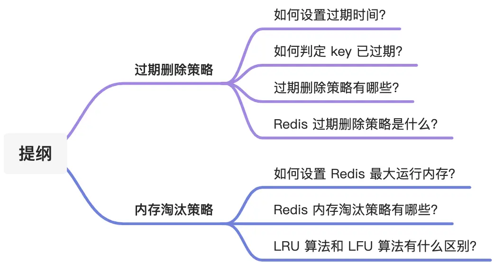
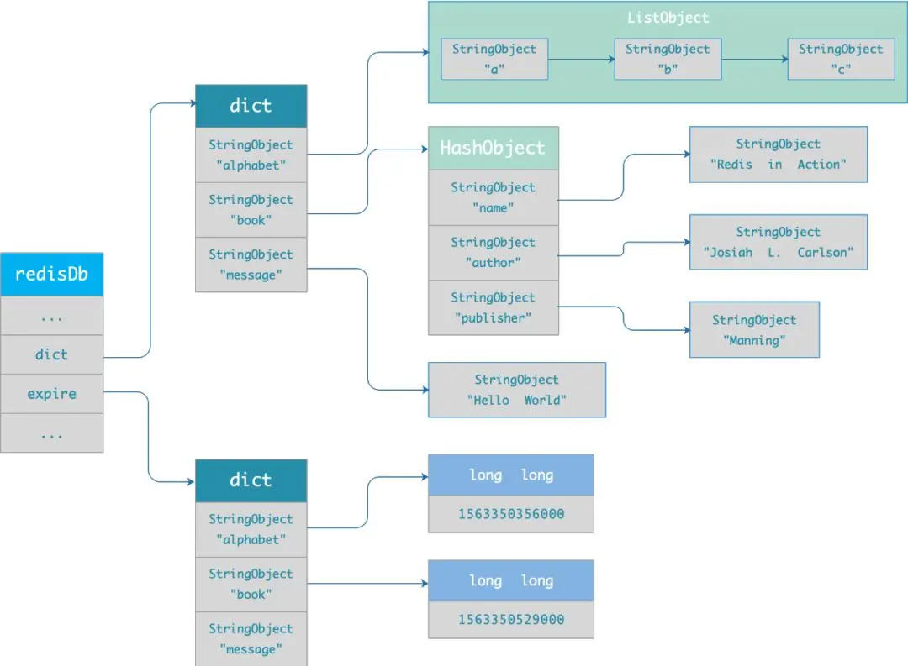

    这是“Redis”系列的第七篇文章，主要介绍的是Redis的“数据淘汰”。

# 一、Redis
<code>Redis（Remote Dictionary Server）</code>是一个开源的内存数据库，遵守 BSD 协议，它提供了一个高性能的键值（key-value）存储系统，常用于缓存、消息队列、会话存储等应用场景。

<!-- more -->

今天就跟大家理一理，「内存淘汰策略」和「过期删除策略」，这两个机制虽然都是做删除的操作，但是触发的条件和使用的策略都是不同的。


# 二、过期删除策略
Redis 是可以对 key 设置过期时间的，因此需要有相应的机制**将<font color=red>已过期</font>的键值对删除**，而做这个工作的就是**过期键值删除策略**。

## 2.1、如何设置过期时间？
先说一下对 key 设置过期时间的命令。 设置 key 过期时间的命令一共有 4 个：
- <code>**expire key n**</code>：设置 key 在 n 秒后过期，比如 <code>expire key 100</code> 表示设置 key 在 100 秒后过期；
- <code>**pexpire key n**</code>：设置 key 在 n 毫秒后过期，比如 <code>pexpire key2 100000</code> 表示设置 key2 在 100000 毫秒（100 秒）后过期。
- <code>**expireat key n**</code>：设置 key 在某个时间戳（精确到秒）之后过期，比如 <code>expireat key3 1655654400</code> 表示 key3 在时间戳 1655654400 后过期（精确到秒）；
- <code>**pexpireat key n**</code>：设置 key 在某个时间戳（精确到毫秒）之后过期，比如 <code>pexpireat key4 1655654400000</code> 表示 key4 在时间戳 1655654400000 后过期（精确到毫秒）

当然，在设置字符串时，也可以同时对 key 设置过期时间，共有 3 种命令：
- <code>**set key value  ex  n**</code>：设置键值对的时候，同时指定过期时间（精确到秒）；
- <code>**set key value  px  n**</code>：设置键值对的时候，同时指定过期时间（精确到毫秒）；
- <code>**setex key n valule**</code>：设置键值对的时候，同时指定过期时间（精确到秒）。

## 2.2、如何判定 key 已过期了？
每当我们对一个 key 设置了过期时间时，Redis 会把该 key 带上过期时间存储到一个过期字典（expires dict）中，也就是说「过期字典」保存了数据库中所有 key 的过期时间。

过期字典存储在 redisDb 结构中，如下：
```cpp
typedef struct redisDb {
    dict *dict;    /* 数据库键空间，存放着所有的键值对 */
    dict *expires; /* 键的过期时间 */
    ....
} redisDb;
```
过期字典数据结构结构如下：
- 过期字典的 key 是一个指针，指向某个键对象；
- 过期字典的 value 是一个 long long 类型的整数，这个整数保存了 key 的过期时间；

过期字典的数据结构如下图所示：

字典实际上是哈希表，哈希表的最大好处就是让我们可以用 O(1) 的时间复杂度来快速查找。当我们查询一个 key 时，Redis 首先检查该 key 是否存在于过期字典中：
- 如果不在，则正常读取键值；
- 如果存在，则会获取该 key 的过期时间，然后与当前系统时间进行比对，如果比系统时间大，那就没有过期，否则判定该 key 已过期。

过期键判断流程如下图所示：

以最简单的 get 命令为例：
在<code>t_string.c</code>文件中对应的实现函数是 getCommand，其调用了 getGenericCommand 函数：
```cpp
void getCommand(client *c) {
    getGenericCommand(c);
}

int getGenericCommand(client *c) {
    robj *o;

    if ((o = lookupKeyReadOrReply(c,c->argv[1],shared.null[c->resp])) == NULL)
        return C_OK;

    if (checkType(c,o,OBJ_STRING)) {
        return C_ERR;
    }

    addReplyBulk(c,o);
    return C_OK;
}
```
在<code>db.c</code>文件中，执行<code>lookupKeyReadOrReply</code>函数：
```cpp
/*
 * 为执行读取操作而从数据库中查找返回 key 的值。
 *
 * 如果 key 存在，那么返回 key 的值对象。
 *
 * 如果 key 不存在，那么向客户端发送 reply 参数中的信息，并返回 NULL 。
 */
robj *lookupKeyReadOrReply(redisClient *c, robj *key, robj *reply) {

    // 查找
    robj *o = lookupKeyRead(c->db, key);

    // 决定是否发送信息
    if (!o) addReply(c,reply);

    return o;
}
/*
 * 为执行读取操作而取出键 key 在数据库 db 中的值。
 *
 * 并根据是否成功找到值，更新服务器的命中/不命中信息。
 *
 * 找到时返回值对象，没找到返回 NULL 。
 */
robj *lookupKeyRead(redisDb *db, robj *key) {
    robj *val;

    // 检查 key 释放已经过期
    expireIfNeeded(db,key);

    // 从数据库中取出键的值
    val = lookupKey(db,key);

    // 更新命中/不命中信息
    if (val == NULL)
        server.stat_keyspace_misses++;
    else
        server.stat_keyspace_hits++;

    // 返回值
    return val;
}
```

## 2.3、过期删除策略
在说 Redis 过期删除策略之前，先跟大家介绍下，常见的三种过期删除策略：
- 定时删除：过期时间一到，就将数据删除。
消耗性能
消耗CPU资源
- 定期删除：每隔一段时间，就去扫描key，清除部分数据。
数据没法全部清除
- 惰性删除：当通过key去取数据时，再去判断是否过期，过期清除
会出现太多的数据没有清除，导致OOM。

Redis 选择「<font color=red>**惰性删除+定期删除**</font>」这两种策略配和使用，以求在合理使用 CPU 时间和避免内存浪费之间取得平衡。

### 2.3.1、惰性删除的实现
Redis 的惰性删除策略由 <code>db.c</code> 文件中的 <code>expireIfNeeded</code> 函数实现，代码如下：
```cpp
int expireIfNeeded(redisDb *db, robj *key) {
    // 判断 key 是否过期
    if (!keyIsExpired(db,key)) return 0;
    ....
    /* 删除过期键 */
    ....
    // 如果 server.lazyfree_lazy_expire 为 1 表示异步删除，反之同步删除；
    return server.lazyfree_lazy_expire ? dbAsyncDelete(db,key) :
    dbSyncDelete(db,key);
}
```
Redis 在访问或者修改 key 之前，都会调用 <code>expireIfNeeded</code> 函数对其进行检查，检查 key 是否过期：
- 如果过期，则删除该 key，至于选择异步删除，还是选择同步删除，根据 <code>lazyfree_lazy_expire</code> 参数配置决定（Redis 4.0版本开始提供参数），然后返回 null 客户端；
- 如果没有过期，不做任何处理，然后返回正常的键值对给客户端；

### 2.3.2、定期删除的实现

#### 1、检查间隔时间
在 Redis 中，默认每秒进行 10 次过期检查一次数据库，此配置可通过 Redis 的配置文件 redis.conf 进行配置，配置键为 hz 它的默认值是 hz 10。

特别强调下，每次检查数据库并不是遍历过期字典中的所有 key，而是从数据库中随机抽取一定数量的 key 进行过期检查。

#### 2、随机抽取数量
定期删除的实现在 <code>expire.c</code> 文件下的 <code>activeExpireCycle</code> 函数中，其中随机抽查的数量由 <code>ACTIVE_EXPIRE_CYCLE_LOOKUPS_PER_LOOP</code> 定义的，它是写死在代码中的，数值是 20。

也就是说，数据库每轮抽查时，会随机选择 20 个 key 判断是否过期。

接下来，详细说说 Redis 的定期删除的流程：
1. 从过期字典中随机抽取 20 个 key；
2. 检查这 20 个 key 是否过期，并删除已过期的 key；
3. 如果本轮检查的已过期 key 的数量，超过 5 个（20/4），也就是「已过期 key 的数量」占比「随机抽取 key 的数量」大于 25%，则继续重复步骤 1；如果已过期的 key 比例小于 25%，则停止继续删除过期 key，然后等待下一轮再检查。

#### 3、定期删除的执行
定期删除过期数据是由**serverCron 线程**来执行。

**serverCron 线程**是 Redis 服务器的一个定时任务线程，它会周期性地执行一系列维护操作，其中就包括定期删除过期数据。这个线程在 Redis 服务器启动时就会被创建并开始运行，以确保服务器能够正常运转和数据的有效管理。

**执行周期**
Redis 的配置文件中通过hz参数来控制 serverCron 线程的执行频率，默认情况下hz的值为 10，意味着 serverCron 线程每秒会执行 10 次。不过，用户可以根据实际需求在配置文件中修改hz的值来调整执行频率。例如，将hz设置为 20，则 serverCron 线程每秒会执行 20 次。

源码在<code>redis.c</code>文件内，感兴趣的可详细查看。

# 三、内存淘汰策略
前面说的过期删除策略，是删除已过期的 key，而**<font color=green>当 Redis 的运行内存已经超过 Redis 设置的最大内存之后</font>，则会使用<font color=red>内存淘汰策略</font>删除符合条件的 key，以此来保障 Redis 高效的运行**。

## 3.1、如何设置运行内存
在配置文件 redis.conf 中，可以通过参数 <code>maxmemory <bytes> </code>来设定最大运行内存，只有在 Redis 的运行内存达到了我们设置的最大运行内存，才会触发内存淘汰策略。

## 3.2、六大内存淘汰策略

### 3.2.1、no-eviction
no-eviction（Redis3.0之后，**默认的内存淘汰策略**） ：
它表示当运行内存超过最大设置内存时，不淘汰任何数据，这时如果有新的数据写入，会报错通知禁止写入，不淘汰任何数据，但是如果没用数据写入的话，只是单纯的查询或者删除操作的话，还是可以正常工作。

### 3.2.2、volatile-lru（least recently used）
从<font color=red>已设置过期时间</font>的数据集<code>（server.db[i].expires）</code>中挑选**<font color=green>最近最少使用</font>**的数据淘汰

### 3.2.3、volatile-ttl
从<font color=red>已设置过期时间</font>的数据集<code>（server.db[i].expires）</code>中挑选**<font color=green>将要过期</font>**的数据淘汰

### 3.2.4、volatile-random
从<font color=red>已设置过期时间</font>的数据集<code>（server.db[i].expires）</code>中**<font color=green>任意选择</font>**数据淘汰

### 3.2.5、allkeys-lru
当<font color=red>内存不足</font>以容纳新写入数据时，在键空间（所有数据范围内）中，移除**<font color=green>最近最少使用</font>**的 key（这个是最常用的）

### 3.2.6、allkeys-random
从数据集（所有数据范围内）<code>（server.db[i].dict）</code>中**<font color=green>任意选择</font>**数据淘汰

## 3.3、查看策略
可以使用 config get maxmemory-policy 命令，来查看当前 Redis 的内存淘汰策略，命令如下：
```cpp
127.0.0.1:6379> config get maxmemory-policy
1) "maxmemory-policy"
2) "noeviction"
```
可以看出，当前 Redis 使用的是 noeviction 类型的内存淘汰策略，它是 Redis 3.0 之后默认使用的内存淘汰策略，表示当运行内存超过最大设置内存时，不淘汰任何数据，但新增操作会报错。


# 四、常见的缓存读写策略

## 4.1、旁路缓存模式（cache Aside pattern）
是日常比较常用的方式，适合读请求比较多的场景

### 4.1.1、实现
需要同时维系DB和cache，并且以DB的数据为准
- 写步骤
先更新DB，然后直接删除cache
- 读步骤
从cache中读取数据，读取到就直接返回
cache读取不到的话，就从DB中读取数据返回
再把数据放到cache中

### 4.1.2、三种场景
- 先删缓存，再更新DB
线程A删除时（耗时较长），此时线程B去缓存读取数据，存在脏缓存问题
- 先更新DB，再删除缓存
也存在脏缓存的问题，但是概览会小很多，因为缓存写入的时间比写DB的时间小很多
- 延迟双删
更新数据库前后分别进行一次缓存删除操作，并且在第一次删除缓存后，等待一段时间（即延迟）再进行第二次删除，以此确保在这段延迟时间内，可能出现的旧数据写回缓存的操作都已完成，第二次删除可以将这些旧数据缓存清理掉，保证缓存与数据库数据的最终一致性

### 4.1.3、缺陷
- 首次请求数据一定不在缓存问题
热点数据，容易造成缓存击穿，需要将数据提前缓存进缓存
- 写操作频繁的话容易导致数据更新频繁，导致缓存命中率降低

## 4.2、读写穿透（read/write  through pattern）
服务端把cache视为主要数据存储，从中读取数据并将数据写入其中。cache服务负责将次数据读取和写入db，从而减轻了应用程序的职责。

平常开发过程非常少见，抛弃性能方面的影响，大概率是日常经常使用的redis不支持直接操作DB的功能

- 写步骤
先查cache，cache中不存在，直接更新DB。 cache中存在，则先更新cache，然后cache服务自己更新DB

### 4.2.2、缺陷
可以理解成是旁路缓存模式的封装，也存在热点数据的问题。

<font color=red>**同步更新cache 和DB**</font>

## 4.3、异步缓存写入（write behind pattern）
只更新cache，不直接更新DB，而是改为异步批量的方式来更新DB。

很明显，这种方式对数据一致性带来了更大的挑战，比如 cache 数据可能还没异步更新 db 的话，cache 服务可能就就挂掉了。这种策略在我们平时开发过程中也非常非常少见（也不是如此，在阿里很多场景都是使用这种方式），但是不代表它的应用场景少，比如消息队列中消息的异步写入磁盘、MySQL 的 Innodb Buffer Pool 机制都用到了这种策略。Write Behind Pattern 下 db 的写性能非常高，非常适合一些数据经常变化又对数据一致性要求没那么高的场景，比如浏览量、点赞量。


参考文章：
[Redis 常见数据类型和应用场景](https://xiaolincoding.com/redis/data_struct/command.html#string)      
[Redis 数据结构](https://xiaolincoding.com/redis/data_struct/data_struct.html)      
[Redis Stream 数据结构实现原理真的很强](https://www.51cto.com/article/766539.html)      
[Redis源码解析：一条Redis命令是如何执行的？](https://cloud.tencent.com/developer/article/2427055)