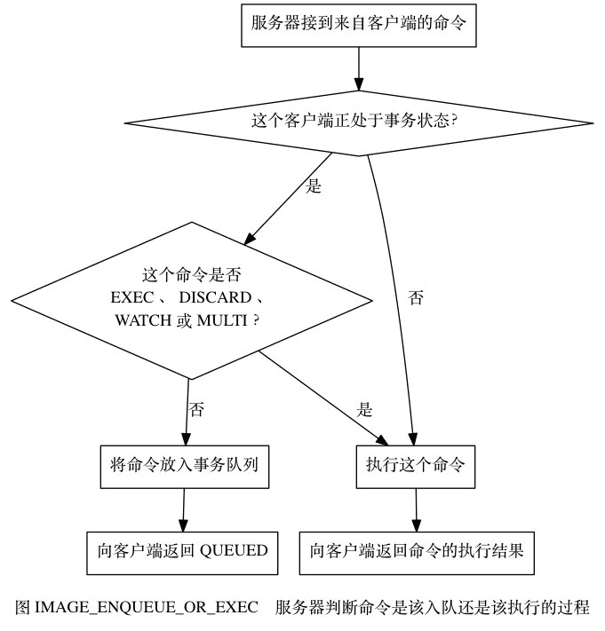

    这是“Redis”系列的第八篇文章，主要介绍的是Redis的“事务”。

# 一、Redis
<code>Redis（Remote Dictionary Server）</code>是一个开源的内存数据库，遵守 BSD 协议，它提供了一个高性能的键值（key-value）存储系统，常用于缓存、消息队列、会话存储等应用场景。

<!-- more -->


# 二、redis事务
Redis 事务的本质是一组命令的集合。事务支持一次执行多个命令，一个事务中所有命令都会被序列化。在事务执行过程，会按照顺序串行化执行队列中的命令，其他客户端提交的命令请求不会插入到事务执行命令序列中。

总结说：redis事务就是一次性、顺序性、排他性的执行一个队列中的一系列命令。#

## 2.1、Redis事务相关命令和使用
事务相关命令
- 事务开启：multi
- 事务关闭：discard
- 事务提交：exec
- key监控：watch

## 2.2、标准的事务执行
给k1、k2分别赋值，在事务中修改k1、k2，执行事务后，查看k1、k2值都被修改。
```
127.0.0.1:6379> set k1 v1
OK
127.0.0.1:6379> set k2 v2
OK
127.0.0.1:6379> MULTI
OK
127.0.0.1:6379> set k1 11
QUEUED
127.0.0.1:6379> set k2 22
QUEUED
127.0.0.1:6379> EXEC
1) OK
2) OK
127.0.0.1:6379> get k1
"11"
127.0.0.1:6379> get k2
"22"
127.0.0.1:6379>
```

## 2.3、事务取消
```
127.0.0.1:6379> MULTI
OK
127.0.0.1:6379> set k1 33
QUEUED
127.0.0.1:6379> set k2 34
QUEUED
127.0.0.1:6379> DISCARD
OK
```

## 2.4、事务出现错误的处理

### 2.4.1、语法错误（编译器错误）
在开启事务后，修改k1值为11，k2值为22，但k2语法错误，最终导致事务提交失败，k1、k2保留原值。
```
127.0.0.1:6379> set k1 v1
OK
127.0.0.1:6379> set k2 v2
OK
127.0.0.1:6379> MULTI
OK
127.0.0.1:6379> set k1 11
QUEUED
127.0.0.1:6379> sets k2 22
(error) ERR unknown command `sets`, with args beginning with: `k2`, `22`, 
127.0.0.1:6379> exec
(error) EXECABORT Transaction discarded because of previous errors.
127.0.0.1:6379> get k1
"v1"
127.0.0.1:6379> get k2
"v2"
```

### 2.4.2、Redis类型错误（运行时错误）
在开启事务后，修改k1值为11，k2值为22，但将k2的类型作为List，在运行时检测类型错误，最终导致事务提交失败，此时事务并没有回滚，而是跳过错误命令继续执行， **结果k1值改变、k2保留原值**。
```
127.0.0.1:6379> set k1 v1
OK
127.0.0.1:6379> set k1 v2
OK
127.0.0.1:6379> MULTI
OK
127.0.0.1:6379> set k1 11
QUEUED
127.0.0.1:6379> lpush k2 22
QUEUED
127.0.0.1:6379> EXEC
1) OK
2) (error) WRONGTYPE Operation against a key holding the wrong kind of value
127.0.0.1:6379> get k1
"11"
127.0.0.1:6379> get k2
"v2"
```

### 2.4.3、错误处理总结
- **编译类型错误**：事务提交失败，
- **运行时错误**：事务不会回滚，正确的语句会成功执行。

## 2.5、带watch的事务【可实现类似CAS功能】
WATCH 命令用于在事务开始之前监视任意数量的键，如下代码：监听了name键
```
redis> WATCH name
OK
redis> MULTI
OK
redis> SET name peter
QUEUED
redis> EXEC
(nil)
```
当调用 EXEC 命令执行事务时， 如果任意一个被监视的键已经被其他客户端修改了， 那么整个事务不再执行， 直接返回失败

### 2.5.1、watch原理
每个代表数据库的 <code>redis.h/redisDb</code> 结构类型中， 都保存了一个 <code>watched_keys</code> 字典， 字典的键是这个数据库被监视的键， 而字典的值则是一个链表， 链表中保存了所有监视这个键的客户端。
```cpp
typedef struct redisDb {
    // 数据库键空间，保存着数据库中的所有键值对
    dict *dict;                 /* The keyspace for this DB */
    // 键的过期时间，字典的键为键，字典的值为过期事件 UNIX 时间戳
    dict *expires;              /* Timeout of keys with a timeout set */
    // 正处于阻塞状态的键
    dict *blocking_keys;        /* Keys with clients waiting for data (BLPOP) */
    // 可以解除阻塞的键
    dict *ready_keys;           /* Blocked keys that received a PUSH */
    // 正在被 WATCH 命令监视的键
    dict *watched_keys; 
}
```

# 三、Redis事务原理
事务的三个阶段
1. 开启事务
当客户端发送 MULTI 命令时，Redis 服务端会将客户端的状态从非事务状态切换到事务状态。在客户端状态中会维护一个事务队列，用于存储事务期间客户端发送的所有命令。
2. 命令入队
服务端判断客户端的状态
将命令放入都事务队列内
向客户端返回QUEUED，表示入列成功
3. 执行事务




## 3.1、开启事务
Redis 服务端会将客户端的状态从非事务状态切换到事务状态。具体是怎么做的呢？
```cpp
struct redisServer {
    // 数据库
    redisDb *db;
    // 服务端的列表
    list *clients;  
}

typedef struct redisClient {
    // 套接字描述符
    int fd;
    // 当前正在使用的数据库
    redisDb *db;
    // 事务状态
    multiState mstate;
    // 客户端状态标志
    int flags;  /* REDIS_SLAVE | REDIS_MONITOR | REDIS_MULTI ... */
}
```
- **mstate**：类型为 multiState，用于存储事务的具体状态信息，包括事务队列、已执行命令数量等。
- **flags**：客户端标志位，通过特定的标志来表示客户端是否处于事务状态等信息。

```cpp
/*
 * 事务状态
 */
typedef struct multiState {
    // 事务队列，FIFO 顺序
    multiCmd *commands;     /* Array of MULTI commands */
    // 已入队命令计数
    int count;              /* Total number of MULTI commands */
    int minreplicas;        /* MINREPLICAS for synchronous replication */
    time_t minreplicas_timeout; /* MINREPLICAS timeout as unixtime. */
} multiState;
```
- **commands**：一个 multiCmd 类型的数组，用于存储事务队列中的命令。每个 multiCmd 结构体包含了命令的参数（argv）、参数数量（argc）以及对应的命令指针（cmd）。
- **count**：表示事务队列中命令的总数。
- **minreplicas** 和 **minreplicas_timeout**：用于同步复制相关的设置，这里暂不详细展开。

### 3.1.1、开启事务（MULTI 命令处理）
MULTI 命令的处理函数为 multiCommand，定义在 multi.c 文件中，关键代码如下：
```cpp
void multiCommand(client *c) {
    if (c->flags & CLIENT_MULTI) {
        addReplyError(c,"MULTI calls can not be nested");
        return;
    }
    c->flags |= CLIENT_MULTI;
    addReply(c,shared.ok);
}
```
首先检查客户端是否已经处于事务状态（通过 <code>c->flags & CLIENT_MULTI</code> 判断），如果是则返回错误信息。
若客户端未处于事务状态，将 <code>CLIENT_MULTI</code> 标志添加到 <code>c->flags</code> 中，表示客户端进入事务状态。
最后向客户端返回 OK 响应。

## 3.2、命令入队
在事务状态下，客户端发送的命令会被添加到事务队列中。当接收到命令时，Redis 会调用 queueMultiCommand 函数将命令入队，该函数定义在 multi.c 文件中，关键代码如下：
```cpp
void queueMultiCommand(client *c) {
    multiCmd *mc;
    int j;

    c->mstate.commands = zrealloc(c->mstate.commands,
            sizeof(multiCmd)*(c->mstate.count+1));
    mc = c->mstate.commands+c->mstate.count;
    mc->cmd = c->cmd;
    mc->argc = c->argc;
    mc->argv = zmalloc(sizeof(robj*)*c->argc);
    memcpy(mc->argv,c->argv,sizeof(robj*)*c->argc);
    for (j = 0; j < c->argc; j++)
        incrRefCount(mc->argv[j]);
    c->mstate.count++;
    addReply(c,shared.queued);
}
```
- 首先使用 <code>zrealloc</code> 函数为事务队列分配新的空间，以容纳新的命令。
- 然后将当前命令的信息（包括命令指针、参数数量和参数）复制到新的 multiCmd 结构体中。
- 增加参数对象的引用计数，防止对象被过早释放。
- 最后将事务队列的命令总数加 1，并向客户端返回 <code>QUEUED</code> 响应。

## 3.3、执行事务（EXEC 命令处理）
EXEC 命令的处理函数为 <code>execCommand</code>，定义在 multi.c 文件中，部分关键代码如下：
```cpp
void execCommand(client *c) {
    int j;
    robj **orig_argv;
    int orig_argc;
    struct redisCommand *orig_cmd;
    int must_propagate = 0; /* Need to propagate MULTI/EXEC to AOF / slaves? */
    int was_master = server.masterhost == NULL;

    if (!(c->flags & CLIENT_MULTI)) {
        addReplyError(c,"EXEC without MULTI");
        return;
    }

    /* Check if we need to abort the EXEC because:
     * 1) Some WATCHed key was touched.
     * 2) There was a previous error while queueing commands.
     * A failed EXEC in the first case returns a multi bulk nil object
     * (technically it is not an error but a special behavior), while
     * in the second an EXECABORT error is returned. */
    if (c->flags & (CLIENT_DIRTY_CAS|CLIENT_DIRTY_EXEC)) {
        addReply(c, c->flags & CLIENT_DIRTY_EXEC ? shared.execaborterr :
                                                  shared.nullmultibulk);
        discardTransaction(c);
        return;
    }

    /* Exec all the queued commands */
    unwatchAllKeys(c); /* Unwatch ASAP otherwise we'll waste CPU cycles */
    orig_argv = c->argv;
    orig_argc = c->argc;
    orig_cmd = c->cmd;
    addReplyMultiBulkLen(c,c->mstate.count);
    for (j = 0; j < c->mstate.count; j++) {
        c->argc = c->mstate.commands[j].argc;
        c->argv = c->mstate.commands[j].argv;
        c->cmd = c->mstate.commands[j].cmd;
        /* Propagate a MULTI request once we encounter the first write op. */
        if (!must_propagate && !(c->cmd->flags & REDIS_CMD_READONLY)) {
            execCommandPropagateMulti(c);
            must_propagate = 1;
        }
        call(c,REDIS_CALL_FULL);
        /* Commands may alter argc/argv, restore mstate. */
        c->mstate.commands[j].argc = c->argc;
        c->mstate.commands[j].argv = c->argv;
    }
    c->argv = orig_argv;
    c->argc = orig_argc;
    c->cmd = orig_cmd;
    freeClientMultiState(c);
    c->flags &= ~CLIENT_MULTI;
    c->flags &= ~(CLIENT_DIRTY_CAS|CLIENT_DIRTY_EXEC);
    if (must_propagate) server.dirty++;
}
```
- 首先检查客户端是否处于事务状态，如果不是则返回错误信息。
- 接着检查是否需要中止事务，例如被 <code>WATCH</code> 的键被修改或者之前入队命令时出现错误。
- 若可以执行事务，先调用 <code>unwatchAllKeys</code> 函数取消对所有键的监视。
- 然后依次执行事务队列中的命令，使用 <code>call</code> 函数调用具体的命令处理逻辑。
- 最后释放事务状态相关的资源，将客户端状态从事务状态切换回非事务状态。

## 3.4、放弃事务（DISCARD 命令处理）
DISCARD 命令的处理函数为 <code>discardCommand</code>，定义在 multi.c 文件中，代码如下：
```cpp
void discardCommand(client *c) {
    if (!(c->flags & CLIENT_MULTI)) {
        addReplyError(c,"DISCARD without MULTI");
        return;
    }
    discardTransaction(c);
    addReply(c,shared.ok);
}

void discardTransaction(client *c) {
    freeClientMultiState(c);
    c->flags &= ~CLIENT_MULTI;
    c->flags &= ~(CLIENT_DIRTY_CAS|CLIENT_DIRTY_EXEC);
    unwatchAllKeys(c);
}
```
- 首先检查客户端是否处于事务状态，如果不是则返回错误信息。
- 调用 <code>discardTransaction</code> 函数清空事务队列，释放相关资源，将客户端状态从事务状态切换回非事务状态，并取消对所有键的监视。
- 最后向客户端返回 OK 响应。

通过以上源码分析，可以了解 Redis 中事务状态的管理和事务操作的具体实现原理。


# 四、事务的原子性

## 4.1、为什么 Redis 不支持回滚？
> 如果你有使用关系式数据库的经验， 那么 “Redis 在事务失败时不进行回滚，而是继续执行余下的命令”这种做法可能会让你觉得有点奇怪。

以下是这种做法的优点：
- Redis 命令只会因为错误的语法而失败（并且这些问题不能在入队时发现），或是命令用在了错误类型的键上面：这也就是说，从实用性的角度来说，失败的命令是由编程错误造成的，而这些错误应该在开发的过程中被发现，而不应该出现在生产环境中。
- 因为不需要对回滚进行支持，所以 Redis 的内部可以保持简单且快速。

有种观点认为 Redis 处理事务的做法会产生 bug ， 然而需要注意的是， 在通常情况下， 回滚并不能解决编程错误带来的问题。 举个例子， 如果你本来想通过 INCR 命令将键的值加上 1 ， 却不小心加上了 2 ， 又或者对错误类型的键执行了 INCR ， 回滚是没有办法处理这些情况的。

## 4.2、如何理解Redis与事务的ACID？
> **原子性定义**：一个事务包含多个操作，这些操作要么全部执行，要么全都不执行

### 4.2.1、原子性atomicity
首先通过上文知道 运行期的错误是不会回滚的，很多文章由此说Redis事务违背原子性的；而官方文档认为是遵从原子性的。
Redis官方文档给的理解是，**Redis的事务是原子性的：所有的命令，要么全部执行，要么全部不执行。而不是完全成功。**

Redis 事务在一定程度上支持原子性，但与传统数据库有所不同。

### 4.2.2、一致性consistencyredis
事务可以保证命令失败的情况下得以回滚，数据能恢复到没有执行之前的样子，是保证一致性的，除非redis进程意外终结。

Redis 事务在执行过程中具有一定的一致性保障。由于 Redis 是单线程执行命令的，在执行事务期间，不会有其他客户端的命令插入执行过程，保证了事务内部命令执行的顺序性。

### 4.2.3、隔离性Isolationredis
**事务是严格遵守隔离性的**，原因是redis是单进程单线程模式(v6.0之前），可以保证命令执行过程中不会被其他客户端命令打断。但是，Redis不像其它结构化数据库有隔离级别这种设计。

### 4.2.4、持久性Durabilityredis
**事务是不保证持久性的**，这是因为redis持久化策略中不管是RDB还是AOF都是异步执行的，不保证持久性是出于对性能的考虑。

参考文章：
[Redis 常见数据类型和应用场景](https://xiaolincoding.com/redis/data_struct/command.html#string)      
[Redis 数据结构](https://xiaolincoding.com/redis/data_struct/data_struct.html)      
[Redis Stream 数据结构实现原理真的很强](https://www.51cto.com/article/766539.html)      
[Redis源码解析：一条Redis命令是如何执行的？](https://cloud.tencent.com/developer/article/2427055)