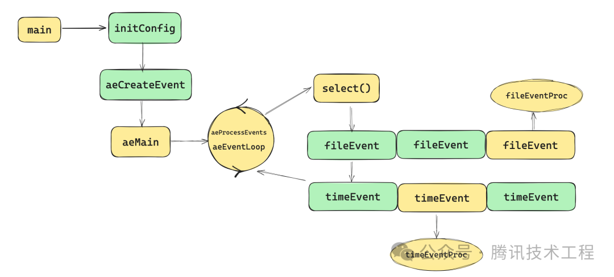
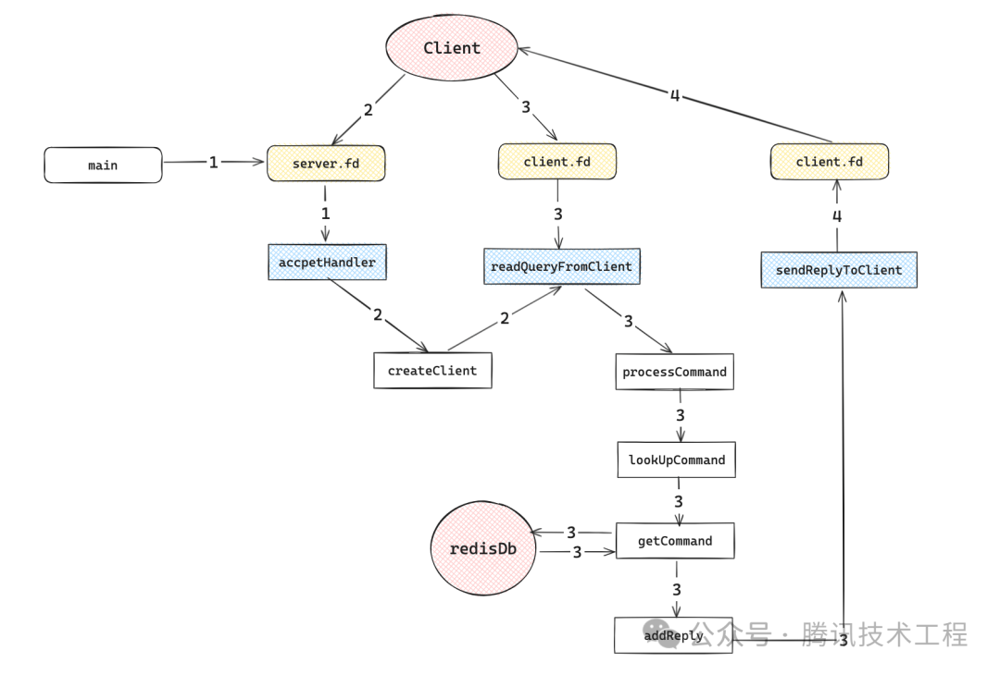

    这是“Redis”系列的第九篇文章，主要介绍的是Redis的“事件机制和线程模型”。

# 一、Redis
<code>Redis（Remote Dictionary Server）</code>是一个开源的内存数据库，遵守 BSD 协议，它提供了一个高性能的键值（key-value）存储系统，常用于缓存、消息队列、会话存储等应用场景。

<!-- more -->

# 二、Redis事件模型
Redis 的<font color=green>事件模型是其高性能和高并发处理能力的关键基础</font>，主要由**文件事件**和**时间事件**组成：
- **文件事件(file event)**：用于处理 Redis 服务器和客户端之间的网络IO。
- **时间事件(time eveat)**：Redis 服务器中的一些操作（比如serverCron函数）需要在给定的时间点执行，而时间事件就是处理这类定时操作的。

事件驱动库的代码主要是在<code>src/ae.c</code>中实现的，其示意图如下所示。

<code>aeEventloop</code>是redis事件模型基础数据，它主要包含文件事件和时间事件的两个链表。对于文件事件来说，包含文件句柄fd，事件类型mask，对应处理函数fileProc；对于时间事件来说包含id、执行时间（when_sec、when_ms）和对应执行函数timeProc 对应的源代码如下：


## 2.1、文件事件
Redis 基于网络套接字进行客户端连接和数据交互，文件事件就是对套接字操作的抽象。Redis 通过文件事件来监听套接字上的可读、可写等事件，以实现对客户端请求的响应和数据的传输。

> Redis基于Reactor模式开发了自己的网络事件处理器，也就是文件事件处理器。文件事件处理器使用IO多路复用技术（建议先看下 Java IO多路复用详解 ），同时监听多个套接字，并为套接字关联不同的事件处理函数。当套接字的可读或者可写事件触发时，就会调用相应的事件处理函数。

Redis 的文件事件的具体定义结构如下所示。
```cpp
/* File event structure */
typedef struct aeFileEvent {
    int fd; // 事件对应的文件句柄ID
    int mask; /* one of AE_(READABLE|WRITABLE|EXCEPTION) */
    aeFileProc *fileProc; // 文件事件回调函数
    aeEventFinalizerProc *finalizerProc; // 事件结束时执行的函数
    void *clientData; // 对应客户端的扩展数据
    struct aeFileEvent *next; // 下一个文件事件（链表存储）
} aeFileEvent;
```

### 2.1.1、线程模型
单线程事件循环
> 从 Redis 的 v1.0 到 v6.0 版本之前，Redis 的核心网络模型一直是一个典型的单 Reactor 模型：利用 epoll/select/kqueue 等多路复用技术，在单线程的事件循环中不断去处理事件（客户端请求），最后回写响应数据到客户端

### 2.1.2、为什么单线程的 Redis 能那么快？
Redis的瓶颈主要在IO而不是CPU，所以为了省开发量，在6.0版本前是单线程模型；其次，Redis 是单线程主要是指 Redis 的网络 IO 和键值对读写是由一个线程来完成的，这也是 Redis 对外提供键值存储服务的主要流程。（但 Redis 的其他功能，比如持久化、异步删除、集群数据同步等，其实是由额外的线程执行的）。

Redis 采用了多路复用机制使其在网络 IO 操作中能并发处理大量的客户端请求，实现高吞吐率。

### 2.1.3、Redis事件响应框架ae_event及文件事件处理器
Redis 使用的IO多路复用技术主要有：select、epoll、evport和kqueue等。每个IO多路复用函数库在 Redis 源码中都对应一个单独的文件，比如ae_select.c，ae_epoll.c， ae_kqueue.c等。

如下图所示，文件事件处理器有四个组成部分，它们分别是套接字、I/O多路复用程序、文件事件分派器以及事件处理器。

文件事件是对套接字操作的抽象，每当一个套接字准备好执行 <code>accept、read、write和 close</code> 等操作时，就会产生一个文件事件。因为 Redis 通常会连接多个套接字，所以多个文件事件有可能并发的出现。

## 2.2、时间事件
时间事件用于处理定时任务和周期性任务，比如定期执行内存数据的持久化、检查客户端连接的超时等。
Redis 的时间事件分为以下两类：
- 定时事件：让一段程序在指定的时间之后执行一次。
- 周期性事件：让一段程序每隔指定时间就执行一次。

Redis 的时间事件的具体定义结构如下所示。
```cpp
typedef struct aeTimeEvent {
    /* 全局唯一ID */
    long long id; /* time event identifier. */
    /* 秒精确的UNIX时间戳，记录时间事件到达的时间*/
    long when_sec; /* seconds */
    /* 毫秒精确的UNIX时间戳，记录时间事件到达的时间*/
    long when_ms; /* milliseconds */
    /* 时间处理器 */
    aeTimeProc *timeProc;
    /* 事件结束回调函数，析构一些资源*/
    aeEventFinalizerProc *finalizerProc;
    /* 私有数据 */
    void *clientData;
    /* 前驱节点 */
    struct aeTimeEvent *prev;
    /* 后继节点 */
    struct aeTimeEvent *next;
} aeTimeEvent;
```
一个时间事件是定时事件还是周期性事件取决于时间处理器的返回值：
- 如果返回值是 AE_NOMORE，那么这个事件是一个定时事件，该事件在达到后删除，之后不会再重复。
- 如果返回值是非 AE_NOMORE 的值，那么这个事件为周期性事件，当一个时间事件到达后，服务器会根据时间处理器的返回值，对时间事件的 when 属性进行更新，让这个事件在一段时间后再次达到。


服务器所有的时间事件都放在一个无序链表中，每当时间事件执行器运行时，它就遍历整个链表，查找所有已到达的时间事件，并调用相应的事件处理器。正常模式下的Redis服务器只使用serverCron一个时间事件，而在benchmark模式下，服务器也只使用两个时间事件，所以不影响事件执行的性能。#


## 2.3、aeEventLoop事件管理器源码分析
redisServer是存储redis服务端运行的结构体，在启动的时候就会初始化完成，结构如下，它主要包含跟监听的socket有关的参数port和fd；对应存储数据的redisDb列表；链接的客户端列表clients；事件循环<code>aeEventLoop *el</code>
```cpp
struct redisServer {
    int port;       // 服务端监听的端口
    int fd;         // 服务端起的socket对应的文件句柄
    redisDb *db;    // redis db的列表，一般实际生产环境只用一个
//  3-lines
    list *clients;  // 服务端的列表
// 2 lines
    aeEventLoop *el; // 事件循环
//  36 lines
};
```

<code>aeEventLoop</code>内部有aeFileEvent和aeTimeEvent
```cpp
typedef struct aeEventLoop {
    // 时间事件的最大ID
    long long timeEventNextId;
    // 已分配的文件事件数组大小
    int eventsSize;
    // 已分配的时间事件数组大小
    int timeEventSize;
    // 已使用的文件事件数量
    int fileEventCount;
    // 指向时间事件的指针数组
    aeTimeEvent **timeEventHead;
    // 文件事件数组，每个元素对应一个文件描述符的事件信息
    aeFileEvent *events;
    // 用于存储已就绪的文件事件的数组
    aeFiredEvent *fired;
    // 事件多路复用库的私有数据
    void *apidata;
    // 时间事件处理器函数
    int (*timeProc)(aeEventLoop *eventLoop, long long id, void *clientData);
    // 事件循环结束标志
    int stop;
    // 最后一次执行时间事件的时间
    long long lastTime;
} aeEventLoop;
```
- <code>timeEventHead</code>：是一个指向 aeTimeEvent 结构体的指针数组，用于存储所有的时间事件。数组中的每个元素都是一个时间事件节点的指针，通过这个数组可以方便地遍历和管理所有的时间事件
- <code>events</code>：文件事件数组，每个元素对应一个文件描述符的事件信息
- <code>fired</code>：用于存储已就绪的文件事件的数组

### 2.3.1、aeEventLoop的创建及启动
这部分涉及了redis的启动流程。

#### 2.3.1.1、主入口main()
从main函数看起，redis启动的main函数位于<code>redis.c</code>中，可以看到启动时，首先初始化了配置<code>initServerConfig()</code>，然后初始化了server端服务<code>initServer()</code>，接下来注册处理函数为<code>acceptHandler</code>的文件事件，然后启动了redis的主循环开始处理事件了。
```cpp
int main(int argc, char **argv) {
    initServerConfig(); // 初始化配置
// 8-lines 从文件中读取配置
    initServer(); // 初始化服务
    if (server.daemonize) daemonize(); // TODO
    redisLog(REDIS_NOTICE,"Server started, Redis version " REDIS_VERSION);
// 5-lines,内存检查，加载rdb
    if (aeCreateFileEvent(server.el, server.fd, AE_READABLE,
        acceptHandler, NULL, NULL) == AE_ERR) oom("creating file event"); // 创建一个读的文件事件，处理者是acceptHandler
    redisLog(REDIS_NOTICE,"The server is now ready to accept connections on port %d", server.port);
    aeMain(server.el); // 启动redis主循环
    aeDeleteEventLoop(server.el); // 主循环退出清理资源
    return 0;
}
```

#### 2.3.1.2、initServer【初始化服务端】
```cpp
static void initServer() {
// 5-lines ...
    server.clients = listCreate(); // 初始化客户端列表
// 4-lines
    server.el = aeCreateEventLoop(); // 初始化事件循环
    server.db = zmalloc(sizeof(redisDb)*server.dbnum); // 为db分配内存
// 3-lines ...
    server.fd = anetTcpServer(server.neterr, server.port, server.bindaddr); // 初始化服务端的sever socket
// 4-lines ...
    for (j = 0; j < server.dbnum; j++) { // 初始化数据存储
        server.db[j].dict = dictCreate(&hashDictType,NULL);
        server.db[j].expires = dictCreate(&setDictType,NULL);
        server.db[j].id = j;
    }
// 8-lines ...
    aeCreateTimeEvent(server.el, 1000, serverCron, NULL, NULL);// 初始化时间事件
}
```
初始化了客户端列表、事件循环、db、创建了时间事件，主要工作内容就是将这几个核心的组件初始化了。

##### 2.3.1.2.1、内部小步骤：aeCreateEventLoop
初始化时间循环。

#### 2.3.1.3、主循环aeEventProcess执行过程
上一步在<code>initServer</code>初始化服务端时就创建好了<code>eventLoop</code>事件循环。接下来就是执行事件循环了。

如何执行：main函数中调用<code>aeMain</code>函数 <code>aeMain</code>函数则不停的循环调用<code>aeEventProcess</code>处理事件。
```cpp
void aeMain(aeEventLoop *eventLoop)
{
    eventLoop->stop = 0;
    while (!eventLoop->stop)
        aeProcessEvents(eventLoop, AE_ALL_EVENTS);
}
```
while循环，调用<code>aeEventProcess</code>，接下来详细了解方法内部执行逻辑。

#### 2.3.1.4、<code>aeEventProcess</code>
方法主要逻辑是处理所有已到达的时间事件，以及所有已就绪的文件事件
```cpp
int aeProcessEvents(aeEventLoop *eventLoop, int flags)
{
// 9-line 变量初始化和前置判断
    FD_ZERO(&rfds); // 清空fd集合
    FD_ZERO(&wfds); // 清空fd集合
    FD_ZERO(&efds); // 清空fd集合

   // 检查文件事件，将它们分别放到对应的集合中
    if (flags & AE_FILE_EVENTS) {
        while (fe != NULL) {
            if (fe->mask & AE_READABLE) FD_SET(fe->fd, &rfds);
            if (fe->mask & AE_WRITABLE) FD_SET(fe->fd, &wfds);
            if (fe->mask & AE_EXCEPTION) FD_SET(fe->fd, &efds);
            if (maxfd < fe->fd) maxfd = fe->fd;
            numfd++;
            fe = fe->next;
        }
    }
 // ...
}
```
将这些文件事件装到不同的集合（可读、可写、异常）中

##### 2.3.1.4.1、计算超时时间
在调用select()函数的时候，在监听的fd没有就绪时，会阻塞住；这里还需要处理时间事件，因此我们需要给select()设置一个超时时间，以防阻塞的时候错过了执行时间事件。超时时间计算通过找到最近的一条时间事件的执行时间计算的到
```cpp
int aeProcessEvents(aeEventLoop *eventLoop, int flags)
{
// 42-lines ...接上文
       if (numfd || ((flags & AE_TIME_EVENTS) && !(flags & AE_DONT_WAIT))) {
        int retval;
        aeTimeEvent *shortest = NULL;
        struct timeval tv, *tvp;

        if (flags & AE_TIME_EVENTS && !(flags & AE_DONT_WAIT))
            shortest = aeSearchNearestTimer(eventLoop); // 遍历timeEvent的链表，拿到最近的执行时间事件
        if (shortest) {
            long now_sec, now_ms;
            // 计算时间差
            aeGetTime(&now_sec, &now_ms); // 拿到当前时间
            tvp = &tv;
            tvp->tv_sec = shortest->when_sec - now_sec;// 计算秒差
            if (shortest->when_ms < now_ms) { // 比较毫秒位
                tvp->tv_usec = ((shortest->when_ms+1000) - now_ms)*1000; // 计算微秒差
                tvp->tv_sec --;
            } else {
                tvp->tv_usec = (shortest->when_ms - now_ms)*1000;
            }
        } else { //在某些情况下，事件循环需要立即返回，而不是等待事件的发生。这通常发生在非阻塞模式下，即使没有事件发生，事件循环也不应该阻塞等待。AE_DONT_WAIT 是一个标志，用于指示事件循环在这种非阻塞模式下运行。所以此处就进尽快返回ASAP
            if (flags & AE_DONT_WAIT) {
                tv.tv_sec = tv.tv_usec = 0;
                tvp = &tv;
            } else {
                // 设置为NULL，永久阻塞等待就绪
                tvp = NULL; /* wait forever */
            }
        }
}
```


##### 2.3.1.4.1、执行文件事件
拿到超时时间后就开始执行事件了，首先调用epoll_wait，拿到就绪文件事件的个数，然后开始挨个检查就绪的文件事件执行
- 值的注意的是在redis1.0中调用的是select()系统调用，在后续的redis版本中调用的是epoll()相关函数。

###### 1、获取文件事件：aeApiPoll
执行<code>epoll_wait</code>去获取
```cpp
static int aeApiPoll(aeEventLoop *eventLoop, struct timeval *tvp) {
    aeApiState *state = eventLoop->apidata;
    int retval, numevents = 0;
    // 等待时间
    retval = epoll_wait(state->epfd,state->events,eventLoop->setsize,
            tvp ? (tvp->tv_sec*1000 + tvp->tv_usec/1000) : -1);
    // 有至少一个事件就绪？
    if (retval > 0) {
        int j;
        // 为已就绪事件设置相应的模式
        // 并加入到 eventLoop 的 fired 数组中
        numevents = retval;
        for (j = 0; j < numevents; j++) {
            int mask = 0;
            struct epoll_event *e = state->events+j;

            if (e->events & EPOLLIN) mask |= AE_READABLE;
            if (e->events & EPOLLOUT) mask |= AE_WRITABLE;
            if (e->events & EPOLLERR) mask |= AE_WRITABLE;
            if (e->events & EPOLLHUP) mask |= AE_WRITABLE;

            eventLoop->fired[j].fd = e->data.fd;
            eventLoop->fired[j].mask = mask;
        }
    }
    // 返回已就绪事件个数
    return numevents;
}
```
###### 2、处理文件事件
```cpp
// 处理文件事件，阻塞时间由 tvp 决定
numevents = aeApiPoll(eventLoop, tvp);
for (j = 0; j < numevents; j++) {
    // 从已就绪数组中获取事件
    aeFileEvent *fe = &eventLoop->events[eventLoop->fired[j].fd];
    int mask = eventLoop->fired[j].mask;
    int fd = eventLoop->fired[j].fd;
    int rfired = 0;
   /* note the fe->mask & mask & ... code: maybe an already processed
     * event removed an element that fired and we still didn't
     * processed, so we check if the event is still valid. */
    // 读事件
    if (fe->mask & mask & AE_READABLE) {
        // rfired 确保读/写事件只能执行其中一个
        rfired = 1;
        fe->rfileProc(eventLoop,fd,fe->clientData,mask);
    }
    // 写事件
    if (fe->mask & mask & AE_WRITABLE) {
        if (!rfired || fe->wfileProc != fe->rfileProc)
            fe->wfileProc(eventLoop,fd,fe->clientData,mask);
    }
    processed++;
}
```


##### 2.3.1.4.2、执行时间事件
时间事件的执行就相对简单一些，主要逻辑就是比较事件执行时间是否比当前时间大了，到达执行时间便执行；另外一个点是看这个事件是一次性的还是周期性，一次性的事件要删掉；另外下一次执行的时间点是回调函数返回的，然后写到事件的结构体中
```cpp
if (flags & AE_TIME_EVENTS) { // 需要处理时间事件
    te = eventLoop->timeEventHead; // 取到第一个事件
    maxId = eventLoop->timeEventNextId-1; // 记录最大的ID
    while(te) {
        long now_sec, now_ms;
        long long id;

        if (te->id > maxId) {// 如果ID>maxID则认为这个事件是新加的不在此次循环处理，否则可能出现无限循环的情况
            te = te->next;
            continue;
        }
        aeGetTime(&now_sec, &now_ms); //拿到当前时间
        if (now_sec > te->when_sec || //比较秒
            (now_sec == te->when_sec && now_ms >= te->when_ms)) // 比较毫秒
        {
            int retval;

            id = te->id;
            retval = te->timeProc(eventLoop, id, te->clientData); //执行时间事件的回调函数
            
            if (retval != AE_NOMORE) {// 如果是不是一次性的
                aeAddMillisecondsToNow(retval,&te->when_sec,&te->when_ms); //添加下一次时间事件
            } else {
                aeDeleteTimeEvent(eventLoop, id); //如果是一次性的删除这个时间
            }
            te = eventLoop->timeEventHead; // 执行完一次时间事件后，列表可能发生变化，下一次需要从头开始处理
        } else {
            te = te->next;
        }
    }
```

#### 2.3.1.5、小结
整个过程如图，简单来说：在redis启动时，在初始化配置和server的数据后，便启动了主循环aeMain，主循环的任务就是等待事件就绪和处理事件。对于文件事件，redis使用了 IO多路复用技术，通过系统调用<code>select()/epoll()</code>，检查就绪的文件事件，就绪后则会遍历aeEventLoop进行事件处理；对于时间事件，则是与系统当前时间比较，就绪的执行。



# 三、事件处理
了解完redis整体事件驱动的运行架构后，我们看下redis的一条命令执行的过程中经过了哪些过程 简单来说有四个过程：redis启动、客户端前来连接、客户端发送命令到服务端、服务端回复结果给客户端。 下面让我们详细看看：

## 3.1、过程1（redis启动）
上一章中，redis在启动的时候会通过<code>anetTcpSever</code>创建一个socket server，再调用<code>aeCreateFileEvent</code>注册一个<code>readable</code>事件，回调函数为<code>acceptHander</code>，对应文件的句柄就是server的fd。
```cpp
static void initServer() {
// 5-lines ...
    server.clients = listCreate(); // 初始化客户端列表
// 4-lines
    server.el = aeCreateEventLoop(); // 初始化事件循环
    server.db = zmalloc(sizeof(redisDb)*server.dbnum); // 为db分配内存
// 3-lines ...
    server.fd = anetTcpServer(server.neterr, server.port, server.bindaddr); // 初始化服务端的sever socket
// 4-lines ...
    for (j = 0; j < server.dbnum; j++) { // 初始化数据存储
        server.db[j].dict = dictCreate(&hashDictType,NULL);
        server.db[j].expires = dictCreate(&setDictType,NULL);
        server.db[j].id = j;
    }
// 8-lines ...
    aeCreateTimeEvent(server.el, 1000, serverCron, NULL, NULL);// 初始化时间事件
    /* Create an event handler for accepting new connections in TCP and Unix
     * domain sockets. */
    // 为 TCP 连接关联连接应答（accept）处理器
    // 用于接受并应答客户端的 connect() 调用
    for (j = 0; j < server.ipfd_count; j++) {
        if (aeCreateFileEvent(server.el, server.ipfd[j], AE_READABLE,
            acceptTcpHandler,NULL) == AE_ERR)
            {
                redisPanic(
                    "Unrecoverable error creating server.ipfd file event.");
            }
    }
}
```
```cpp
int main(int argc, char **argv) {
    initServerConfig(); // 初始化配置
// 8-lines 从文件中读取配置
    initServer(); // 初始化服务
    if (server.daemonize) daemonize(); // TODO
    redisLog(REDIS_NOTICE,"Server started, Redis version " REDIS_VERSION);
// 5-lines,内存检查，加载rdb
    redisLog(REDIS_NOTICE,"The server is now ready to accept connections on port %d", server.port);
    aeMain(server.el); // 启动redis主循环
    aeDeleteEventLoop(server.el); // 循环推出清理资源
    return 0;
}
```

## 3.2、过程2（客户端与服务端建立链接）
第一个事件中处理函数是<code>acceptHander</code>，顾名思义就是接收客户端了链接并进行进一步处理，首先执行了<code>anetAccept()</code>函数，拿到了客户端和服务端交互的文件句柄fd，接下来执行<code>createClient()</code>函数，创建客户端实例
```cpp
static void acceptHandler(aeEventLoop *el, int fd, void *privdata, int mask) {
// 6-lines ...
    cfd = anetAccept(server.neterr, fd, cip, &cport); // 核心是执行了accept，建立了连接拿到了与client交互的cfd
    if (cfd == AE_ERR) {
        redisLog(REDIS_DEBUG,"Accepting client connection: %s", server.neterr);
        return;
    }
    redisLog(REDIS_DEBUG,"Accepted %s:%d", cip, cport);
    if ((c = createClient(cfd)) == NULL) { // 初始化客户端
        redisLog(REDIS_WARNING,"Error allocating resoures for the client");
        close(cfd); /* May be already closed, just ingore errors */
        return;
    }
    // 如果当前客户端数量超过了 `maxclients` 的设置，服务器会接受新的连接，发送错误消息，然后关闭连接。
    if (server.maxclients && listLength(server.clients) > server.maxclients) {
        char *err = "-ERR max number of clients reached\r\n";

        /* That's a best effort error message, don't check write errors */
        (void) write(c->fd,err,strlen(err));
        freeClient(c);
        return;
    }
    server.stat_numconnections++;
}
```
在<code>createClient()</code>中，初始化了<code>redisClient</code>的一些参数，最重要的是注册了一个文件事件，对应的执行函数是<code>readQueryFromClient</code>
```cpp
static redisClient *createClient(int fd) {
    redisClient *c = zmalloc(sizeof(*c));
// 15-lines...
    listSetFreeMethod(c->reply,decrRefCount);  //设置了链表 c->reply 的释放方法为 decrRefCount 函数
    listSetDupMethod(c->reply,dupClientReplyValue);// 设置了链表 c->reply 的复制方法为 dupClientReplyValue 函数
    if (aeCreateFileEvent(server.el, c->fd, AE_READABLE,
        readQueryFromClient, c, NULL) == AE_ERR) { // 创建了一个文件事件，执行函数为readQueryFromClient
        freeClient(c);
        return NULL;
    }
    if (!listAddNodeTail(server.clients,c)) oom("listAddNodeTail");
    return c;
}
```

## 3.3、过程3（客户端发送命令给服务端）
接上文 当客户端发送命令到服务端时，数据到达服务端经过网卡、协议栈等一系列操作后，达到可读状态后，就会执行<code>readQueryFromClient()</code>，处理客户端传过来的命令，首先会执行read()方法从缓冲区中读取一块数据，将其追加到c->querybuf后面，根据redis协议进行querybuf的解析，并将其转换成sds的redisObject，存储到argv中，然后执行<code>processCommand()</code>处理命令，注意这里只是展示主流程的代码和说明，这里为了保证客户端输入能在各种情况下都work做了比较多的校验和错误处理；另外redis客户端和服务端交互的协议有两种一种是inline的、另外一种是bulk的，在querybuf转换成argv时，根据协议不同（bulklen==-1），走的也是不同的解析逻辑。
```cpp
static void readQueryFromClient(aeEventLoop *el, int fd, void *privdata, int mask) {
    redisClient *c = (redisClient*) privdata;
    char buf[REDIS_IOBUF_LEN];
    int nread;
    REDIS_NOTUSED(el);
    REDIS_NOTUSED(mask);

    nread = read(fd, buf, REDIS_IOBUF_LEN);
// 14-lines ... 读取buf检验处理
    if (nread) {
        c->querybuf = sdscatlen(c->querybuf, buf, nread); // 将buf追加到querybuf后面
        c->lastinteraction = time(NULL); // 更新最后一次交互时间
    } else {
        return;
    }

again:
    if (c->bulklen == -1) { // inline协议
        /* Read the first line of the query */
        char *p = strchr(c->querybuf,'\n');
        size_t querylen;

        if (p) {
// 28-lines... 处理读取的buf
            //   这里将输入的参数存到argv中，argc++
            for (j = 0; j < argc; j++) {
                if (sdslen(argv[j])) {
                    c->argv[c->argc] = createObject(REDIS_STRING,argv[j]);
                    c->argc++;
                } else {
                    sdsfree(argv[j]);
                }
            }
            zfree(argv);
            // 执行processCommand处理命令
            if (c->argc && processCommand(c) && sdslen(c->querybuf)) goto again;
            return;
        } else if (sdslen(c->querybuf) >= REDIS_REQUEST_MAX_SIZE) {
            redisLog(REDIS_DEBUG, "Client protocol error");
            freeClient(c);
            return;
        }
    }
 //  15 lines ... bulk命令处理
}
```
接下来我们继续看看重头戏<code>processCommand</code>的处理过程，首先执行<code>lookupCommand</code>，从cmdTable中遍历找到符合要求的命令，然后进行一些认证和数据合法性校验后，执行cmd的proc函数执行命令，执行完毕后，清理命令执行的过程数据。
```cpp
static int processCommand(redisClient *c) {
// 11 lines...
    cmd = lookupCommand(c->argv[0]->ptr); // 从表里面查找命令
// 46 lines ... cmd、argv、argc、内存、认证等校验

    dirty = server.dirty;
    cmd->proc(c); // 执行命令
// 4 lines.. 变更通知给连接的从服务器（slaves）和监控客户端（monitors）
   
    if (c->flags & REDIS_CLOSE) { 
        freeClient(c);
        return 0;
    }
    resetClient(c); // 清理client命令相关字段
    return 1;
}

static struct redisCommand cmdTable[] = {
    {"get",getCommand,2,REDIS_CMD_INLINE},
    {"set",setCommand,3,REDIS_CMD_BULK|REDIS_CMD_DENYOOM},
    {"setnx",setnxCommand,3,REDIS_CMD_BULK|REDIS_CMD_DENYOOM},
    {"del",delCommand,-2,REDIS_CMD_INLINE},
    {"exists",existsCommand,2,REDIS_CMD_INLINE},
    {"incr",incrCommand,2,REDIS_CMD_INLINE|REDIS_CMD_DENYOOM}
}
```
让我们以get命令为例看看 getCommand()做了什么事，首先从DB里面去查找这个key，然后调用addReply，将结果回复加到回复队列中去，可以看到它回复了协议头、数据、协议尾三段数据。
```cpp
static void getCommand(redisClient *c) {
    robj *o = lookupKeyRead(c->db,c->argv[1]);

    if (o == NULL) {
        addReply(c,shared.nullbulk);
    } else {
        if (o->type != REDIS_STRING) {
            addReply(c,shared.wrongtypeerr);
        } else {
            addReplySds(c,sdscatprintf(sdsempty(),"$%d\r\n",(int)sdslen(o->ptr)));
            addReply(c,o);
            addReply(c,shared.crlf);
        }
    }
}
```
让我们看看<code>lookupKeyRead</code> 做了什么，最终执行的是dict的方法<code>dictFind</code>,这个函数首先根据key算出在table中的位置，然后开始遍历entry链表，通过<code>dictCompareHashKeys</code>方法比较key是不是相等最终找到这个key取出返回。
```cpp
static robj *lookupKeyRead(redisDb *db, robj *key) {
    expireIfNeeded(db,key); // 检查过期
    return lookupKey(db,key);
} static robj *lookupKey(redisDb *db, robj *key) {
    dictEntry *de = dictFind(db->dict,key); //找到key
    return de ? dictGetEntryVal(de) : NULL; //找到key对应的value
}
dictEntry *dictFind(dict *ht, const void *key)
{
    dictEntry *he;
    unsigned int h;

    if (ht->size == 0) return NULL;
    h = dictHashKey(ht, key) & ht->sizemask; // 计算在哈希表的位置
    he = ht->table[h];
    while(he) {
        if (dictCompareHashKeys(ht, key, he->key)) // 比较entry和key是否相等
            return he;
        he = he->next;
    }
    return NULL;
}
```
具体是怎么回复结果的呢，addReply函数通过调用aeCreateFileEvent 创建了写入类型的文件事件，然后就是尾插法将要回复的obj添加到c->reply的尾部，等待fd写就绪时执行事件
```cpp
static void addReply(redisClient *c, robj *obj) {
    if (listLength(c->reply) == 0 &&
        (c->replstate == REDIS_REPL_NONE ||
         c->replstate == REDIS_REPL_ONLINE) &&
        aeCreateFileEvent(server.el, c->fd, AE_WRITABLE,
        sendReplyToClient, c, NULL) == AE_ERR) return; //创建了文件事件
    if (!listAddNodeTail(c->reply,obj)) oom("listAddNodeTail");
    incrRefCount(obj); // 引用+1
}
```

## 3.4、过程4 （写就绪将结果写回客户端）
当 socket 的发送缓冲区有足够空间，并且网络状态允许数据发送时，socket 变为写就绪状态时，这时候就会<code>aeEventLoop->fileEvents</code>中取出就绪的reply事件，执行<code>sendReplyToClient()</code>函数，这个函数会遍历c->reply列表，按照顺序一个一个通过调用write()方法写回给客户端，值的注意的是，Redis 限制了单次事件循环中可以写入的最大字节数（REDIS_MAX_WRITE_PER_EVENT），防止一个客户端占用所有的服务器资源，特别是当该客户端连接速度非常快（例如通过本地回环接口 loopback interface）并且发送了一个大请求（如 KEYS * 命令），如果c->reply全写完了，就干掉这个写入事件
```cpp
static void sendReplyToClient(aeEventLoop *el, int fd, void *privdata, int mask) {
    redisClient *c = privdata;
    int nwritten = 0, totwritten = 0, objlen;
    robj *o;
// 4 lines ...
    while(listLength(c->reply)) {
        o = listNodeValue(listFirst(c->reply)); // 取出第一个
        objlen = sdslen(o->ptr); // 拿到长度

        if (objlen == 0) { // 长度为零删掉
            listDelNode(c->reply,listFirst(c->reply));
            continue;
        }

        if (c->flags & REDIS_MASTER) {
            /* Don't reply to a master */
            nwritten = objlen - c->sentlen;
        } else {
        // 从上一次发送的最后的位置(c—>sentlen)，发送剩余长度的数据(objlen - c->sentlen)
            nwritten = write(fd, ((char*)o->ptr)+c->sentlen, objlen - c->sentlen);
            if (nwritten <= 0) break;
        }
        c->sentlen += nwritten; // 更新已经发送的长度
        totwritten += nwritten; // 更新本次事件已经发送的长度
        // 如果已经发送的长度==要发送的对象长度，这个对象就发送完了，删掉
        if (c->sentlen == objlen) {
            listDelNode(c->reply,listFirst(c->reply));
            c->sentlen = 0;
        }
        // 对单个客户端单个事件发送的长度进行限制，因为redis时单线程，防止一个客户端有
        // 大量返回数据时，会阻塞主循环处理，导致无法服务其他客户端
        if (totwritten > REDIS_MAX_WRITE_PER_EVENT) break;
    }
// 9-lines... 
    if (totwritten > 0) c->lastinteraction = time(NULL); // 更新最后交互时间
    /*
     * 当Redis在事件循环中处理客户端连接的数据发送时，它会逐个取出回复列表中的数据进行发送。
     * 每发送完一个数据，就从列表中删除该数据。
     * 因此，如果回复列表的长度为0，说明所有的回复数据都已经发送完毕。
     */
    if (listLength(c->reply) == 0) {
        c->sentlen = 0;
        aeDeleteFileEvent(server.el,c->fd,AE_WRITABLE);
    }
}
```

## 3.5、命令执行小结
命令执行的完整流程总结如下



# 四、线程模型
通过学习上面对事件模型的详解再来总结一下Redis的线程模型。

> redis 内部使用文件事件处理器 file event handler，它是单线程的，所以redis才叫做单线程模型。它采用IO多路复用机制同时监听多个 socket，将产生事件的 socket 压入内存队列中，事件分派器根据 socket 上的事件类型来选择对应的事件处理器进行处理。

## 4.1、线程模型
多个 socket 可能会并发产生不同的操作，每个操作对应不同的文件事件，但是 IO多路复用程序会监听多个 socket，会将产生事件的 socket 放入队列中排队，事件分派器（<code>aeEventLoop</code>）每次从队列中取出一个 socket，根据 socket 的事件类型交给对应的事件处理器进行处理。

更具体的流程：

- **连接应答处理器**：networking.c/acceptTcpHandler 函数是 Redis 的连接应答处理器
- **命令请求处理器**：networking.c/readQueryFromClient 函数是 Redis 的命令请求处理器， 这个处理器负责从套接字中读入客户端发送的命令请求内容， 具体实现为 unistd.h/read 函数的包装。
- **命令回复处理器**：networking.c/sendReplyToClient 函数是 Redis 的命令回复处理器， 这个处理器负责将服务器执行命令后得到的命令回复通过套接字返回给客户端， 具体实现为 unistd.h/write 函数的包装。

参考文章：
[Redis 常见数据类型和应用场景](https://xiaolincoding.com/redis/data_struct/command.html#string)      
[Redis 数据结构](https://xiaolincoding.com/redis/data_struct/data_struct.html)      
[Redis Stream 数据结构实现原理真的很强](https://www.51cto.com/article/766539.html)      
[Redis源码解析：一条Redis命令是如何执行的？](https://cloud.tencent.com/developer/article/2427055)