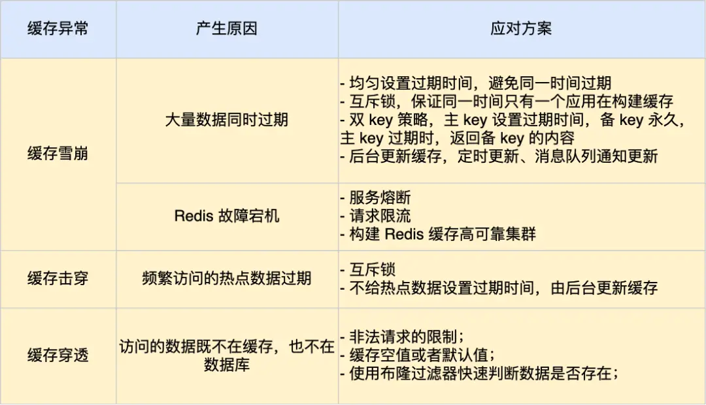

    这是“Redis”系列的第十一篇文章，主要介绍的是Redis“什么是缓存雪崩、击穿、穿透？”。

# 一、Redis
<code>Redis（Remote Dictionary Server）</code>是一个开源的内存数据库，遵守 BSD 协议，它提供了一个高性能的键值（key-value）存储系统，常用于缓存、消息队列、会话存储等应用场景。

<!-- more -->

# 二、什么是缓存雪崩、击穿、穿透？
在高并发的业务场景下，数据库大多数情况都是用户并发访问最薄弱的环节。所以，就需要使用redis做一个缓冲操作，让请求先访问到redis，而不是直接访问Mysql等数据库。这样可以大大缓解数据库的压力。当缓存库出现时，必须要考虑如下问题：缓存穿透缓存穿击缓存雪崩缓存污染（或者满了）缓存和数据库一致性
- 缓存穿透
- 缓存穿击
- 缓存雪崩
- 缓存污染（或者满了）
- 缓存和数据库一致性

---

## 2.1、缓存穿透
缓存穿透是指查询一个<font color=red>不存在的数据<font color=green>（既不在缓存中，也不在数据库中）</font></font>，由于缓存中没有该数据，请求会直接到达数据库。如果大量此类请求发生，数据库可能会被压垮。


缓存穿透的发生一般有这两种情况：
1. 业务误操作，缓存中的数据和数据库中的数据都被误删除了，所以导致缓存和数据库中都没有数据；
2. 黑客恶意攻击，故意大量访问某些读取不存在数据的业务；

应对缓存穿透的方案，常见的方案有三种。
- 第一种方案，非法请求的限制；
- 第二种方案，缓存空值或者默认值；
- 第三种方案，使用布隆过滤器快速判断数据是否存在，避免通过查询数据库来判断数据是否存在；

> 第一种方案，非法请求的限制

当有大量恶意请求访问不存在的数据的时候，也会发生缓存穿透，因此在 API 入口处我们要判断求请求参数是否合理，请求参数是否含有非法值、请求字段是否存在，如果判断出是恶意请求就直接返回错误，避免进一步访问缓存和数据库。

> 第二种方案，缓存空值或者默认值

当我们线上业务发现缓存穿透的现象时，可以针对查询的数据，在缓存中设置一个空值或者默认值，这样后续请求就可以从缓存中读取到空值或者默认值，返回给应用，而不会继续查询数据库。

> 第三种方案，使用布隆过滤器快速判断数据是否存在，避免通过查询数据库来判断数据是否存在。

我们可以在写入数据库数据时，使用布隆过滤器做个标记，然后在用户请求到来时，业务线程确认缓存失效后，可以通过查询布隆过滤器快速判断数据是否存在，如果不存在，就不用通过查询数据库来判断数据是否存在。

即使发生了缓存穿透，大量请求只会查询 Redis 和布隆过滤器，而不会查询数据库，保证了数据库能正常运行，Redis 自身也是支持布隆过滤器的。

### 2.1.1、小结
缓存穿透之所以叫“穿透”，是因为请求直接绕过了缓存层，击中了数据库。


---

## 2.2、缓存雪崩
通常我们为了保证缓存中的数据与数据库中的数据一致性，会给 Redis 里的数据设置过期时间，当缓存数据过期后，用户访问的数据如果不在缓存里，业务系统需要重新生成缓存，因此就会访问数据库，并将数据更新到 Redis 里，这样后续请求都可以直接命中缓存。

那么，<font color=green>**当大量缓存数据在同一时间过期（失效）**</font>或者 <font color=green>**Redis 故障宕机时**</font>，如果此时有大量的用户请求，都无法在 Redis 中处理，于是全部请求都直接访问数据库，从而导致数据库的压力骤增，严重的会造成数据库宕机，从而形成一系列连锁反应，造成整个系统崩溃，这就是<font color=green>缓存雪崩</font>的问题。

可以看到，发生缓存雪崩有两个原因：
1. 大量数据同时过期；
2. Redis 故障宕机；

不同的诱因，应对的策略也会不同。

### 2.2.1、大量数据同时过期
针对大量数据同时过期而引发的缓存雪崩问题，常见的应对方法有下面这几种：
- 均匀设置过期时间；
- 互斥锁；
- 后台更新缓存；

1) 均匀设置过期时间
   如果要给缓存数据设置过期时间，应该避免将大量的数据设置成同一个过期时间。我们可以在对缓存数据设置过期时间时，给这些数据的过期时间加上一个随机数，这样就保证数据不会在同一时间过期。

2) 互斥锁
当业务线程在处理用户请求时，如果发现访问的数据不在 Redis 里，就加个互斥锁，保证同一时间内只有一个请求来构建缓存（从数据库读取数据，再将数据更新到 Redis 里），当缓存构建完成后，再释放锁。未能获取互斥锁的请求，要么等待锁释放后重新读取缓存，要么就返回空值或者默认值。

实现互斥锁的时候，最好设置超时时间，不然第一个请求拿到了锁，然后这个请求发生了某种意外而一直阻塞，一直不释放锁，这时其他请求也一直拿不到锁，整个系统就会出现无响应的现象。

3) 后台更新缓存
   业务线程不再负责更新缓存，缓存也不设置有效期，而是让缓存“永久有效”，并将更新缓存的工作交由后台线程定时更新。

事实上，缓存数据不设置有效期，并不是意味着数据一直能在内存里，因为当系统内存紧张的时候，有些缓存数据会被“淘汰”，而在缓存被“淘汰”到下一次后台定时更新缓存的这段时间内，业务线程读取缓存失败就返回空值，业务的视角就以为是数据丢失了。

解决上面的问题的方式有两种。

**第一种方式，后台线程不仅负责定时更新缓存**，而且也负责频繁地检测缓存是否有效，检测到缓存失效了，原因可能是系统紧张而被淘汰的，于是就要马上从数据库读取数据，并更新到缓存。

这种方式的检测时间间隔不能太长，太长也导致用户获取的数据是一个空值而不是真正的数据，所以检测的间隔最好是毫秒级的，但是总归是有个间隔时间，用户体验一般。

**第二种方式，在业务线程发现缓存数据失效后（缓存数据被淘汰），通过消息队列发送一条消息通知后台线程更新缓存**，后台线程收到消息后，在更新缓存前可以判断缓存是否存在，存在就不执行更新缓存操作；不存在就读取数据库数据，并将数据加载到缓存。这种方式相比第一种方式缓存的更新会更及时，用户体验也比较好。

在业务刚上线的时候，我们最好提前把数据缓起来，而不是等待用户访问才来触发缓存构建，这就是所谓的<font color=green>**缓存预热**</font>，后台更新缓存的机制刚好也适合干这个事情。


### 2.2.2、Redis 故障宕机
针对 Redis 故障宕机而引发的缓存雪崩问题，常见的应对方法有下面这几种：
- 服务熔断或请求限流机制；
- 构建 Redis 缓存高可靠集群；

#### 1. 服务熔断或请求限流机制
因为 Redis 故障宕机而导致缓存雪崩问题时，我们可以启动服务熔断机制，暂停业务应用对缓存服务的访问，直接返回错误，不用再继续访问数据库，从而降低对数据库的访问压力，保证数据库系统的正常运行，然后等到 Redis 恢复正常后，再允许业务应用访问缓存服务。

服务熔断机制是保护数据库的正常允许，但是暂停了业务应用访问缓存服系统，全部业务都无法正常工作

为了减少对业务的影响，我们可以启用请求限流机制，只将少部分请求发送到数据库进行处理，再多的请求就在入口直接拒绝服务，等到 Redis 恢复正常并把缓存预热完后，再解除请求限流的机制。

#### 2. 构建 Redis 缓存高可靠集群
服务熔断或请求限流机制是缓存雪崩发生后的应对方案，我们最好通过主从节点的方式构建 Redis 缓存高可靠集群。

如果 Redis 缓存的主节点故障宕机，从节点可以切换成为主节点，继续提供缓存服务，避免了由于 Redis 故障宕机而导致的缓存雪崩问题。


---
  
## 2.3、缓存击穿
我们的业务通常会有几个数据会被频繁地访问，比如秒杀活动，这类被频繁访问的数据被称为热点数据。

如果缓存中的<font color=green>**某个热点数据过期了**</font>，此时大量的请求访问了该热点数据，就无法从缓存中读取，直接访问数据库，数据库很容易就被高并发的请求冲垮，这就是<font color=green>**缓存击穿**</font>的问题。

可以发现缓存击穿跟缓存雪崩很相似，你可以认为缓存击穿是缓存雪崩的一个子集。

应对缓存击穿可以采取前面说到两种方案：
- 互斥锁方案，保证同一时间只有一个业务线程更新缓存，未能获取互斥锁的请求，要么等待锁释放后重新读取缓存，要么就返回空值或者默认值。
- 不给热点数据设置过期时间，由后台异步更新缓存，或者在热点数据准备要过期前，提前通知后台线程更新缓存以及重新设置过期时间；

以下是使用 **Java** 实现基于互斥锁（Mutex Lock）的缓存获取代码。我们使用 `ReentrantLock` 来实现互斥锁，并通过 `ConcurrentHashMap` 模拟缓存。


### 2.3.1、“互斥锁”代码实现

```java
public class CacheWithMutexLock {
    // 模拟缓存
    private static final ConcurrentHashMap<String, String> cache = new ConcurrentHashMap<>();
    // 互斥锁
    private static final Lock lock = new ReentrantLock();

    // 模拟数据库查询
    private static String queryDatabase(String key) {
        try {
            // 模拟数据库查询耗时
            Thread.sleep(2000);
        } catch (InterruptedException e) {
            e.printStackTrace();
        }
        return "Data for " + key; // 假设从数据库获取的数据
    }

    // 获取缓存数据
    public static String getData(String key) {
        // 尝试从缓存中获取数据
        String data = cache.get(key);
        if (data != null) {
            System.out.println(Thread.currentThread().getName() + ": Cache hit!");
            return data;
        }
        // 缓存未命中，尝试获取锁
        lock.lock();
        try {
            // 再次检查缓存（防止其他线程已经更新了缓存）
            data = cache.get(key);
            if (data != null) {
                System.out.println(Thread.currentThread().getName() + ": Cache hit after lock!");
                return data;
            }
            // 模拟从数据库获取数据
            System.out.println(Thread.currentThread().getName() + ": Querying database...");
            data = queryDatabase(key);
            // 将数据写入缓存
            cache.put(key, data);
            System.out.println(Thread.currentThread().getName() + ": Cache updated!");
        } finally {
            // 释放锁
            lock.unlock();
        }
        return data;
    }
}
```
### 2.3.2、总结
通过互斥锁的方式，可以有效解决缓存击穿问题，确保系统在高并发场景下的稳定性和性能。Java 的 `ReentrantLock` 提供了灵活的锁机制，适合实现此类需求。

## 2.4、缓存污染（或满了）
缓存污染问题说的是缓存中一些只会被访问一次或者几次的的数据，被访问完后，再也不会被访问到，但这部分数据依然留存在缓存中，消耗缓存空间。

缓存污染会随着数据的持续增加而逐渐显露，随着服务的不断运行，缓存中会存在大量的永远不会再次被访问的数据。缓存空间是有限的，如果缓存空间满了，再往缓存里写数据时就会有额外开销，影响Redis性能。这部分额外开销主要是指写的时候判断淘汰策略，根据淘汰策略去选择要淘汰的数据，然后进行删除操作。

## 2.5、缓存问题小结



# 三、大key问题
大key指的是key对应的value值所占的内存空间比较大
> 例如一个字符串类型的value最大可以存储512MB的内容，一个列表类型的value最多可以存储2的32次方-1个元素，一般情况下，我们认为字符串类型的key的value值超过10kb，就算大key。

## 3.1、大key的危害

### 3.1.1、内存占用过高
大key会占用大量内存，可能导致Redis内存不足，触发淘汰策略（如LRU）或直接崩溃。

### 3.1.2、阻塞请求
对大key的操作（如读取、删除）会消耗大量CPU和网络资源，导致其他请求被阻塞。

### 3.1.3、持久化性能下降
在生成RDB快照或AOF重写时，大key会导致持久化过程变慢，甚至影响主线程的性能。（具体内容查看Redis的数据持久化流程）

### 3.1.4、数据迁移困难
在集群模式下，大key会导致数据迁移变得非常缓慢，影响集群的扩展性。

## 3.2、大key产生原因
- 在不适用的场景下使用Redis，易造成Key的value过大
  - 如使用String类型的Key存放大体积二进制文件型数据；
- 业务上线前规划设计不足，没有对Key中的成员进行合理的拆分，造成个别Key中的成员数量过多
- 未定期清理无效数据，造成如HASH类型Key中的成员持续不断地增加
- 使用LIST类型Key的业务消费侧发生代码故障，造成对应Key的成员只增不减


## 3.3、如何发现大key
1. redis-cli --bigkeys命令可以统计bigkey的分布情况
示例：
```
redis-cli --bigkeys
```

2. 使用 ”MEMORY USAGE“命令，可以查看某个key的内存占用情况
示例：
```
MEMORY USAGE my_key
```

3. 使用SCAN命令
结合scan和 STRLEN、HLEN、LLEN等命令，手动查找大key。
示例：
```
scan 0 match * count 100
STRLEN my_key
```

## 3.4、大key如何处理？

1) **对大Key进行拆分**
> 例如将含有数万成员的一个HASH Key拆分为多个HASH Key，并确保每个Key的成员数量在合理范围。在Redis集群架构中，拆分大Key能对数据分片间的内存平衡起到显著作用

示例：
```
HSET big_hash field1 value1 field2 value2 ... field10000 value10000
```
拆分成多个小key
```
HSET hash_part1 field1 value1 field2 value2 ... field1000 value1000
HSET hash_part2 field1001 value1001 ... field2000 value2000
....
```


2) **压缩数据**
对value进行压缩，减少内存占用。例如使用GZIP、Snappy等压缩算法。
示例：
```
//压缩数据
byte[] compressedData = compress(data);
redis.set("my_key", compressedData);

//解压数据
byte[] compressedData = redis.get("my_key");
byte[] data = decompress(compressedData);
```


3) **使用合适的数据结构**
根据业务需求选择合适的数据结构，避免不必要的大key。
例如使用 HyperLogLog代替集合进行基数统计。


4) **异步删除大key**
直接删除大key 会阻塞Redis，可以使用 UNLINK 命令异步删除。
示例：
```
UNLINK my_key
```


5) **限制大key的大小**
在业务层面限制 key 的大小，避免生成大 key 。
例如：限制列表、集合、哈希表的最大长度。

## 3.5、大key的预防措施
1. 监控和告警
定期监控redis的内存使用情况，设置大key的告警阈值。
2. 数据分片
将数据分散到多个Redis实例中，避免单个实例出现大key。
3. 优化业务逻辑
避免在单个key中存储过多数据，合理设计数据结构。


## 3.6、大key小结
大key是Redis中常见的问题，会对性能和稳定性产生严重影响。通过拆分、压缩、异步删除等方法，可以有效解决大key问题。同时，通过监控和优化业务逻辑，可以预防大key的产生。

# 四、热key问题
热key是指在Redis中访问频率非常高的key。热key会导致Redis的某些实例负载过高，从而影响整体性能和稳定性。热key问题在分布式缓存系统中尤为常见，尤其是在高并发场景下。

## 4.1、热key的危害

1. 单实例负载过高
热key集中在某个Redis实例上，导致该实例的CPU、内存和网络带宽压力过大。

2. 性能瓶颈
热key的频繁访问可能导致Redis响应变慢，甚至触发连接超时

3. 数据倾斜
在Redis集群模式下，热key会导致数据分布不均匀，某些节点负载过高。

4. 缓存击穿
热Key的请求压力数量超出Redis的承受能力易造成缓存击穿，即大量请求将被直接指向后端的存储层，导致存储访问量激增甚至宕机，从而影响其他业务。

## 4.2、热key产生原因
预期外的访问量陡增，如突然出现的爆款商品、访问量暴涨的热点新闻、直播间某主播搞活动带来的大量刷屏点赞、游戏中某区域发生多个工会之间的战斗涉及大量玩家等


## 4.3、如何发现热key
1. 通过redis-cli hotkeys参数查找热Key
Redis 6.0 及以上版本支持 --hotkeys 命令，可以扫描并识别热key。
示例
```
redis-cli --hotkeys
```

2. 使用MONITOR命令
实时监控Redis的所有操作，分析访问频率较高的key。
示例
```
redis-cli monitor
```

3. 使用SLOWLOG命令
查看慢查询日志，分析是否有某些key的访问频率过高
示例：
```
redis-cli slowlog get
```

4. 通过业务层定位热Key
通过在业务层增加相应的代码对Redis的访问进行记录并异步汇总分析

## 4.4、热key如何处理？

### 4.4.1、多级缓存
定义缓存级别：首先，确定你希望使用多少级别的缓存。这可以是一级、二级或更多级别，具体取决于你的需求。

#### 4.4.1.1、本地缓存
在应用层（如Java的Guava cache或Caffeine）缓存热key的数据，减少对Redis的访问。

#### 4.4.1.2、示例：本地缓存 + Redis的代码
```java
public class HotKeySolution {
    // 本地缓存
    private static final Cache<String, String> localCache = CacheBuilder.newBuilder()
            .maximumSize(1000) // 最大缓存数量
            .expireAfterWrite(10, TimeUnit.MINUTES) // 缓存过期时间
            .build();

    // 连接 Redis
    private static final Jedis jedis = new Jedis("localhost", 6379);
    // 获取数据
    public static String getData(String key) {
        // 先从本地缓存获取
        String data = localCache.getIfPresent(key);
        if (data != null) {
            System.out.println("Local cache hit!");
            return data;
        }

        // 本地缓存未命中，从 Redis 获取
        data = jedis.get(key);
        if (data != null) {
            System.out.println("Redis cache hit!");
            localCache.put(key, data); // 更新本地缓存
        } else {
            System.out.println("Cache miss!");
            // 从数据库获取数据并更新缓存
            data = queryDatabase(key);
            jedis.set(key, data);
            localCache.put(key, data);
        }

        return data;
    }

    // 模拟数据库查询
    private static String queryDatabase(String key) {
        // 模拟数据库查询耗时
        try {
            Thread.sleep(1000);
        } catch (InterruptedException e) {
            e.printStackTrace();
        }
        return "Data for " + key;
    }

    // 测试
    public static void main(String[] args) {
        String key = "hot_key";
        System.out.println(getData(key)); // 第一次访问
        System.out.println(getData(key)); // 第二次访问（命中本地缓存）
    }
}
```

### 4.4.2、数据分片
将热key的数据分散到多个key中，减轻单个key的压力。

示例：
```
# 原始热 key
SET hot_key value

# 分片为多个 key
SET hot_key_part1 value1
SET hot_key_part2 value2
SET hot_key_part3 value3
```

在Redis集群架构中，由于热Key的迁移粒度问题，无法将请求分散至其他数据分片，导致单个数据分片的压力无法下降。此时，可以将对应热Key进行复制并迁移至其他数据分片，例如将热Key foo复制出3个内容完全一样的Key并名为foo2、foo3、foo4，将这三个Key迁移到其他数据分片来解决单个数据分片的热Key压力。

说明 该方案的缺点在于需要联动修改代码，同时带来了数据一致性的挑战（由原来更新一个Key演变为需要更新多个Key），仅建议该方案用来解决临时棘手的问题。

### 4.4.3、读写分离
使用Redis的主从复制功能，将读请求分散到从节点，减轻主节点的压力。

如果热Key的产生来自于读请求，您可以将实例改造成读写分离架构来降低每个数据分片的读请求压力，甚至可以不断地增加从节点。但是读写分离架构在增加业务代码复杂度的同时，也会增加Redis集群架构复杂度。不仅要为多个从节点提供转发层（如Proxy，LVS等）来实现负载均衡，还要考虑从节点数量显著增加后带来故障率增加的问题。Redis集群架构变更会为监控、运维、故障处理带来了更大的挑战。

说明 读写分离架构同样存在缺点，在请求量极大的场景下，读写分离架构会产生不可避免的延迟，此时会有读取到脏数据的问题。因此，在读、写压力都较大且对数据一致性要求很高的场景下，读写分离架构并不是最优方案。

### 4.4.4、限流和熔断
- 对热key的访问进行限流，防止请求过多导致Redis崩溃。
- 使用熔断机制，在Redis压力过大时直接拒绝请求。

### 4.4.5、数据预热
在系统启动或低峰期，提前加载热key的数据到缓存中，避免高峰期缓存失效。


参考文章：
[Redis进阶 - 缓存问题：一致性, 穿击, 穿透, 雪崩, 污染等](https://pdai.tech/md/db/nosql-redis/db-redis-x-cache.html)
[Redis 大 Key 对持久化有什么影响？](https://xiaolincoding.com/redis/storage/bigkey_aof_rdb.html#%E6%80%BB%E7%BB%93)

