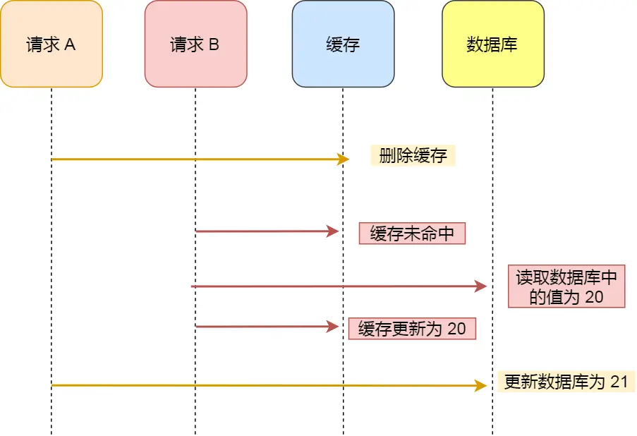
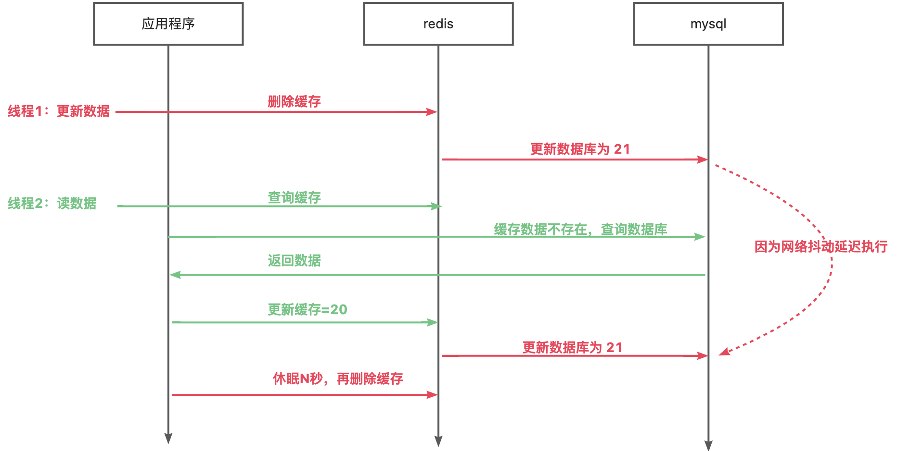
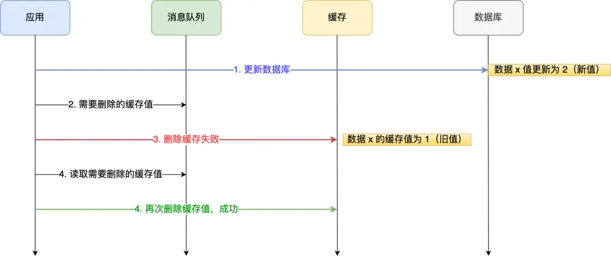

    这是“Redis”系列的第十二篇文章，主要介绍的是Redis“数据库和缓存如何保证一致性？”。

# 一、Redis
<code>Redis（Remote Dictionary Server）</code>是一个开源的内存数据库，遵守 BSD 协议，它提供了一个高性能的键值（key-value）存储系统，常用于缓存、消息队列、会话存储等应用场景。

<!-- more -->

# 二、常见的缓存更新策略
再聊一下常见的缓存更新策略。

## 2.1、旁路缓存模式（cache Aside pattern）
描述：
- 应用程序直接管理缓存，缓存与数据库之间没有直接交互。
- 读取时，先查缓存，缓存未命中则查数据库并更新缓存。
- 写入时，先更新数据库，再删除缓存。

是日常比较常用的方式，适合读请求比较多的场景

优点
- 数据一致性较好：因为先更新数据库，再让缓存失效，在大多数情况下能保证数据库与缓存数据的一致性，避免了缓存数据长时间不一致的问题。
- 实现相对简单：相比于一些复杂的缓存更新策略，旁路缓存模式的逻辑较为清晰，容易理解和实现，开发和维护成本相对较低。
- 缓存灵活性高：可以根据业务需求灵活选择缓存的数据和缓存策略，对于不同的数据可以设置不同的缓存过期时间等。

缺点
- 存在数据不一致的窗口期：在更新数据库和使缓存失效这两个操作之间，如果有读请求进来，可能会读到旧的缓存数据。不过这个窗口期通常很短，在大多数业务场景下是可以接受的。
- 并发问题：在高并发场景下，可能会出现多个请求同时更新数据库和操作缓存的情况，需要合理的并发控制来保证数据的准确性和一致性。
- 缓存维护成本：需要应用程序来管理缓存的更新和失效，对于大量数据的缓存管理，可能会带来一定的性能开销和维护成本。

## 2.2、直写缓存模式（Write-Through Cache）
- **原理**：
  - 在进行写操作时，同时更新缓存和数据库，确保两者的数据始终保持一致。
  - 读操作与旁路缓存模式类似，先从缓存读取，命中则返回，未命中则从数据库读取并更新缓存。
- **优点**：数据一致性强，任何时候缓存和数据库中的数据都是同步的。对应用程序透明，应用程序只需要进行正常的读写操作，不需要额外处理缓存更新的逻辑。
- **缺点**：写操作的性能相对较低，因为每次写操作都需要同时更新缓存和数据库，可能会增加系统的响应时间。对数据库的压力较大，尤其是在高并发写的场景下。
- **适用场景**：适用于对数据一致性要求极高的场景，如金融交易系统、库存管理系统等，不允许出现数据不一致的情况。

## 2.3、回写缓存模式（Write-Back Cache）
- **原理**：
  - 写操作时，只更新缓存，标记该数据为脏数据，并异步地将脏数据批量更新到数据库。
  - 读操作同样先从缓存读取，未命中再从数据库读取并更新缓存。
- **优点**：写操作性能高，因为不需要立即更新数据库，减少了写操作的等待时间，提高了系统的响应速度。可以批量更新数据库，减少数据库的 I/O 操作，提高数据库的性能。
- **缺点**：数据一致性相对较弱，在缓存数据还未更新到数据库时，如果系统出现故障，可能会导致数据丢失。需要复杂的缓存管理机制，来跟踪脏数据和安排数据的回写。
- **适用场景**：适用于对写性能要求高、对数据一致性要求相对较低的场景，如日志系统、数据采集系统等。

# 三、数据库和缓存如何保证数据一致性？
节选最最常用的Cache Aside Pattern（旁路缓存模式）进行说明。

## 3.1、更新缓存 Or 删除缓存，如何选择?
更新缓存的两个缺点
- 如果写入的缓存值，是经过复杂计算才得到的话。 更新缓存频率高的话，就浪费性能
- 在写多读少的情况下，数据很多时候还没被读取到，又被更新了，这就浪费了性能(实际上，写多读少的场景，也不建议使用缓存)

小结：**选择删除缓存**。

## 3.2、先删除缓存，再更新数据库

### 3.2.1、存在的问题
假设某个用户的年龄是 20，请求 A 要更新用户年龄为 21，所以它会删除缓存中的内容。这时，另一个请求 B 要读取这个用户的年龄，它查询缓存发现未命中后，会从数据库中读取到年龄为 20，并且写入到缓存中，然后请求 A 继续更改数据库，将用户的年龄更新为 21。

最终，该用户年龄在缓存中是 20（旧值），在数据库中是 21（新值），缓存和数据库的数据不一致。

这种情况也有**很大缺陷**，不论是异常情况还是高并发场景，都可能导致数据不一致（存在较长时间数据不一致）。

### 3.2.2、解决方案
**延迟双删策略**主要是是应对先删除缓存，再更新数据库的场景。

所以这边多加了一个步骤，就是在数据库更新完成之后，再删除一次缓存。所以步骤如下：
- 删除缓存
- 缓存删除完成之后，更新数据库
- 数据库更新完成之后，休眠 n ms，二次删除缓存
  - (休眠时间需要大于从DB读取数据并更新完缓存的时间之和)

这时候唯一存在的一个问题就是，在（更新据库 + 休眠 n ms） 这个时间窗口中，依旧能读取到旧值，而这个短暂时间控制的好的话，是可以接受的。

## 3.3、先更新数据库，再删除缓存
继续用「读 + 写」请求的并发的场景来分析。

假如某个用户数据在缓存中不存在，请求 A 读取数据时从数据库中查询到年龄为 20，在未写入缓存中时另一个请求 B 更新数据。它更新数据库中的年龄为 21，并且清空缓存。这时请求 A 把从数据库中读到的年龄为 20 的数据写入到缓存中。

最终，该用户年龄在缓存中是 20（旧值），在数据库中是 21（新值），缓存和数据库数据不一致。

### 3.3.1、存在的问题
「先更新数据库， 再删除缓存」其实是两个操作，这次客户投诉的问题就在于，在删除缓存（第二个操作）的时候失败了，导致缓存中的数据是旧值，而数据库是最新值。

好在之前给缓存加上了过期时间，所以才会出现客户说的过一段时间才更新生效的现象，假设如果没有这个过期时间的兜底，那后续的请求读到的就会一直是缓存中的旧数据，这样问题就更大了。

所以新的问题来了，如何保证「先更新数据库 ，再删除缓存」这两个操作能执行成功？

### 3.3.2、解决方案
有两种方法：
- 重试机制。
- 订阅 MySQL binlog，再操作缓存。

#### 3.3.2.1、重试机制
我们可以引入**消息队列**，将第二个操作（删除缓存）要操作的数据加入到消息队列，由消费者来操作数据。

如果应用删除缓存失败，可以从消息队列中重新读取数据，然后再次删除缓存，这个就是重试机制。当然，如果重试超过的一定次数，还是没有成功，我们就需要向业务层发送报错信息了。
如果删除缓存成功，就要把数据从消息队列中移除，避免重复操作，否则就继续重试。

##### 引入消息队列的问题
消息队列的引入，也会降低系统的稳定性，此时可以使用本地消息表的方式，将更新数据库+本地消息表同一事务中落地，再通过当时任务去做删除。

这些方案都过于笨重了。

#### 3.3.2.2、订阅 MySQL binlog
「先更新数据库，再删缓存」的策略的第一步是更新数据库，那么更新数据库成功，就会产生一条变更日志，记录在 binlog 里。

于是我们就可以通过订阅 binlog 日志，拿到具体要操作的数据，然后再执行缓存删除，阿里巴巴开源的 Canal 中间件就是基于这个实现的。

### 3.3.3、小结
从上面的理论上分析，先更新数据库，再删除缓存也是会出现数据不一致性的问题，**但是在实际中，这个问题出现的概率并不高**。

因为缓存的写入通常要远远快于数据库的写入，所以在实际中很难出现请求 B 已经更新了数据库并且删除了缓存，请求 A 才更新完缓存的情况。

而一旦请求 A 早于请求 B 删除缓存之前更新了缓存，那么接下来的请求就会因为缓存不命中而从数据库中重新读取数据，所以不会出现这种不一致的情况。

所以，「先更新数据库 + 再删除缓存」的方案，是可以保证数据一致性的。

# 四、总结
- 缓存策略的最常用模式是 Cache Aside Pattern。
- 读缓存最优策略：读取缓存，命中则返回结果；未命中则查询数据库，写缓存，再返回。
- 写缓存最优策略是：先写数据库，再直接删除缓存
- 在实践中，建议使用延迟双删和删除重试兜底的模式为数据一致性做保障。

参考文章：
[Redis进阶 - 缓存问题：一致性, 穿击, 穿透, 雪崩, 污染等](https://pdai.tech/md/db/nosql-redis/db-redis-x-cache.html)
[数据库和缓存如何保证一致性？](https://xiaolincoding.com/redis/architecture/mysql_redis_consistency.html)

